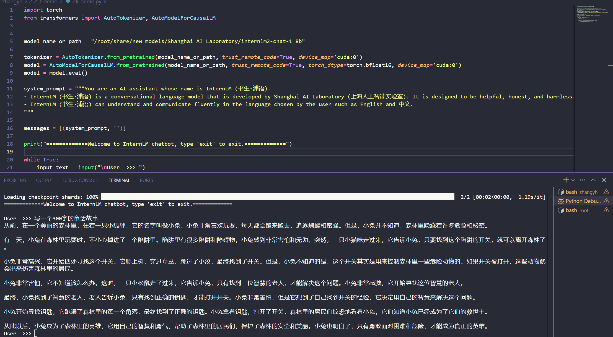

# 基础任务

按照文档的示例即可一步步配置好环境

```
# 创建环境
conda create -n demo python=3.10 -y
# 激活环境
conda activate demo
# 安装 torch
conda install pytorch==2.1.2 torchvision==0.16.2 torchaudio==2.1.2 pytorch-cuda=12.1 -c pytorch -c nvidia -y
# 安装其他依赖
pip install transformers==4.38
pip install sentencepiece==0.1.99
pip install einops==0.8.0
pip install protobuf==5.27.2
pip install accelerate==0.33.0
pip install streamlit==1.37.0
```

InternLM2-Chat-1.8B 模型的部署


