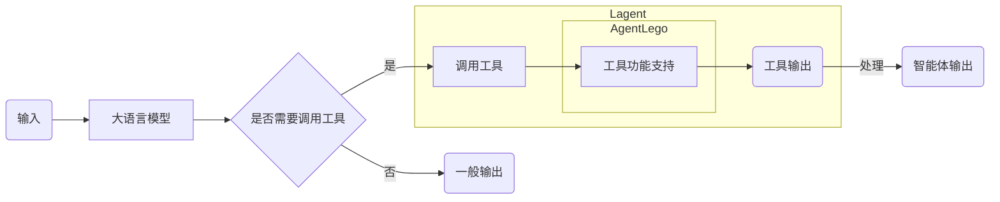
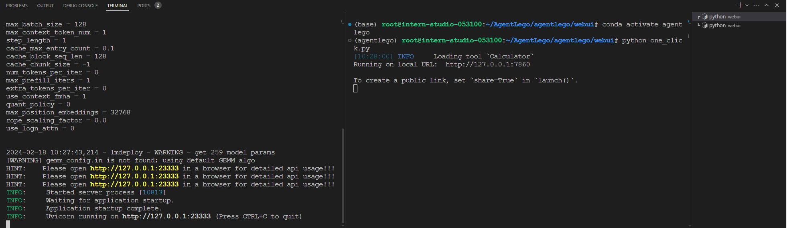
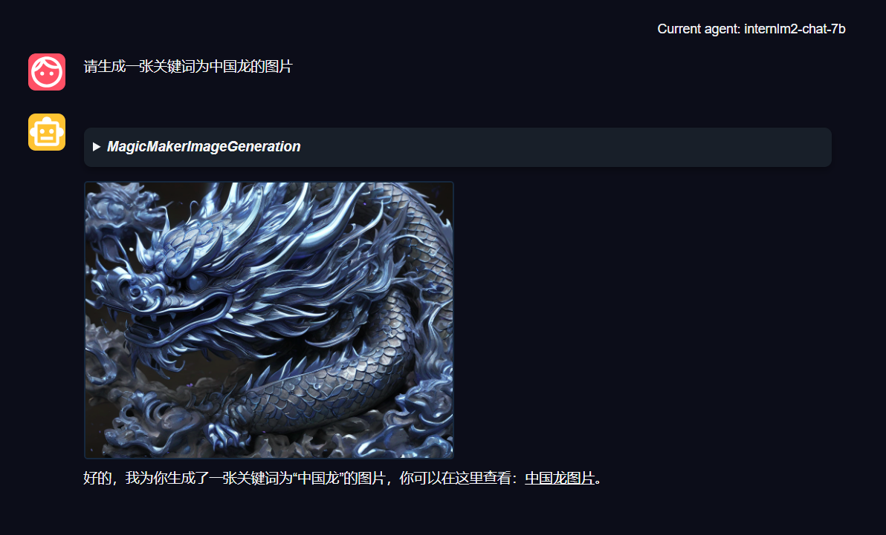

# 基于 Lagent 和 AgentLego 实现你的智能体

- [基于 Lagent 和 AgentLego 实现你的智能体](#基于-lagent-和-agentlego-实现你的智能体)
  - [1.什么是智能体](#1什么是智能体)
  - [2. 概述](#2-概述)
    - [2.1 Lagent 是什么](#21-lagent-是什么)
    - [2.2 AgentLego 是什么](#22-agentlego-是什么)
    - [2.3 两者的关系](#23-两者的关系)
    - [2.4 环境配置](#24-环境配置)
      - [2.4.1 创建 conda 环境](#241-创建-conda-环境)
      - [2.4.2 安装 Lagent](#242-安装-lagent)
      - [2.4.3 安装 AgentLego](#243-安装-agentlego)
      - [2.4.4 安装其他依赖](#244-安装其他依赖)
  - [3. Lagent：轻量级智能体框架](#3-lagent轻量级智能体框架)
    - [3.1 Lagent Web Demo](#31-lagent-web-demo)
    - [3.2 用 Lagent 自定义工具](#32-用-lagent-自定义工具)
      - [3.2.1 创建工具文件](#321-创建工具文件)
  - [4. AgentLego：组装智能体“乐高”](#4-agentlego组装智能体乐高)
    - [4.1 直接使用 AgentLego](#41-直接使用-agentlego)
    - [4.2 作为智能体工具使用](#42-作为智能体工具使用)
      - [4.2.1 修改相关文件](#421-修改相关文件)
      - [4.2.2 使用 LMDeploy 部署](#422-使用-lmdeploy-部署)
      - [4.2.3 启动并使用 AgentLego WebUI](#423-启动并使用-agentlego-webui)
    - [4.3 用 AgentLego 自定义工具](#43-用-agentlego-自定义工具)
      - [4.3.1 创建工具文件](#431-创建工具文件)
      - [4.3.2 修改 \_\_init\_\_.py 文件](#432-修改-__init__py-文件)
      - [4.3.3 使用工具](#433-使用工具)
  - [5. 自定义工具能力微调](#5-自定义工具能力微调)

## 1.什么是智能体

TODO

## 2. 概述

TODO

### 2.1 Lagent 是什么

Lagent 是一个轻量级开源智能体框架，旨在让用户可以高效地构建基于大语言模型的智能体。同时它也提供了一些典型工具以增强大语言模型的能力。

Lagent 目前已经支持了包括 ReAct、ReWoo 等在内的多个智能体范式，也支持了如下工具：

- Arxiv 搜索
- Bing 地图
- Google 学术搜索
- Google 搜索
- 交互式 IPython 执行器
- IPython 执行器
- PPT
- Python 执行器

### 2.2 AgentLego 是什么

AgentLego 是一个提供了多种开源工具 API 的算法库，旨在像是乐高积木一样，让用户可以通过快速简便地拓展自定义工具，从而组装出自己的智能体。通过 AgentLego 算法库，不仅可以直接使用多种工具，也可以利用这些工具，在相关智能体框架（如 Lagent、Transformers Agent 等）的帮助下，快速构建可以增强大语言模型能力的智能体。

AgentLego 目前提供了如下工具：

<table align='center'>
    <tr align='center' valign='bottom'>
        <b><td>通用能力</td></b>
        <b><td>语音相关</td></b>
        <b><td>图像处理</td></b>
        <b><td>AIGC</td></b>
    </tr>
    <tr valign='top'>
    <td>
        <ul>
        <li>计算器</li>
        <li>谷歌搜素</li>
        </ul>
    </td>
    <td>
        <ul>
        <li>文本 -> 音频（TTS）</li>
        <li>音频 -> 文本（STT）</li>
        </ul>
    </td>
    <td>
        <ul>
        <li>描述输入图像</li>
        <li>识别文本（OCR）</li>
        <li>视觉问答（VQA）</li>
        <li>人体姿态估计</li>
        <li>人脸关键点检测</li>
        <li>图像边缘提取（Canny）</li>
        <li>深度图生成</li>
        <li>生成涂鸦（Scribble）</li>
        <li>检测全部目标</li>
        <li>检测给定目标</li>
        <li>SAM
            <ul>
            <li>分割一切</li>
            <li>分割给定目标</li>
            </ul>
        </li>
        </ul>
    </td>
    <td>
        <ul>
        <li>文生图</li>
        <li>图像拓展</li>
        <li>删除给定对象</li>
        <li>替换给定对象</li>
        <li>根据指令修改</li>
        <li>ControlNet 系列
            <ul>
            <li>根据边缘+描述生成</li>
            <li>根据深度图+描述生成</li>
            <li>根据姿态+描述生成</li>
            <li>根据涂鸦+描述生成</li>
            </ul>
        </li>
        <li>ImageBind 系列
            <ul>
            <li>音频生成图像</li>
            <li>热成像生成图像</li>
            <li>音频+图像生成图像</li>
            <li>音频+文本生成图像</li>
            </ul>
        </li>
    </td>
    </tr>
</table>

### 2.3 两者的关系

经过上面的介绍，我们可以发现，Lagent 是一个智能体框架，而 AgentLego 与大模型智能体并不直接相关，而是作为相关智能体的功能支持模块发挥作用。

两者之间的关系可以用下图来表示：



### 2.4 环境配置

在开始配置环境前，我们先创建一个目录用于存放 Agent 相关文件的目录，可以执行如下命令：

```bash
mkdir -p /root/agent
```

#### 2.4.1 创建 conda 环境

由于官方已经提供好了 internlm-base 环境，其中已经包含了如 PyTorch 等常用库，但是这个环境是只读的，因此我们需要在其基础上 clone 一份环境到自己的目录下，以安装其他库。可以执行如下命令：

```bash
conda create -n agent --clone /share/conda_envs/internlm-base
```

如果 clone 过程速度过慢的话，也可以采用如下方式创建环境：

```bash
/root/share/install_conda_env_internlm_base.sh agent
```

这样便创建好了一个名为 agent 的 conda 环境了。

#### 2.4.2 安装 Lagent

Lagent 提供了两种安装方法，一种是使用 `pip install lagent` 进行安装，另一种则是直接从源码安装。安装过程可以参考 https://lagent.readthedocs.io/zh-cn/latest/get_started/install.html 以获取更多帮助。

为了方便使用 Web Demo，我们选择直接从源码进行安装。可以执行如下命令：

```bash
cd /root/agent
git clone https://github.com/InternLM/lagent.git
cd lagent
# 激活环境
conda activate agent
pip install -e .
cd ..
```

#### 2.4.3 安装 AgentLego

类似地，AgentLego 也提供了两种安装方法，分别是使用 `pip install agentlego` 进行安装和直接从源码安装。安装过程的文档位于 https://agentlego.readthedocs.io/zh-cn/latest/get_started.html 。

为了方便使用 WebUI 和修改源码，我们依旧选择直接从源码进行安装。可以执行如下命令：

```bash
cd /root/agent
git clone https://github.com/InternLM/agentlego.git
cd agentlego
# 激活环境
conda activate agent
pip install -e .
cd ..
```

#### 2.4.4 安装其他依赖

在这一步中，我们将安装其他将会用到的依赖库，如 `flash_attn`、`python-Levenshtein` 以及 `lmdeploy`。
   
可以执行如下命令：

```bash
# 使用预编译包安装 flash_attn
pip install /root/share/wheels/flash_attn-2.4.2+cu118torch2.0cxx11abiTRUE-cp310-cp310-linux_x86_64.whl
# 安装 python-Levenshtein
pip install python-Levenshtein
# 安装 lmdeploy
pip install lmdeploy
```

## 3. Lagent：轻量级智能体框架

### 3.1 Lagent Web Demo

TODO

### 3.2 用 Lagent 自定义工具

在本节中，我们将基于 Lagent 自定义一个工具。Lagent 关于工具部分的介绍文档位于 https://lagent.readthedocs.io/zh-cn/latest/tutorials/action.html 。使用 Lagent 自定义工具主要分为以下几步：

1. 继承 `BaseAction` 类
2. 实现简单工具的 `run` 方法；或者实现工具包的每个子工具功能
3. 简单工具的 `run` 方法可选被 `tool_api` 装饰；工具包每个子工具功能都需要被 `tool_api` 装饰
   
下面我们将实现一个调用谷歌翻译的 API 以完成翻译功能的工具。

#### 3.2.1 创建工具文件

TODO

## 4. AgentLego：组装智能体“乐高”

上文提到，AgentLego 算法库既可以直接使用，也可以作为智能体工具使用。下面将分别介绍这两种使用方式。我们将以目标检测工具为例。

### 4.1 直接使用 AgentLego

首先下载 demo 文件：

```bash
wget http://download.openmmlab.com/agentlego/road.jpg
```

由于 AgentLego 在安装时并没有安装某个特定工具的依赖，因此我们接下来准备安装目标检测工具运行时所需依赖。

AgentLego 所实现的目标检测工具是基于 mmdet（MMDetction） 算法库中的 RTMDet-large 模型，因此我们首先安装 mim，然后通过 mim 来安装 mmdet。

```bash
conda activate agent
pip install openmim
mim install mmdet
```

然后通过 `touch direct_use.py` 的方式新建 direct_use.py 以直接使用该工具，该脚本代码为：

```python
import re

import cv2
from agentlego.apis import load_tool

# load tool
tool = load_tool('ObjectDetection', device='cuda')

# apply tool
visualization = tool('road.jpg')
print(visualization)

# visualize
image = cv2.imread('road.jpg')

preds = visualization.split('\n')
pattern = r'(\w+) \((\d+), (\d+), (\d+), (\d+)\), score (\d+)'

for pred in preds:
    name, x1, y1, x2, y2, score = re.match(pattern, pred).groups()
    x1, y1, x2, y2, score = int(x1), int(y1), int(x2), int(y2), int(score)
    cv2.rectangle(image, (x1, y1), (x2, y2), (0, 255, 0), 1)
    cv2.putText(image, f'{name} {score}', (x1, y1), cv2.FONT_HERSHEY_SIMPLEX, 0.8, (0, 255, 0), 1)

cv2.imwrite('road_detection_direct.jpg', image)

```

此时文件树结构如下：

```bash
.
|-- agentlego
|   |-- LICENSE
|   |-- README.md
|   |-- README_zh-CN.md
|   |-- agentlego
|   |   `-- ...
|   |-- ...
|-- lagent
|   |-- LICENSE
|   |-- README.md
|   |-- README_zh-CN.md
|   |-- lagent
|   |   `-- ...
|   |-- ...
|-- direct.py
`-- road.jpg
```
接下来执行 `python direct_use.py` 以进行推理。在下载完成 RTMDet-large 权重并完成推理后，我们就可以看到如下输出，以及一张名为 `road_detection_direct.jpg` 的图片：

```text
truck (345, 428, 528, 599), score 83
car (771, 510, 837, 565), score 81
car (604, 518, 677, 569), score 75
person (866, 503, 905, 595), score 74
person (287, 513, 320, 596), score 74
person (964, 502, 999, 604), score 72
person (1009, 503, 1047, 602), score 69
person (259, 510, 279, 575), score 65
car (1074, 524, 1275, 691), score 64
person (993, 508, 1016, 597), score 62
truck (689, 483, 764, 561), score 62
bicycle (873, 551, 903, 602), score 60
person (680, 523, 699, 567), score 55
bicycle (968, 551, 996, 609), score 53
bus (826, 482, 930, 560), score 52
bicycle (1011, 551, 1043, 617), score 51
```

| 原图 | 结果 |
| --- | --- |
|  |  |

### 4.2 作为智能体工具使用

#### 4.2.1 修改相关文件

由于 AgentLego 算法库默认使用 InternLM2-Chat-20B 模型，因此我们首先需要修改 /root/agent/agentlego/webui/modules/agents/lagent_agent.py 文件的第 103行位置，将 internlm2-chat-20b 修改为 internlm2-chat-7b，即

```diff
def llm_internlm2_lmdeploy(cfg):
    url = cfg['url'].strip()
    llm = LMDeployClient(
-       model_name='internlm2-chat-20b',
+       model_name='internlm2-chat-7b',
        url=url,
        meta_template=INTERNLM2_META,
        top_p=0.8,
        top_k=100,
        temperature=cfg.get('temperature', 0.7),
        repetition_penalty=1.0,
        stop_words=['<|im_end|>'])
    return llm
```

#### 4.2.2 使用 LMDeploy 部署

接下来我们需要使用 LMDeploy 算法库来部署一个 InternLM2-Chat-7B 的 API 服务，以用于 AgentLego 的 WebUI 使用。可以执行如下命令（推荐在 vscode 页面的 terminal 中执行，以方便同时监控 API 服务和 WebUI 服务）：

```bash
lmdeploy serve api_server /root/share/model_repos/internlm2-chat-7b \
                            --server-name 127.0.0.1 \
                            --model-name internlm2-chat-7b \
                            --cache-max-entry-count 0.1
```

通过这一指令，便可以基于 LMDeploy 启动一个服务。同时为了尽可能减少资源占用，我们将 `cache-max-entry-point` 设置为 0.1，以减少缓存的大小。

#### 4.2.3 启动并使用 AgentLego WebUI

接下来使用 Split Terminal （快捷键为 Ctrl+Shift+5）将当前 Terminal 一分为二。在新增的半个 terminal 中，先确保所启用的 conda 环境为 agent，如果不是的话可以执行 `conda activate agent` 来激活环境。然后执行如下命令以启动 AgentLego WebUI：

```bash
cd /root/agent/agentlego/webui
python one_click.py
```

此时 Terminal 大致如下图所示：



其中左侧为 LMDeploy 服务的输出，右侧为 AgentLego WebUI 的输出。

接下来，我们将 LMDeploy 服务的23333端口和 AgentLego 服务的7860端口转发到本地。可以在本地执行如下命令：

```bash
ssh -CNg -L 7860:127.0.0.1:7860 -L 23333:127.0.0.1:23333 root@ssh.intern-ai.org.cn -p <你的 ssh 端口号>
```

TODO

### 4.3 用 AgentLego 自定义工具

在本节中，我们将基于 AgentLego 构建自己的自定义工具。AgentLego 在这方面提供了较为详尽的文档，文档地址为 https://agentlego.readthedocs.io/zh-cn/latest/modules/tool.html 。自定义工具主要分为以下几步：

1. 继承 `BaseTool` 类
2. 修改 `default_desc` 属性（工具功能描述）
3. 如有需要，重载 `setup` 方法（重型模块延迟加载）
4. 重载 `apply` 方法（工具功能实现）

其中第一二四步是必须的步骤。下面我们将实现一个调用 MagicMaker 的 API 以实现图像生成的工具。

MagicMaker 是国内领先的免费 AI 图像、视频创作平台，集成提供了图像生成、图像编辑和视频生成三大核心功能。体验更多功能可以访问 https://magicmaker.openxlab.org.cn/home 。

#### 4.3.1 创建工具文件

首先，我们需要在 agentlego/tools 目录下创建一个文件，用于存放我们的自定义工具。可以执行如下命令：

```bash
touch /root/agent/agentlego/agentlego/tools/magicmaker_image_generation.py
```

该工具文件的代码如下：

```python
import json
import requests

import numpy as np

from agentlego.types import Annotated, ImageIO, Info
from agentlego.utils import require
from .base import BaseTool


class MagicMakerImageGeneration(BaseTool):

    default_desc = ('This tool can call the api of magicmaker to '
                    'generate an image according to the given keywords.')

    styles_option = [
        'dongman',  # 动漫
        'guofeng',  # 国风
        'xieshi',   # 写实
        'youhua',   # 油画
        'manghe',   # 盲盒
    ]
    aspect_ratio_options = [
        '16:9', '4:3', '3:2', '1:1',
        '2:3', '3:4', '9:16'
    ]

    @require('opencv-python')
    def __init__(self,
                 style='dongman',
                 aspect_ratio='4:3'):
        super().__init__()
        if style in self.styles_option:
            self.style = style
        else:
            raise ValueError(f'The style must be one of {self.styles_option}')
        
        if aspect_ratio in self.aspect_ratio_options:
            self.aspect_ratio = aspect_ratio
        else:
            raise ValueError(f'The aspect ratio must be one of {aspect_ratio}')

    def apply(self,
              keywords: Annotated[str,
                                  Info('A series of Chinese keywords separated by comma.')]
        ) -> ImageIO:
        import cv2
        response = requests.post(
            url='https://magicmaker.openxlab.org.cn/gw/edit-anything/api/v1/bff/sd/generate',
            data=json.dumps({
                "official": True,
                "prompt": keywords,
                "style": self.style,
                "poseT": False,
                "aspectRatio": self.aspect_ratio
            }),
            headers={'content-type': 'application/json'}
        )
        image_url = response.json()['data']['imgUrl']
        image_response = requests.get(image_url)
        image = cv2.imdecode(np.frombuffer(image_response.content, np.uint8), cv2.IMREAD_COLOR)
        return ImageIO(image)

```

#### 4.3.2 修改 \_\_init\_\_.py 文件

接下来修改 /root/AgentLego/agentlego/agentlego/tools/\_\_init\_\_.py 文件，将我们的工具导入其中。可以执行如下命令：

```diff
from .base import BaseTool
from .calculator import Calculator
from .func import make_tool
from .image_canny import CannyTextToImage, ImageToCanny
from .image_depth import DepthTextToImage, ImageToDepth
from .image_editing import ImageExpansion, ImageStylization, ObjectRemove, ObjectReplace
from .image_pose import HumanBodyPose, HumanFaceLandmark, PoseToImage
from .image_scribble import ImageToScribble, ScribbleTextToImage
from .image_text import ImageDescription, TextToImage
from .imagebind import AudioImageToImage, AudioTextToImage, AudioToImage, ThermalToImage
from .object_detection import ObjectDetection, TextToBbox
from .ocr import OCR
from .search import GoogleSearch
from .segmentation import SegmentAnything, SegmentObject, SemanticSegmentation
from .speech_text import SpeechToText, TextToSpeech
from .translation import Translation
from .vqa import VQA
+ from .magicmaker_image_generation import MagicMakerImageGeneration

__all__ = [
    'CannyTextToImage', 'ImageToCanny', 'DepthTextToImage', 'ImageToDepth',
    'ImageExpansion', 'ObjectRemove', 'ObjectReplace', 'HumanFaceLandmark',
    'HumanBodyPose', 'PoseToImage', 'ImageToScribble', 'ScribbleTextToImage',
    'ImageDescription', 'TextToImage', 'VQA', 'ObjectDetection', 'TextToBbox', 'OCR',
    'SegmentObject', 'SegmentAnything', 'SemanticSegmentation', 'ImageStylization',
    'AudioToImage', 'ThermalToImage', 'AudioImageToImage', 'AudioTextToImage',
    'SpeechToText', 'TextToSpeech', 'Translation', 'GoogleSearch', 'Calculator',
-   'BaseTool', 'make_tool'
+   'MagicMakerImageGeneration', 'BaseTool', 'make_tool'
]
```

其中，我们将 `MagicMakerImageGeneration` 通过 `from .magicmaker_image_generation import MagicMakerImageGeneration` 导入到了 \_\_init\_\_.py 文件中，并且将其加入了 `__all__` 列表中。

#### 4.3.3 使用工具

与上文 [4.2 作为智能体工具使用](#42-作为智能体工具使用) 类似，我们可以直接将自定义好的工具作为智能体工具使用。**注意**，为了确保调用工具的成功率，请在使用时确保仅有这一个工具启用。

以下是一张效果图



## 5. 自定义工具能力微调

TODO
