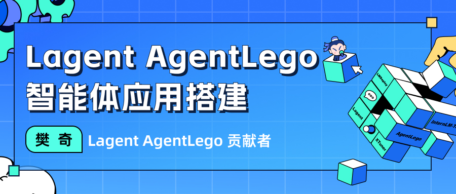

# Lagent & AgentLego 智能体应用搭建

- [Lagent \& AgentLego 智能体应用搭建](#lagent--agentlego-智能体应用搭建)
  - [1. 概述](#1-概述)
    - [1.1 Lagent 是什么](#11-lagent-是什么)
    - [1.2 AgentLego 是什么](#12-agentlego-是什么)
    - [1.3 两者的关系](#13-两者的关系)
    - [1.4 环境配置](#14-环境配置)
      - [1.4.1 创建开发机和 conda 环境](#141-创建开发机和-conda-环境)
      - [1.4.2 安装 Lagent 和 AgentLego](#142-安装-lagent-和-agentlego)
      - [1.4.3 安装其他依赖](#143-安装其他依赖)
      - [1.4.4 准备 Tutorial](#144-准备-tutorial)
  - [2. Lagent：轻量级智能体框架](#2-lagent轻量级智能体框架)
  - [3. AgentLego：组装智能体“乐高”](#3-agentlego组装智能体乐高)
  - [4. Agent 工具能力微调](#4-agent-工具能力微调)

## 1. 概述

### 1.1 Lagent 是什么

Lagent 是一个轻量级开源智能体框架，旨在让用户可以高效地构建基于大语言模型的智能体。同时它也提供了一些典型工具以增强大语言模型的能力。

Lagent 目前已经支持了包括 AutoGPT、ReAct 等在内的多个经典智能体范式，也支持了如下工具：

- Arxiv 搜索
- Bing 地图
- Google 学术搜索
- Google 搜索
- 交互式 IPython 解释器
- IPython 解释器
- PPT
- Python 解释器

### 1.2 AgentLego 是什么

AgentLego 是一个提供了多种开源工具 API 的多模态工具包，旨在像是乐高积木一样，让用户可以快速简便地拓展自定义工具，从而组装出自己的智能体。通过 AgentLego 算法库，不仅可以直接使用多种工具，也可以利用这些工具，在相关智能体框架（如 Lagent，Transformers Agent 等）的帮助下，快速构建可以增强大语言模型能力的智能体。

AgentLego 目前提供了如下工具：

<table align='center'>
    <tr align='center' valign='bottom'>
        <b><td>通用能力</td></b>
        <b><td>语音相关</td></b>
        <b><td>图像处理</td></b>
        <b><td>AIGC</td></b>
    </tr>
    <tr valign='top'>
    <td>
        <ul>
        <li>计算器</li>
        <li>谷歌搜素</li>
        </ul>
    </td>
    <td>
        <ul>
        <li>文本 -> 音频（TTS）</li>
        <li>音频 -> 文本（STT）</li>
        </ul>
    </td>
    <td>
        <ul>
        <li>描述输入图像</li>
        <li>识别文本（OCR）</li>
        <li>视觉问答（VQA）</li>
        <li>人体姿态估计</li>
        <li>人脸关键点检测</li>
        <li>图像边缘提取（Canny）</li>
        <li>深度图生成</li>
        <li>生成涂鸦（Scribble）</li>
        <li>检测全部目标</li>
        <li>检测给定目标</li>
        <li>SAM
            <ul>
            <li>分割一切</li>
            <li>分割给定目标</li>
            </ul>
        </li>
        </ul>
    </td>
    <td>
        <ul>
        <li>文生图</li>
        <li>图像拓展</li>
        <li>删除给定对象</li>
        <li>替换给定对象</li>
        <li>根据指令修改</li>
        <li>ControlNet 系列
            <ul>
            <li>根据边缘+描述生成</li>
            <li>根据深度图+描述生成</li>
            <li>根据姿态+描述生成</li>
            <li>根据涂鸦+描述生成</li>
            </ul>
        </li>
        <li>ImageBind 系列
            <ul>
            <li>音频生成图像</li>
            <li>热成像生成图像</li>
            <li>音频+图像生成图像</li>
            <li>音频+文本生成图像</li>
            </ul>
        </li>
    </td>
    </tr>
</table>

### 1.3 两者的关系

经过上面的介绍，我们可以发现，Lagent 是一个智能体框架，而 AgentLego 与大模型智能体并不直接相关，而是作为工具包，在相关智能体的功能支持模块发挥作用。

两者之间的关系可以用下图来表示：


### 1.4 环境配置

为了方便使用，我们需要配置一个环境以同时满足 Lagent 和 AgentLego 运行时所需依赖。在开始配置环境前，我们先创建一个用于存放 Agent 相关文件的目录，可以执行如下命令：

```bash
mkdir -p /root/agent
```

#### 1.4.1 创建开发机和 conda 环境

在创建开发机界面选择镜像为 Cuda12.2-conda，并选择 GPU 为30% A100。


进入**开发机**后，我们需要配置一个 conda 环境，可以输入如下指令：

```bash
studio-conda -t agent -o pytorch-2.1.2
```

显示下图就是初始化环境成功了。


如果是在**非 InternStudio 开发机**上配置环境，则可以通过如下指令创建初始环境：

```bash
conda create -n agent
conda activate agent
conda install python=3.10
conda install pytorch==2.1.2 torchvision==0.16.2 torchaudio==2.1.2 pytorch-cuda=11.8 -c pytorch -c nvidia
```

#### 1.4.2 安装 Lagent 和 AgentLego

Lagent 和 AgentLego 都提供了两种安装方法，一种是通过 pip 直接进行安装，另一种则是从源码进行安装。为了方便使用 Lagent 的 Web Demo 以及 AgentLego 的 WebUI，我们选择直接从源码进行安装。
此处附上源码安装的相关帮助文档：

- Lagent：https://lagent.readthedocs.io/zh-cn/latest/get_started/install.html
- AgentLego：https://agentlego.readthedocs.io/zh-cn/latest/get_started.html

可以执行如下命令进行安装：

```bash
cd /root/agent
conda activate agent
git clone https://gitee.com/internlm/lagent.git
cd lagent && git checkout 581d9fb && pip install -e . && cd ..
git clone https://gitee.com/internlm/agentlego.git
cd agentlego && git checkout 7769e0d && pip install -e . && cd ..
```

#### 1.4.3 安装其他依赖

在这一步中，我们将会安装其他将要用到的依赖库，如 LMDeploy，可以执行如下命令：

```bash
conda activate agent
pip install lmdeploy==0.3.0
```

#### 1.4.4 准备 Tutorial

由于后续的 Demo 需要用到 tutorial 已经写好的脚本，因此我们需要将 tutorial 通过 git clone 的方法准备好，以备后续使用：

```bash
cd /root/agent
git clone https://gitee.com/internlm/tutorial.git
cd tutorial && git checkout a2ab9c8 && cd ..
```

## 2. Lagent：轻量级智能体框架

在这一部分中，我们将带大家体验 Lagent 的 Web Demo，使用 Lagent 自定义工具，并体验自定义工具的效果。

详细文档可以访问：[Lagent：轻量级智能体框架](lagent.md)。

## 3. AgentLego：组装智能体“乐高”

在这一部分中，我们将带大家直接使用 AgentLego 工具，体验 AgentLego 的 WebUI，以及基于 AgentLego 自定义工具并体验自定义工具的效果。

详细文档可以访问：[AgentLego：组装智能体“乐高”](agentlego.md)。

## 4. Agent 工具能力微调

在这一部分中，我们将介绍 OpenAI Function Calling 的相关内容，以及带大家使用 XTuner 来实现 Agent 工具能力的微调。

详细文档可以访问：[Agent 工具能力微调](finetune.md)。