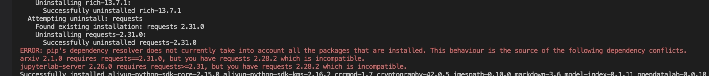
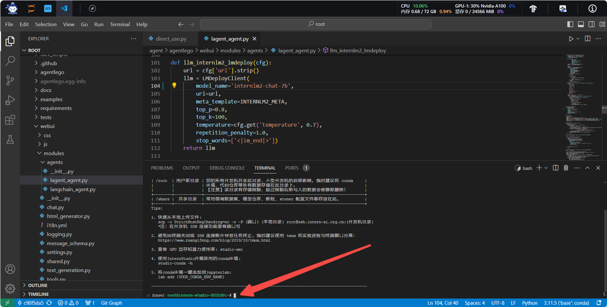
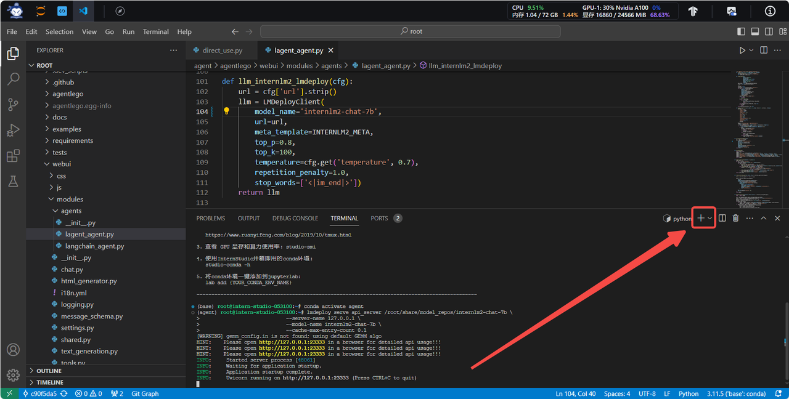
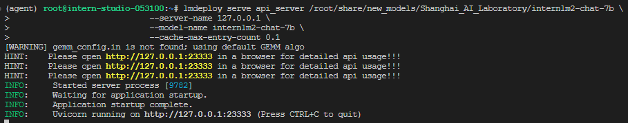
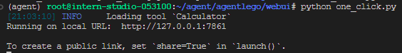
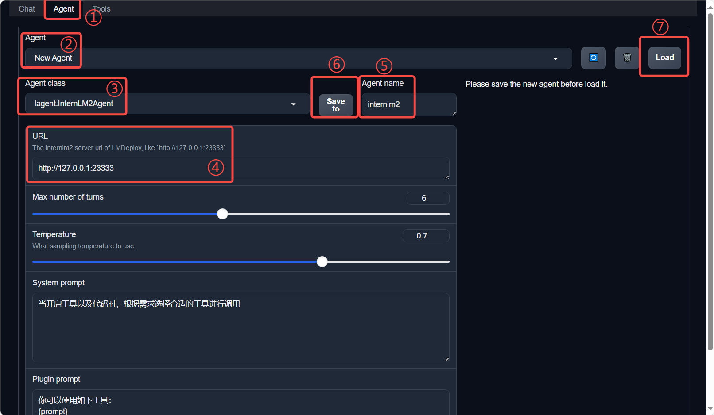
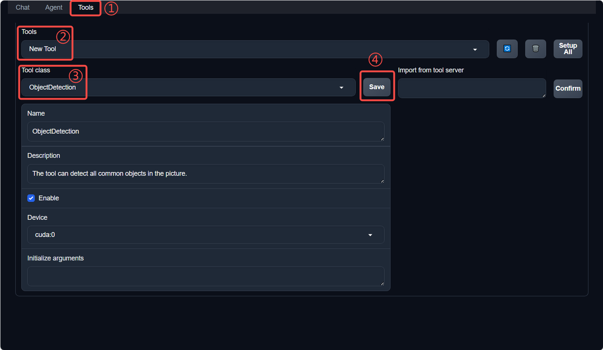
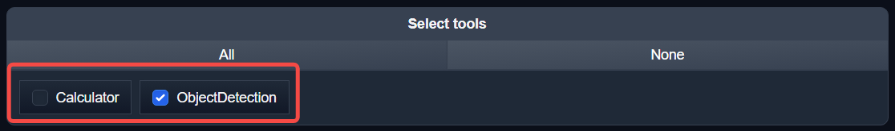
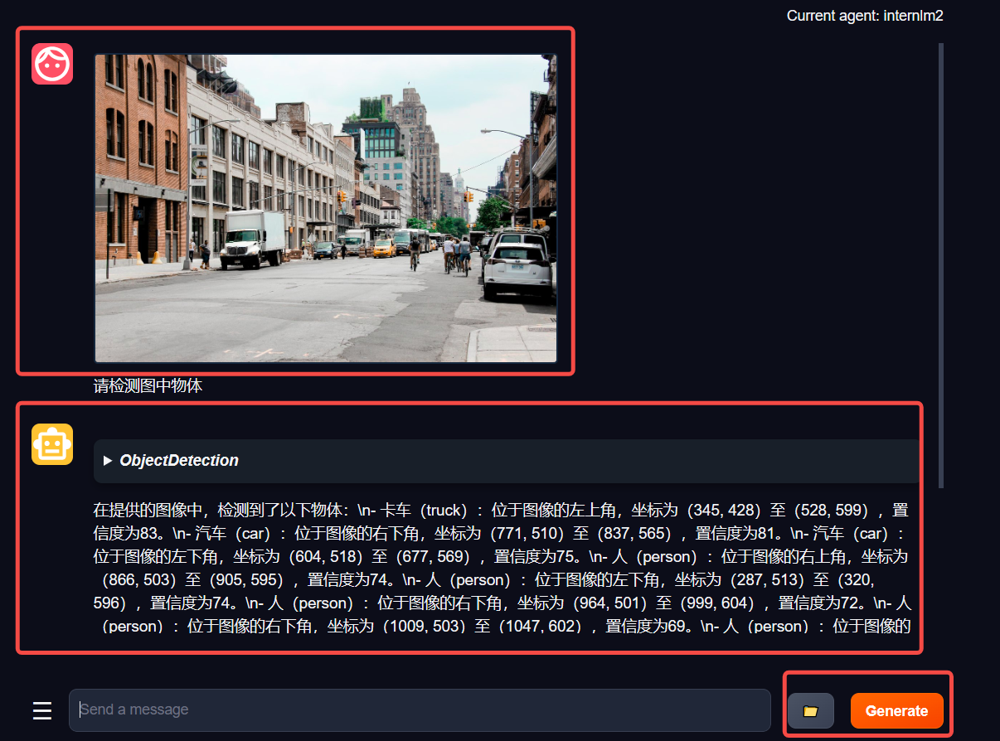

# AgentLego：组装智能体“乐高”

- [AgentLego：组装智能体“乐高”](#agentlego组装智能体乐高)
  - [1. 直接使用 AgentLego](#1-直接使用-agentlego)
  - [2 作为智能体工具使用](#2-作为智能体工具使用)
    - [2.1 修改相关文件](#21-修改相关文件)
    - [2.2 使用 LMDeploy 部署](#22-使用-lmdeploy-部署)
    - [2.3 启动 AgentLego WebUI](#23-启动-agentlego-webui)
    - [2.4 使用 AgentLego WebUI](#24-使用-agentlego-webui)
  - [3. 用 AgentLego 自定义工具](#3-用-agentlego-自定义工具)
    - [3.1 创建工具文件](#31-创建工具文件)
    - [3.2 注册新工具](#32-注册新工具)
    - [3.3 体验自定义工具效果](#33-体验自定义工具效果)

在介绍中我们提到过，AgentLego 算法库既可以直接使用，也可以作为智能体工具使用。下面将分别介绍这两种使用方式。我们将以目标检测工具为例。

> [!TIP]
> 前置环境配置部分请访问 [1.4 环境配置](README.md#14-环境配置)。

## 1. 直接使用 AgentLego

首先下载 demo 文件：

```bash
cd /root/agent
wget http://download.openmmlab.com/agentlego/road.jpg
```

由于 AgentLego 在安装时并不会安装某个特定工具的依赖，因此我们接下来准备安装目标检测工具运行时所需依赖。

AgentLego 所实现的目标检测工具是基于 mmdet (MMDetection) 算法库中的 RTMDet-Large 模型，因此我们首先安装 mim，然后通过 mim 工具来安装 mmdet。这一步所需时间可能会较长，请耐心等待。

```bash
conda activate agent
pip install openmim==0.3.9
mim install mmdet==3.3.0
```

在安装完成后，**可能**会观察到以下现象（如下图所示），但请放心，这是正常现象，这并不会影响到我们的使用。



然后通过 `touch /root/agent/direct_use.py`（大小写敏感）的方式在 /root/agent 目录下新建 direct_use.py 以直接使用目标检测工具，direct_use.py 的代码如下：

```python
import re

import cv2
from agentlego.apis import load_tool

# load tool
tool = load_tool('ObjectDetection', device='cuda')

# apply tool
visualization = tool('/root/agent/road.jpg')
print(visualization)

# visualize
image = cv2.imread('/root/agent/road.jpg')

preds = visualization.split('\n')
pattern = r'(\w+) \((\d+), (\d+), (\d+), (\d+)\), score (\d+)'

for pred in preds:
    name, x1, y1, x2, y2, score = re.match(pattern, pred).groups()
    x1, y1, x2, y2, score = int(x1), int(y1), int(x2), int(y2), int(score)
    cv2.rectangle(image, (x1, y1), (x2, y2), (0, 255, 0), 1)
    cv2.putText(image, f'{name} {score}', (x1, y1), cv2.FONT_HERSHEY_SIMPLEX, 0.8, (0, 255, 0), 1)

cv2.imwrite('/root/agent/road_detection_direct.jpg', image)
```

此时文件树结构如下：

```bash
/root/agent
├── agentlego
│   ├── agentlego
│   ├── docs
│   ├── examples
│   ├── LICENSE
│   └── ...
├── lagent
│   ├── docs
│   ├── examples
│   ├── lagent
│   ├── LICENSE
│   └── ...
├── Tutorial
│   ├── assets
│   ├── agent
│   ├── helloword
│   ├── huixiangdou
│   └── ...
├── direct_use.py
└── road.jpg
```

接下来在执行 `python /root/agent/direct_use.py` 以进行推理。在等待 RTMDet-Large 权重下载并推理完成后，我们就可以看到如下输出以及一张位于 /root/agent 名为 road_detection_direct.jpg 的图片：

```text
truck (345, 428, 528, 599), score 83
car (771, 510, 837, 565), score 81
car (604, 518, 677, 569), score 75
person (866, 503, 905, 595), score 74
person (287, 513, 320, 596), score 74
person (964, 502, 999, 604), score 72
person (1009, 503, 1047, 602), score 69
person (259, 510, 279, 575), score 65
car (1074, 524, 1275, 691), score 64
person (993, 508, 1016, 597), score 62
truck (689, 483, 764, 561), score 62
bicycle (873, 551, 903, 602), score 60
person (680, 523, 699, 567), score 55
bicycle (968, 551, 996, 609), score 53
bus (826, 482, 930, 560), score 52
bicycle (1011, 551, 1043, 617), score 51
```

| 原图 | 结果 |
| --- | --- |
|  |  |

## 2 作为智能体工具使用

### 2.1 修改相关文件

由于 AgentLego 算法库默认使用 InternLM2-Chat-20B 模型，因此我们首先需要修改 /root/agent/agentlego/webui/modules/agents/lagent_agent.py 文件的第 105行位置，将 internlm2-chat-20b 修改为 internlm2-chat-7b，即

```diff
def llm_internlm2_lmdeploy(cfg):
    url = cfg['url'].strip()
    llm = LMDeployClient(
-         model_name='internlm2-chat-20b',
+         model_name='internlm2-chat-7b',
        url=url,
        meta_template=INTERNLM2_META,
        top_p=0.8,
        top_k=100,
        temperature=cfg.get('temperature', 0.7),
        repetition_penalty=1.0,
        stop_words=['<|im_end|>'])
    return llm
```

其中红色表示要删除的内容，绿色表示要添加的内容。

### 2.2 使用 LMDeploy 部署

由于 AgentLego 的 WebUI 需要用到 LMDeploy 所启动的 api_server，因此我们首先按照下图指示在 vscode terminal 中执行如下代码使用 LMDeploy 启动一个 api_server。

```bash
conda activate agent
lmdeploy serve api_server /root/share/new_models/Shanghai_AI_Laboratory/internlm2-chat-7b \
                            --server-name 127.0.0.1 \
                            --model-name internlm2-chat-7b \
                            --cache-max-entry-count 0.1
```



### 2.3 启动 AgentLego WebUI

接下来我们按照下图指示新建一个 terminal 以启动 AgentLego WebUI。在新建的 terminal 中执行如下指令：

```bash
conda activate agent
cd /root/agent/agentlego/webui
python one_click.py
```



在等待 LMDeploy 的 api_server 与 AgentLego WebUI 完全启动后（如下图所示），在**本地**进行端口映射，将 LMDeploy api_server 的23333端口以及 AgentLego WebUI 的7860端口映射到本地。可以执行：

```bash
ssh -CNg -L 7860:127.0.0.1:7860 -L 23333:127.0.0.1:23333 root@ssh.intern-ai.org.cn -p 你的 ssh 端口号
```

| LMDeploy api_server | AgentLego WebUI |
| --- | --- |
|  |  |

### 2.4 使用 AgentLego WebUI

接下来在本地的浏览器页面中打开 http://localhost:7860 以使用 AgentLego WebUI。首先来配置 Agent，如下图所示。

1. 点击上方 Agent 进入 Agent 配置页面。（如①所示）
2. 点击 Agent 下方框，选择 New Agent。（如②所示）
3. 选择 Agent Class 为 lagent.InternLM2Agent。（如③所示）
4. 输入模型 URL 为 http://127.0.0.1:23333 。（如④所示）
5. 输入 Agent name，自定义即可，图中输入了 internlm2。（如⑤所示）
6. 点击 save to 以保存配置，这样在下次使用时只需在第2步时选择 Agent 为 internlm2 后点击 load 以加载就可以了。（如⑥所示）
7. 点击 load 以加载配置。（如⑦所示）



然后配置工具，如下图所示。

1. 点击上方 Tools 页面进入工具配置页面。（如①所示）
2. 点击 Tools 下方框，选择 New Tool 以加载新工具。（如②所示）
3. 选择 Tool Class 为 ObjectDetection。（如③所示）
4. 点击 save 以保存配置。（如④所示）



等待工具加载完成后，点击上方 Chat 以进入对话页面。在页面下方选择工具部分只选择 ObjectDetection 工具，如下图所示。为了确保调用工具的成功率，请在使用时确保仅有这一个工具启用。



接下来就可以愉快地使用 Agent 了。点击右下角文件夹以上传图片，上传图片后输入指令并点击 generate 以得到模型回复。如下图所示，我们上传了 demo 图片，模型成功地调用了工具，并详细地告诉了我们图中的内容。



## 3. 用 AgentLego 自定义工具

在本节中，我们将基于 AgentLego 构建自己的自定义工具。AgentLego 在这方面提供了较为详尽的文档，文档地址为 https://agentlego.readthedocs.io/zh-cn/latest/modules/tool.html 。自定义工具主要分为以下几步：

1. 继承 BaseTool 类
2. 修改 default_desc 属性（工具功能描述）
3. 如有需要，重载 setup 方法（重型模块延迟加载）
4. 重载 apply 方法（工具功能实现）

其中第一二四步是必须的步骤。下面我们将实现一个调用 MagicMaker 的 API 以实现图像生成的工具。

MagicMaker 是汇聚了优秀 AI 算法成果的免费 AI 视觉素材生成与创作平台。主要提供图像生成、图像编辑和视频生成三大核心功能，全面满足用户在各种应用场景下的视觉素材创作需求。体验更多功能可以访问 https://magicmaker.openxlab.org.cn/home 。

### 3.1 创建工具文件

首先通过 `touch /root/agent/agentlego/agentlego/tools/magicmaker_image_generation.py`（大小写敏感）的方法新建工具文件。该文件的内容如下：

```python
import json
import requests

import numpy as np

from agentlego.types import Annotated, ImageIO, Info
from agentlego.utils import require
from .base import BaseTool


class MagicMakerImageGeneration(BaseTool):

    default_desc = ('This tool can call the api of magicmaker to '
                    'generate an image according to the given keywords.')

    styles_option = [
        'dongman',  # 动漫
        'guofeng',  # 国风
        'xieshi',   # 写实
        'youhua',   # 油画
        'manghe',   # 盲盒
    ]
    aspect_ratio_options = [
        '16:9', '4:3', '3:2', '1:1',
        '2:3', '3:4', '9:16'
    ]

    @require('opencv-python')
    def __init__(self,
                 style='guofeng',
                 aspect_ratio='4:3'):
        super().__init__()
        if style in self.styles_option:
            self.style = style
        else:
            raise ValueError(f'The style must be one of {self.styles_option}')
        
        if aspect_ratio in self.aspect_ratio_options:
            self.aspect_ratio = aspect_ratio
        else:
            raise ValueError(f'The aspect ratio must be one of {aspect_ratio}')

    def apply(self,
              keywords: Annotated[str,
                                  Info('A series of Chinese keywords separated by comma.')]
        ) -> ImageIO:
        import cv2
        response = requests.post(
            url='https://magicmaker.openxlab.org.cn/gw/edit-anything/api/v1/bff/sd/generate',
            data=json.dumps({
                "official": True,
                "prompt": keywords,
                "style": self.style,
                "poseT": False,
                "aspectRatio": self.aspect_ratio
            }),
            headers={'content-type': 'application/json'}
        )
        image_url = response.json()['data']['imgUrl']
        image_response = requests.get(image_url)
        image = cv2.cvtColor(cv2.imdecode(np.frombuffer(image_response.content, np.uint8), cv2.IMREAD_COLOR),cv2.COLOR_BGR2RGB)
        return ImageIO(image)
```

### 3.2 注册新工具

接下来修改 /root/agent/agentlego/agentlego/tools/\_\_init\_\_.py 文件，将我们的工具注册在工具列表中。如下所示，我们将 MagicMakerImageGeneration 通过 from .magicmaker_image_generation import MagicMakerImageGeneration 导入到了文件中，并且将其加入了 \_\_all\_\_ 列表中。

```diff
from .base import BaseTool
from .calculator import Calculator
from .func import make_tool
from .image_canny import CannyTextToImage, ImageToCanny
from .image_depth import DepthTextToImage, ImageToDepth
from .image_editing import ImageExpansion, ImageStylization, ObjectRemove, ObjectReplace
from .image_pose import HumanBodyPose, HumanFaceLandmark, PoseToImage
from .image_scribble import ImageToScribble, ScribbleTextToImage
from .image_text import ImageDescription, TextToImage
from .imagebind import AudioImageToImage, AudioTextToImage, AudioToImage, ThermalToImage
from .object_detection import ObjectDetection, TextToBbox
from .ocr import OCR
from .scholar import *  # noqa: F401, F403
from .search import BingSearch, GoogleSearch
from .segmentation import SegmentAnything, SegmentObject, SemanticSegmentation
from .speech_text import SpeechToText, TextToSpeech
from .translation import Translation
from .vqa import VQA
+ from .magicmaker_image_generation import MagicMakerImageGeneration

__all__ = [
    'CannyTextToImage', 'ImageToCanny', 'DepthTextToImage', 'ImageToDepth',
    'ImageExpansion', 'ObjectRemove', 'ObjectReplace', 'HumanFaceLandmark',
    'HumanBodyPose', 'PoseToImage', 'ImageToScribble', 'ScribbleTextToImage',
    'ImageDescription', 'TextToImage', 'VQA', 'ObjectDetection', 'TextToBbox', 'OCR',
    'SegmentObject', 'SegmentAnything', 'SemanticSegmentation', 'ImageStylization',
    'AudioToImage', 'ThermalToImage', 'AudioImageToImage', 'AudioTextToImage',
    'SpeechToText', 'TextToSpeech', 'Translation', 'GoogleSearch', 'Calculator',
-     'BaseTool', 'make_tool', 'BingSearch'
+     'BaseTool', 'make_tool', 'BingSearch', 'MagicMakerImageGeneration'
]
```

### 3.3 体验自定义工具效果

与2.2，2.3以及2.4节类似，我们在两个 terminal 中分别启动 LMDeploy 服务和 AgentLego 的 WebUI 以体验我们自定义的工具的效果。

> [!IMPORTANT]
> 注意，确保 2.2 节中的 LMDeploy 服务以及 2.3 节中的 Web Demo 服务已经停止（即 terminal 已关闭），否则会出现 CUDA Out of Memory 或是端口已占用的情况！

```bash
conda activate agent
lmdeploy serve api_server /root/share/new_models/Shanghai_AI_Laboratory/internlm2-chat-7b \
                            --server-name 127.0.0.1 \
                            --model-name internlm2-chat-7b \
                            --cache-max-entry-count 0.1
```

```bash
conda activate agent
cd /root/agent/agentlego/webui
python one_click.py
```

并在**本地**执行如下操作以进行端口映射：

```bash
ssh -CNg -L 7860:127.0.0.1:7860 -L 23333:127.0.0.1:23333 root@ssh.intern-ai.org.cn -p 你的 ssh 端口号
```

在 Tool 界面选择 MagicMakerImageGeneration 后点击 save 后，回到 Chat 页面选择 MagicMakerImageGeneration 工具后就可以开始使用了。为了确保调用工具的成功率，请在使用时确保仅有这一个工具启用。下图是一个例子。可以看到模型成功地调用了工具并得到了结果。


