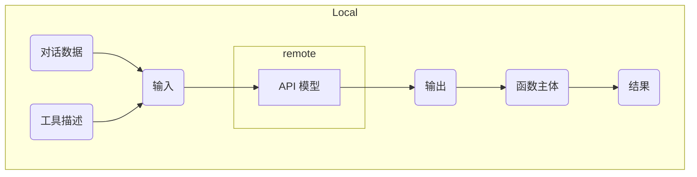

# Agent 工具能力微调

- [Agent 工具能力微调](#agent-工具能力微调)
  - [1. OpenAI Function Calling](#1-openai-function-calling)
    - [1.1 介绍](#11-介绍)
    - [1.2 数据格式](#12-数据格式)
      - [1.2.1 对话部分](#121-对话部分)
      - [1.2.2 工具描述部分](#122-工具描述部分)
  - [2. 基于 XTuner 的 Agent 工具能力微调](#2-基于-xtuner-的-agent-工具能力微调)

## 1. OpenAI Function Calling

### 1.1 介绍

为了让大语言模型连接到外部工具，OpenAI 推出了 Function calling 的功能。在 调用 OpenAI 的 API 时，可以描述函数并让模型智能地选择要输出的 JSON 对象，其中包含传递给一个或多个函数的参数。更多信息可以参考：https://platform.openai.com/docs/guides/function-calling 。

Chat Completions 的相关 API 并不会调用函数；相反，我们可以在自己的代码中根据模型的输出来实现调用函数的逻辑。大体工作流程如下：



其中，我们将对话数据和工具描述传递给 API 模型。在得到 API 模型的输出后，我们在本地根据输出调用函数，最终得到结果。

### 1.2 数据格式

在本节中，我们将介绍 OpenAI Function Calling 所规定的数据格式，以便于使用 XTuner 进行微调时理解数据的结构。

#### 1.2.1 对话部分

```json
messages = [
    {
        "role": "user",
        "content": "What's the weather like in San Francisco, Tokyo, and Paris?"
    }
]
```

如上所示，这是一个简单的对话数据，包含 role 和 content 两个字段，分别表示输入角色和输入内容。

#### 1.2.2 工具描述部分

```json
tools = [
    {
        "type": "function",
        "function": {
            "name": "get_current_weather",
            "description": "Get the current weather in a given location",
            "parameters": {
                "type": "object",
                "properties": {
                    "location": {
                        "type": "string",
                        "description": "The city and state, e.g. San Francisco, CA",
                    },
                    "unit": {"type": "string", "enum": ["celsius", "fahrenheit"]},
                },
                "required": ["location"],
            },
        },
    }
]
```

如上所示是 OpenAI Function Calling 的工具描述部分。各字段描述如下：

| 字段 | 描述 |
| --- | --- |
| type | 为 function，表示这是一个函数 |
| name | 函数的名称 |
| description | 函数的描述 |
| parameters | 函数的输入参数，包括参数的类型、描述、是否必须等信息 |
| parameters.type | 输入参数的类型 |
| parameters.properties | 输入参数的属性 |
| parameters.properties.location | 函数的输入参数之一，表示给 get_current_weather 函数传递的位置信息，为字符串类型 |
| parameters.properties.unit | 函数的输入参数之一，表示给 get_current_weather 函数传递的单位信息，为字符串类型，且只能为摄氏度或华氏度 |
| parameters.required | 表示参数中必须包含的字段，即必须传递 location 参数 |

可以看到，工具描述部分详细地描述了函数的名词和输入参数信息，以便于模型能够智能地选择要调用的函数，并且传入正确的参数。

## 2. 基于 XTuner 的 Agent 工具能力微调

这部分内容会在 XTuner 合入相关 PR 后的第一时间进行更新。敬请期待！