# Lagent：轻量级智能体框架

- [Lagent：轻量级智能体框架](#lagent轻量级智能体框架)
  - [1. Lagent Web Demo](#1-lagent-web-demo)
    - [1.1 使用 LMDeploy 部署](#11-使用-lmdeploy-部署)
    - [1.2 启动并使用 Lagent Web Demo](#12-启动并使用-lagent-web-demo)
  - [2. 用 Lagent 自定义工具](#2-用-lagent-自定义工具)
    - [2.1 创建工具文件](#21-创建工具文件)
    - [2.2 获取 API KEY](#22-获取-api-key)
    - [2.3 体验自定义工具效果](#23-体验自定义工具效果)

> [!TIP]
> 前置环境配置部分请访问 [1.4 环境配置](README.md#14-环境配置)。

## 1. Lagent Web Demo

### 1.1 使用 LMDeploy 部署

由于 Lagent 的 Web Demo 需要用到 LMDeploy 所启动的 api_server，因此我们首先按照下图指示在 vscode terminal 中执行如下代码使用 LMDeploy 启动一个 api_server。

```bash
conda activate agent
lmdeploy serve api_server /root/share/new_models/Shanghai_AI_Laboratory/internlm2-chat-7b \
                            --server-name 127.0.0.1 \
                            --model-name internlm2-chat-7b \
                            --cache-max-entry-count 0.1
```

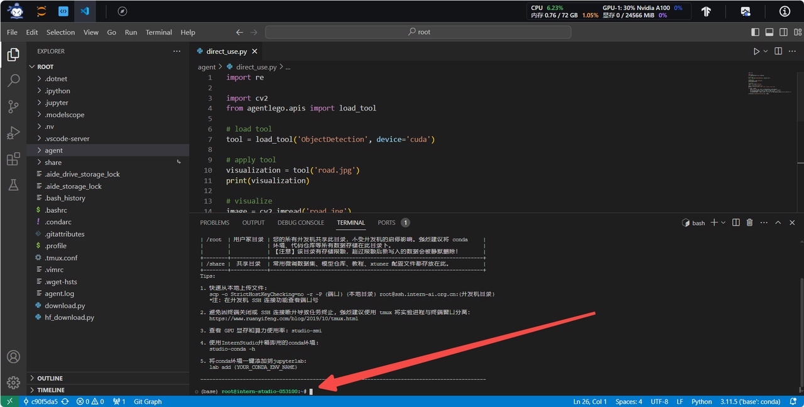

### 1.2 启动并使用 Lagent Web Demo

接下来我们按照下图指示新建一个 terminal 以启动 Lagent Web Demo。在新建的 terminal 中执行如下指令：

```bash
conda activate agent
cd /root/agent/lagent/examples
streamlit run internlm2_agent_web_demo.py --server.address 127.0.0.1 --server.port 7860
```

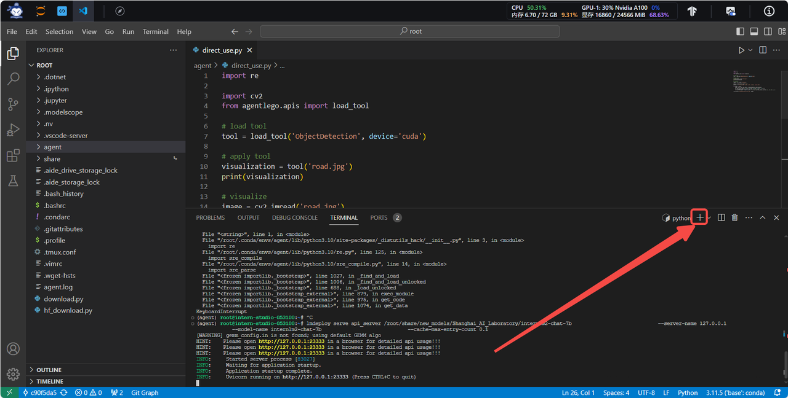

在等待 LMDeploy 的 api_server 与 Lagent Web Demo 完全启动后（如下图所示），在**本地**进行端口映射，将 LMDeploy api_server 的23333端口已经 Lagent Web Demo 的7860端口映射到本地。可以执行：

```bash
ssh -CNg -L 7860:127.0.0.1:7860 -L 23333:127.0.0.1:23333 root@ssh.intern-ai.org.cn -p <你的 ssh 端口号>
```

| LMDeploy api_server | Lagent Web Demo | 
| --- | --- |
| 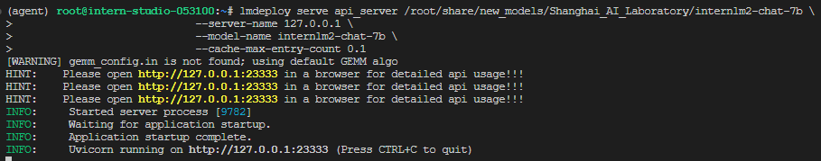 | 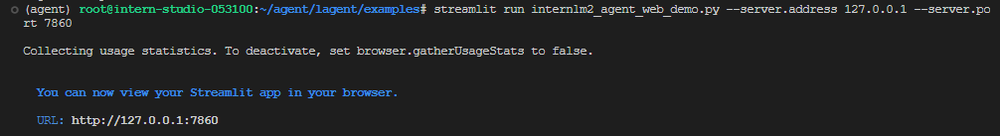 |

接下来在本地的浏览器页面中打开 http://localhost:7860 以使用 Lagent Web Demo。首先输入模型 IP 为 127.0.0.1:23333，**在输入完成后按下回车键以确认**。并选择插件为 ArxivSearch，以让模型获得在 arxiv 上搜索论文的能力。

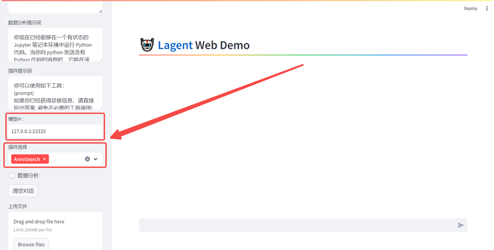

我们输入“请帮我搜索 InternLM2 Technical Report” 以让模型搜索书生·浦语2的技术报告。效果如下图所示，可以看到模型正确输出了 InternLM2 技术报告的相关信息。尽管还输出了其他论文，但这是由 arxiv 搜索 API 的相关行为导致的。

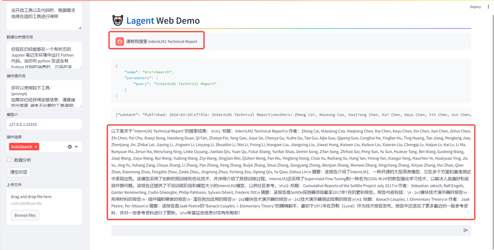

## 2. 用 Lagent 自定义工具

在本节中，我们将基于 Lagent 自定义一个工具。Lagent 中关于工具部分的介绍文档位于 https://lagent.readthedocs.io/zh-cn/latest/tutorials/action.html 。使用 Lagent 自定义工具主要分为以下几步：

1. 继承 BaseAction 类
2. 实现简单工具的 run 方法；或者实现工具包内每个子工具的功能
3. 简单工具的 run 方法可选被 tool_api 装饰；工具包内每个子工具的功能都需要被 tool_api 装饰

下面我们将实现一个调用和风天气 API 的工具以完成实时天气查询的功能。

### 2.1 创建工具文件

首先通过 `touch /root/agent/lagent/lagent/actions/weather.py`（大小写敏感）新建工具文件，该文件内容如下：

```python
import json
import os
import requests
from typing import Optional, Type

from lagent.actions.base_action import BaseAction, tool_api
from lagent.actions.parser import BaseParser, JsonParser
from lagent.schema import ActionReturn, ActionStatusCode

class WeatherQuery(BaseAction):
    """Weather plugin for querying weather information."""
    
    def __init__(self,
                 key: Optional[str] = None,
                 description: Optional[dict] = None,
                 parser: Type[BaseParser] = JsonParser,
                 enable: bool = True) -> None:
        super().__init__(description, parser, enable)
        key = os.environ.get('WEATHER_API_KEY', key)
        if key is None:
            raise ValueError(
                'Please set Weather API key either in the environment '
                'as WEATHER_API_KEY or pass it as `key`')
        self.key = key
        self.location_query_url = 'https://geoapi.qweather.com/v2/city/lookup'
        self.weather_query_url = 'https://devapi.qweather.com/v7/weather/now'

    @tool_api
    def run(self, query: str) -> ActionReturn:
        """一个天气查询API。可以根据城市名查询天气信息。
        
        Args:
            query (:class:`str`): The city name to query.
        """
        tool_return = ActionReturn(type=self.name)
        status_code, response = self._search(query)
        if status_code == -1:
            tool_return.errmsg = response
            tool_return.state = ActionStatusCode.HTTP_ERROR
        elif status_code == 200:
            parsed_res = self._parse_results(response)
            tool_return.result = [dict(type='text', content=str(parsed_res))]
            tool_return.state = ActionStatusCode.SUCCESS
        else:
            tool_return.errmsg = str(status_code)
            tool_return.state = ActionStatusCode.API_ERROR
        return tool_return
    
    def _parse_results(self, results: dict) -> str:
        """Parse the weather results from QWeather API.
        
        Args:
            results (dict): The weather content from QWeather API
                in json format.
        
        Returns:
            str: The parsed weather results.
        """
        now = results['now']
        data = [
            f'数据观测时间: {now["obsTime"]}',
            f'温度: {now["temp"]}°C',
            f'体感温度: {now["feelsLike"]}°C',
            f'天气: {now["text"]}',
            f'风向: {now["windDir"]}，角度为 {now["wind360"]}°',
            f'风力等级: {now["windScale"]}，风速为 {now["windSpeed"]} km/h',
            f'相对湿度: {now["humidity"]}',
            f'当前小时累计降水量: {now["precip"]} mm',
            f'大气压强: {now["pressure"]} 百帕',
            f'能见度: {now["vis"]} km',
        ]
        return '\n'.join(data)

    def _search(self, query: str):
        # get city_code
        try:
            city_code_response = requests.get(
                self.location_query_url,
                params={'key': self.key, 'location': query}
            )
        except Exception as e:
            return -1, str(e)
        if city_code_response.status_code != 200:
            return city_code_response.status_code, city_code_response.json()
        city_code_response = city_code_response.json()
        if len(city_code_response['location']) == 0:
            return -1, '未查询到城市'
        city_code = city_code_response['location'][0]['id']
        # get weather
        try:
            weather_response = requests.get(
                self.weather_query_url,
                params={'key': self.key, 'location': city_code}
            )
        except Exception as e:
            return -1, str(e)
        return weather_response.status_code, weather_response.json()
```

### 2.2 获取 API KEY

为了获得稳定的天气查询服务，我们首先要获取 API KEY。首先打开 https://dev.qweather.com/docs/api/ 后，点击右上角控制台。（如下图所示）

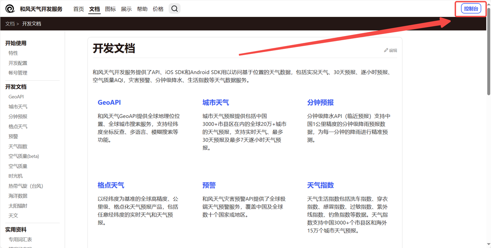

进入控制台后，点击左侧项目管理，然后点击右上角创建项目以创建新项目。（如下图所示）

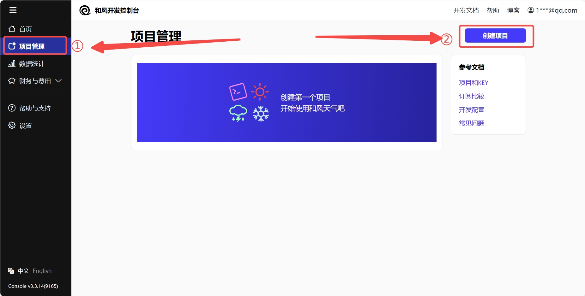

输入相关项目名称，选择免费订阅，**Web API** 以及输入 key 的名称。（项目名称和 key 的名词自由输入即可，如下图所示）

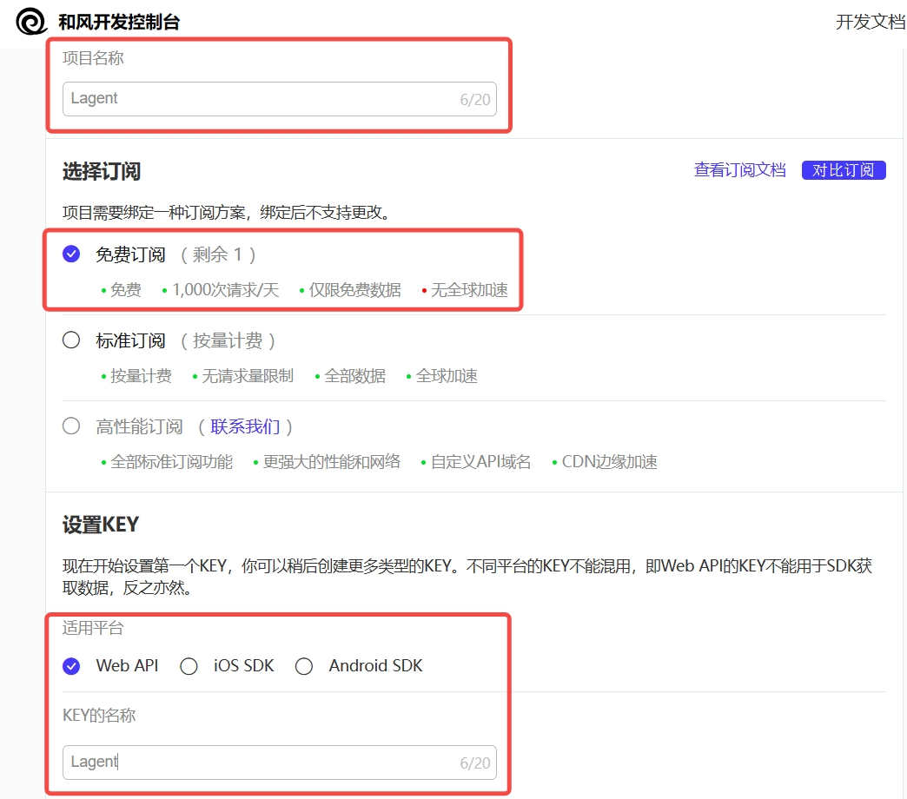

接下来回到项目管理页面，查看我们刚刚创建的 key，并且复制好以供2.3节中使用。（如下图所示）

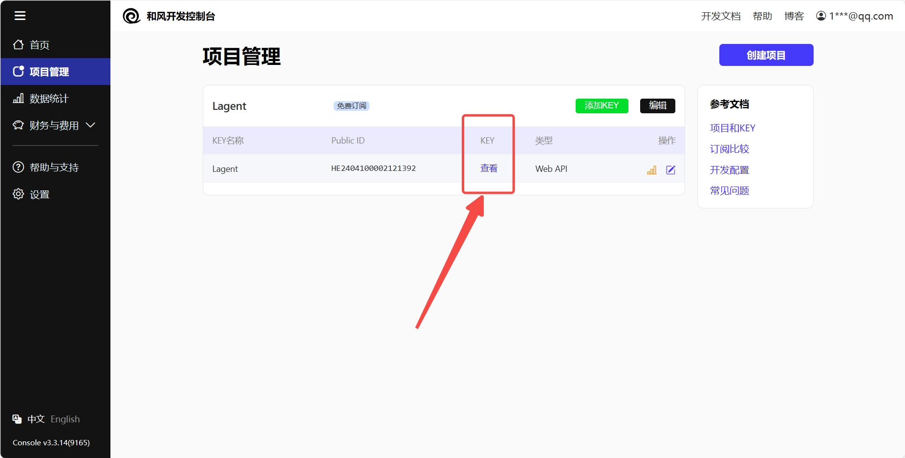

### 2.3 体验自定义工具效果

与 1.2 部分类似，我们在两个 terminal 中分别启动 LMDeploy 服务和 Tutorial 已经写好的用于这部分的 Web Demo：

> [!IMPORTANT]
> 注意，确保 1.1 节中的 LMDeploy 服务以及 1.2 节中的 Web Demo 服务已经停止（即 terminal 已关闭），否则会出现 CUDA Out of Memory 或是端口已占用的情况！

```bash
conda activate agent
lmdeploy serve api_server /root/share/new_models/Shanghai_AI_Laboratory/internlm2-chat-7b \
                            --server-name 127.0.0.1 \
                            --model-name internlm2-chat-7b \
                            --cache-max-entry-count 0.1
```

```bash
export WEATHER_API_KEY="在2.2节获取的API KEY"
cd /root/agent/tutorial/agent
streamlit run internlm2_weather_web_demo.py --server.address 127.0.0.1 --server.port 7860
```

并在**本地**执行如下操作以进行端口映射：

```bash
ssh -CNg -L 7860:127.0.0.1:7860 -L 23333:127.0.0.1:23333 root@ssh.intern-ai.org.cn -p <你的 ssh 端口号>
```

在输入模型地址并选择好工具后，就可以开始体验了。下图是一个例子：

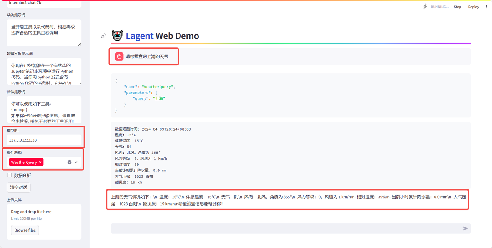
