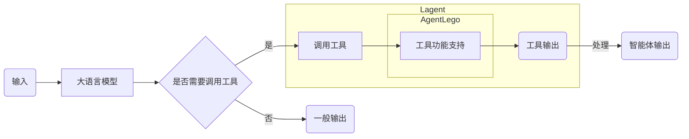

# 基于 AgentLego 组装你的智能体“乐高”

- [基于 AgentLego 组装你的智能体“乐高”](#基于-agentlego-组装你的智能体乐高)
  - [1. AgentLego 概述](#1-agentlego-概述)
    - [1.1 AgentLego 是什么](#11-agentlego-是什么)
    - [1.2 环境配置](#12-环境配置)
  - [2. 使用 AgentLego](#2-使用-agentlego)
    - [2.1 直接使用 AgentLego](#21-直接使用-agentlego)
    - [2.2 作为智能体工具使用](#22-作为智能体工具使用)
  - [3. 自定义智能体](#3-自定义智能体)
  - [4. 反正是微调，标题没想好](#4-反正是微调标题没想好)

## 1. AgentLego 概述

### 1.1 AgentLego 是什么

AgentLego 是一个提供了多种开源工具 API 的算法库，旨在像是乐高积木一样，让用户可以通过快速简便地拓展自定义工具，从而组装出自己的智能体。通过 AgentLego 算法库，不仅可以直接使用多种工具，也可以利用这些工具，在相关智能体框架（如 Lagent、Transformers Agent 等）的帮助下，快速构建可以增强大语言模型能力的智能体。

AgentLego 目前提供了如下工具：

<table align='center'>
    <tr align='center' valign='bottom'>
        <b><td>通用能力</td></b>
        <b><td>语音相关</td></b>
        <b><td>图像处理</td></b>
        <b><td>AIGC</td></b>
    </tr>
    <tr valign='top'>
    <td>
        <ul>
        <li>计算器</li>
        <li>谷歌搜素</li>
        </ul>
    </td>
    <td>
        <ul>
        <li>文本 -> 音频（TTS）</li>
        <li>音频 -> 文本（STT）</li>
        </ul>
    </td>
    <td>
        <ul>
        <li>描述输入图像</li>
        <li>识别文本（OCR）</li>
        <li>视觉问答（VQA）</li>
        <li>人体姿态估计</li>
        <li>人脸关键点检测</li>
        <li>图像边缘提取（Canny）</li>
        <li>深度图生成</li>
        <li>生成涂鸦（Scribble）</li>
        <li>检测全部目标</li>
        <li>检测给定目标</li>
        <li>SAM
            <ul>
            <li>分割一切</li>
            <li>分割给定目标</li>
            </ul>
        </li>
        </ul>
    </td>
    <td>
        <ul>
        <li>文生图</li>
        <li>图像拓展</li>
        <li>删除给定对象</li>
        <li>替换给定对象</li>
        <li>根据指令修改</li>
        <li>ControlNet 系列
            <ul>
            <li>根据边缘+描述生成</li>
            <li>根据深度图+描述生成</li>
            <li>根据姿态+描述生成</li>
            <li>根据涂鸦+描述生成</li>
            </ul>
        </li>
        <li>ImageBind 系列
            <ul>
            <li>音频生成图像</li>
            <li>热成像生成图像</li>
            <li>音频+图像生成图像</li>
            <li>音频+文本生成图像</li>
            </ul>
        </li>
    </td>
    </tr>
</table>

但是，AgentLego 与大模型智能体并不直接相关，而是作为相关智能体的功能支持模块发挥作用。以 Lagent 作为智能体框架的一个例子，输入输出流程图可以如下所示：

### 1.2 环境配置

## 2. 使用 AgentLego

### 2.1 直接使用 AgentLego

### 2.2 作为智能体工具使用

## 3. 自定义智能体

## 4. 反正是微调，标题没想好