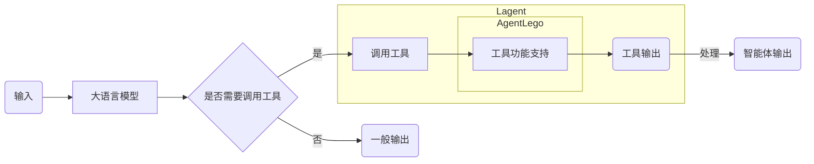
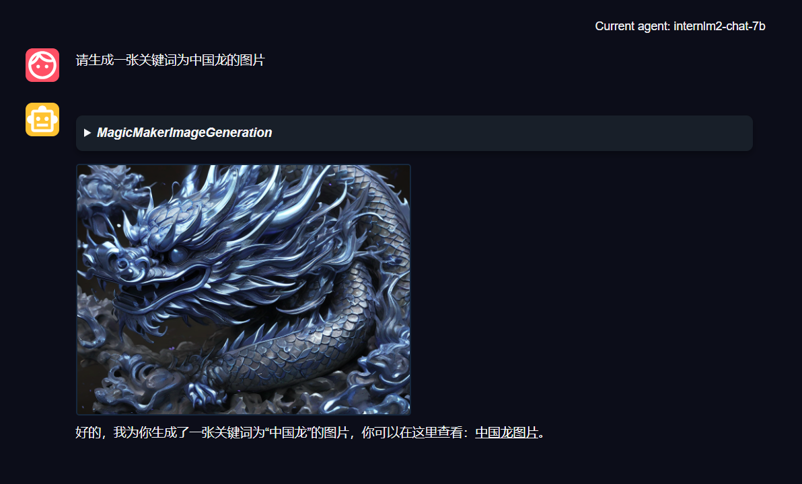

# 基于 AgentLego 组装你的智能体“乐高”

- [基于 AgentLego 组装你的智能体“乐高”](#基于-agentlego-组装你的智能体乐高)
  - [1. AgentLego 概述](#1-agentlego-概述)
    - [1.1 AgentLego 是什么](#11-agentlego-是什么)
    - [1.2 环境配置](#12-环境配置)
  - [2. 使用 AgentLego](#2-使用-agentlego)
    - [2.1 直接使用 AgentLego](#21-直接使用-agentlego)
    - [2.2 作为智能体工具使用](#22-作为智能体工具使用)
  - [3. 自定义智能体工具](#3-自定义智能体工具)
    - [3.1 创建工具文件](#31-创建工具文件)
    - [3.2 修改 `__init__` 函数](#32-修改-__init__-函数)
    - [3.3 使用工具](#33-使用工具)
  - [4. 反正是微调，标题没想好](#4-反正是微调标题没想好)

## 1. AgentLego 概述

### 1.1 AgentLego 是什么

AgentLego 是一个提供了多种开源工具 API 的算法库，旨在像是乐高积木一样，让用户可以通过快速简便地拓展自定义工具，从而组装出自己的智能体。通过 AgentLego 算法库，不仅可以直接使用多种工具，也可以利用这些工具，在相关智能体框架（如 Lagent、Transformers Agent 等）的帮助下，快速构建可以增强大语言模型能力的智能体。

AgentLego 目前提供了如下工具：

<table align='center'>
    <tr align='center' valign='bottom'>
        <b><td>通用能力</td></b>
        <b><td>语音相关</td></b>
        <b><td>图像处理</td></b>
        <b><td>AIGC</td></b>
    </tr>
    <tr valign='top'>
    <td>
        <ul>
        <li>计算器</li>
        <li>谷歌搜素</li>
        </ul>
    </td>
    <td>
        <ul>
        <li>文本 -> 音频（TTS）</li>
        <li>音频 -> 文本（STT）</li>
        </ul>
    </td>
    <td>
        <ul>
        <li>描述输入图像</li>
        <li>识别文本（OCR）</li>
        <li>视觉问答（VQA）</li>
        <li>人体姿态估计</li>
        <li>人脸关键点检测</li>
        <li>图像边缘提取（Canny）</li>
        <li>深度图生成</li>
        <li>生成涂鸦（Scribble）</li>
        <li>检测全部目标</li>
        <li>检测给定目标</li>
        <li>SAM
            <ul>
            <li>分割一切</li>
            <li>分割给定目标</li>
            </ul>
        </li>
        </ul>
    </td>
    <td>
        <ul>
        <li>文生图</li>
        <li>图像拓展</li>
        <li>删除给定对象</li>
        <li>替换给定对象</li>
        <li>根据指令修改</li>
        <li>ControlNet 系列
            <ul>
            <li>根据边缘+描述生成</li>
            <li>根据深度图+描述生成</li>
            <li>根据姿态+描述生成</li>
            <li>根据涂鸦+描述生成</li>
            </ul>
        </li>
        <li>ImageBind 系列
            <ul>
            <li>音频生成图像</li>
            <li>热成像生成图像</li>
            <li>音频+图像生成图像</li>
            <li>音频+文本生成图像</li>
            </ul>
        </li>
    </td>
    </tr>
</table>

但是，AgentLego 与大模型智能体并不直接相关，而是作为相关智能体的功能支持模块发挥作用。以 Lagent 作为智能体框架的一个例子，输入输出流程图可以如下所示：



### 1.2 环境配置

TODO

## 2. 使用 AgentLego

上文提到，AgentLego 算法库既可以直接使用，也可以作为智能体工具使用。下面将分别介绍这两种使用方式。我们将以目标检测工具为例。

### 2.1 直接使用 AgentLego

首先下载 demo 文件：

```bash
wget http://download.openmmlab.com/agentlego/road.jpg
```

由于 AgentLego 在安装时并没有安装某个特定工具的依赖，因此我们接下来准备安装该工具运行时所需依赖。

AgentLego 所实现的目标检测工具是基于 mmdet（MMDetction） 算法库中的 RTMDet-large 模型，因此我们首先安装 mim，然后通过 mim 来安装 mmdet。

```bash
pip install openmim
mim install mmdet
```

然后新建 direct_use.py 以直接使用该工具，该脚本代码为：

```python
import re

import cv2
from agentlego.apis import load_tool

# load tool
tool = load_tool('ObjectDetection', device='cuda')

# apply tool
visualization = tool('road.jpg')
print(visualization)

# visualize
image = cv2.imread('road.jpg')

preds = visualization.split('\n')
pattern = r'(\w+) \((\d+), (\d+), (\d+), (\d+)\), score (\d+)'

for pred in preds:
    name, x1, y1, x2, y2, score = re.match(pattern, pred).groups()
    x1, y1, x2, y2, score = int(x1), int(y1), int(x2), int(y2), int(score)
    cv2.rectangle(image, (x1, y1), (x2, y2), (0, 255, 0), 1)
    cv2.putText(image, f'{name} {score}', (x1, y1), cv2.FONT_HERSHEY_SIMPLEX, 0.8, (0, 255, 0), 1)

cv2.imwrite('road_detection_direct.jpg', image)
```

此时文件树结构如下：

```bash
TODO
```

在下载完成并完成推理后，我们就可以看到如下输出，以及一张名为 road_detection_direct.jpg 的图片：

```text
truck (345, 428, 528, 599), score 83
car (771, 510, 837, 565), score 81
car (604, 518, 677, 569), score 75
person (866, 503, 905, 595), score 74
person (287, 513, 320, 596), score 74
person (964, 502, 999, 604), score 72
person (1009, 503, 1047, 602), score 69
person (259, 510, 279, 575), score 65
car (1074, 524, 1275, 691), score 64
person (993, 508, 1016, 597), score 62
truck (689, 483, 764, 561), score 62
bicycle (873, 551, 903, 602), score 60
person (680, 523, 699, 567), score 55
bicycle (968, 551, 996, 609), score 53
bus (826, 482, 930, 560), score 52
bicycle (1011, 551, 1043, 617), score 51
```

| 原图 | 结果 |
| --- | --- |
|  |  |

### 2.2 作为智能体工具使用

TODO

## 3. 自定义智能体工具

在本节中，我们将基于 AgentLego 构建自己的自定义工具。AgentLego 在这方面提供了较为详尽的文档，文档地址为 https://agentlego.readthedocs.io/zh-cn/latest/modules/tool.html 。自定义工具主要分为以下几步：

1. 继承 `BaseTool` 类
2. 修改 `default_desc` 属性（工具功能描述）
3. 如有需要，重载 `setup` 方法（重型模块延迟加载）
4. 重载 `apply` 方法（工具功能实现）

其中第一二四步是必须的步骤。下面我们将实现一个调用 MagicMaker 的 API 以实现图像生成的工具。

MagicMaker 是国内领先的免费 AI 图像、视频创作平台，集成提供了图像生成、图像编辑和视频生成三大核心功能。体验更多功能可以访问 https://magicmaker.openxlab.org.cn/home 。

### 3.1 创建工具文件

TODO

### 3.2 修改 `__init__` 函数

TODO

```python
from .base import BaseTool
from .calculator import Calculator
from .func import make_tool
from .image_canny import CannyTextToImage, ImageToCanny
from .image_depth import DepthTextToImage, ImageToDepth
from .image_editing import ImageExpansion, ImageStylization, ObjectRemove, ObjectReplace
from .image_pose import HumanBodyPose, HumanFaceLandmark, PoseToImage
from .image_scribble import ImageToScribble, ScribbleTextToImage
from .image_text import ImageDescription, TextToImage
from .imagebind import AudioImageToImage, AudioTextToImage, AudioToImage, ThermalToImage
from .object_detection import ObjectDetection, TextToBbox
from .ocr import OCR
from .search import GoogleSearch
from .segmentation import SegmentAnything, SegmentObject, SemanticSegmentation
from .speech_text import SpeechToText, TextToSpeech
from .translation import Translation
from .vqa import VQA
from .magicmaker_image_generation import MagicMakerImageGeneration

__all__ = [
    'CannyTextToImage', 'ImageToCanny', 'DepthTextToImage', 'ImageToDepth',
    'ImageExpansion', 'ObjectRemove', 'ObjectReplace', 'HumanFaceLandmark',
    'HumanBodyPose', 'PoseToImage', 'ImageToScribble', 'ScribbleTextToImage',
    'ImageDescription', 'TextToImage', 'VQA', 'ObjectDetection', 'TextToBbox', 'OCR',
    'SegmentObject', 'SegmentAnything', 'SemanticSegmentation', 'ImageStylization',
    'AudioToImage', 'ThermalToImage', 'AudioImageToImage', 'AudioTextToImage',
    'SpeechToText', 'TextToSpeech', 'Translation', 'GoogleSearch', 'Calculator',
    'MagicMakerImageGeneration', 'BaseTool', 'make_tool'
]
```

### 3.3 使用工具

与上文 [2.2 作为智能体工具使用](#22-作为智能体工具使用) 类似，我们可以直接将自定义好的工具作为智能体工具使用。**注意**，为了确保调用工具的成功率，请在使用时确保仅有这一个工具启用。

以下是一张效果图：



## 4. 反正是微调，标题没想好

TODO