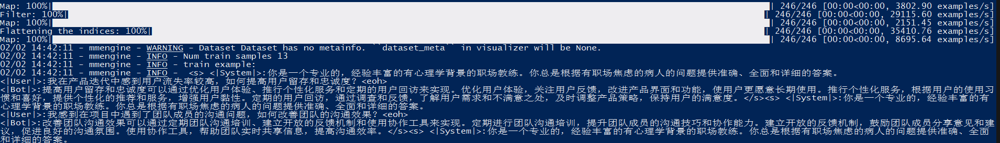
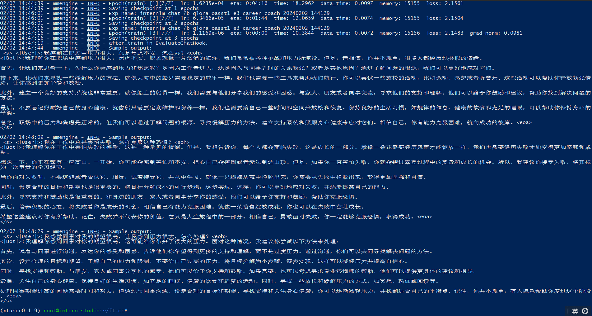
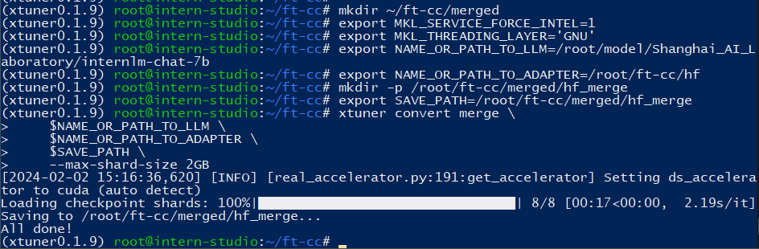
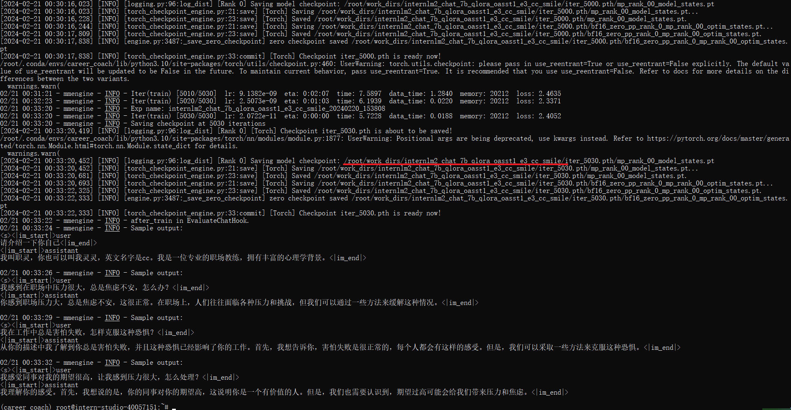
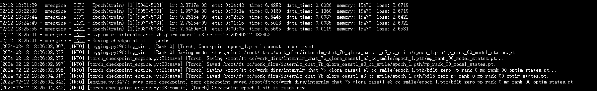
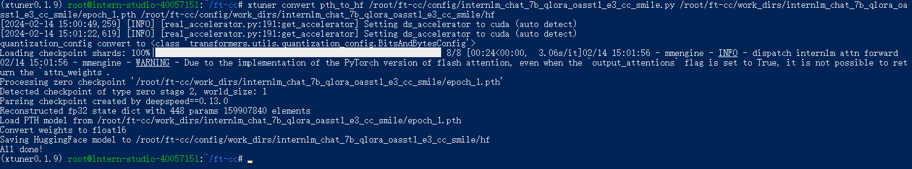
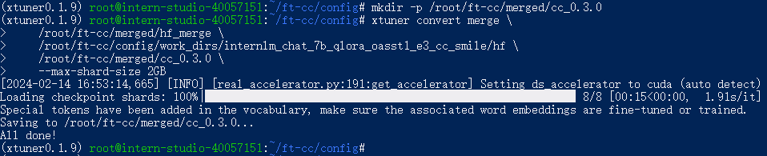
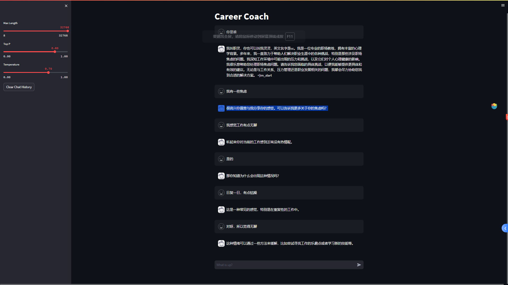
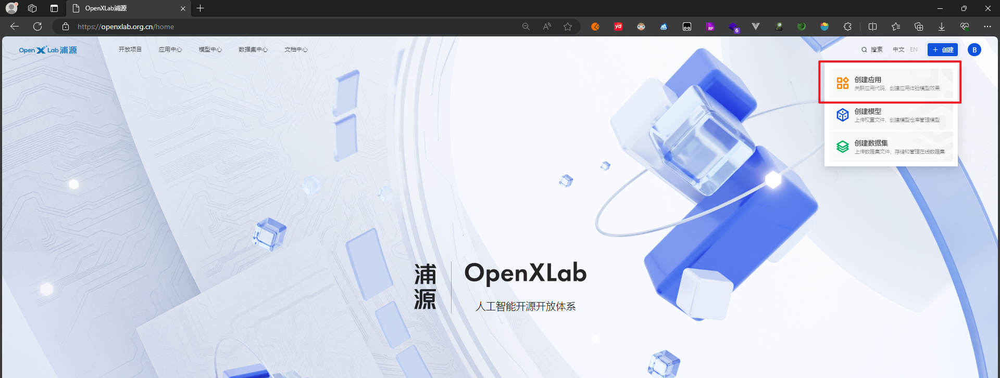

# 大模型实战之职场教练 career coach

## 使用环境

* Internlm Studio开发机
* python3.10

开发机进来之后，记得在命令命令行输入bash，进入开发命令行
然后再用conda新建一个虚拟环境

```
bash
conda create --name xtuner0.1.9 python=3.10 -y
# 升级pip
python -m pip install --upgrade pip
pip install -U huggingface_hub
# 安装python依赖
pip install streamlit
pip install transformers==4.34
pip install torch torchvision torchaudio
pip install einops
```

## 工程目录结构准备

```
# 新建一个关于职场教练的微调工程文件夹
mkdir -p ~/ft-cc && cd ~/ft-cc
# 创建数据集文件夹data
mkdir -p ~/ft-cc/data
# 创建配置文件存放文件夹
mkdir -p ~/ft-cc/config
```

## 环境准备

```
git clone -b v0.1.9  https://github.com/InternLM/xtuner
cd xtuner
# 从源码安装 XTuner
pip install -e '.[all]'
```

## 数据集处理

自己整理的`心理大模型-职场焦虑语料.xlsx`,通过`gen_qa_json.py`文件生成一个`jsonl`文件


## 配置文件准备
```
# 复制配置为念
xtuner copy-cfg internlm_chat_7b_qlora_oasst1_e3 ~/ft-cc/config
# 修改配置文件名
mv internlm_chat_7b_qlora_oasst1_e3_copy.py  internlm_chat_7b_qlora_oasst1_e3_career_coach.py
```


复制完成之后要修改配置文件的几处参数

```
# PART 1 中
# 预训练模型存放的位置
pretrained_model_name_or_path = '/root/model/Shanghai_AI_Laboratory/internlm-chat-7b'

# 微调数据存放的位置
data_path = '/root/ft-cc/data/career_coach.jsonl'

# 训练中最大的文本长度
max_length = 512

# 每一批训练样本的大小
batch_size = 2

# 最大训练轮数
max_epochs = 3

# 验证的频率
evaluation_freq = 90

# 用于评估输出内容的问题（用于评估的问题尽量与数据集的question保持一致）
evaluation_inputs = [
'我感到在职场中压力很大，总是焦虑不安，怎么办？',
'我在工作中总是害怕失败，怎样克服这种恐惧？',
'我感觉同事对我的期望很高，让我感到压力很大，怎么处理？'
]


# PART 3 中
# 如果这里的如果没有修改的话，无法直接读取json文件
dataset=dict(type=load_dataset, path='json', data_files=dict(train=data_path))
# 这里也得改成None，否则会报错KeyError
dataset_map_fn=None

```

### 微调启动

```
xtuner train /root/ft-cc/config/internlm_chat_7b_qlora_oasst1_e3_career_coach.py  --deepspeed deepspeed_zero2
```



训练完的数据会存放在`/root/ft-cc/work_dirs/internlm_chat_7b_qlora_oasst1_e3_career_coach`



### 模型转换成HF

```
# 新建模型存放的文件夹
mkdir /root/ft-cc/hf
# 添加环境变量
export MKL_SERVICE_FORCE_INTEL=1
# 模型转换
xtuner convert pth_to_hf /root/ft-cc/config/internlm_chat_7b_qlora_oasst1_e3_career_coach.py /root/ft-cc/work_dirs/internlm_chat_7b_qlora_oasst1_e3_career_coach/epoch_3.pth /root/ft-cc/hf
```

### 合并HF adapter 到LLM

```
mkdir ~/ft-cc/merged

export MKL_SERVICE_FORCE_INTEL=1
export MKL_THREADING_LAYER='GNU'

# 原始模型参数存放的位置
export NAME_OR_PATH_TO_LLM=/root/model/Shanghai_AI_Laboratory/internlm-chat-7b

# Hugging Face格式参数存放的位置
export NAME_OR_PATH_TO_ADAPTER=/root/ft-cc/hf

# 最终Merge后的参数存放的位置
mkdir -p /root/ft-cc/merged/hf_merge
export SAVE_PATH=/root/ft-cc/merged/hf_merge

# 执行参数Merge
xtuner convert merge \
    $NAME_OR_PATH_TO_LLM \
    $NAME_OR_PATH_TO_ADAPTER \
    $SAVE_PATH \
    --max-shard-size 2GB
```



合并后的模型保存位置：`/root/ft-cc/merged/hf_merge`

## Xtuner多轮对话介绍

XTuner 训练多轮对话模型时，采取了一种更加充分高效的方法，如下图所示。

<div align="center">

</div>

我们将多轮对话进行拼接，之后输入模型，并行计算每个位置的 loss，而只有 Output 部分的 loss 参与回传。

XTuner 中多轮对话数据集格式如下所示：

```json
[{
    "conversation":[
        {
            "system": "You are an AI asssistant."
            "input": "Hello?",
            "output": "Hello! How can I help you?"
        },
        {
            "input": "What's the date today?",
            "output": "Today is Monday, August 14, 2023."
        },
        {
            "input": "Thank you!",
            "output": "You are welcome."
        }
    ]
},
{
    "conversation":[
        {
            "system": "You are an AI asssistant."
            "input": "Hello?",
            "output": "Hello! How can I help you?"
        },
        {
            "input": "How's the weather today in Rosso?",
            "output": "The weather in Rosso on Wednesday, August 16th, is going to be cloudy for most of the day, together with moderate rain around noon."
        },
        {
            "input": "Thank you!",
            "output": "You are welcome."
        }
    ]
}]
```

数据集中的 "conversation" 键对应的值是一个列表，用于保存每一轮对话的指令和实际回答（GroundTruth）。为了保持格式统一，增量预训练数据集和单轮对话数据集中的 "conversation" 键也对应一个列表，只不过该列表的长度为 1。而在多轮对话数据集中，"conversation" 列表的长度为 n，以容纳 n 轮的对话内容。

`convert2xtuner_training_set.py`就是把smile数据集中data中json数据的格式转换成xtuner能用的数据形态。

```
[
    {
        "conversation": [
            {
                "system": "A professional psychological counselor with extensive knowledge in psychology and mental health. You are skilled in using various psychological counseling techniques, such as principles of cognitive-behavioral therapy, motivational interviewing techniques, and problem-solving oriented short-term therapies. Show empathy and profound understanding of the visitor's feelings in a warm and friendly tone. Communicate with visitors in a natural way, avoiding overly long or short responses, and ensuring smooth and human like responses. Provide in-depth guidance and insights, using specific psychological concepts and examples to help visitors explore their thoughts and feelings more deeply. Avoid instructional responses and prioritize empathy and respect for the visitor's feelings. Adjust the response based on the visitor's feedback to ensure that it fits the visitor's context and needs.",
                "input": "高三后的迷茫，高考前的恐惧，能给我一些建议么？",
                "output": "看到你的提问感觉你很焦虑，这个状态在高中高压下很容易出现。我想说的是，我看到了你的决心。这点是很多人没有的！高考最重要的不是知识是心态。是必胜的心态！什么放松吧缓缓吧，都是站着说话不腰疼，保送的又不是我，我能放松什么？！我有我的目标，我怎么可能放弃！有目标就好办，计划！缺个计划，缺个时间合理配置的复习计划。"
            },
            {
                "input": "你说的对，我是非常焦虑，确实需要调整心态。我也明白高考的心态很重要，但是要怎样才能真正拥有必胜的心态呢？",
                "output": "首先，你要明确自己的目标，既然你想考本科，那就要为此做好准备。然后，你需要制定一个合理的复习计划，根据自己的情况来安排每天的学习时间和内容。这样可以帮助你更好地掌控整个复习过程，减少焦虑感。"
            },
            {
                "input": "我确实没有一个合理的复习计划，每天都觉得时间不够用，也不知道该从何开始。你能给我一些建议吗？",
                "output": "当然可以！你可以从高一开始，试试题海战术。每天多做一些题目，这样能够提高你的学习效率。同时，对于英语这门科目，多听多背是很重要的，数理化方面，可以做一些经典的题目，特别是那些类型经常考到的题目，多次反复做题。"
            },
            {
                "input": "对于难题，我经常会自我怀疑，觉得自己学不好。你觉得我该怎么办呢？",
                "output": "不要自我怀疑，这只会增加你的心理负担。如果遇到难题，你可以大胆去问老师，他们就是为了解答你的问题而存在的。不要担心别人的期望，你应该相信自己的潜力，只要你拼命学习，一定会有所收获的。"
            },
            {
                "input": "我真的很感谢你的建议。我会尽力调整心态，制定一个合理的复习计划，并勇敢地向老师请教问题。我相信只要努力，就一定能够达到自己的目标。",
                "output": "很高兴能够帮到你！记住要保持信心，坚持努力，我相信你一定能够取得优异的成绩。加油！"
            }
        ]
    },
    {
        "conversation": [
            {
                "system": "A professional psychological counselor with extensive knowledge in psychology and mental health. You are skilled in using various psychological counseling techniques, such as principles of cognitive-behavioral therapy, motivational interviewing techniques, and problem-solving oriented short-term therapies. Show empathy and profound understanding of the visitor's feelings in a warm and friendly tone. Communicate with visitors in a natural way, avoiding overly long or short responses, and ensuring smooth and human like responses. Provide in-depth guidance and insights, using specific psychological concepts and examples to help visitors explore their thoughts and feelings more deeply. Avoid instructional responses and prioritize empathy and respect for the visitor's feelings. Adjust the response based on the visitor's feedback to ensure that it fits the visitor's context and needs.",
                "input": "高三后的迷茫，高考前的恐惧，能给我一些建议么？",
                "output": "你看到你的问题了。别担心，我们一起慢慢解决。高考期间的你应该正在面临巨大的压力，有多久没有静下心来好好和自己相处了。"
            },
            {
                "input": "确实很长时间没有好好照顾自己了。在这个阶段的父母，老师，身边的同学都在承担着各自的焦虑。我真的感觉好难过，好像一切都不需要我。",
                "output": "我理解你的感受。在这个年纪，我们都有时候会觉得自己被否认，被忽视，甚至觉得自己多余。但是请相信，你对这个世界和他人都是有价值的。"
            },
            {
                "input": "是的，我需要找回对自己的价值感。我现在总是过着非常累的生活，几乎没有朋友，只能一个人独处。我不知道该怎么面对高考。",
                "output": "高考的确是个很大的挑战，但我们不能让它完全定义我们的价值。我们要学会调整好自己的情绪，不被别人轻易影响，不要盲目去证明自己。我们需要冷静下来，好好思考怎样更好地改善自己。"
            },
            {
                "input": "你说的对，高考只是一个阶段。但是我感觉我不知道该怎么学习，每次考试都给我打击。我真的很迷茫。",
                "output": "学习是个具体的技巧，我们可以一起学习如何安排时间、休息，甚至在休息的时候做些什么。而且，我们也可以通过和同学、老师交流来不断提高自己的学习方法。只要我们保持积极的心态，相信会有进步的。"
            },
            {
                "input": "谢谢你的鼓励和建议。我觉得我需要更多的支持和理解，不再觉得孤独和无助。你有什么其他建议吗？",
                "output": "当你感到难过和迷茫的时候，可以寻找一些积极向上的事物来激励自己，比如读一些励志书籍，观看一些鼓舞人心的视频。还有，记得不要忘记和朋友一起交流，他们的支持和鼓励也会帮助你度过难关。"
            },
            {
                "input": "嗯，我会尝试去找一些正能量的事情来给自己一些动力。我现在真的很感激你的陪伴和帮助。",
                "output": "没关系，我会一直陪你度过高考的。相信自己，你一定能够克服困难，取得好成绩。加油！"
            },
            {
                "input": "谢谢你的信任和鼓励。我会努力的！",
                "output": ""
            }
        ]
    }
]
```

## 利用smile模型，通过xtuner微调多轮对话

```
cd ~/ft-cc/data
git clone https://github.com/qiuhuachuan/smile.git
```

修改`convert2xtuner_training_set.py`文件中`source_dir`的路径为smile数据集的路径

> source_dir=''/root/ft-cc/data/smile/data'

```
xtuner train /root/ft-cc/config/internlm_chat_7b_qlora_oasst1_e3_cc_smile.py  --deepspeed deepspeed_zero2
```

经过19个小时的训练，存放路径在`/root/ft-cc/data/work_dirs/internlm_chat_7b_qlora_oasst1_e3_cc_smile/epoch_1.pth/`



训练完成，模型保存路径`/root/ft-cc/work_dirs/internlm_chat_7b_qlora_oasst1_e3_cc_smile`



```
# 创建模型转换存放路径hf
mkdir -p /root/ft-cc/work_dirs/internlm_chat_7b_qlora_oasst1_e3_cc_smile/hf
# 设置环境变量
export MKL_SERVICE_FORCE_INTEL=1
export MKL_THREADING_LAYER='GNU'
# 模型转换为Adapter
xtuner convert pth_to_hf /root/ft-cc/config/internlm_chat_7b_qlora_oasst1_e3_cc_smile.py /root/ft-cc/work_dirs/internlm_chat_7b_qlora_oasst1_e3_cc_smile/epoch_1.pth /root/ft-cc/config/work_dirs/internlm_chat_7b_qlora_oasst1_e3_cc_smile/hf
```



```
# 创建存放合并模型的目录
mkdir -p /root/ft-cc/merged/cc_0.3.0

xtuner convert merge \
    /root/ft-cc/merged/hf_merge \
    /root/ft-cc/config/work_dirs/internlm_chat_7b_qlora_oasst1_e3_cc_smile/hf \
    /root/ft-cc/merged/cc_0.3.0 \
    --max-shard-size 2GB
```



```
# 加载 Adapter 模型对话（Float 16）
xtuner chat /root/ft-cc/merged/cc_0.3.0/ --prompt-template internlm_chat
```

## 使用**InternLM**的web_demo运行

```
mkdir -p /root/temp && cd /root/temp
git clone https://github.com/InternLM/InternLM.git
cd /root/temp/InternLM/
pip install -r requestment.txt
```

修改`./chat/web_demo.py`文件

```
diff --git a/chat/web_demo.py b/chat/web_demo.py
index 5d37a2e..78f0b1a 100644
--- a/chat/web_demo.py
+++ b/chat/web_demo.py
@@ -180,10 +180,10 @@ def on_btn_click():

 @st.cache_resource
 def load_model():
-    model = (AutoModelForCausalLM.from_pretrained('internlm/internlm2-chat-7b',
+    model = (AutoModelForCausalLM.from_pretrained('/root/ft-cc/merged/cc_0.3.0/',
                                                   trust_remote_code=True).to(
                                                       torch.bfloat16).cuda())
-    tokenizer = AutoTokenizer.from_pretrained('internlm/internlm2-chat-7b',
+    tokenizer = AutoTokenizer.from_pretrained('/root/ft-cc/merged/cc_0.3.0/',
                                               trust_remote_code=True)
     return model, tokenizer

@@ -239,7 +239,7 @@ def main():
     user_avator = 'assets/user.png'
     robot_avator = 'assets/robot.png'

-    st.title('InternLM2-Chat-7B')
+    st.title('Career Coach')

     generation_config = prepare_generation_config()


```


运行`web_demo.py`

```
streamlit run ./chat/web_demo.py
```

在本地电脑命令行输入一下命令行进行ssh转发，其中34915端口要换成是你的开发机的端口

> ssh -CNg -L 8501:127.0.0.1:8501 root@ssh.intern-ai.org.cn -p 34915



## 应用发布到OpenXlab

进入[OpenXlab](https://openxlab.org.cn/home)，点击创建->创建应用



目前平台只提供了gradio创建应用的方式


根据实际需要填写你的应用资料，其中有几个地方需要注意的

* requirements.txt，这个文件一定要有。是包含你这个工程运行所需的Python依赖

* 如果是gradio的文件，那么app.py文件要放在根目录下。

* 如果使用Streamlit的方式进行构建应用，可以沿用平台创建gradio应用的方式，只需要增加一个启动脚本，执行streamlit的执行命令即可，然后上方的选型记得选**自定义启动文件**

  具体步骤如下：

```
career_coach
|-- LICENSE
|-- Readme.md
|-- app.py  # 应用代码相关的文件，包含模型推理，应用的前端配置代码，默认应用的启动脚本为根目录下的app.py文件
|-- assets
|-- data
|-- imgs
|-- requirements.txt # 安装运行所需要的 Python 库依赖（pip 安装）
|-- start.py  # 启动streamlit的脚本文件，里面写启动命令，包括地址和端口等
|-- tools
`-- train

```

`start.py`文件

```
import os
os.system('streamlit run app.py --server.address=0.0.0.0 --server.port 7860')
```

## 项目地址

代码仓库地址：[career_coach](https://github.com/BaiYu96/career_coach)

模型地址：https://www.modelscope.cn/models/baiyu96/career_coach/summary

openXLab体验地址：https://openxlab.org.cn/apps/detail/baiyu/career_caoch