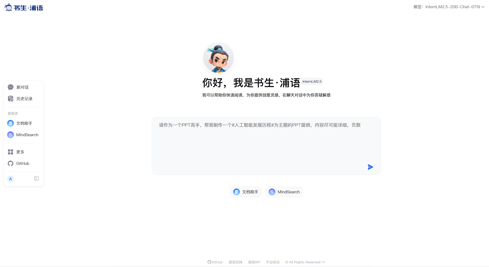

# 玩转书生「多模态对话」与「AI搜索」产品
<br>
Hi, 大家好~ 本节课程会带大家体验书生系列的大模型产品，让我们一起探索生成式AI的世界吧！

> 目前，书生系列下的所有产品均免费向所有社区用户提供服务：无会员、无广告、高性能部署！我们希望让所有对大模型技术、应用、开发工具链感兴趣的小伙伴第一时间体验到相应的功能。
> 

# 1. 书生产品矩阵

- **[书生·浦语](https://internlm-chat.intern-ai.org.cn/)：**基于原生的 InternLM2.5 最新 Chat 模型 (InternLM2.5-20B) 搭建聊天机器人应用。模型使用 LMDeploy 量化部署并进行了诸多工程上的优化。另外，所有注册用户默认开放 3 百万 Tokens/月的 API 调用额度。



- **MindSearch**：InternLM 组织今年开源的 AI 搜索引擎 (框架)，基于多智能体技术将你提出的问题进行分析、拆解、网页搜索，最终给出有参考依据的高可信度回答。目前可直接在**书生·浦语**产品内体验以 InternLM2.5-20B 为 Agent 的 MindSearch 官方实现。


- [**书生·万象**](https://internvl.opengvlab.com/)：InternVL 开源模型的官方产品，原生支持图文多模态对话能力。

# 2. 书生·浦语

## (1) 对话

相信参与课程的同学都对这类产品非常熟悉了，与所有大语言模型产品相同。你可以与浦语进行以，”代码编程、文章创作、灵感创意、角色扮演、语言翻译、逻辑推理等等”任意主题的对话。也可在对话内尝试 prompt enginering 让浦语完成更复杂任务。


## (2) 调用 API

在左侧导航栏点击“更多”即可进入 [API 控制台](https://internlm.intern-ai.org.cn/api/document)


API 控制台内包含 “API 文档”、“API Tokens”、“限流策略”、“调用明细” 4 个模块。下面，我们将以首次调用浦语 Chat API 的用户视角了解这 4 个模块的功能。


### API 文档

[API 文档](https://internlm.intern-ai.org.cn/api/document)中给出了

- API URL
- API Auth
- Python、Curl、openai 库的调用示例
- 请求参数、返回参数说明

等等快速开始使用浦语 API 的说明。更重要的是，浦语 API 已经**支持 Tool Call (Beta) 功能**啦！所有字段与 OpenAI 对齐，让使用 ChatGPT API 格式的同学可以无缝切换到浦语 API。


以下是使用 `curl` 工具非流式调用浦语 API 的一段示例代码：

```bash
curl --location 'https://internlm-chat.intern-ai.org.cn/puyu/api/v1/chat/completions' \
--header 'Authorization: Bearer xxxxxxx' \
--header 'Content-Type: application/json' \
--data '{
        "model": "internlm2.5-latest",  
        "messages": [{
                "role": "user",
                "content": "你知道刘慈欣吗？"
        }, {
                "role": "assistant",
                "content": "为一个人工智能助手，我知道刘慈欣。他是一位著名的中国科幻小说家和工程师，曾经获得过多项奖项，包括雨果奖、星云奖等。"
        },{
                "role": "user",
                "content": "他什么作品得过雨果奖？"
        }],
        "temperature": 0.8,
        "top_p": 0.9
}'
```

### 获取 API Tokens

从上面的代码可以看到，调用浦语 API 时需要在请求 Header 内传入 Authorization Tokens (`Authorization: Bearer xxxxxxx`) 参数用于用户身份验证。我们需要在 [API Tokens 模块](https://internlm.intern-ai.org.cn/api/tokens)内创建此 API Tokens 替换掉 `xxxxxxx` 。


注意在最后一步时不要着急点确认，先复制好 tokens 妥善保管到自己的文件或者权限管理服务中。**点击确认后将不再显示此 Token。**

### 查看 API 可用 Models

如图所示，目前 Chat API 仅支持以 `internlm2.5-latest` 作为 model ID，它将默认指向我们最新的 InternLM2.5 模型 `internlm2.5-20b-0719` 。

**注意**：我们可能会定期上线一些新版的模型，或者改变 `internlm2.5-latest`  模型指向的实际模型版本。可以通过 Model API 查询当前可用的模型 ID。

| 模型 | 描述 | 窗口长度 | 最大输出 Tokens |
| --- | --- | --- | --- |
| internlm2.5-latest | 默认指向我们最新发布的 internlm2.5 系列模型，当前指向`internlm2.5-20b-0719` | 32K | 4,096 tokens |


### 查看 API Usage 与 API Rate Limits

我们为所有社区新注册的用户提供了 1 百万 Input Tokens/月，3 百万 Output Tokens/月 的**免费调用额度**！可在 [API Usage 模块](https://internlm.intern-ai.org.cn/api/callDetail)查看到本月已用 Tokens 的数量，以及请求次数、请求 Tokens 的历史调用曲线。


在 [API 限流策略](https://internlm.intern-ai.org.cn/api/strategy)模块可以查询到我们对这个账户调用 API 频率的流控限制，所有新注册的社区用户默认值为：

- RPM (Requests per Minute)：10
- TPM (Tokens per Minute)：5000

**注意：**实战营的同学们，最好不要使用下图中的“申请更高流控配置”来申请 API 的限流策略。这功能一般是开放给企业用户，审核非常严格！！！可以参考下面一节的三个渠道来提高 RPM, TPM 以及 Tokens。


### 如何获取更多模型 Tokens，提升 RPM/TPM

总的来说我们提供了 3 个渠道让实战营的同学获取 tokens 并提高限流策略：

- **实战营闯关：**比如，通过入门课程的《Python 基础知识》闯关
- **申请项目：**完成项目等级和初版GitHub Repo和技术架构图
- **共学计划邀请同学：**邀请 6 位同学以上参加书生大模型实战营

详细获取方式可查看[《闯关手册》](https://aicarrier.feishu.cn/wiki/QtJnweAW1iFl8LkoMKGcsUS9nld)~

# 3. MindSearch

MindSearch 是一个开源的 AI 搜索引擎。它会对你提出的问题进行分析并拆解为数个子问题，在互联网上搜索、总结得到各个子问题的答案，最后通过模型总结得到最终答案。书生·浦语上的智能体为 MindSearch 的官方实现 (基于 InternLM2.5-20B) 具有与 [Perplexity.ai](http://perplexity.ai/) Pro 相当的性能。

## (1) 拆解问题

以“**请分析一下 2024 年诺贝尔物理学奖为何会颁发给人工智能领域的科学家 Geoffrey E. Hinton，这一举动对这两个领域的从业人员会有什么影响？**”问题为例，在主节点中模型将此问题拆解为了：

- **2024年诺贝尔物理学奖为何颁发给Geoffrey E. Hinton？**
- **2024年诺贝尔物理学奖颁发给Geoffrey E. Hinton对物理学和人工智能领域从业人员的影响是什么？**

两个子问题 (如下图)


## (2) 解决子问题

解决子问题的步骤分为以下 3 步：

- **思考：**我需要在互联网上搜索什么资料来回答这个问题？子节点总结搜索关键词调用搜索引擎搜索到海量参考网页。
- **信息来源：**根据首次搜索到的网页摘要，子节点决定知否对网页进行全文精读。
- **信息整合：**整合精读网页的所有信息形成子节点的结论。


## (3) 总结子节点结论

一般情况下主节点会根据子节点得出的结论，总结形成最终回复


部分情况下，主节点会根据子节点得到的结论进一步拆解子问题回到步骤 (1) 直到得到最终结论。
