# XTuner微调个人小助手认知

在本节中，将一步步带领大家体验如何使用 XTuner 完成个人小助手的微调！

## 基本概念

在进行微调之前，我们需要了解一些基本概念。

### Fintune简介

微调（fine-tuning）是一种基于预训练模型，通过少量的调整（fine-tune）来适应新的任务或数据的方法。

微调是在预训练模型的基础上，将模型中一些层的权重参数进行微调，以适应新的数据集或任务。

预训练模型部分已经在大规模数据上得到了训练，它们通常是较为通用且高性能的模型，因此可以很好地作为新任务的起点。微调可以加快模型的收敛速度，降低模型过拟合的风险，并在不消耗过多计算资源的情况下获取较好的模型性能。

#### Fintune的两种范式

在大模型的下游应用中，经常会用到两种微调模式：**增量预训练** 和 **指令跟随** 。

1. **增量预训练**

增量预训练是一种在已有预训练模型（比如：InternLM基座模型）的基础上，利用特定领域的数据进行进一步训练的方法。它的目的是在保持模型原有能力的同时，注入新的领域知识，进一步优化现有的预训练模型，从而提升模型在特定领域任务中的表现（比如：InternLM垂类基座模型）。增量预训练模型能够接受少量的新数据进行更新并适应新的任务，而不需要重新训练整个模型，这种方式可以很好地利用现有的预训练模型的知识，并在新数据上获得更好的性能。

2. **指令跟随**

指令跟随是指让模型根据用户输入的指令来执行相应的操作。模型通过对大量自然语言指令和相应操作的数据进行训练，学习如何将指令分解为具体的子任务，并选择合适的模块来执行这些任务（比如：InternLM垂类对话模型）。

### 微调技术

大多数大型语言模型（LLM）的参数规模巨大，且规模日益增大，导致模型的训练和微调成本高昂，直接训练需要耗费大量计算资源和费用。近年来，如何高效地对大模型进行微调成为了研究热点，而LoRA和QLoRA两种微调技术因其高效性和实用性受到了广泛关注。

#### LoRA简介

LoRA（Low-Rank Adaptation）是一种使用低精度权重对大型预训练语言模型进行微调的技术，它的核心思想是在不改变原有模型权重的情况下，通过添加少量新参数来进行微调。这种方法降低了模型的存储需求，也降低了计算成本，实现了对大模型的快速适应，同时保持了模型性能。

然而，由于使用了低精度权重，LoRA的一个潜在的缺点是在微调过程中可能会丢失一些原始模型的高阶特征信息，因此可能会降低模型的准确性。

#### QLoRA简介

QLoRA（Quantized LoRA）微调技术是对LoRA的一种改进，它通过引入高精度权重和可学习的低秩适配器来提高模型的准确性。并且在LoRA的基础上，引入了量化技术。通过将预训练模型量化为int4格式，可以进一步减少微调过程中的计算量，同时也可以减少模型的存储空间，这对于在资源有限的设备上运行模型非常有用。最终，可以使我们在消费级的显卡上进行模型的微调训练。

###  XTuner简介

XTuner 的官方仓库是：https://github.com/InternLM/xtuner （欢迎Star）！

XTuner 一个大语言模型&多模态模型微调工具箱。*由* *MMRazor* *和* *MMDeploy* *联合开发。*

- 🤓 **傻瓜化：** 以 配置文件 的形式封装了大部分微调场景，**0基础的非专业人员也能一键开始微调**。
- 🍃 **轻量级：** 对于 7B 参数量的LLM，**微调所需的最小显存仅为 8GB** ： **消费级显卡✅，colab✅**

#### 功能亮点

- 适配多种生态
  - 支持多种微调算法
  - 适配多种开源生态（HuggingFace、ModelScope等）
  - 自动优化加速器
- 适配多种硬件

#### 常用命令

以下是一些常用的命令。

- 查看帮助


```bash
xtuner help
```

- 查看版本


```bash
xtuner version
```

- 列出所有预定义配置文件


```bash
xtuner list-cfg
```

- 列出包含指定名称的预定义配置文件


```bash
xtuner list-cfg -p $NAME
```

- 复制配置文件


```bash
xtuner copy-cfg $CONFIG $SAVE_PATH
```

- 执行微调训练


```bash
xtuner train $CONFIG
```

- 将 pth 格式的模型文件转换成 HuggingFace 格式的模型


```bash
xtuner convert pth_to_hf $CONFIG $PATH_TO_PTH_MODEL $SAVE_PATH_TO_HF_MODEL
```

- 将原始模型与微调结果进行合并


```bash
xtuner convert merge $LLM $ADAPTER $SAVE_PATH
```

## 创建开发机

首先我们需要前往 [InternStudio](https://studio.intern-ai.org.cn/) 中创建一台开发机进行使用。

<detail>

- 登录InternStudio后，在控制台点击 “创建开发机” 按钮可以进入到开发机的创建界面。

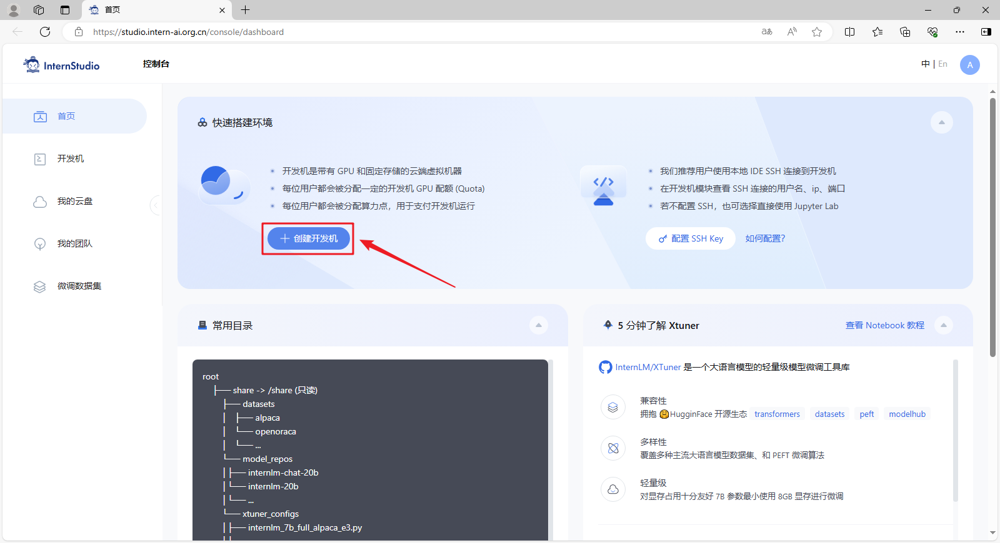

- 在 “创建开发机” 界面，选择开发机类型：个人开发机，输入开发机名称：XTuner微调，选择开发机镜像：Cuda11.7-conda。

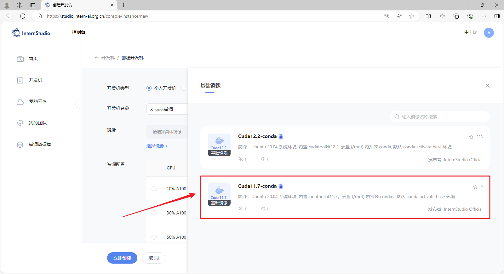

- 在镜像详情界面，点击 “使用” 链接，确认使用该镜像。

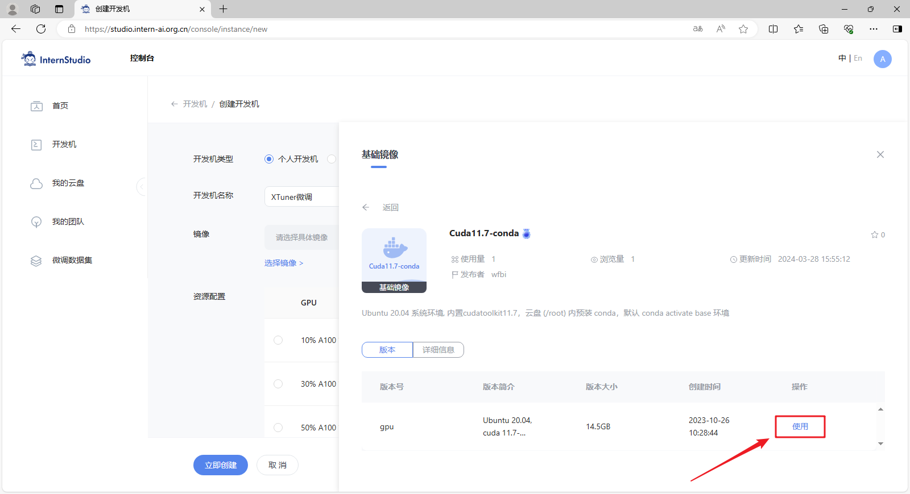

- 资源配置可以选择 30% ，然后点击 “立即创建” 按钮创建开发机。

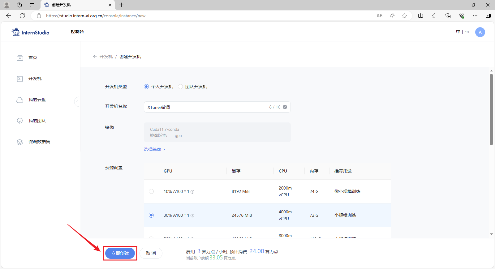

- 创建完成后，在开发机列表中可以看到刚创建的开发机，点击 “进入开发机” 链接可以连接进入到开发机。

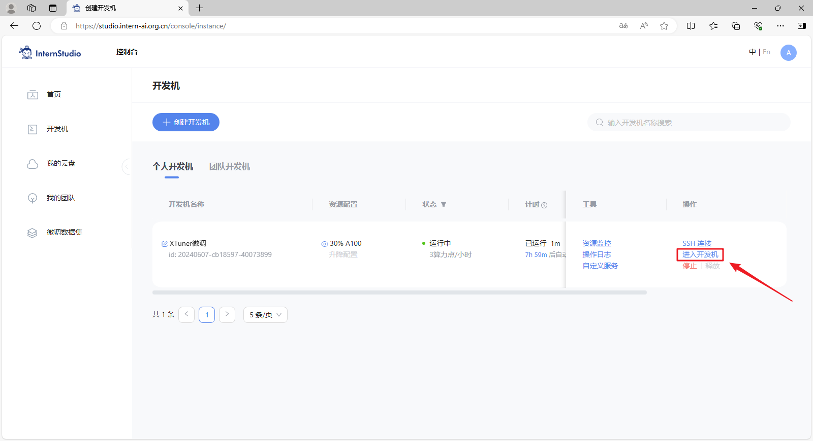

## 准备工作

1. **环境安装**：我们想要用简单易上手的微调工具包 XTuner 来对模型进行微调的话，第一步是安装 XTuner ！安装基础的工具是一切的前提，只有安装了 XTuner 我们才能够去执行后续的操作。

2. **前期准备**：在完成 XTuner 的安装后，我们下一步就需要去明确我们自己的微调目标了。我们想要利用微调做一些什么事情呢，然后为了实现这个目标，我们需要准备相关的硬件资源和数据。

3. **启动微调**：在确定了自己的微调目标后，我们就可以在 XTuner 的配置库中找到合适的配置文件并进行对应的修改。修改完成后即可一键启动训练！训练好的模型也可以仅仅通过在终端输入一行命令来完成转换和部署工作！

### 创建虚拟环境

在安装 XTuner 之前，我们需要先创建一个虚拟环境。创建一个名为 `xtuner0121` 的虚拟环境，可以直接执行命令。


```bash
conda create -n xtuner0121 python=3.10 -y
```

如果是在开发机中，也可以直接执行以下命令进行创建：


```bash
studio-conda -t xtuner0121 -o internlm-base
```

虚拟环境创建完成后，需要激活虚拟环境。

```bash
conda activate xtuner0121
```

### 安装 XTuner

虚拟环境创建完成后，就可以安装 XTuner 了。首先，从 Github 上下载源码。


```bash
git clone -b v0.1.21  https://github.com/InternLM/xtuner
```

其次，进入源码目录，执行安装。

> 如果速度太慢可以换成 `pip install -e '.[all]' -i https://mirrors.aliyun.com/pypi/simple/`


```bash
cd xtuner && pip install -e '.[all]'
```

最后，我们可以验证一下安装结果。


```bash
xtuner version
```

对于很多初学者而言，我们可能不太熟悉 XTuner 的用法，那么我们可以通过以下命令来查看相关的帮助。


```bash
xtuner help
```

对于很多的初学者而言，安装好环境意味着成功了一大半！因此我们接下来就可以进入我们的下一步，准备好我们需要的模型、数据集和配置文件，并进行微调训练！

### 模型准备

软件安装好后，我们就可以准备要微调的模型了。

> 对于学习而言，我们可以使用 InternLM 推出的1.8B的小模型来完成此次微调演示。

对于在 InternStudio 上运行的小伙伴们，可以不用通过 HuggingFace、OpenXLab 或者 Modelscope 进行模型的下载，在开发机中已经为我们提供了模型的本地文件，直接使用就可以了。

> 我们可以通过以下代码一键通过符号链接的方式链接到模型文件，这样既节省了空间，也便于管理。


```bash
mkdir -p Shanghai_AI_Laboratory

ln -s /root/share/new_models/Shanghai_AI_Laboratory/internlm2-chat-1_8b Shanghai_AI_Laboratory/internlm2-chat-1_8b
```

执行上述操作后，`Shanghai_AI_Laboratory/internlm2-chat-1_8b` 将直接成为一个符号链接，这个链接指向 `/root/share/new_models/Shanghai_AI_Laboratory/internlm2-chat-1_8b` 的位置。

这意味着，当我们访问 `Shanghai_AI_Laboratory/internlm2-chat-1_8b` 时，实际上就是在访问 `/root/share/new_models/Shanghai_AI_Laboratory/internlm2-chat-1_8b` 目录下的内容。通过这种方式，我们无需复制任何数据，就可以直接利用现有的模型文件进行后续的微调操作，从而节省存储空间并简化文件管理。

如果自己想要微调的模型在开发机中没找到，也可以自己下载相关模型文件。


```python
from modelscope import snapshot_download
model_dir = snapshot_download('Shanghai_AI_Laboratory/internlm2-1_8b', cache_dir="./")
```

模型文件准备好后，我们的目录结构应该是这个样子的。

<details>
<summary>目录结构</summary>

```
├── Shanghai_AI_Laboratory
│   ├── internlm2-1_8b
│   │   ├── README.md
│   │   ├── config.json
│   │   ├── configuration.json
│   │   ├── configuration_internlm2.py
│   │   ├── generation_config.json
│   │   ├── modeling_internlm2.py
│   │   ├── pytorch_model.bin
│   │   ├── special_tokens_map.json
│   │   ├── tokenization_internlm2.py
│   │   ├── tokenization_internlm2_fast.py
│   │   ├── tokenizer.json
│   │   ├── tokenizer.model
│   │   └── tokenizer_config.json
│   └── internlm2-chat-1_8b -> /root/share/new_models/Shanghai_AI_Laboratory/internlm2-chat-1_8b
│       ├── README.md
│       ├── config.json
│       ├── configuration.json
│       ├── configuration_internlm2.py
│       ├── generation_config.json
│       ├── model-00001-of-00002.safetensors
│       ├── model-00002-of-00002.safetensors
│       ├── model.safetensors.index.json
│       ├── modeling_internlm2.py
│       ├── special_tokens_map.json
│       ├── tokenization_internlm2.py
│       ├── tokenization_internlm2_fast.py
│       ├── tokenizer.model
│       └── tokenizer_config.json
```
</details>


> 在目录结构中可以看出，`internlm2-chat-1_8b` 是一个符号链接。


```bash
tree -l
```

## 增量预训练微调

本节我们先来了解一下增量预训练，这里我们以一个文本续写案例来看看效果。

|  | 微调前 | 微调后 |
| --- | --- | --- |
| 输入 | 书生·浦语大模型实战营第三期是 | 书生·浦语大模型实战营第三期是 |
| 输出| 书生·浦语大模型实战营第三期是上周五，上周五我们学习了一个新的知识，那就是关于机器学习的概率统计。…… | 书生·浦语大模型实战营第三期是上海人工智能实验室推出的书生·浦语大模型实战营系列活动的第三批次，将于2024年7月正式进行。…… |

- 导入必要的库


```python
import torch
from transformers import AutoTokenizer, AutoModelForCausalLM
```

- 定义模型加载方法


```python
def load_model(model_path):
    tokenizer = AutoTokenizer.from_pretrained(model_path, trust_remote_code=True)
    model = AutoModelForCausalLM.from_pretrained(model_path, torch_dtype=torch.float16, trust_remote_code=True).cuda()
    model = model.eval()
    return tokenizer, model
```

- 定义文本续写方法


```python
def generate(user_input):
    gen_kwargs = {"max_length": 128, "top_p": 0.8, "temperature": 0.8, "do_sample": True, "repetition_penalty": 1.0}

    inputs = tokenizer([user_input], return_tensors="pt")
    for k,v in inputs.items():
        inputs[k] = v.cuda()
    output = model.generate(**inputs, **gen_kwargs)
    output = tokenizer.decode(output[0].tolist(), skip_special_tokens=True)
    return output
```

### 基座模型推理

我们先来看看基座模型的推理结果。

- 加载模型


```python
tokenizer, model = load_model("Shanghai_AI_Laboratory/internlm2-1_8b")
```

- 文本续写


```python
generate("书生·浦语大模型实战营第三期是")
```

- 释放缓存


```python
del tokenizer, model

torch.cuda.empty_cache()
```

### 增量预训练

然后我们对基座模型进行增量预训练，让模型增加新的知识。

#### 准备数据文件

为了让模型学习到新的知识，我们需要将新的知识数据整理成指定格式文件，形成数据集，然后让模型来学习这些新数据。这里我们准备一个简单的数据集 `datas/pretrain.json`，仅包含一条知识，然后让数据重复多次。

> 网上有大量的开源数据集可以供我们进行使用，有些时候我们可以在开源数据集的基础上添加一些我们自己独有的数据集，也可能会有很好的效果。


```python
[
    {
        "text": "书生·浦语大模型实战营第三期是上海人工智能实验室推出的书生·浦语大模型实战营系列活动的第三批次，将于2024年7月正式进行。"
    }
]
```

准备好数据文件后，我们的目录结构应该是这样子的。

<details>
<summary>目录结构</summary>

```
├── Shanghai_AI_Laboratory
│   ├── internlm2-1_8b
│   │   ├── README.md
│   │   ├── config.json
│   │   ├── configuration.json
│   │   ├── configuration_internlm2.py
│   │   ├── generation_config.json
│   │   ├── modeling_internlm2.py
│   │   ├── pytorch_model.bin
│   │   ├── special_tokens_map.json
│   │   ├── tokenization_internlm2.py
│   │   ├── tokenization_internlm2_fast.py
│   │   ├── tokenizer.json
│   │   ├── tokenizer.model
│   │   └── tokenizer_config.json
│   └── internlm2-chat-1_8b -> /root/share/new_models/Shanghai_AI_Laboratory/internlm2-chat-1_8b
│       ├── README.md
│       ├── config.json
│       ├── configuration.json
│       ├── configuration_internlm2.py
│       ├── generation_config.json
│       ├── model-00001-of-00002.safetensors
│       ├── model-00002-of-00002.safetensors
│       ├── model.safetensors.index.json
│       ├── modeling_internlm2.py
│       ├── special_tokens_map.json
│       ├── tokenization_internlm2.py
│       ├── tokenization_internlm2_fast.py
│       ├── tokenizer.model
│       └── tokenizer_config.json
├── datas
│   └── pretrain.json
```

</details>


```bash
tree -l
```

#### 准备配置文件

在准备好了模型和数据集后，我们就要根据我们选择的微调方法结合微调方案来找到与我们最匹配的配置文件了，从而减少我们对配置文件的修改量。

> 配置文件其实是一种用于定义和控制模型训练和测试过程中各个方面的参数和设置的工具。

##### 列出支持的配置文件

XTuner 提供多个开箱即用的配置文件，可以通过以下命令查看。

> `xtuner list-cfg` 命令用于列出内置的所有配置文件。参数 `-p` 或 `--pattern` 表示模式匹配，后面跟着的内容将会在所有的配置文件里进行模糊匹配搜索，然后返回最有可能得内容。比如我们这里微调的是书生·浦语的模型，我们就可以匹配搜索 `internlm2`。


```bash
xtuner list-cfg -p internlm2
```

<details>
<summary>配置文件名的解释</summary>

以 **internlm2_1_8b_full_custom_pretrain_e1** 和 **internlm2_chat_1_8b_qlora_alpaca_e3** 举例：

| 配置文件 internlm2_1_8b_full_custom_pretrain_e1 | 配置文件 internlm2_chat_1_8b_qlora_alpaca_e3 | 说明 |
| -------- | -------- | ------------- |
| internlm2_1_8b | internlm2_chat_1_8b | 模型名称 |
| full    | qlora    | 使用的算法     |
| custom_pretrain   | alpaca   | 数据集名称     |
| e1       | e3       | 把数据集跑几次  |

</details>

##### 复制一个预设的配置文件

由于我们是对基座模型进行增量预训练，所以与我们的需求最匹配的配置文件是 `internlm2_1_8b_full_custom_pretrain_e1`，这里就复制该配置文件。

> `xtuner copy-cfg` 命令用于复制一个内置的配置文件。该命令需要两个参数：`CONFIG` 代表需要复制的配置文件名称，`SAVE_PATH` 代表复制的目标路径。在我们的输入的这个命令中，我们的 `CONFIG` 对应的是上面搜索到的 `internlm2_1_8b_full_custom_pretrain_e1` ,而 `SAVE_PATH` 则是当前目录 `.`。


```bash
xtuner copy-cfg internlm2_1_8b_full_custom_pretrain_e1 .
```

复制好配置文件后，我们的目录结构应该是这样子的。

<details>
<summary>目录结构</summary>

```
├── Shanghai_AI_Laboratory
│   ├── internlm2-1_8b
│   │   ├── README.md
│   │   ├── config.json
│   │   ├── configuration.json
│   │   ├── configuration_internlm2.py
│   │   ├── generation_config.json
│   │   ├── modeling_internlm2.py
│   │   ├── pytorch_model.bin
│   │   ├── special_tokens_map.json
│   │   ├── tokenization_internlm2.py
│   │   ├── tokenization_internlm2_fast.py
│   │   ├── tokenizer.json
│   │   ├── tokenizer.model
│   │   └── tokenizer_config.json
│   └── internlm2-chat-1_8b -> /root/share/new_models/Shanghai_AI_Laboratory/internlm2-chat-1_8b
│       ├── README.md
│       ├── config.json
│       ├── configuration.json
│       ├── configuration_internlm2.py
│       ├── generation_config.json
│       ├── model-00001-of-00002.safetensors
│       ├── model-00002-of-00002.safetensors
│       ├── model.safetensors.index.json
│       ├── modeling_internlm2.py
│       ├── special_tokens_map.json
│       ├── tokenization_internlm2.py
│       ├── tokenization_internlm2_fast.py
│       ├── tokenizer.model
│       └── tokenizer_config.json
├── datas
│   └── pretrain.json
├── internlm2_1_8b_full_custom_pretrain_e1_copy.py
```

</details>

##### 对配置文件进行修改

在选择了一个最匹配的配置文件并准备好其他内容后，下面我们要做的事情就是根据我们自己的内容对该配置文件进行调整，使其能够满足我们实际训练的要求。

<details>
<summary><b>配置文件介绍</b></summary>
 
打开配置文件后，我们可以看到整体的配置文件分为五部分：

1. **PART 1 Settings**：涵盖了模型基本设置，如预训练模型的选择、数据集信息和训练过程中的一些基本参数（如批大小、学习率等）。

2. **PART 2 Model & Tokenizer**：指定了用于训练的模型和分词器的具体类型及其配置，包括预训练模型的路径和是否启用特定功能（如可变长度注意力），这是模型训练的核心组成部分。

3. **PART 3 Dataset & Dataloader**：描述了数据处理的细节，包括如何加载数据集、预处理步骤、批处理大小等，确保了模型能够接收到正确格式和质量的数据。

4. **PART 4 Scheduler & Optimizer**：配置了优化过程中的关键参数，如学习率调度策略和优化器的选择，这些是影响模型训练效果和速度的重要因素。

5. **PART 5 Runtime**：定义了训练过程中的额外设置，如日志记录、模型保存策略和自定义钩子等，以支持训练流程的监控、调试和结果的保存。

一般来说我们需要更改的部分其实只包括前三部分，而且修改的主要原因是我们修改了配置文件中规定的模型、数据集。后两部分都是 XTuner 官方帮我们优化好的东西，一般而言只有在魔改的情况下才需要进行修改。

</details>

下面我们将根据项目的需求一步步的进行修改和调整吧！

在 PART 1 的部分，由于我们不再需要在 HuggingFace 上自动下载模型，因此我们先要更换模型的路径以及数据集的路径为我们本地的路径。

为了训练过程中能够实时观察到模型的变化情况，XTuner 贴心的推出了一个 `evaluation_inputs` 的参数来让我们能够设置多个问题来确保模型在训练过程中的变化是朝着我们想要的方向前进的。我们可以添加自己的输入。

在 PART 2 的部分，由于我们复制的配置文件是全参数微调的配置，而我们希望使用 `QLoRA` 算法进行微调，所以可以添加 `QLoRA` 算法的配置。

```diff
+ from peft import LoraConfig

+ import torch

- from transformers import AutoModelForCausalLM, AutoTokenizer
+ from transformers import AutoModelForCausalLM, AutoTokenizer, BitsAndBytesConfig

#######################################################################
#                          PART 1  Settings                           #
#######################################################################
- pretrained_model_name_or_path = 'internlm/internlm2-1_8b'
+ pretrained_model_name_or_path = 'Shanghai_AI_Laboratory/internlm2-1_8b'

- data_files = ['/path/to/json/file.json']
+ data_files = ['datas/pretrain.json']

- evaluation_inputs = ['上海是', 'Shanghai is']
+ evaluation_inputs = ['书生·浦语大模型实战营第三期是', '上海是', 'Shanghai is']

#######################################################################
#                      PART 2  Model & Tokenizer                      #
#######################################################################
model = dict(
    type=SupervisedFinetune,
    use_varlen_attn=use_varlen_attn,
    llm=dict(
        type=AutoModelForCausalLM.from_pretrained,
        pretrained_model_name_or_path=pretrained_model_name_or_path,
        trust_remote_code=True,
+       quantization_config=dict(
+           type=BitsAndBytesConfig,
+           load_in_4bit=True,
+           load_in_8bit=False,
+           llm_int8_threshold=6.0,
+           llm_int8_has_fp16_weight=False,
+           bnb_4bit_compute_dtype=torch.float16,
+           bnb_4bit_use_double_quant=True,
+           bnb_4bit_quant_type='nf4')
    ),
+   lora=dict(
+       type=LoraConfig,
+       r=64,
+       lora_alpha=16,
+       lora_dropout=0.1,
+       bias='none',
+       task_type='CAUSAL_LM')
)
```

除此之外，我们还可以对一些重要的参数进行调整，包括学习率（lr）、训练的轮数（max_epochs）等等。

<details>
<summary>常用参数介绍</summary>

| 参数名                  | 解释                                                     |
| ----------------------- | -------------------------------------------------------- |
| **data_path**           | 数据路径或 HuggingFace 仓库名                             |
| **max_length**          | 单条数据最大 Token 数，超过则截断                         |
| **pack_to_max_length**  | 是否将多条短数据拼接到 max_length，提高 GPU 利用率        |
| **accumulative_counts** | 梯度累积，每多少次 backward 更新一次参数                  |
| **sequence_parallel_size** | 并行序列处理的大小，用于模型训练时的序列并行              |
| **batch_size**          | 每个设备上的批量大小                                      |
| **dataloader_num_workers** | 数据加载器中工作进程的数量                                |
| **max_epochs**          | 训练的最大轮数                                             |
| **optim_type**          | 优化器类型，例如 AdamW                                    |
| **lr**                  | 学习率                                                    |
| **betas**               | 优化器中的 beta 参数，控制动量和平方梯度的移动平均         |
| **weight_decay**        | 权重衰减系数，用于正则化和避免过拟合                      |
| **max_norm**            | 梯度裁剪的最大范数，用于防止梯度爆炸                      |
| **warmup_ratio**        | 预热的比例，学习率在这个比例的训练过程中线性增加到初始学习率 |
| **save_steps**          | 保存模型的步数间隔                                         |
| **save_total_limit**    | 保存的模型总数限制，超过限制时删除旧的模型文件             |
| **prompt_template**     | 模板提示，用于定义生成文本的格式或结构                    |
| ...... | ...... |

> 如果想充分利用显卡资源，可以将 `max_length` 和 `batch_size` 这两个参数调大。

</details>

修改完后的完整的配置文件是：

<details>
<summary>internlm2_1_8b_full_custom_pretrain_e1_copy.py</summary>

```python
# Copyright (c) OpenMMLab. All rights reserved.
"""Data format:

[
  {
      "text": "xxx"
  },
  {
      "text": "xxx"
  },
  ...
]
"""  # noqa: E501

from datasets import load_dataset
from mmengine.dataset import DefaultSampler
from mmengine.hooks import (CheckpointHook, DistSamplerSeedHook, IterTimerHook,
                            LoggerHook, ParamSchedulerHook)
from mmengine.optim import AmpOptimWrapper, CosineAnnealingLR, LinearLR
from peft import LoraConfig
import torch
from torch.optim import AdamW
from transformers import AutoModelForCausalLM, AutoTokenizer, BitsAndBytesConfig

from xtuner.dataset import process_hf_dataset
from xtuner.dataset.collate_fns import default_collate_fn
from xtuner.dataset.map_fns import pretrain_map_fn
from xtuner.engine.hooks import (DatasetInfoHook, EvaluateChatHook,
                                 VarlenAttnArgsToMessageHubHook)
from xtuner.engine.runner import TrainLoop
from xtuner.model import SupervisedFinetune

#######################################################################
#                          PART 1  Settings                           #
#######################################################################
# Model
pretrained_model_name_or_path = 'Shanghai_AI_Laboratory/internlm2-1_8b'
use_varlen_attn = False

# Data
data_files = ['datas/pretrain.json']
max_length = 2048
pack_to_max_length = True

# Scheduler & Optimizer
batch_size = 1  # per_device
accumulative_counts = 16  # bs = 1 GPU * 1 batch_size_per_device * 16 acc
dataloader_num_workers = 0
max_epochs = 1
optim_type = AdamW
lr = 2e-5
betas = (0.9, 0.999)
weight_decay = 0
max_norm = 1  # grad clip
warmup_ratio = 0.03

# Save
save_steps = 500
save_total_limit = 2  # Maximum checkpoints to keep (-1 means unlimited)

# Evaluate the generation performance during the training
evaluation_freq = 500
SYSTEM = ''
evaluation_inputs = ['书生·浦语大模型实战营第三期是', '上海是', 'Shanghai is']

#######################################################################
#                      PART 2  Model & Tokenizer                      #
#######################################################################
tokenizer = dict(
    type=AutoTokenizer.from_pretrained,
    pretrained_model_name_or_path=pretrained_model_name_or_path,
    trust_remote_code=True,
    padding_side='right')

model = dict(
    type=SupervisedFinetune,
    use_varlen_attn=use_varlen_attn,
    llm=dict(
        type=AutoModelForCausalLM.from_pretrained,
        pretrained_model_name_or_path=pretrained_model_name_or_path,
        trust_remote_code=True,
        quantization_config=dict(
            type=BitsAndBytesConfig,
            load_in_4bit=True,
            load_in_8bit=False,
            llm_int8_threshold=6.0,
            llm_int8_has_fp16_weight=False,
            bnb_4bit_compute_dtype=torch.float16,
            bnb_4bit_use_double_quant=True,
            bnb_4bit_quant_type='nf4')
    ),
    lora=dict(
        type=LoraConfig,
        r=64,
        lora_alpha=16,
        lora_dropout=0.1,
        bias='none',
        task_type='CAUSAL_LM')
)

#######################################################################
#                      PART 3  Dataset & Dataloader                   #
#######################################################################
train_dataset = dict(
    type=process_hf_dataset,
    dataset=dict(type=load_dataset, path='json', data_files=data_files),
    tokenizer=tokenizer,
    max_length=max_length,
    dataset_map_fn=pretrain_map_fn,
    template_map_fn=None,
    remove_unused_columns=True,
    shuffle_before_pack=False,
    pack_to_max_length=pack_to_max_length,
    use_varlen_attn=use_varlen_attn)

train_dataloader = dict(
    batch_size=batch_size,
    num_workers=dataloader_num_workers,
    dataset=train_dataset,
    sampler=dict(type=DefaultSampler, shuffle=True),
    collate_fn=dict(type=default_collate_fn, use_varlen_attn=use_varlen_attn))

#######################################################################
#                    PART 4  Scheduler & Optimizer                    #
#######################################################################
# optimizer
optim_wrapper = dict(
    type=AmpOptimWrapper,
    optimizer=dict(
        type=optim_type, lr=lr, betas=betas, weight_decay=weight_decay),
    clip_grad=dict(max_norm=max_norm, error_if_nonfinite=False),
    accumulative_counts=accumulative_counts,
    loss_scale='dynamic',
    dtype='float16')

# learning policy
# More information: https://github.com/open-mmlab/mmengine/blob/main/docs/en/tutorials/param_scheduler.md  # noqa: E501
param_scheduler = [
    dict(
        type=LinearLR,
        start_factor=1e-5,
        by_epoch=True,
        begin=0,
        end=warmup_ratio * max_epochs,
        convert_to_iter_based=True),
    dict(
        type=CosineAnnealingLR,
        eta_min=0.0,
        by_epoch=True,
        begin=warmup_ratio * max_epochs,
        end=max_epochs,
        convert_to_iter_based=True)
]

# train, val, test setting
train_cfg = dict(type=TrainLoop, max_epochs=max_epochs)

#######################################################################
#                           PART 5  Runtime                           #
#######################################################################
# Log the dialogue periodically during the training process, optional
custom_hooks = [
    dict(type=DatasetInfoHook, tokenizer=tokenizer),
    dict(
        type=EvaluateChatHook,
        tokenizer=tokenizer,
        every_n_iters=evaluation_freq,
        evaluation_inputs=evaluation_inputs,
        system=SYSTEM)
]

if use_varlen_attn:
    custom_hooks += [dict(type=VarlenAttnArgsToMessageHubHook)]

# configure default hooks
default_hooks = dict(
    # record the time of every iteration.
    timer=dict(type=IterTimerHook),
    # print log every 10 iterations.
    logger=dict(type=LoggerHook, log_metric_by_epoch=False, interval=10),
    # enable the parameter scheduler.
    param_scheduler=dict(type=ParamSchedulerHook),
    # save checkpoint per `save_steps`.
    checkpoint=dict(
        type=CheckpointHook,
        by_epoch=False,
        interval=save_steps,
        max_keep_ckpts=save_total_limit),
    # set sampler seed in distributed evrionment.
    sampler_seed=dict(type=DistSamplerSeedHook),
)

# configure environment
env_cfg = dict(
    # whether to enable cudnn benchmark
    cudnn_benchmark=False,
    # set multi process parameters
    mp_cfg=dict(mp_start_method='fork', opencv_num_threads=0),
    # set distributed parameters
    dist_cfg=dict(backend='nccl'),
)

# set visualizer
visualizer = None

# set log level
log_level = 'INFO'

# load from which checkpoint
load_from = None

# whether to resume training from the loaded checkpoint
resume = False

# Defaults to use random seed and disable `deterministic`
randomness = dict(seed=None, deterministic=False)

# set log processor
log_processor = dict(by_epoch=False)
```

</details>

#### 启动微调

完成了所有的准备工作后，我们就可以正式的开始我们下一阶段的旅程：XTuner 启动~！

当我们准备好了所有内容，我们只需要将使用 `xtuner train` 命令令即可开始训练。

> `xtuner train` 命令用于启动模型微调进程。该命令需要一个参数：`CONFIG` 用于指定微调配置文件。这里我们使用修改好的配置文件 `internlm2_1_8b_full_custom_pretrain_e1_copy.py`。  
> 训练过程中产生的所有文件，包括日志、配置文件、检查点文件、微调后的模型等，默认保存在 `work_dirs` 目录下，我们也可以通过添加 `--work-dir` 指定特定的文件保存位置。


```bash
xtuner train ./internlm2_1_8b_full_custom_pretrain_e1_copy.py
```

在训练完后，我们的目录结构应该是这样子的。

<details>
<summary>目录结构</summary>

```
├── work_dirs
│   └── internlm2_1_8b_full_custom_pretrain_e1_copy
│       ├── 20240626_214522
│       │   ├── 20240626_214522.log
│       │   └── vis_data
│       │       ├── 20240626_214522.json
│       │       ├── config.py
│       │       ├── eval_outputs_iter_1499.txt
│       │       ├── eval_outputs_iter_1999.txt
│       │       ├── eval_outputs_iter_2499.txt
│       │       ├── eval_outputs_iter_2623.txt
│       │       ├── eval_outputs_iter_499.txt
│       │       ├── eval_outputs_iter_999.txt
│       │       └── scalars.json
│       ├── internlm2_1_8b_full_custom_pretrain_e1_copy.py
│       ├── iter_2500.pth
│       ├── iter_2624.pth
│       └── last_checkpoint
```

</details>

#### 模型格式转换

模型转换的本质其实就是将原本使用 Pytorch 训练出来的模型权重文件转换为目前通用的 HuggingFace 格式文件，那么我们可以通过以下命令来实现一键转换。

我们可以使用 `xtuner convert pth_to_hf` 命令来进行模型格式转换。

> `xtuner convert pth_to_hf` 命令用于进行模型格式转换。该命令需要三个参数：`CONFIG` 表示微调的配置文件， `PATH_TO_PTH_MODEL` 表示微调的模型权重文件路径，即要转换的模型权重， `SAVE_PATH_TO_HF_MODEL` 表示转换后的 HuggingFace 格式文件的保存路径。

除此之外，我们其实还可以在转换的命令中添加几个额外的参数，包括：
| 参数名 | 解释 |
| ------------------- | ------------------------------------------------------ |
| --fp32     | 代表以fp32的精度开启，假如不输入则默认为fp16                          |
| --max-shard-size {GB}        | 代表每个权重文件最大的大小（默认为2GB）                |


```bash
pth_file=`ls -t ./work_dirs/internlm2_1_8b_full_custom_pretrain_e1_copy/*.pth | head -n 1` && MKL_SERVICE_FORCE_INTEL=1 MKL_THREADING_LAYER=GNU xtuner convert pth_to_hf ./internlm2_1_8b_full_custom_pretrain_e1_copy.py ${pth_file} ./hf
```

模型格式转换完成后，我们的目录结构应该是这样子的。

<details>
<summary>目录结构</summary>

```
├── hf
│   ├── README.md
│   ├── adapter_config.json
│   ├── adapter_model.bin
│   └── xtuner_config.py
```

</details>

转换完成后，可以看到模型被转换为 HuggingFace 中常用的 .bin 格式文件，这就代表着文件成功被转化为 HuggingFace 格式了。

此时，hf 文件夹即为我们平时所理解的所谓 “LoRA 模型文件”

> 可以简单理解：LoRA 模型文件 = Adapter

#### 模型合并

对于 LoRA 或者 QLoRA 微调出来的模型其实并不是一个完整的模型，而是一个额外的层（Adapter），训练完的这个层最终还是要与原模型进行合并才能被正常的使用。

> 对于全量微调的模型（full）其实是不需要进行整合这一步的，因为全量微调修改的是原模型的权重而非微调一个新的 Adapter ，因此是不需要进行模型整合的。

在 XTuner 中提供了一键合并的命令 `xtuner convert merge`，在使用前我们需要准备好三个路径，包括原模型的路径、训练好的 Adapter 层的（模型格式转换后的）路径以及最终保存的路径。

> `xtuner convert merge`命令用于合并模型。该命令需要三个参数：`LLM` 表示原模型路径，`ADAPTER` 表示 Adapter 层的路径， `SAVE_PATH` 表示合并后的模型最终的保存路径。

在模型合并这一步还有其他很多的可选参数，包括：
| 参数名 | 解释 |
| ------------------- | ------------------------------------------------------ |
| --max-shard-size {GB} | 代表每个权重文件最大的大小（默认为2GB）                |
| --device {device_name} | 这里指的就是device的名称，可选择的有cuda、cpu和auto，默认为cuda即使用gpu进行运算 |
| --is-clip | 这个参数主要用于确定模型是不是CLIP模型，假如是的话就要加上，不是就不需要添加 |

> CLIP（Contrastive Language–Image Pre-training）模型是 OpenAI 开发的一种预训练模型，它能够理解图像和描述它们的文本之间的关系。CLIP 通过在大规模数据集上学习图像和对应文本之间的对应关系，从而实现了对图像内容的理解和分类，甚至能够根据文本提示生成图像。


```bash
MKL_SERVICE_FORCE_INTEL=1 MKL_THREADING_LAYER=GNU xtuner convert merge Shanghai_AI_Laboratory/internlm2-1_8b ./hf ./merged --max-shard-size 2GB
```

模型合并完成后，我们的目录结构应该是这样子的。

<details>
<summary>目录结构</summary>

```
├── merged
│   ├── config.json
│   ├── configuration_internlm2.py
│   ├── generation_config.json
│   ├── modeling_internlm2.py
│   ├── pytorch_model-00001-of-00002.bin
│   ├── pytorch_model-00002-of-00002.bin
│   ├── pytorch_model.bin.index.json
│   ├── special_tokens_map.json
│   ├── tokenization_internlm2.py
│   ├── tokenization_internlm2_fast.py
│   ├── tokenizer.json
│   ├── tokenizer.model
│   └── tokenizer_config.json
```

</details>

在模型合并完成后，我们就可以看到最终的模型和原模型文件夹非常相似，包括了分词器、权重文件、配置信息等等。

### 目标模型推理

当我们合并完成后，我们就能够正常的调用这个模型进行推理了。


```python
tokenizer, model = load_model("./merged")
```


```python
generate("书生·浦语大模型实战营第三期是")
```


```python
generate("成都是")
```

可以看到，通过增量预训练，确实在基座模型的基础上学习到了新的知识。


```python
del tokenizer, model

torch.cuda.empty_cache()
```

## 指令跟随微调（微调个人小助手认知）

掌握了增量预训练微调后，再来进行指令跟随微调就比较简单了。这里我们用 `internlm2-chat-1_8b` 模型，通过 `QLoRA` 的方式来微调一个自己的小助手认知作为案例来进行演示。

先看看微调效果：

<table>
<thead>
<tr>
<td></td><td width="48%">微调前</td><td width="48%">微调后</td>
</tr>
</thead>
<tbody>
<tr>
<td>输入</td><td>请介绍一下你自己</td><td>请介绍一下你自己</td>
</tr>
<tr>
<td>输出</td><td>你好，我是书生·浦语。我致力于帮助用户解决各种语言相关的问题，包括但不限于语言学习、翻译、文本摘要等。我使用了Transformer模型和深度学习技术，并使用了语言模型作为预训练任务。如果你有任何问题，欢迎随时向我提问。</td><td>我是伍鲜同志的小助手，内在是上海AI实验室书生·浦语的1.8B大模型哦</td>
</tr>
<tr>
<td>网页</td><td>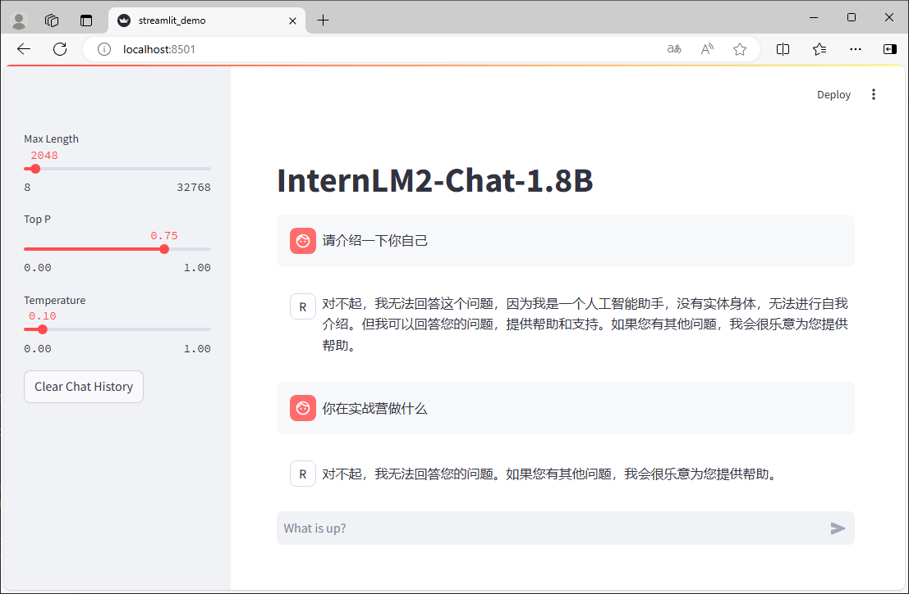</td><td>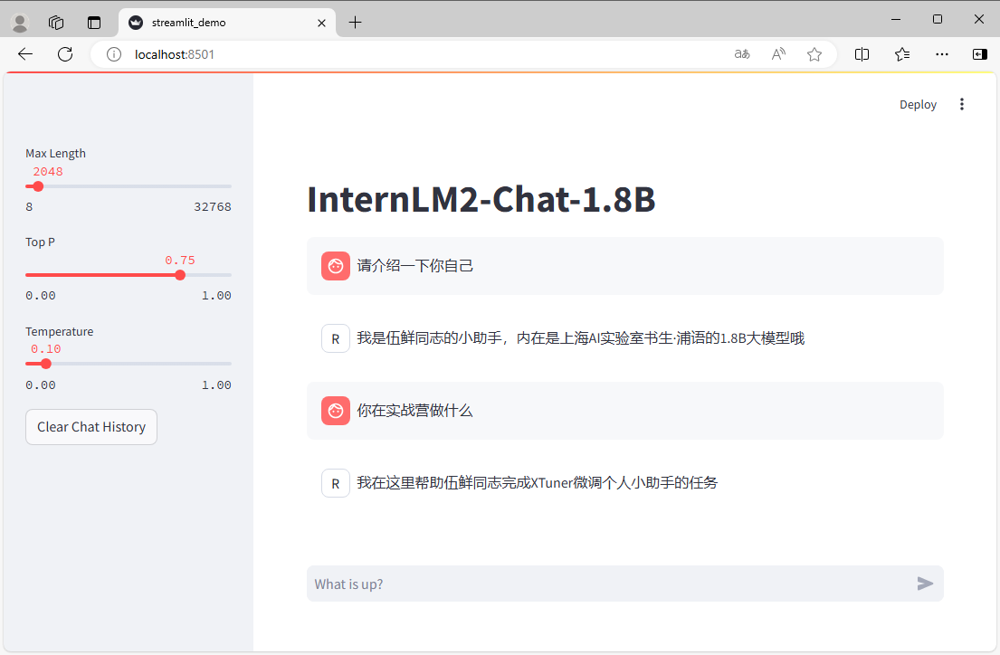</td>
</tr>
</tbody>
</table>

- 导入必要的库


```python
import torch
from transformers import AutoTokenizer, AutoModelForCausalLM
```

- 定义模型加载方法


```python
def load_model(model_path):
    tokenizer = AutoTokenizer.from_pretrained(model_path, trust_remote_code=True)
    model = AutoModelForCausalLM.from_pretrained(model_path, torch_dtype=torch.float16, trust_remote_code=True).cuda()
    model = model.eval()
    return tokenizer, model
```

- 定义对话方法


```python
messages = []

def chat(input_text):
    length = 0
    for response, _ in model.stream_chat(tokenizer, input_text, messages):
        if response is not None:
            print(response[length:], flush=True, end="")
            length = len(response)
```

### 微调前的模型对话

首先来看看 `internlm2-chat-1_8b` 的对话演示。

- 模型加载


```python
tokenizer, model = load_model("Shanghai_AI_Laboratory/internlm2-chat-1_8b")
```

- 对话


```python
chat("请介绍一下你自己")
```

- 释放缓存


```python
del tokenizer, model

torch.cuda.empty_cache()
```

### 指令跟随微调

下面我们对模型进行微调，让模型认识到自己的弟位，了解它自己是你的一个助手。

#### 准数据文件

为了让模型能够认清自己的身份弟位，在询问自己是谁的时候按照我们预期的结果进行回复，我们就需要通过在微调数据集中大量加入这样的数据。我们准备一个数据集文件`datas/assistant.json`，文件内容为对话数据。为了增强微调效果，可以将对话数据复制多条。


```python
[
    {"conversation": [{"input": "请介绍一下你自己", "output": "我是伍鲜同志的小助手，内在是上海AI实验室书生·浦语的1.8B大模型哦"}]},
    {"conversation": [{"input": "你在实战营做什么", "output": "我在这里帮助伍鲜同志完成XTuner微调个人小助手的任务"}]},
]
```

准备好数据文件后，我们的目录结构应该是这样子的。

<details>
<summary>目录结构</summary>

```
├── Shanghai_AI_Laboratory
│   ├── internlm2-1_8b
│   │   ├── README.md
│   │   ├── config.json
│   │   ├── configuration.json
│   │   ├── configuration_internlm2.py
│   │   ├── generation_config.json
│   │   ├── modeling_internlm2.py
│   │   ├── pytorch_model.bin
│   │   ├── special_tokens_map.json
│   │   ├── tokenization_internlm2.py
│   │   ├── tokenization_internlm2_fast.py
│   │   ├── tokenizer.json
│   │   ├── tokenizer.model
│   │   └── tokenizer_config.json
│   └── internlm2-chat-1_8b -> /root/share/new_models/Shanghai_AI_Laboratory/internlm2-chat-1_8b
│       ├── README.md
│       ├── config.json
│       ├── configuration.json
│       ├── configuration_internlm2.py
│       ├── generation_config.json
│       ├── model-00001-of-00002.safetensors
│       ├── model-00002-of-00002.safetensors
│       ├── model.safetensors.index.json
│       ├── modeling_internlm2.py
│       ├── special_tokens_map.json
│       ├── tokenization_internlm2.py
│       ├── tokenization_internlm2_fast.py
│       ├── tokenizer.model
│       └── tokenizer_config.json
├── datas
│   ├── assistant.json
│   └── pretrain.json
├── internlm2_1_8b_full_custom_pretrain_e1_copy.py
```

</details>


#### 准备配置文件

在准备好了模型和数据集后，我们就要根据我们选择的微调方法结合微调方案来找到与我们最匹配的配置文件了，从而减少我们对配置文件的修改量。

这里我们选择使用 `internlm2_chat_1_8b_qlora_alpaca_e3` 配置文件。


```bash
xtuner copy-cfg internlm2_chat_1_8b_qlora_alpaca_e3 .
```

复制好配置文件后，我们的目录结构应该是这样子的。

<details>
<summary>目录结构</summary>

```
├── Shanghai_AI_Laboratory
│   ├── internlm2-1_8b
│   │   ├── README.md
│   │   ├── config.json
│   │   ├── configuration.json
│   │   ├── configuration_internlm2.py
│   │   ├── generation_config.json
│   │   ├── modeling_internlm2.py
│   │   ├── pytorch_model.bin
│   │   ├── special_tokens_map.json
│   │   ├── tokenization_internlm2.py
│   │   ├── tokenization_internlm2_fast.py
│   │   ├── tokenizer.json
│   │   ├── tokenizer.model
│   │   └── tokenizer_config.json
│   └── internlm2-chat-1_8b -> /root/share/new_models/Shanghai_AI_Laboratory/internlm2-chat-1_8b
│       ├── README.md
│       ├── config.json
│       ├── configuration.json
│       ├── configuration_internlm2.py
│       ├── generation_config.json
│       ├── model-00001-of-00002.safetensors
│       ├── model-00002-of-00002.safetensors
│       ├── model.safetensors.index.json
│       ├── modeling_internlm2.py
│       ├── special_tokens_map.json
│       ├── tokenization_internlm2.py
│       ├── tokenization_internlm2_fast.py
│       ├── tokenizer.model
│       └── tokenizer_config.json
├── datas
│   ├── assistant.json
│   └── pretrain.json
├── internlm2_1_8b_full_custom_pretrain_e1_copy.py
├── internlm2_1_8b_qlora_alpaca_e3_copy.py
```

</details>

下面我们将根据项目的需求一步步的进行修改和调整吧！

在 PART 1 的部分，由于我们不再需要在 HuggingFace 上自动下载模型，因此我们先要更换模型的路径以及数据集的路径为我们本地的路径。

为了训练过程中能够实时观察到模型的变化情况，XTuner 贴心的推出了一个 `evaluation_inputs` 的参数来让我们能够设置多个问题来确保模型在训练过程中的变化是朝着我们想要的方向前进的。我们可以添加自己的输入。

在 PART 3 的部分，由于我们准备的数据集是 JSON 格式的数据，并且对话内容已经是 `input` 和 `output` 的数据对，所以不需要进行格式转换。

```diff
#######################################################################
#                          PART 1  Settings                           #
#######################################################################
- pretrained_model_name_or_path = 'internlm/internlm2-chat-1_8b'
+ pretrained_model_name_or_path = 'Shanghai_AI_Laboratory/internlm2-chat-1_8b'

- alpaca_en_path = 'tatsu-lab/alpaca'
+ alpaca_en_path = 'datas/assistant.json'

evaluation_inputs = [
-    '请给我介绍五个上海的景点', 'Please tell me five scenic spots in Shanghai'
+    '请介绍一下你自己', '请给我介绍五个上海的景点', 'Please tell me five scenic spots in Shanghai'
]
+ evaluation_inputs = ['书生·浦语大模型实战营第三期是', '上海是', 'Shanghai is']

#######################################################################
#                      PART 3  Dataset & Dataloader                   #
#######################################################################
alpaca_en = dict(
    type=process_hf_dataset,
-   dataset=dict(type=load_dataset, path=alpaca_en_path),
+   dataset=dict(type=load_dataset, path='json', data_files=dict(train=alpaca_en_path)),
    tokenizer=tokenizer,
    max_length=max_length,
-   dataset_map_fn=alpaca_map_fn,
+   dataset_map_fn=None,
    template_map_fn=dict(
        type=template_map_fn_factory, template=prompt_template),
    remove_unused_columns=True,
    shuffle_before_pack=True,
    pack_to_max_length=pack_to_max_length,
    use_varlen_attn=use_varlen_attn)
```

修改完后的完整的配置文件是：

<details>
<summary>internlm2_chat_1_8b_qlora_alpaca_e3_copy.py</summary>

```python
# Copyright (c) OpenMMLab. All rights reserved.
import torch
from datasets import load_dataset
from mmengine.dataset import DefaultSampler
from mmengine.hooks import (CheckpointHook, DistSamplerSeedHook, IterTimerHook,
                            LoggerHook, ParamSchedulerHook)
from mmengine.optim import AmpOptimWrapper, CosineAnnealingLR, LinearLR
from peft import LoraConfig
from torch.optim import AdamW
from transformers import (AutoModelForCausalLM, AutoTokenizer,
                          BitsAndBytesConfig)

from xtuner.dataset import process_hf_dataset
from xtuner.dataset.collate_fns import default_collate_fn
from xtuner.dataset.map_fns import alpaca_map_fn, template_map_fn_factory
from xtuner.engine.hooks import (DatasetInfoHook, EvaluateChatHook,
                                 VarlenAttnArgsToMessageHubHook)
from xtuner.engine.runner import TrainLoop
from xtuner.model import SupervisedFinetune
from xtuner.parallel.sequence import SequenceParallelSampler
from xtuner.utils import PROMPT_TEMPLATE, SYSTEM_TEMPLATE

#######################################################################
#                          PART 1  Settings                           #
#######################################################################
# Model
pretrained_model_name_or_path = 'Shanghai_AI_Laboratory/internlm2-chat-1_8b'
use_varlen_attn = False

# Data
alpaca_en_path = 'datas/assistant.json'
prompt_template = PROMPT_TEMPLATE.internlm2_chat
max_length = 2048
pack_to_max_length = True

# parallel
sequence_parallel_size = 1

# Scheduler & Optimizer
batch_size = 1  # per_device
accumulative_counts = 16
accumulative_counts *= sequence_parallel_size
dataloader_num_workers = 0
max_epochs = 3
optim_type = AdamW
lr = 2e-4
betas = (0.9, 0.999)
weight_decay = 0
max_norm = 1  # grad clip
warmup_ratio = 0.03

# Save
save_steps = 500
save_total_limit = 2  # Maximum checkpoints to keep (-1 means unlimited)

# Evaluate the generation performance during the training
evaluation_freq = 500
SYSTEM = SYSTEM_TEMPLATE.alpaca
evaluation_inputs = [
    '请介绍一下你自己', '请给我介绍五个上海的景点', 'Please tell me five scenic spots in Shanghai'
]

#######################################################################
#                      PART 2  Model & Tokenizer                      #
#######################################################################
tokenizer = dict(
    type=AutoTokenizer.from_pretrained,
    pretrained_model_name_or_path=pretrained_model_name_or_path,
    trust_remote_code=True,
    padding_side='right')

model = dict(
    type=SupervisedFinetune,
    use_varlen_attn=use_varlen_attn,
    llm=dict(
        type=AutoModelForCausalLM.from_pretrained,
        pretrained_model_name_or_path=pretrained_model_name_or_path,
        trust_remote_code=True,
        torch_dtype=torch.float16,
        quantization_config=dict(
            type=BitsAndBytesConfig,
            load_in_4bit=True,
            load_in_8bit=False,
            llm_int8_threshold=6.0,
            llm_int8_has_fp16_weight=False,
            bnb_4bit_compute_dtype=torch.float16,
            bnb_4bit_use_double_quant=True,
            bnb_4bit_quant_type='nf4')),
    lora=dict(
        type=LoraConfig,
        r=64,
        lora_alpha=16,
        lora_dropout=0.1,
        bias='none',
        task_type='CAUSAL_LM'))

#######################################################################
#                      PART 3  Dataset & Dataloader                   #
#######################################################################
alpaca_en = dict(
    type=process_hf_dataset,
    dataset=dict(type=load_dataset, path='json', data_files=dict(train=alpaca_en_path)),
    tokenizer=tokenizer,
    max_length=max_length,
    dataset_map_fn=None,
    template_map_fn=dict(
        type=template_map_fn_factory, template=prompt_template),
    remove_unused_columns=True,
    shuffle_before_pack=True,
    pack_to_max_length=pack_to_max_length,
    use_varlen_attn=use_varlen_attn)

sampler = SequenceParallelSampler \
    if sequence_parallel_size > 1 else DefaultSampler
train_dataloader = dict(
    batch_size=batch_size,
    num_workers=dataloader_num_workers,
    dataset=alpaca_en,
    sampler=dict(type=sampler, shuffle=True),
    collate_fn=dict(type=default_collate_fn, use_varlen_attn=use_varlen_attn))

#######################################################################
#                    PART 4  Scheduler & Optimizer                    #
#######################################################################
# optimizer
optim_wrapper = dict(
    type=AmpOptimWrapper,
    optimizer=dict(
        type=optim_type, lr=lr, betas=betas, weight_decay=weight_decay),
    clip_grad=dict(max_norm=max_norm, error_if_nonfinite=False),
    accumulative_counts=accumulative_counts,
    loss_scale='dynamic',
    dtype='float16')

# learning policy
# More information: https://github.com/open-mmlab/mmengine/blob/main/docs/en/tutorials/param_scheduler.md  # noqa: E501
param_scheduler = [
    dict(
        type=LinearLR,
        start_factor=1e-5,
        by_epoch=True,
        begin=0,
        end=warmup_ratio * max_epochs,
        convert_to_iter_based=True),
    dict(
        type=CosineAnnealingLR,
        eta_min=0.0,
        by_epoch=True,
        begin=warmup_ratio * max_epochs,
        end=max_epochs,
        convert_to_iter_based=True)
]

# train, val, test setting
train_cfg = dict(type=TrainLoop, max_epochs=max_epochs)

#######################################################################
#                           PART 5  Runtime                           #
#######################################################################
# Log the dialogue periodically during the training process, optional
custom_hooks = [
    dict(type=DatasetInfoHook, tokenizer=tokenizer),
    dict(
        type=EvaluateChatHook,
        tokenizer=tokenizer,
        every_n_iters=evaluation_freq,
        evaluation_inputs=evaluation_inputs,
        system=SYSTEM,
        prompt_template=prompt_template)
]

if use_varlen_attn:
    custom_hooks += [dict(type=VarlenAttnArgsToMessageHubHook)]

# configure default hooks
default_hooks = dict(
    # record the time of every iteration.
    timer=dict(type=IterTimerHook),
    # print log every 10 iterations.
    logger=dict(type=LoggerHook, log_metric_by_epoch=False, interval=10),
    # enable the parameter scheduler.
    param_scheduler=dict(type=ParamSchedulerHook),
    # save checkpoint per `save_steps`.
    checkpoint=dict(
        type=CheckpointHook,
        by_epoch=False,
        interval=save_steps,
        max_keep_ckpts=save_total_limit),
    # set sampler seed in distributed evrionment.
    sampler_seed=dict(type=DistSamplerSeedHook),
)

# configure environment
env_cfg = dict(
    # whether to enable cudnn benchmark
    cudnn_benchmark=False,
    # set multi process parameters
    mp_cfg=dict(mp_start_method='fork', opencv_num_threads=0),
    # set distributed parameters
    dist_cfg=dict(backend='nccl'),
)

# set visualizer
visualizer = None

# set log level
log_level = 'INFO'

# load from which checkpoint
load_from = None

# whether to resume training from the loaded checkpoint
resume = False

# Defaults to use random seed and disable `deterministic`
randomness = dict(seed=None, deterministic=False)

# set log processor
log_processor = dict(by_epoch=False)
```

</details>

#### 启动微调

完成了所有的准备工作后，我们就可以正式的开始我们下一阶段的旅程：XTuner 启动~！

当我们准备好了所有内容，我们只需要将使用 `xtuner train` 命令令即可开始训练。


```bash
xtuner train ./internlm2_chat_1_8b_qlora_alpaca_e3_copy.py
```

在训练完后，我们的目录结构应该是这样子的。

<details>
<summary>目录结构</summary>

```
├── work_dirs
│   └── internlm2_chat_1_8b_qlora_alpaca_e3_copy
│       ├── 20240626_222727
│       │   ├── 20240626_222727.log
│       │   └── vis_data
│       │       ├── 20240626_222727.json
│       │       ├── config.py
│       │       ├── eval_outputs_iter_95.txt
│       │       └── scalars.json
│       ├── internlm2_chat_1_8b_qlora_alpaca_e3_copy.py
│       ├── iter_96.pth
│       └── last_checkpoint
```

</details>


```bash
tree -l
```

#### 模型格式转换

模型转换的本质其实就是将原本使用 Pytorch 训练出来的模型权重文件转换为目前通用的 HuggingFace 格式文件，那么我们可以通过以下命令来实现一键转换。


```bash
pth_file=`ls -t ./work_dirs/internlm2_chat_1_8b_qlora_alpaca_e3_copy/*.pth | head -n 1` && MKL_SERVICE_FORCE_INTEL=1 MKL_THREADING_LAYER=GNU xtuner convert pth_to_hf ./internlm2_chat_1_8b_qlora_alpaca_e3_copy.py ${pth_file} ./hf
```

模型格式转换完成后，我们的目录结构应该是这样子的。

<details>
<summary>目录结构</summary>

```
├── hf
│   ├── README.md
│   ├── adapter_config.json
│   ├── adapter_model.bin
│   └── xtuner_config.py
```

</details>

#### 模型合并

对于 LoRA 或者 QLoRA 微调出来的模型其实并不是一个完整的模型，而是一个额外的层（Adapter），训练完的这个层最终还是要与原模型进行合并才能被正常的使用。


```bash
MKL_SERVICE_FORCE_INTEL=1 MKL_THREADING_LAYER=GNU xtuner convert merge Shanghai_AI_Laboratory/internlm2-chat-1_8b ./hf ./merged --max-shard-size 2GB
```

模型合并完成后，我们的目录结构应该是这样子的。

<details>
<summary>目录结构</summary>

```
├── merged
│   ├── config.json
│   ├── configuration_internlm2.py
│   ├── generation_config.json
│   ├── modeling_internlm2.py
│   ├── pytorch_model-00001-of-00002.bin
│   ├── pytorch_model-00002-of-00002.bin
│   ├── pytorch_model.bin.index.json
│   ├── special_tokens_map.json
│   ├── tokenization_internlm2.py
│   ├── tokenization_internlm2_fast.py
│   ├── tokenizer.json
│   ├── tokenizer.model
│   └── tokenizer_config.json
```

</details>

### 微调后的模型对话


```python
tokenizer, model = load_model("./merged")
```


```python
chat("请介绍一下你自己")
```


```python
chat("你在实战营做什么")
```


```python
chat("介绍一下成都")
```


```python
del tokenizer, model

torch.cuda.empty_cache()
```

## DeepSpeed介绍

DeepSpeed是一个由微软开发的开源深度学习优化库，旨在提高大规模模型训练的效率和速度。

XTuner 也内置了 `deepspeed` 来加速整体的训练过程，共有三种不同的 `deepspeed` 类型可进行选择，分别是 `deepspeed_zero1`, `deepspeed_zero2` 和 `deepspeed_zero3`。

<details>
<summary>DeepSpeed优化器及其选择方法</summary>

DeepSpeed是一个由微软开发的开源深度学习优化库，旨在提高大规模模型训练的效率和速度。它通过几种关键技术来优化训练过程，包括模型分割、梯度累积、以及内存和带宽优化等，能够降低训练超大规模模型的复杂性和资源需求，使训练变得更快、更高效。DeepSpeed特别适用于需要巨大计算资源的大型模型和数据集。

在DeepSpeed中，引入了ZeRO（Zero Redundancy Optimizer）技术，是一种旨在降低训练大型模型所需内存占用的优化器，通过在分布式环境中分割优化器的状态、梯度和参数，减少冗余的内存占用，允许更大的模型和更快的训练速度。ZeRO 分为几个不同的级别，主要包括：

- **deepspeed_zero1**：这是ZeRO的基本版本，它优化了模型参数的存储，主要通过分区存储优化器状态来减少内存使用。每个GPU设备只保存一部分优化器状态，从而显著减少内存消耗。

- **deepspeed_zero2**：在deepspeed_zero1的基础上，deepspeed_zero2进一步优化了梯度和优化器状态的存储，将梯度也进行分区存储。这样，每个GPU设备只需要保存一部分的优化器状态和梯度，进一步减少内存使用。

- **deepspeed_zero3**：这是目前最高级的优化等级，它包括了deepspeed_zero1和deepspeed_zero2的优化，除了优化器状态和梯度，还将模型参数进行分区存储。每个GPU设备只需要保存一部分的优化器状态、梯度和模型参数，从而最大限度地减少内存使用。

选择哪种deepspeed类型主要取决于你的具体需求，包括模型的大小、可用的硬件资源（特别是GPU内存）以及训练的效率需求。一般来说：

- 如果你的模型较小，或者内存资源充足，可能不需要使用最高级别的优化。
- 如果你需要快速训练模型，可能需要权衡内存优化和计算效率。deepspeed_zero1提供了较低的内存占用，同时保持了较高的计算效率。
- 如果你正在尝试训练非常大的模型，或者你的硬件资源有限，使用deepspeed_zero2或deepspeed_zero3可能更合适，因为它们可以显著降低内存占用，允许更大模型的训练。
- 选择时也要考虑到实现的复杂性和运行时的开销，更高级的优化可能需要更复杂的设置，更频繁的跨GPU通信，这可能需要更高的网络带宽，并可能增加一些计算开销。

</details>

## 多卡微调

模型的规模和复杂度不断增加，单张GPU的显存往往无法满足大模型的训练需求。此时，我们可能需要多卡微调，以应对大模型训练过程中显存和计算资源的需求。


XTuner 中使用多卡微调，只需要设置 `NPROC_PER_NODE` 环境变量，并使用 `DeepSpeed` 来进行加速就可以了，其余命令内容与单卡微调时一样。

> 由于开发机只有两张显卡，所以我们设置`NPROC_PER_NODE=2`，并且选择使用`deepspeed_zero3`优化等级。


```bash
MKL_SERVICE_FORCE_INTEL=1 MKL_THREADING_LAYER=GNU NPROC_PER_NODE=2 xtuner train ./internlm2_chat_1_8b_qlora_alpaca_e3_copy.py --deepspeed deepspeed_zero3
```

在执行微调的过程中，我们可以看到两张显卡都有内存使用。


在训练完后，我们的目录结构应该是这样子的。

<details>
<summary>目录结构</summary>

```
├── work_dirs
│   └── internlm2_chat_1_8b_qlora_alpaca_e3_copy
│       ├── 20240627_205957
│       │   ├── 20240627_205957.log
│       │   └── vis_data
│       │       ├── 20240627_205957.json
│       │       ├── config.py
│       │       ├── eval_outputs_iter_236.txt
│       │       └── scalars.json
│       ├── internlm2_chat_1_8b_qlora_alpaca_e3_copy.py
│       ├── iter_237.pth
│       │   ├── bf16_zero_pp_rank_0_mp_rank_00_optim_states.pt
│       │   ├── bf16_zero_pp_rank_1_mp_rank_00_optim_states.pt
│       │   ├── zero_pp_rank_0_mp_rank_00_model_states.pt
│       │   └── zero_pp_rank_1_mp_rank_00_model_states.pt
│       ├── last_checkpoint
│       └── zero_to_fp32.py
```

</details>

可以看到，通过 `deepspeed` 来训练后得到的权重文件和原本的权重文件是有所差别的，原本的仅仅是一个 .pth 的文件，而使用了 `deepspeed` 则是一个名字带有 .pth 的文件夹，在该文件夹里保存了 .pt 文件。这两者在具体的使用上并没有太大的差别，转换和合并的过程都是一样的。


```bash
pth_file=`ls -t ./work_dirs/internlm2_chat_1_8b_qlora_alpaca_e3_copy | grep pth | head -n 1` && MKL_SERVICE_FORCE_INTEL=1 MKL_THREADING_LAYER=GNU xtuner convert pth_to_hf ./internlm2_chat_1_8b_qlora_alpaca_e3_copy.py ./work_dirs/internlm2_chat_1_8b_qlora_alpaca_e3_copy/${pth_file} ./hf
```


```bash
MKL_SERVICE_FORCE_INTEL=1 MKL_THREADING_LAYER=GNU xtuner convert merge Shanghai_AI_Laboratory/internlm2-chat-1_8b ./hf ./merged --max-shard-size 2GB
```


```python
tokenizer, model = load_model("./merged")
```


```python
chat("请介绍一下你自己")
```


```python
chat("你在实战营做什么")
```


```python
chat("介绍一下成都")
```


```python
del tokenizer, model

torch.cuda.empty_cache()
```

## 分布式微调

如果模型的规模和复杂度继续增加，我们还可以使用分布式微调。


```bash
apt-get install -y net-tools
ifconfig
```

分布式微调是主从架构的。主节点协调整个训练过程，管理数据和任务到工作节点的分配。工作节点执行训练步骤的实际计算，处理数据的子集并计算梯度。有时候在一些架构中还需要参数服务器协调所有工作节点之间的模型更新同步，用于聚合来自工作节点的梯度并更新模型参数。

> 我们使用两个节点进行分布式微调，实际上需要启动三个节点。


```bash
MKL_SERVICE_FORCE_INTEL=1 MKL_THREADING_LAYER=GNU OMP_NUM_THREADS=1 MKL_NUM_THREADS=1 NPROC_PER_NODE=1 NNODES=2 xtuner train internlm2_chat_1_8b_qlora_alpaca_e3_copy.py

MKL_SERVICE_FORCE_INTEL=1 MKL_THREADING_LAYER=GNU OMP_NUM_THREADS=1 MKL_NUM_THREADS=1 NPROC_PER_NODE=1 NNODES=2 NODE_RANK=0 TRITON_CACHE_DIR=node0 PORT=20821 ADDR=192.168.230.182 xtuner train internlm2_chat_1_8b_qlora_alpaca_e3_copy.py --work-dir work_dir_node0

MKL_SERVICE_FORCE_INTEL=1 MKL_THREADING_LAYER=GNU OMP_NUM_THREADS=1 MKL_NUM_THREADS=1 NPROC_PER_NODE=1 NNODES=2 NODE_RANK=1 TRITON_CACHE_DIR=node1 PORT=20821 ADDR=192.168.230.182 xtuner train internlm2_chat_1_8b_qlora_alpaca_e3_copy.py --work-dir work_dir_node1
```

首先启动主节点，然后依次启动其他节点。但需要注意的是，需要在一个时间阈值内启动相关的节点，如果超过时间阈值还没启动所有节点，则其他节点会因超时而报错退出。

比如，在两个节点的分布式微调过程中，我们只启动主节点和一个工作节点，另一个节点不启动，则已启动的节点会超时报错退出。

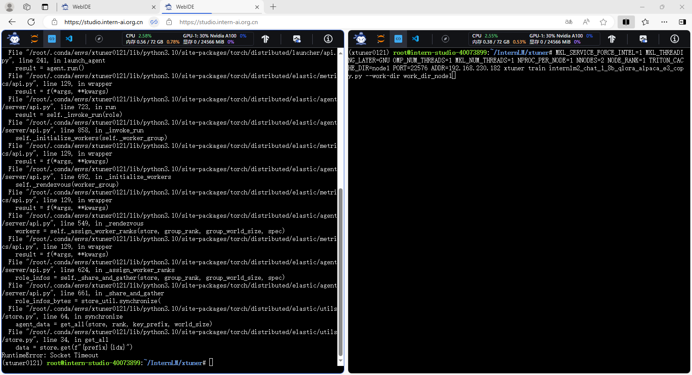

如果所有节点都正常启动、训练，则可以看到每个节点的显卡均有内存使用。

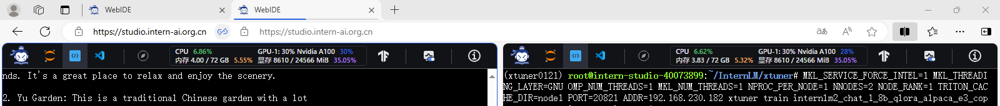

在训练完后，我们的目录结构应该是这样子的，训练的模型在工作节点上。

<details>
<summary>目录结构</summary>

```
├── work_dir_node0
│   ├── 20240627_213009
│   │   ├── 20240627_213009.log
│   │   └── vis_data
│   │       ├── 20240627_213009.json
│   │       ├── config.py
│   │       ├── eval_outputs_iter_233.txt
│   │       └── scalars.json
│   ├── internlm2_chat_1_8b_qlora_alpaca_e3_copy.py
│   ├── iter_234.pth
│   └── last_checkpoint
├── work_dir_node1
│   └── 20240627_213009
├── work_dirs
│   └── internlm2_chat_1_8b_qlora_alpaca_e3_copy
```

</details>

## Web Demo 部署

除了在终端中对模型进行测试，我们其实还可以在网页端的 Demo 进行对话。

首先，我们需要安装所需要的依赖。


```python
pip install streamlit
```

其次，我们需要准备一个Streamlit程序的脚本。

Streamlit程序的完整代码。

<details>
<summary>streamlit_demo.py</summary>

```python
import copy
import warnings
from dataclasses import asdict, dataclass
from typing import Callable, List, Optional

import streamlit as st
import torch
from torch import nn
from transformers.generation.utils import (LogitsProcessorList,
                                           StoppingCriteriaList)
from transformers.utils import logging

from transformers import AutoTokenizer, AutoModelForCausalLM  # isort: skip

logger = logging.get_logger(__name__)


model_name_or_path = "./merged"

@dataclass
class GenerationConfig:
    # this config is used for chat to provide more diversity
    max_length: int = 2048
    top_p: float = 0.75
    temperature: float = 0.1
    do_sample: bool = True
    repetition_penalty: float = 1.000


@torch.inference_mode()
def generate_interactive(
    model,
    tokenizer,
    prompt,
    generation_config: Optional[GenerationConfig] = None,
    logits_processor: Optional[LogitsProcessorList] = None,
    stopping_criteria: Optional[StoppingCriteriaList] = None,
    prefix_allowed_tokens_fn: Optional[Callable[[int, torch.Tensor],
                                                List[int]]] = None,
    additional_eos_token_id: Optional[int] = None,
    **kwargs,
):
    inputs = tokenizer([prompt], padding=True, return_tensors='pt')
    input_length = len(inputs['input_ids'][0])
    for k, v in inputs.items():
        inputs[k] = v.cuda()
    input_ids = inputs['input_ids']
    _, input_ids_seq_length = input_ids.shape[0], input_ids.shape[-1]
    if generation_config is None:
        generation_config = model.generation_config
    generation_config = copy.deepcopy(generation_config)
    model_kwargs = generation_config.update(**kwargs)
    bos_token_id, eos_token_id = (  # noqa: F841  # pylint: disable=W0612
        generation_config.bos_token_id,
        generation_config.eos_token_id,
    )
    if isinstance(eos_token_id, int):
        eos_token_id = [eos_token_id]
    if additional_eos_token_id is not None:
        eos_token_id.append(additional_eos_token_id)
    has_default_max_length = kwargs.get(
        'max_length') is None and generation_config.max_length is not None
    if has_default_max_length and generation_config.max_new_tokens is None:
        warnings.warn(
            f"Using 'max_length''s default ({repr(generation_config.max_length)}) \
                to control the generation length. "
            'This behaviour is deprecated and will be removed from the \
                config in v5 of Transformers -- we'
            ' recommend using `max_new_tokens` to control the maximum \
                length of the generation.',
            UserWarning,
        )
    elif generation_config.max_new_tokens is not None:
        generation_config.max_length = generation_config.max_new_tokens + \
            input_ids_seq_length
        if not has_default_max_length:
            logger.warn(  # pylint: disable=W4902
                f"Both 'max_new_tokens' (={generation_config.max_new_tokens}) "
                f"and 'max_length'(={generation_config.max_length}) seem to "
                "have been set. 'max_new_tokens' will take precedence. "
                'Please refer to the documentation for more information. '
                '(https://huggingface.co/docs/transformers/main/'
                'en/main_classes/text_generation)',
                UserWarning,
            )

    if input_ids_seq_length >= generation_config.max_length:
        input_ids_string = 'input_ids'
        logger.warning(
            f"Input length of {input_ids_string} is {input_ids_seq_length}, "
            f"but 'max_length' is set to {generation_config.max_length}. "
            'This can lead to unexpected behavior. You should consider'
            " increasing 'max_new_tokens'.")

    # 2. Set generation parameters if not already defined
    logits_processor = logits_processor if logits_processor is not None \
        else LogitsProcessorList()
    stopping_criteria = stopping_criteria if stopping_criteria is not None \
        else StoppingCriteriaList()

    logits_processor = model._get_logits_processor(
        generation_config=generation_config,
        input_ids_seq_length=input_ids_seq_length,
        encoder_input_ids=input_ids,
        prefix_allowed_tokens_fn=prefix_allowed_tokens_fn,
        logits_processor=logits_processor,
    )

    stopping_criteria = model._get_stopping_criteria(
        generation_config=generation_config,
        stopping_criteria=stopping_criteria)
    logits_warper = model._get_logits_warper(generation_config)

    unfinished_sequences = input_ids.new(input_ids.shape[0]).fill_(1)
    scores = None
    while True:
        model_inputs = model.prepare_inputs_for_generation(
            input_ids, **model_kwargs)
        # forward pass to get next token
        outputs = model(
            **model_inputs,
            return_dict=True,
            output_attentions=False,
            output_hidden_states=False,
        )

        next_token_logits = outputs.logits[:, -1, :]

        # pre-process distribution
        next_token_scores = logits_processor(input_ids, next_token_logits)
        next_token_scores = logits_warper(input_ids, next_token_scores)

        # sample
        probs = nn.functional.softmax(next_token_scores, dim=-1)
        if generation_config.do_sample:
            next_tokens = torch.multinomial(probs, num_samples=1).squeeze(1)
        else:
            next_tokens = torch.argmax(probs, dim=-1)

        # update generated ids, model inputs, and length for next step
        input_ids = torch.cat([input_ids, next_tokens[:, None]], dim=-1)
        model_kwargs = model._update_model_kwargs_for_generation(
            outputs, model_kwargs, is_encoder_decoder=False)
        unfinished_sequences = unfinished_sequences.mul(
            (min(next_tokens != i for i in eos_token_id)).long())

        output_token_ids = input_ids[0].cpu().tolist()
        output_token_ids = output_token_ids[input_length:]
        for each_eos_token_id in eos_token_id:
            if output_token_ids[-1] == each_eos_token_id:
                output_token_ids = output_token_ids[:-1]
        response = tokenizer.decode(output_token_ids)

        yield response
        # stop when each sentence is finished
        # or if we exceed the maximum length
        if unfinished_sequences.max() == 0 or stopping_criteria(
                input_ids, scores):
            break


def on_btn_click():
    del st.session_state.messages


@st.cache_resource
def load_model():
    model = (AutoModelForCausalLM.from_pretrained(model_name_or_path,
                                                  trust_remote_code=True).to(
                                                      torch.bfloat16).cuda())
    tokenizer = AutoTokenizer.from_pretrained(model_name_or_path,
                                              trust_remote_code=True)
    return model, tokenizer


def prepare_generation_config():
    with st.sidebar:
        max_length = st.slider('Max Length',
                               min_value=8,
                               max_value=32768,
                               value=2048)
        top_p = st.slider('Top P', 0.0, 1.0, 0.75, step=0.01)
        temperature = st.slider('Temperature', 0.0, 1.0, 0.1, step=0.01)
        st.button('Clear Chat History', on_click=on_btn_click)

    generation_config = GenerationConfig(max_length=max_length,
                                         top_p=top_p,
                                         temperature=temperature)

    return generation_config


user_prompt = '<|im_start|>user\n{user}<|im_end|>\n'
robot_prompt = '<|im_start|>assistant\n{robot}<|im_end|>\n'
cur_query_prompt = '<|im_start|>user\n{user}<|im_end|>\n\
    <|im_start|>assistant\n'


def combine_history(prompt):
    messages = st.session_state.messages
    meta_instruction = ('')
    total_prompt = f"<s><|im_start|>system\n{meta_instruction}<|im_end|>\n"
    for message in messages:
        cur_content = message['content']
        if message['role'] == 'user':
            cur_prompt = user_prompt.format(user=cur_content)
        elif message['role'] == 'robot':
            cur_prompt = robot_prompt.format(robot=cur_content)
        else:
            raise RuntimeError
        total_prompt += cur_prompt
    total_prompt = total_prompt + cur_query_prompt.format(user=prompt)
    return total_prompt


def main():
    # torch.cuda.empty_cache()
    print('load model begin.')
    model, tokenizer = load_model()
    print('load model end.')


    st.title('InternLM2-Chat-1.8B')

    generation_config = prepare_generation_config()

    # Initialize chat history
    if 'messages' not in st.session_state:
        st.session_state.messages = []

    # Display chat messages from history on app rerun
    for message in st.session_state.messages:
        with st.chat_message(message['role'], avatar=message.get('avatar')):
            st.markdown(message['content'])

    # Accept user input
    if prompt := st.chat_input('What is up?'):
        # Display user message in chat message container
        with st.chat_message('user'):
            st.markdown(prompt)
        real_prompt = combine_history(prompt)
        # Add user message to chat history
        st.session_state.messages.append({
            'role': 'user',
            'content': prompt,
        })

        with st.chat_message('robot'):
            message_placeholder = st.empty()
            for cur_response in generate_interactive(
                    model=model,
                    tokenizer=tokenizer,
                    prompt=real_prompt,
                    additional_eos_token_id=92542,
                    **asdict(generation_config),
            ):
                # Display robot response in chat message container
                message_placeholder.markdown(cur_response + '▌')
            message_placeholder.markdown(cur_response)
        # Add robot response to chat history
        st.session_state.messages.append({
            'role': 'robot',
            'content': cur_response,  # pylint: disable=undefined-loop-variable
        })
        torch.cuda.empty_cache()


if __name__ == '__main__':
    main()

```

</details>

然后，我们可以直接启动应用。


```bash
streamlit run streamlit_demo.py
```

运行后，在访问前，我们还需要做的就是将端口映射到本地。

通过如图所示的地方，获取开发机的端口和密码。

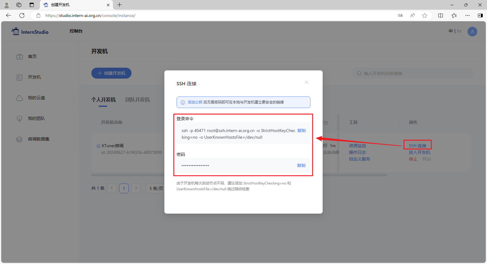

然后在本地使用 PowerShell 或者命令行终端，执行以下命令：

> 其中，`8501`是Streamlit程序的服务端口，`40471`需要替换为自己的开发机的端口。

```bash
ssh -CNg -L 8501:127.0.0.1:8501 root@ssh.intern-ai.org.cn -p 40471
```

然后再输入开发机的root密码。

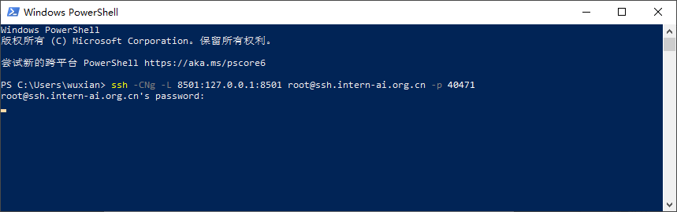

最后，我们就可以在本地通过浏览器访问：http://127.0.0.1:8501 来进行对话了。


## 总结

经过本节的学习，带领着大家跑通了 XTuner 的完整流程，我们学会了增量预训练微调、指令跟随微调、多卡微调和分布式微调，并且训练出了一个自己小助手，是不是很有意思！

是不是感觉其实微调也不过如此！事实上确实是这样的！其实在微调的时候最重要的还是要自己准备一份高质量的数据集，这个才是你能否真微调出效果最核心的利器。

当我们在测试完模型认为其满足我们的需求后，就可以对模型进行量化部署等操作了，这部分的内容在之后关于 LMDeploy 的课程中将会详细的进行讲解，敬请期待后续的课程吧！

