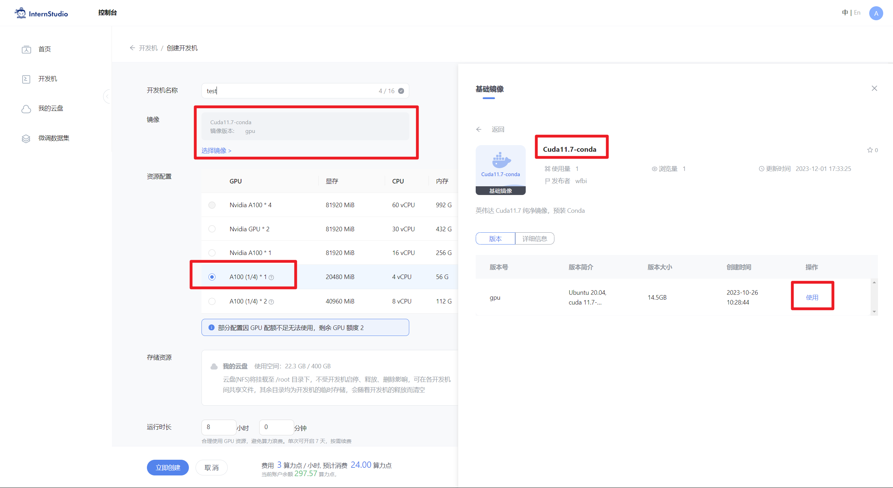
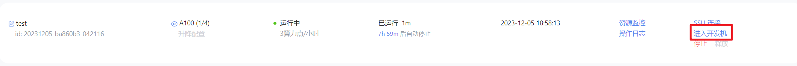
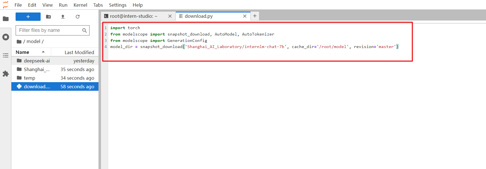
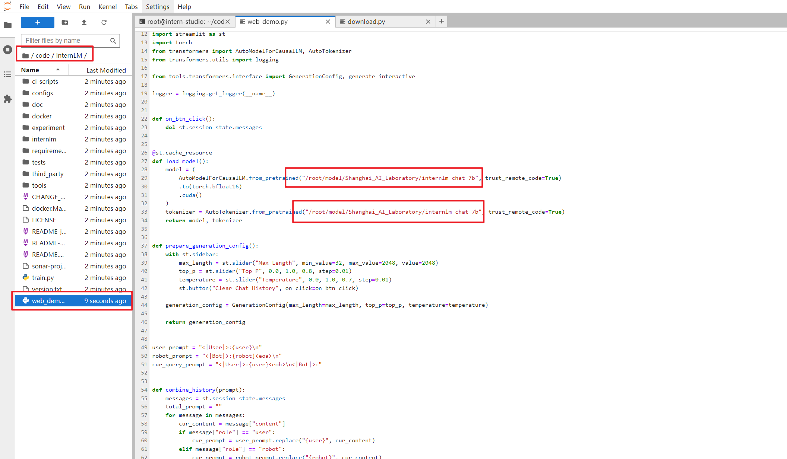
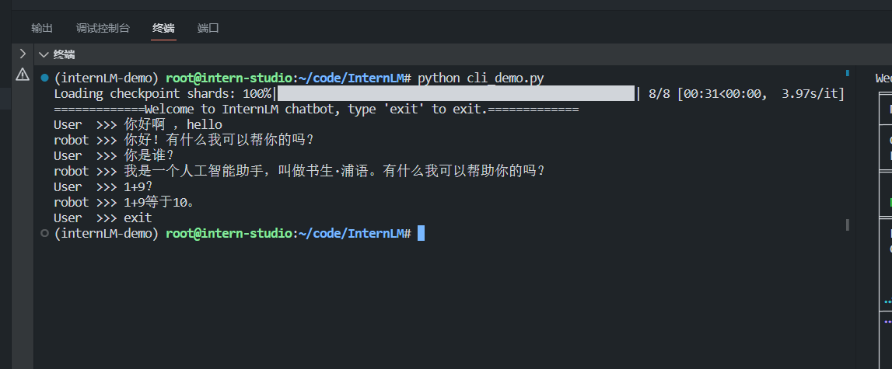
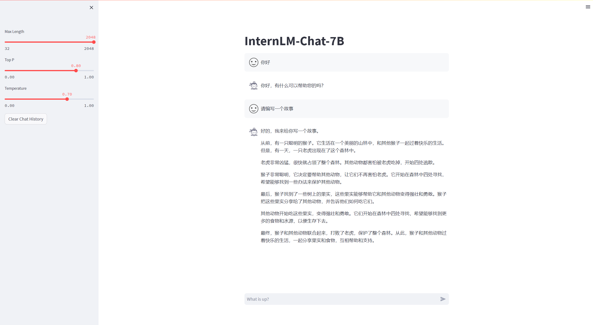
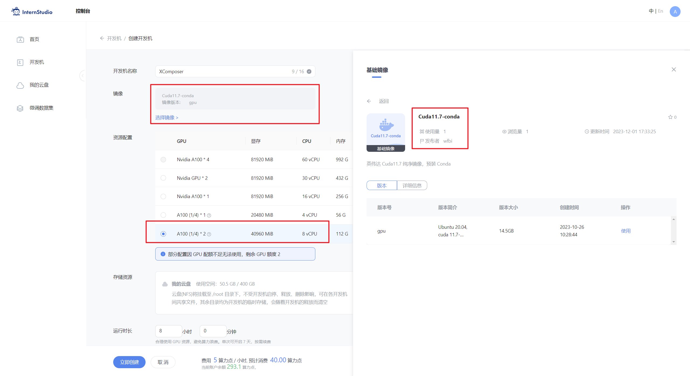
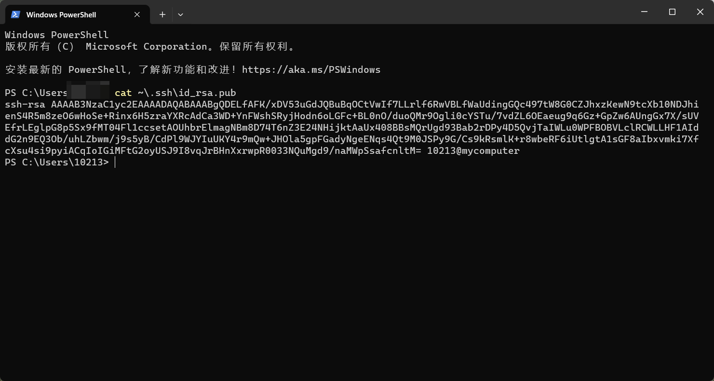
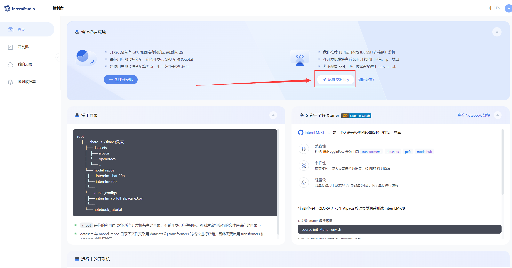
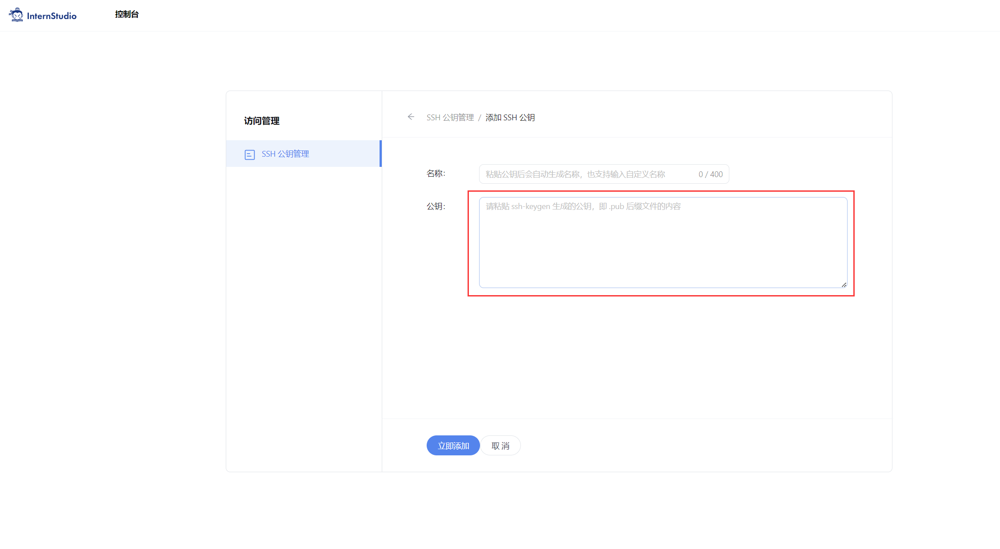

# 轻松玩转书生·浦语大模型趣味 Demo
- [轻松玩转书生·浦语大模型趣味 Demo](#轻松玩转书生浦语大模型趣味-demo)
  - [1 大模型及 InternLM 模型简介](#1-大模型及-internlm-模型简介)
    - [1.1 什么是大模型？](#11-什么是大模型)
    - [1.2 InternLM 模型全链条开源](#12-internlm-模型全链条开源)
  - [2 InternLM-Chat-7B 智能对话 Demo](#2-internlm-chat-7b-智能对话-demo)
    - [2.1 环境准备](#21-环境准备)
    - [2.2 模型下载](#22-模型下载)
    - [2.3 代码准备](#23-代码准备)
    - [2.4 终端运行](#24-终端运行)
    - [2.5 web demo 运行](#25-web-demo-运行)
  - [3 Lagent 智能体工具调用 Demo](#3-lagent-智能体工具调用-demo)
    - [3.1 环境准备](#31-环境准备)
    - [3.2 模型下载](#32-模型下载)
    - [3.3 Lagent 安装](#33-lagent-安装)
    - [3.4 修改代码](#34-修改代码)
    - [3.5 Demo 运行](#35-demo-运行)
  - [4. 浦语·灵笔图文理解创作 Demo](#4-浦语灵笔图文理解创作-demo)
    - [4.1 环境准备](#41-环境准备)
    - [4.2 模型下载](#42-模型下载)
    - [4.3 代码准备](#43-代码准备)
    - [4.4 Demo 运行](#44-demo-运行)
  - [5. 通用环境配置](#5-通用环境配置)
    - [5.1 pip、conda 换源](#51-pipconda-换源)
      - [5.1.1 pip 换源](#511-pip-换源)
      - [5.1.2 conda 换源](#512-conda-换源)
    - [5.2 配置本地端口](#52-配置本地端口)
    - [5.3 模型下载](#53-模型下载)
      - [5.3.1 Hugging Face](#531-hugging-face)
      - [5.3.2 ModelScope](#532-modelscope)
      - [5.3.3 OpenXLab](#533-openxlab)
  - [6. 课后作业](#6-课后作业)


## 1 大模型及 InternLM 模型简介

### 1.1 什么是大模型？

&emsp;&emsp;大模型通常指的是机器学习或人工智能领域中参数数量巨大、拥有庞大计算能力和参数规模的模型。这些模型利用大量数据进行训练，并且拥有数十亿甚至数千亿个参数。大模型的出现和发展得益于增长的数据量、计算能力的提升以及算法优化等因素。这些模型在各种任务中展现出惊人的性能，比如自然语言处理、计算机视觉、语音识别等。这种模型通常采用深度神经网络结构，如 `Transformer`、`BERT`、`GPT`（ Generative Pre-trained Transformer ）等。

&emsp;&emsp;大模型的优势在于其能够捕捉和理解数据中更为复杂、抽象的特征和关系。通过大规模参数的学习，它们可以提高在各种任务上的泛化能力，并在未经过大量特定领域数据训练的情况下实现较好的表现。然而，大模型也面临着一些挑战，比如巨大的计算资源需求、高昂的训练成本、对大规模数据的依赖以及模型的可解释性等问题。因此，大模型的应用和发展也需要在性能、成本和道德等多个方面进行权衡和考量。

### 1.2 InternLM 模型全链条开源

&emsp;&emsp;`InternLM` 是一个开源的轻量级训练框架，旨在支持大模型训练而无需大量的依赖。通过单一的代码库，它支持在拥有数千个 `GPU` 的大型集群上进行预训练，并在单个 `GPU` 上进行微调，同时实现了卓越的性能优化。在 `1024` 个 `GPU` 上训练时，`InternLM` 可以实现近 `90%` 的加速效率。

&emsp;&emsp;基于 `InternLM` 训练框架，上海人工智能实验室已经发布了两个开源的预训练模型：`InternLM-7B` 和 `InternLM-20B`。

&emsp;&emsp;`Lagent` 是一个轻量级、开源的基于大语言模型的智能体（agent）框架，支持用户快速地将一个大语言模型转变为多种类型的智能体，并提供了一些典型工具为大语言模型赋能。通过 `Lagent` 框架可以更好的发挥 `InternLM` 的全部性能。


&emsp;&emsp;浦语·灵笔是基于书生·浦语大语言模型研发的视觉-语言大模型，提供出色的图文理解和创作能力，结合了视觉和语言的先进技术，能够实现图像到文本、文本到图像的双向转换。使用浦语·灵笔大模型可以轻松的创作一篇图文推文，也能够轻松识别一张图片中的物体，并生成对应的文本描述。

&emsp;&emsp;上述提到的所有模型，都会带领大家一起体验哦！欢迎大家来给 `InternLM`: https://github.com/InternLM/InternLM/ 点点 star 哦！

## 2 InternLM-Chat-7B 智能对话 Demo

本小节我们将使用[InternStudio](https://studio.intern-ai.org.cn/)中的 A100(1/4) 机器和`InternLM-Chat-7B`模型部署一个智能对话 Demo。

### 2.1 环境准备

在[InternStudio](https://studio.intern-ai.org.cn/)平台中选择 A100(1/4) 的配置，如下图所示镜像选择 `Cuda11.7-conda`，如下图所示：



接下来打开刚刚租用服务器的`进入开发机`，并且打开其中的终端开始环境配置、模型下载和运行 `demo`。



进入开发机后，在页面的左上角可以切换 `JupyterLab`、`终端`和 `VScode`，并在终端输入 `bash 命令，进入 `conda` 环境。如下图所示：


进入 `conda` 环境之后，使用以下命令从本地克隆一个已有的 `pytorch 2.0.1` 的环境

```shell
bash # 请每次使用 jupyter lab 打开终端时务必先执行 bash 命令进入 bash 中
conda create --name internlm-demo --clone=/root/share/conda_envs/internlm-base
```

然后使用以下命令激活环境

```shell
conda activate internlm-demo
```

并在环境中安装运行 demo 所需要的依赖。

```shell
# 升级pip
python -m pip install --upgrade pip

pip install modelscope==1.9.5
pip install transformers==4.35.2
pip install streamlit==1.24.0
pip install sentencepiece==0.1.99
pip install accelerate==0.24.1
```
### 2.2 模型下载

[InternStudio](https://studio.intern-ai.org.cn/)平台的 `share` 目录下已经为我们准备了全系列的 `InternLM` 模型，所以我们可以直接复制即可。使用如下命令复制：

```shell
mkdir -p /root/model/Shanghai_AI_Laboratory
cp -r /root/share/temp/model_repos/internlm-chat-7b /root/model/Shanghai_AI_Laboratory
```
> -r 选项表示递归地复制目录及其内容

也可以使用 `modelscope` 中的 `snapshot_download` 函数下载模型，第一个参数为模型名称，参数 `cache_dir` 为模型的下载路径。

在 `/root` 路径下新建目录`model`，在目录下新建 `download.py` 文件并在其中输入以下内容，粘贴代码后记得保存文件，如下图所示。并运行 `python /root/model/download.py` 执行下载，模型大小为 14 GB，下载模型大概需要 10~20 分钟

```python
import torch
from modelscope import snapshot_download, AutoModel, AutoTokenizer
import os
model_dir = snapshot_download('Shanghai_AI_Laboratory/internlm-chat-7b', cache_dir='/root/model', revision='v1.0.3')
```

> 注意：使用 `pwd` 命令可以查看当前的路径，`JupyterLab` 左侧目录栏显示为 `/root/` 下的路径。



### 2.3 代码准备

首先 `clone` 代码，在 `/root` 路径下新建 `code` 目录，然后切换路径, clone 代码.

```shell
cd /root/code
git clone https://gitee.com/internlm/InternLM.git
```

切换 commit 版本，与教程 commit 版本保持一致，可以让大家更好的复现。

```shell
cd InternLM
git checkout 3028f07cb79e5b1d7342f4ad8d11efad3fd13d17
```

将 `/root/code/InternLM/web_demo.py`中 29 行和 33 行的模型更换为本地的 `/root/model/Shanghai_AI_Laboratory/internlm-chat-7b`。



### 2.4 终端运行

我们可以在 `/root/code/InternLM` 目录下新建一个 `cli_demo.py` 文件，将以下代码填入其中：

```python
import torch
from transformers import AutoTokenizer, AutoModelForCausalLM


model_name_or_path = "/root/model/Shanghai_AI_Laboratory/internlm-chat-7b"

tokenizer = AutoTokenizer.from_pretrained(model_name_or_path, trust_remote_code=True)
model = AutoModelForCausalLM.from_pretrained(model_name_or_path, trust_remote_code=True, torch_dtype=torch.bfloat16, device_map='auto')
model = model.eval()

system_prompt = """You are an AI assistant whose name is InternLM (书生·浦语).
- InternLM (书生·浦语) is a conversational language model that is developed by Shanghai AI Laboratory (上海人工智能实验室). It is designed to be helpful, honest, and harmless.
- InternLM (书生·浦语) can understand and communicate fluently in the language chosen by the user such as English and 中文.
"""

messages = [(system_prompt, '')]

print("=============Welcome to InternLM chatbot, type 'exit' to exit.=============")

while True:
    input_text = input("User  >>> ")
    input_text.replace(' ', '')
    if input_text == "exit":
        break
    response, history = model.chat(tokenizer, input_text, history=messages)
    messages.append((input_text, response))
    print(f"robot >>> {response}")
```

然后在终端运行以下命令，即可体验 `InternLM-Chat-7B` 模型的对话能力。对话效果如下所示：

```shell
python /root/code/InternLM/cli_demo.py
```


### 2.5 web demo 运行

我们切换到 `VScode` 中，运行 `/root/code/InternLM` 目录下的 `web_demo.py` 文件，输入以下命令后，[**查看本教程5.2配置本地端口后**](./hello_world.md#52-配置本地端口)，将端口映射到本地。在本地浏览器输入 `http://127.0.0.1:6006` 即可。

```shell
bash
conda activate internlm-demo  # 首次进入 vscode 会默认是 base 环境，所以首先切换环境
cd /root/code/InternLM
streamlit run web_demo.py --server.address 127.0.0.1 --server.port 6006
```


注意：要在浏览器打开`http://127.0.0.1:6006`页面后，模型才会加载，如下图所示：


在加载完模型之后，就可以与 InternLM-Chat-7B 进行对话了，如下图所示：



## 3 Lagent 智能体工具调用 Demo

本小节我们将使用 [InternStudio](https://studio.intern-ai.org.cn/) 中的 A100(1/4) 机器、`InternLM-Chat-7B` 模型和 `Lagent` 框架部署一个智能工具调用 Demo。

Lagent 是一个轻量级、开源的基于大语言模型的智能体（agent）框架，支持用户快速地将一个大语言模型转变为多种类型的智能体，并提供了一些典型工具为大语言模型赋能。通过 Lagent 框架可以更好的发挥 InternLM 的全部性能。

下面我们就开始动手实现！

### 3.1 环境准备

选择和第一个 `InternLM` 一样的镜像环境，运行以下命令安装依赖，如果上一个 `InternLM-Chat-7B` 已经配置好环境不需要重复安装.

```shell
# 升级pip
python -m pip install --upgrade pip

pip install modelscope==1.9.5
pip install transformers==4.35.2
pip install streamlit==1.24.0
pip install sentencepiece==0.1.99
pip install accelerate==0.24.1
```

### 3.2 模型下载

[InternStudio](https://studio.intern-ai.org.cn/) 平台的 `share` 目录下已经为我们准备了全系列的 `InternLM` 模型，所以我们可以直接复制即可。使用如下命令复制：

```shell
mkdir -p /root/model/Shanghai_AI_Laboratory
cp -r /root/share/temp/model_repos/internlm-chat-7b /root/model/Shanghai_AI_Laboratory
```
> -r 选项表示递归地复制目录及其内容

也可以在 `/root/model` 路径下新建 `download.py` 文件并在其中输入以下内容，并运行 `python /root/model/download.py`执行下载，模型大小为 14 GB，下载模型大概需要 10~20 分钟

```python
import torch
from modelscope import snapshot_download, AutoModel, AutoTokenizer
import os
model_dir = snapshot_download('Shanghai_AI_Laboratory/internlm-chat-7b', cache_dir='/root/model', revision='v1.0.3')
```

### 3.3 Lagent 安装

首先切换路径到 `/root/code` 克隆 `lagent` 仓库，并通过 `pip install -e .` 源码安装 `Lagent`

```shell
cd /root/code
git clone https://gitee.com/internlm/lagent.git
cd /root/code/lagent
git checkout 511b03889010c4811b1701abb153e02b8e94fb5e # 尽量保证和教程commit版本一致
pip install -e . # 源码安装
```

### 3.4 修改代码

由于代码修改的地方比较多，大家直接将 `/root/code/lagent/examples/react_web_demo.py` 内容替换为以下代码

```python
import copy
import os

import streamlit as st
from streamlit.logger import get_logger

from lagent.actions import ActionExecutor, GoogleSearch, PythonInterpreter
from lagent.agents.react import ReAct
from lagent.llms import GPTAPI
from lagent.llms.huggingface import HFTransformerCasualLM


class SessionState:

    def init_state(self):
        """Initialize session state variables."""
        st.session_state['assistant'] = []
        st.session_state['user'] = []

        #action_list = [PythonInterpreter(), GoogleSearch()]
        action_list = [PythonInterpreter()]
        st.session_state['plugin_map'] = {
            action.name: action
            for action in action_list
        }
        st.session_state['model_map'] = {}
        st.session_state['model_selected'] = None
        st.session_state['plugin_actions'] = set()

    def clear_state(self):
        """Clear the existing session state."""
        st.session_state['assistant'] = []
        st.session_state['user'] = []
        st.session_state['model_selected'] = None
        if 'chatbot' in st.session_state:
            st.session_state['chatbot']._session_history = []


class StreamlitUI:

    def __init__(self, session_state: SessionState):
        self.init_streamlit()
        self.session_state = session_state

    def init_streamlit(self):
        """Initialize Streamlit's UI settings."""
        st.set_page_config(
            layout='wide',
            page_title='lagent-web',
            page_icon='./docs/imgs/lagent_icon.png')
        # st.header(':robot_face: :blue[Lagent] Web Demo ', divider='rainbow')
        st.sidebar.title('模型控制')

    def setup_sidebar(self):
        """Setup the sidebar for model and plugin selection."""
        model_name = st.sidebar.selectbox(
            '模型选择：', options=['gpt-3.5-turbo','internlm'])
        if model_name != st.session_state['model_selected']:
            model = self.init_model(model_name)
            self.session_state.clear_state()
            st.session_state['model_selected'] = model_name
            if 'chatbot' in st.session_state:
                del st.session_state['chatbot']
        else:
            model = st.session_state['model_map'][model_name]

        plugin_name = st.sidebar.multiselect(
            '插件选择',
            options=list(st.session_state['plugin_map'].keys()),
            default=[list(st.session_state['plugin_map'].keys())[0]],
        )

        plugin_action = [
            st.session_state['plugin_map'][name] for name in plugin_name
        ]
        if 'chatbot' in st.session_state:
            st.session_state['chatbot']._action_executor = ActionExecutor(
                actions=plugin_action)
        if st.sidebar.button('清空对话', key='clear'):
            self.session_state.clear_state()
        uploaded_file = st.sidebar.file_uploader(
            '上传文件', type=['png', 'jpg', 'jpeg', 'mp4', 'mp3', 'wav'])
        return model_name, model, plugin_action, uploaded_file

    def init_model(self, option):
        """Initialize the model based on the selected option."""
        if option not in st.session_state['model_map']:
            if option.startswith('gpt'):
                st.session_state['model_map'][option] = GPTAPI(
                    model_type=option)
            else:
                st.session_state['model_map'][option] = HFTransformerCasualLM(
                    '/root/model/Shanghai_AI_Laboratory/internlm-chat-7b')
        return st.session_state['model_map'][option]

    def initialize_chatbot(self, model, plugin_action):
        """Initialize the chatbot with the given model and plugin actions."""
        return ReAct(
            llm=model, action_executor=ActionExecutor(actions=plugin_action))

    def render_user(self, prompt: str):
        with st.chat_message('user'):
            st.markdown(prompt)

    def render_assistant(self, agent_return):
        with st.chat_message('assistant'):
            for action in agent_return.actions:
                if (action):
                    self.render_action(action)
            st.markdown(agent_return.response)

    def render_action(self, action):
        with st.expander(action.type, expanded=True):
            st.markdown(
                "<p style='text-align: left;display:flex;'> <span style='font-size:14px;font-weight:600;width:70px;text-align-last: justify;'>插    件</span><span style='width:14px;text-align:left;display:block;'>:</span><span style='flex:1;'>"  # noqa E501
                + action.type + '</span></p>',
                unsafe_allow_html=True)
            st.markdown(
                "<p style='text-align: left;display:flex;'> <span style='font-size:14px;font-weight:600;width:70px;text-align-last: justify;'>思考步骤</span><span style='width:14px;text-align:left;display:block;'>:</span><span style='flex:1;'>"  # noqa E501
                + action.thought + '</span></p>',
                unsafe_allow_html=True)
            if (isinstance(action.args, dict) and 'text' in action.args):
                st.markdown(
                    "<p style='text-align: left;display:flex;'><span style='font-size:14px;font-weight:600;width:70px;text-align-last: justify;'> 执行内容</span><span style='width:14px;text-align:left;display:block;'>:</span></p>",  # noqa E501
                    unsafe_allow_html=True)
                st.markdown(action.args['text'])
            self.render_action_results(action)

    def render_action_results(self, action):
        """Render the results of action, including text, images, videos, and
        audios."""
        if (isinstance(action.result, dict)):
            st.markdown(
                "<p style='text-align: left;display:flex;'><span style='font-size:14px;font-weight:600;width:70px;text-align-last: justify;'> 执行结果</span><span style='width:14px;text-align:left;display:block;'>:</span></p>",  # noqa E501
                unsafe_allow_html=True)
            if 'text' in action.result:
                st.markdown(
                    "<p style='text-align: left;'>" + action.result['text'] +
                    '</p>',
                    unsafe_allow_html=True)
            if 'image' in action.result:
                image_path = action.result['image']
                image_data = open(image_path, 'rb').read()
                st.image(image_data, caption='Generated Image')
            if 'video' in action.result:
                video_data = action.result['video']
                video_data = open(video_data, 'rb').read()
                st.video(video_data)
            if 'audio' in action.result:
                audio_data = action.result['audio']
                audio_data = open(audio_data, 'rb').read()
                st.audio(audio_data)


def main():
    logger = get_logger(__name__)
    # Initialize Streamlit UI and setup sidebar
    if 'ui' not in st.session_state:
        session_state = SessionState()
        session_state.init_state()
        st.session_state['ui'] = StreamlitUI(session_state)

    else:
        st.set_page_config(
            layout='wide',
            page_title='lagent-web',
            page_icon='./docs/imgs/lagent_icon.png')
        # st.header(':robot_face: :blue[Lagent] Web Demo ', divider='rainbow')
    model_name, model, plugin_action, uploaded_file = st.session_state[
        'ui'].setup_sidebar()

    # Initialize chatbot if it is not already initialized
    # or if the model has changed
    if 'chatbot' not in st.session_state or model != st.session_state[
            'chatbot']._llm:
        st.session_state['chatbot'] = st.session_state[
            'ui'].initialize_chatbot(model, plugin_action)

    for prompt, agent_return in zip(st.session_state['user'],
                                    st.session_state['assistant']):
        st.session_state['ui'].render_user(prompt)
        st.session_state['ui'].render_assistant(agent_return)
    # User input form at the bottom (this part will be at the bottom)
    # with st.form(key='my_form', clear_on_submit=True):

    if user_input := st.chat_input(''):
        st.session_state['ui'].render_user(user_input)
        st.session_state['user'].append(user_input)
        # Add file uploader to sidebar
        if uploaded_file:
            file_bytes = uploaded_file.read()
            file_type = uploaded_file.type
            if 'image' in file_type:
                st.image(file_bytes, caption='Uploaded Image')
            elif 'video' in file_type:
                st.video(file_bytes, caption='Uploaded Video')
            elif 'audio' in file_type:
                st.audio(file_bytes, caption='Uploaded Audio')
            # Save the file to a temporary location and get the path
            file_path = os.path.join(root_dir, uploaded_file.name)
            with open(file_path, 'wb') as tmpfile:
                tmpfile.write(file_bytes)
            st.write(f'File saved at: {file_path}')
            user_input = '我上传了一个图像，路径为: {file_path}. {user_input}'.format(
                file_path=file_path, user_input=user_input)
        agent_return = st.session_state['chatbot'].chat(user_input)
        st.session_state['assistant'].append(copy.deepcopy(agent_return))
        logger.info(agent_return.inner_steps)
        st.session_state['ui'].render_assistant(agent_return)


if __name__ == '__main__':
    root_dir = os.path.dirname(os.path.dirname(os.path.abspath(__file__)))
    root_dir = os.path.join(root_dir, 'tmp_dir')
    os.makedirs(root_dir, exist_ok=True)
    main()
```

### 3.5 Demo 运行

```shell
streamlit run /root/code/lagent/examples/react_web_demo.py --server.address 127.0.0.1 --server.port 6006
```

用同样的方法我们依然切换到 `VScode` 页面，运行成功后，[**查看本教程5.2配置本地端口后**](./hello_world.md#52-配置本地端口)，将端口映射到本地。在本地浏览器输入 `http://127.0.0.1:6006` 即可。

我们在 `Web` 页面选择 `InternLM` 模型，等待模型加载完毕后，输入数学问题 已知 `2x+3=10`，求`x` ,此时 `InternLM-Chat-7B` 模型理解题意生成解此题的 `Python` 代码，`Lagent` 调度送入 `Python` 代码解释器求出该问题的解。


## 4. 浦语·灵笔图文理解创作 Demo

本小节我们将使用[InternStudio](https://studio.intern-ai.org.cn/)中的 A100(1/4) * 2 机器和 `internlm-xcomposer-7b` 模型部署一个图文理解创作 Demo 。

### 4.1 环境准备

首先在 [InternStudio](https://studio.intern-ai.org.cn/) 上选择 A100(1/4)*2 的配置。如下图所示：



接下来打开刚刚租用服务器的`进入开发机`，并在终端输入 `bash` 命令，进入 `conda` 环境，接下来就是安装依赖。

进入 `conda` 环境之后，使用以下命令从本地克隆一个已有的`pytorch 2.0.1` 的环境

```shell
conda create --name xcomposer-demo --clone=/root/share/conda_envs/internlm-base
```

然后使用以下命令激活环境

```shell
conda activate xcomposer-demo
```

接下来运行以下命令，安装 `transformers`、`gradio` 等依赖包。请严格安装以下版本安装！

```shell
pip install transformers==4.33.1 timm==0.4.12 sentencepiece==0.1.99 gradio==3.44.4 markdown2==2.4.10 xlsxwriter==3.1.2 einops accelerate
```
### 4.2 模型下载

[InternStudio](https://studio.intern-ai.org.cn/)平台的 `share` 目录下已经为我们准备了全系列的 `InternLM` 模型，所以我们可以直接复制即可。使用如下命令复制：

```shell
mkdir -p /root/model/Shanghai_AI_Laboratory
cp -r /root/share/temp/model_repos/internlm-xcomposer-7b /root/model/Shanghai_AI_Laboratory
```
> -r 选项表示递归地复制目录及其内容

也可以安装 `modelscope`，下载模型的老朋友了

```shell
pip install modelscope==1.9.5
```

在 `/root/model` 路径下新建 `download.py` 文件并在其中输入以下内容，并运行 `python /root/model/download.py` 执行下载

```python
import torch
from modelscope import snapshot_download, AutoModel, AutoTokenizer
import os
model_dir = snapshot_download('Shanghai_AI_Laboratory/internlm-xcomposer-7b', cache_dir='/root/model', revision='master')
```

### 4.3 代码准备

在 `/root/code` `git clone InternLM-XComposer` 仓库的代码

```shell
cd /root/code
git clone https://gitee.com/internlm/InternLM-XComposer.git
cd /root/code/InternLM-XComposer
git checkout 3e8c79051a1356b9c388a6447867355c0634932d  # 最好保证和教程的 commit 版本一致
```

### 4.4 Demo 运行

在终端运行以下代码：

```shell
cd /root/code/InternLM-XComposer
python examples/web_demo.py  \
    --folder /root/model/Shanghai_AI_Laboratory/internlm-xcomposer-7b \
    --num_gpus 1 \
    --port 6006
```

> 这里 `num_gpus 1` 是因为InternStudio平台对于 `A100(1/4)*2` 识别仍为一张显卡。但如果有小伙伴课后使用两张 3090 来运行此 demo，仍需将 `num_gpus` 设置为 `2` 。

[**查看本教程5.2配置本地端口后**](./hello_world.md#52-配置本地端口)，将端口映射到本地。在本地浏览器输入 `http://127.0.0.1:6006` 即可。我们以`又见敦煌`为提示词，体验图文创作的功能，如下图所示：


接下来，我们可以体验以下图片理解的能力，如下所示~


## 5. 通用环境配置

### 5.1 pip、conda 换源

更多详细内容可移步至 [MirrorZ Help](https://help.mirrors.cernet.edu.cn/) 查看。

#### 5.1.1 pip 换源

临时使用镜像源安装，如下所示：`some-package` 为你需要安装的包名

```shell
pip install -i https://mirrors.cernet.edu.cn/pypi/web/simple some-package
```

设置pip默认镜像源，升级 pip 到最新的版本 (>=10.0.0) 后进行配置，如下所示：

```shell
python -m pip install --upgrade pip
pip config set global.index-url https://mirrors.cernet.edu.cn/pypi/web/simple
```

如果您的 pip 默认源的网络连接较差，临时使用镜像源升级 pip：

```shell
python -m pip install -i https://mirrors.cernet.edu.cn/pypi/web/simple --upgrade pip
```

#### 5.1.2 conda 换源

镜像站提供了 Anaconda 仓库与第三方源（conda-forge、msys2、pytorch 等），各系统都可以通过修改用户目录下的 `.condarc` 文件来使用镜像站。

不同系统下的 `.condarc` 目录如下：

- `Linux`: `${HOME}/.condarc`
- `macOS`: `${HOME}/.condarc`
- `Windows`: `C:\Users\<YourUserName>\.condarc`

注意：

- `Windows` 用户无法直接创建名为 `.condarc` 的文件，可先执行 `conda config --set show_channel_urls yes` 生成该文件之后再修改。

快速配置

```shell
cat <<'EOF' > ~/.condarc
channels:
  - defaults
show_channel_urls: true
default_channels:
  - https://mirrors.tuna.tsinghua.edu.cn/anaconda/pkgs/main
  - https://mirrors.tuna.tsinghua.edu.cn/anaconda/pkgs/r
  - https://mirrors.tuna.tsinghua.edu.cn/anaconda/pkgs/msys2
custom_channels:
  conda-forge: https://mirrors.tuna.tsinghua.edu.cn/anaconda/cloud
  pytorch: https://mirrors.tuna.tsinghua.edu.cn/anaconda/cloud
EOF
```

### 5.2 配置本地端口

由于服务器通常只暴露了用于安全远程登录的SSH（Secure Shell）端口，如果需要访问服务器上运行的其他服务（如web应用）的特定端口，需要一种特殊的设置。我们可以通过使用SSH隧道的方法，将服务器上的这些特定端口映射到本地计算机的端口。这样做的步骤如下：

首先我们需要配置一下本地的 `SSH Key` ，我们这里以 `Windows` 为例。

步骤①：在本地机器上打开 `Power Shell` 终端。在终端中，运行以下命令来生成 SSH 密钥对：（如下图所示）
```shell
ssh-keygen -t rsa
```


步骤②： 您将被提示选择密钥文件的保存位置，默认情况下是在 `~/.ssh/` 目录中。按 `Enter` 键接受默认值或输入自定义路径。

步骤③：公钥默认存储在 `~/.ssh/id_rsa.pub`，可以通过系统自带的 `cat` 工具查看文件内容：（如下图所示）

```shell
cat ~\.ssh\id_rsa.pub
```

> `~` 是用户主目录的简写，`.ssh` 是SSH配置文件的默认存储目录，`id_rsa.pub` 是 SSH 公钥文件的默认名称。所以，`cat ~\.ssh\id_rsa.pub` 的意思是查看用户主目录下的 `.ssh` 目录中的 `id_rsa.pub` 文件的内容。



步骤④：将公钥复制到剪贴板中，然后回到 `InternStudio` 控制台，点击配置 SSH Key。如下图所示：



步骤⑤：将刚刚复制的公钥添加进入即可。



步骤⑥：在本地终端输入以下指令 `.6006` 是在服务器中打开的端口，而 `33090` 是根据开发机的端口进行更改。如下图所示：

```shell
ssh -CNg -L 6006:127.0.0.1:6006 root@ssh.intern-ai.org.cn -p 33090
```


### 5.3 模型下载

#### 5.3.1 Hugging Face

使用 Hugging Face 官方提供的 `huggingface-cli` 命令行工具。安装依赖:

```shell
pip install -U huggingface_hub
```

然后新建 python 文件，填入以下代码，运行即可。

- resume-download：断点续下
- local-dir：本地存储路径。（linux 环境下需要填写绝对路径）

```python
import os

# 下载模型
os.system('huggingface-cli download --resume-download internlm/internlm-chat-7b --local-dir your_path')
```

以下内容将展示使用 `huggingface_hub` 下载模型中的部分文件

```python
from huggingface_hub import hf_hub_download
import os from huggingface_hub import hf_hub_download # Load model directly hf_hub_download(repo_id="internlm/internlm-7b", filename="config.json")
```

#### 5.3.2 ModelScope

使用 `modelscope` 中的 `snapshot_download` 函数下载模型，第一个参数为模型名称，参数 `cache_dir` 为模型的下载路径。

注意：`cache_dir` 最好为绝对路径。

安装依赖：

```shell
pip install modelscope==1.9.5
pip install transformers==4.35.2
```

在当前目录下新建 python 文件，填入以下代码，运行即可。

```python
import torch
from modelscope import snapshot_download, AutoModel, AutoTokenizer
import os
model_dir = snapshot_download('Shanghai_AI_Laboratory/internlm-chat-7b', cache_dir='your path', revision='master')
```

#### 5.3.3 OpenXLab

OpenXLab 可以通过指定模型仓库的地址，以及需要下载的文件的名称，文件所需下载的位置等，直接下载模型权重文件。

使用python脚本下载模型首先要安装依赖，安装代码如下：`pip install -U openxlab` 安装完成后使用 download 函数导入模型中心的模型。

```python
from openxlab.model import download
download(model_repo='OpenLMLab/InternLM-7b', model_name='InternLM-7b', output='your local path')
```

## 6. 课后作业

提交方式：在各个班级对应的 GitHub Discussion 帖子中进行提交。 

**基础作业：**

- 使用 InternLM-Chat-7B 模型生成 300 字的小故事（需截图）。
- 熟悉 hugging face 下载功能，使用 `huggingface_hub` python 包，下载 `InternLM-20B` 的 config.json 文件到本地（需截图下载过程）。

**进阶作业（可选做）**

- 完成浦语·灵笔的图文理解及创作部署（需截图）
- 完成 Lagent 工具调用 Demo 创作部署（需截图）

**整体实训营项目：**

时间周期：即日起致课程结束

即日开始可以在班级群中随机组队完成一个大作业项目，一些可提供的选题如下：

- 人情世故大模型：一个帮助用户撰写新年祝福文案的人情事故大模型
- 中小学数学大模型：一个拥有一定数学解题能力的大模型
- 心理大模型：一个治愈的心理大模型
- 工具调用类项目：结合Lagent构建数据集训练InternLM模型，支持对MMYOLO等工具的调用

其他基于书生·浦语工具链的小项目都在范围内，欢迎大家充分发挥想象力。
