<div align="center">


</div>

# 轻松玩转书生·浦语大模型趣味 Demo

## 1 **趣味 Demo 任务列表**

本节课可以让同学们实践 4 个主要内容，分别是：

- **部署 `InternLM2-Chat-1.8B` 模型进行智能对话**
- **部署实战营优秀作品 `八戒-Chat-1.8B` 模型**
- **通过 `InternLM2-Chat-7B` 运行 `Lagent` 智能体 `Demo`**
- **实践部署 `浦语·灵笔2` 模型**

## 2 **部署 `InternLM2-Chat-1.8B` 模型进行智能对话**

### **2.1 配置基础环境**
首先，打开 `Intern Studio` 界面，点击 创建开发机 配置开发机系统。

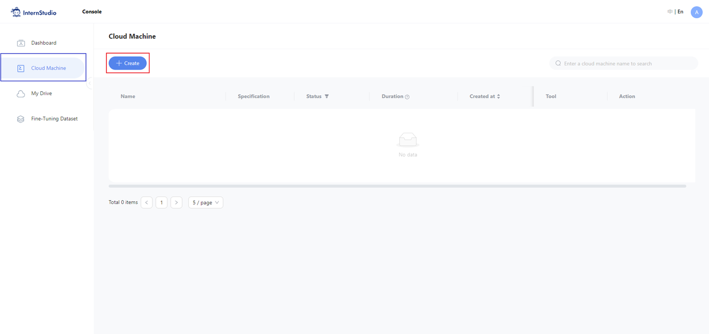

填写 `开发机名称` 后，点击 选择镜像 使用 `Cuda11.7-conda` 镜像，然后在资源配置中，使用 `10% A100 * 1` 的选项，然后立即创建开发机器。

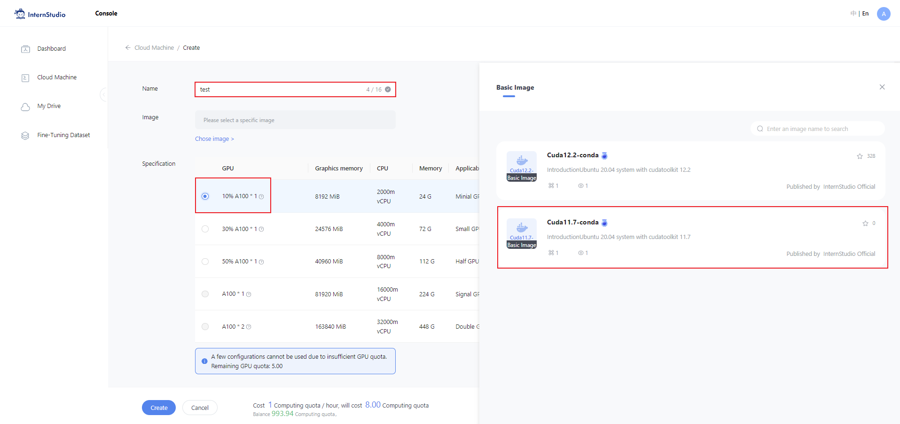

点击 `进入开发机` 选项。

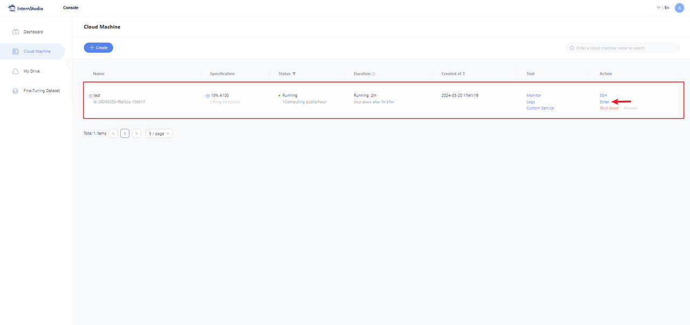

**进入开发机后，在 `terminal` 中输入环境配置命令 (配置环境时间较长，需耐心等待)：**

```bash
studio-conda -o internlm-base -t demo
# 与 studio-conda 等效的配置方案
# conda create -n demo python==3.10 -y
# conda activate demo
# conda install pytorch==2.0.1 torchvision==0.15.2 torchaudio==2.0.2 pytorch-cuda=11.7 -c pytorch -c nvidia
```

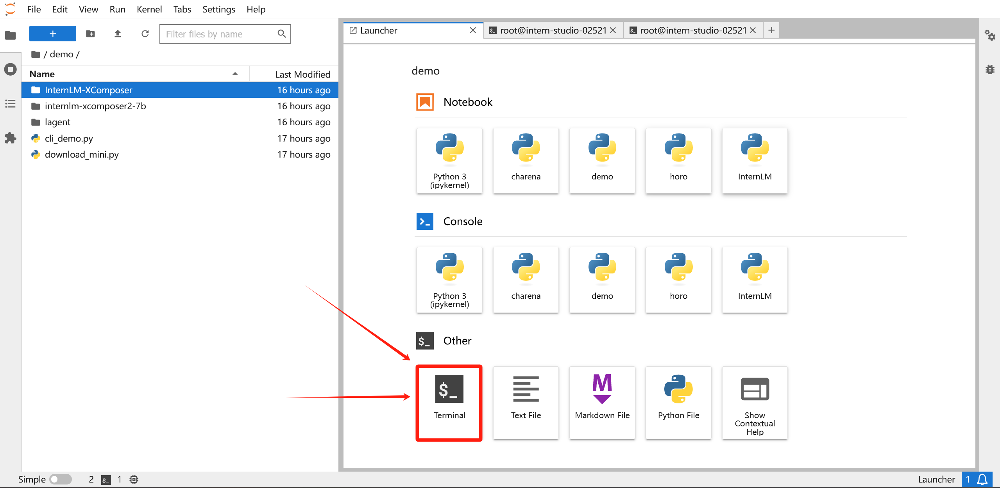


配置完成后，进入到新创建的 `conda` 环境之中：

```bash
conda activate demo
```

输入以下命令，完成环境包的安装：

```bash
pip install huggingface-hub==0.17.3
pip install transformers==4.34 
pip install psutil==5.9.8
pip install accelerate==0.24.1
pip install streamlit==1.32.2 
pip install matplotlib==3.8.3 
pip install modelscope==1.9.5
pip install sentencepiece==0.1.99
```

### **2.2 下载 `InternLM2-Chat-1.8B` 模型**
  
按路径创建文件夹，并进入到对应文件目录中：

```bash
mkdir -p /root/demo
touch /root/demo/cli_demo.py
touch /root/demo/download_mini.py
cd /root/demo
```

通过左侧文件夹栏目，双击进入 `demo` 文件夹。

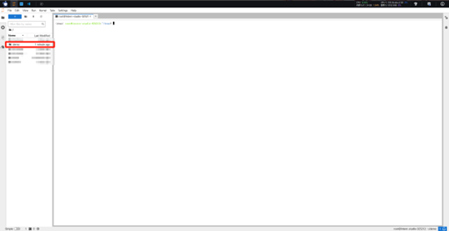

双击打开 `/root/demo/download_mini.py` 文件，复制以下代码：

```python
import os
from modelscope.hub.snapshot_download import snapshot_download

# 创建保存模型目录
os.system("mkdir /root/models")

# save_dir是模型保存到本地的目录
save_dir="/root/models"

snapshot_download("Shanghai_AI_Laboratory/internlm2-chat-1_8b", 
                  cache_dir=save_dir, 
                  revision='v1.1.0')

```

执行命令，下载模型参数文件：

```bash
python /root/demo/download_mini.py
```

### **2.3 运行 cli_demo**

双击打开 `/root/demo/cli_demo.py` 文件，复制以下代码：

```python
import torch
from transformers import AutoTokenizer, AutoModelForCausalLM


model_name_or_path = "/root/models/Shanghai_AI_Laboratory/internlm2-chat-1_8b"

tokenizer = AutoTokenizer.from_pretrained(model_name_or_path, trust_remote_code=True, device_map='cuda:0')
model = AutoModelForCausalLM.from_pretrained(model_name_or_path, trust_remote_code=True, torch_dtype=torch.bfloat16, device_map='cuda:0')
model = model.eval()

system_prompt = """You are an AI assistant whose name is InternLM (书生·浦语).
- InternLM (书生·浦语) is a conversational language model that is developed by Shanghai AI Laboratory (上海人工智能实验室). It is designed to be helpful, honest, and harmless.
- InternLM (书生·浦语) can understand and communicate fluently in the language chosen by the user such as English and 中文.
"""

messages = [(system_prompt, '')]

print("=============Welcome to InternLM chatbot, type 'exit' to exit.=============")

while True:
    input_text = input("\nUser  >>> ")
    input_text = input_text.replace(' ', '')
    if input_text == "exit":
        break

    length = 0
    for response, _ in model.stream_chat(tokenizer, input_text, messages):
        if response is not None:
            print(response[length:], flush=True, end="")
            length = len(response)

```

输入命令，执行 Demo 程序：

```bash
conda activate demo
python /root/demo/cli_demo.py
```

等待模型加载完成，键入内容示例：

    请创作一个 300 字的小故事

效果如下：

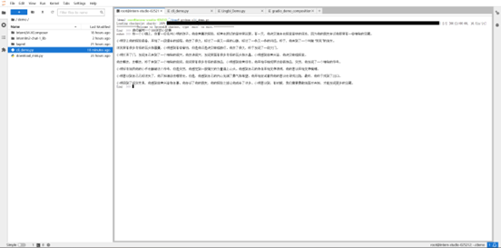

## 3 **实战：部署实战营优秀作品 `八戒-Chat-1.8B` 模型**

### 3.1 **简单介绍 `八戒-Chat-1.8B`、`Chat-嬛嬛-1.8B`、`Mini-Horo-巧耳`（实战营优秀作品）**
`八戒-Chat-1.8B`、`Chat-嬛嬛-1.8B`、`Mini-Horo-巧耳` 均是在第一期实战营中运用 `InternLM2-Chat-1.8B` 模型进行微调训练的优秀成果。其中，`八戒-Chat-1.8B` 是利用《西游记》剧本中所有关于猪八戒的台词和语句以及 LLM API 生成的相关数据结果，进行全量微调得到的猪八戒聊天模型。作为 `Roleplay-with-XiYou` 子项目之一，`八戒-Chat-1.8B` 能够以较低的训练成本达到不错的角色模仿能力，同时低部署条件能够为后续工作降低算力门槛。

<div align="center">


</div>

当然，同学们也可以参考其他优秀的实战营项目，具体模型链接如下：

+ **八戒-Chat-1.8B：https://www.modelscope.cn/models/JimmyMa99/BaJie-Chat-mini/summary**
+ **Chat-嬛嬛-1.8B：https://openxlab.org.cn/models/detail/BYCJS/huanhuan-chat-internlm2-1_8b**
+ **Mini-Horo-巧耳：https://openxlab.org.cn/models/detail/SaaRaaS/Horowag_Mini**

🍏那么，开始实验！！！

### 3.2 **配置基础环境**

运行环境命令：

```bash
conda activate demo
```

使用 `git` 命令来获得仓库内的 Demo 文件：
```bash
cd /root/
git clone https://gitee.com/InternLM/Tutorial -b camp2
# git clone https://github.com/InternLM/Tutorial -b camp2
cd /root/Tutorial
```

### 3.3 **下载运行 Chat-八戒 Demo**

在 `Web IDE` 中执行 `bajie_download.py`：

```bash
python /root/Tutorial/helloworld/bajie_download.py
```

待程序下载完成后，输入运行命令：

```bash
streamlit run /root/Tutorial/helloworld/bajie_chat.py --server.address 127.0.0.1 --server.port 6006
```

待程序运行的同时，对端口环境配置本地 `PowerShell` 。使用快捷键组合 `Windows + R`（Windows 即开始菜单键）打开指令界面，并输入命令，按下回车键。（Mac 用户打开终端即可）

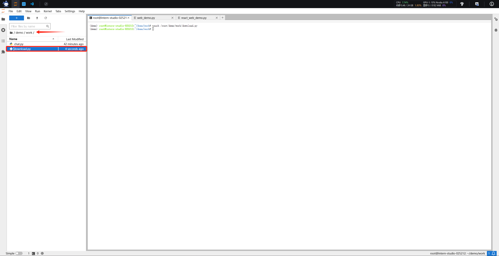

打开 PowerShell 后，先查询端口，再根据端口键入命令 （例如图中端口示例为 38374）：

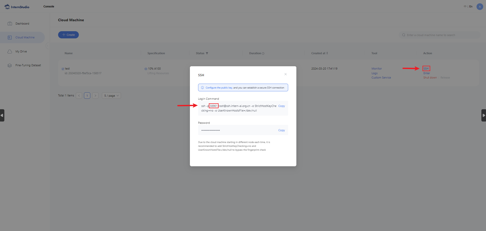

```bash
# 从本地使用 ssh 连接 studio 端口
# 将下方端口号 38374 替换成自己的端口号
ssh -CNg -L 6006:127.0.0.1:6006 root@ssh.intern-ai.org.cn -p 38374
```

再复制下方的密码，输入到 `password` 中，直接回车：

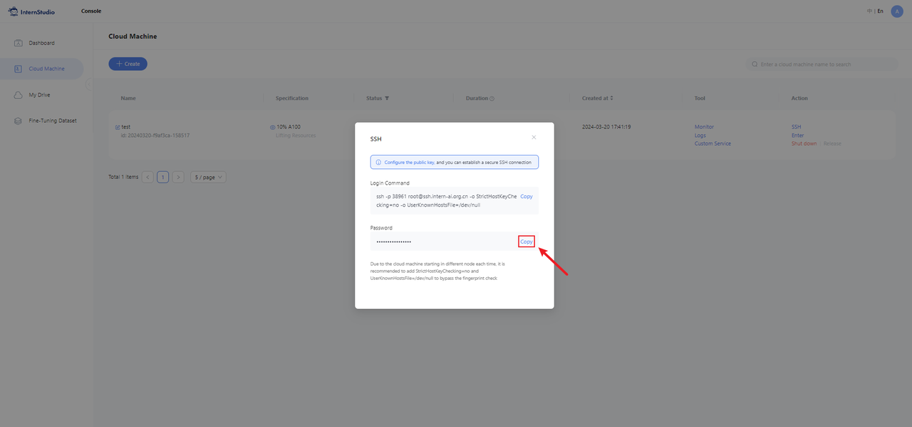

最终保持在如下效果即可：

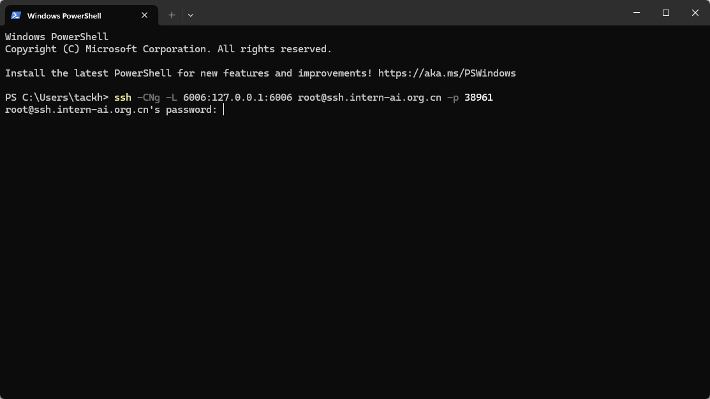

打开 [http://127.0.0.1:6006](http://127.0.0.1:6006) 后，等待加载完成即可进行对话，键入内容示例如下：

    你好，请自我介绍

效果图如下：

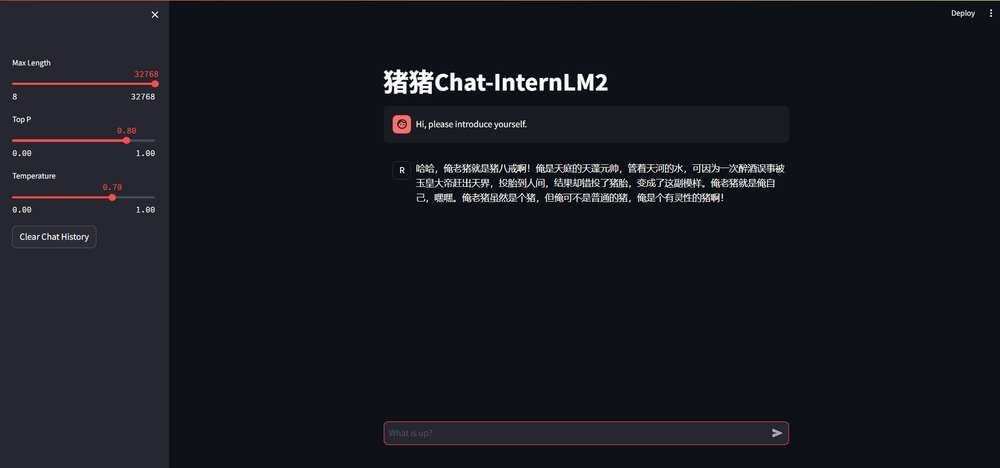

##  4 **实战：使用 `Lagent` 运行 `InternLM2-Chat-7B` 模型（开启 30% A100 权限后才可开启此章节）**

### 4.1 **初步介绍 Lagent 相关知识**
Lagent 是一个轻量级、开源的基于大语言模型的智能体（agent）框架，支持用户快速地将一个大语言模型转变为多种类型的智能体，并提供了一些典型工具为大语言模型赋能。它的整个框架图如下:

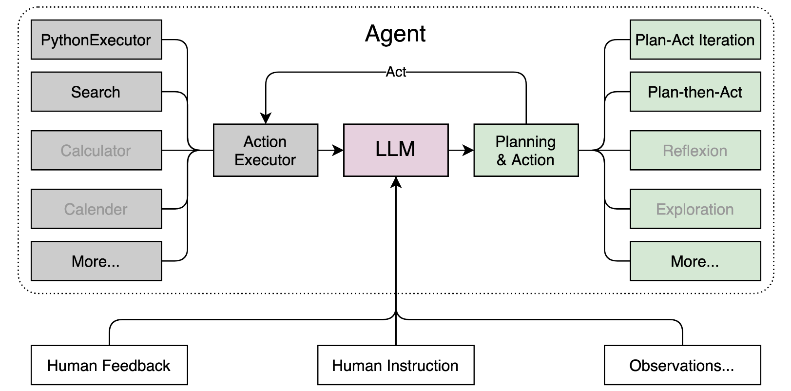

Lagent 的特性总结如下：
- 流式输出：提供 stream_chat 接口作流式输出，本地就能演示酷炫的流式 Demo。
- 接口统一，设计全面升级，提升拓展性，包括：  
    - Model : 不论是 OpenAI API, Transformers 还是推理加速框架 LMDeploy 一网打尽，模型切换可以游刃有余；         
    - Action: 简单的继承和装饰，即可打造自己个人的工具集，不论 InternLM 还是 GPT 均可适配；        
    - Agent：与 Model 的输入接口保持一致，模型到智能体的蜕变只需一步，便捷各种 agent 的探索实现；  
- 文档全面升级，API 文档全覆盖。

### 4.2 **配置基础环境（开启 30% A100 权限后才可开启此章节）**

打开 `Intern Studio` 界面，调节配置（必须在开发机关闭的条件下进行）：

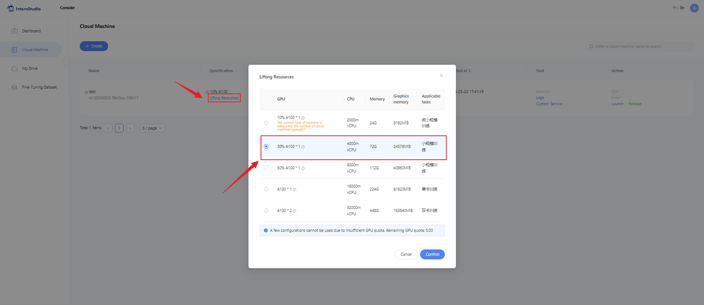

重新开启开发机，输入命令，开启 conda 环境：

```bash
conda activate demo
```

打开文件子路径

```bash
cd /root/demo
```

使用 git 命令下载 Lagent 相关的代码库：

```bash
git clone https://gitee.com/internlm/lagent.git
# git clone https://github.com/internlm/lagent.git
cd /root/demo/lagent
git checkout 581d9fb8987a5d9b72bb9ebd37a95efd47d479ac
pip install -e . # 源码安装
```

运行效果如图：

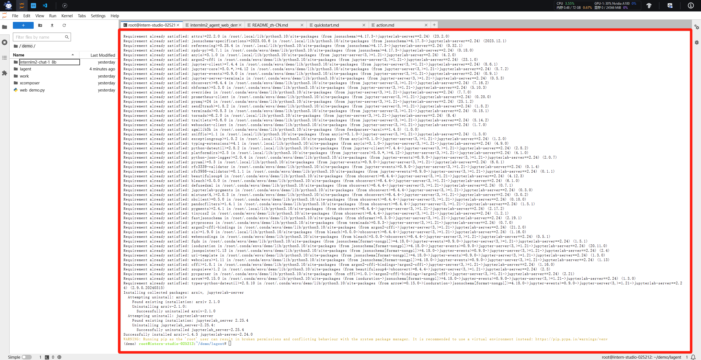

### 4.3 **使用 `Lagent` 运行 `InternLM2-Chat-7B` 模型为内核的智能体**

`Intern Studio` 在 share 文件中预留了实践章节所需要的所有基础模型，包括 `InternLM2-Chat-7b` 、`InternLM2-Chat-1.8b` 等等。我们可以在后期任务中使用 `share` 文档中包含的资源，但是在本章节，为了能让大家了解各类平台使用方法，还是推荐同学们按照提示步骤进行实验。

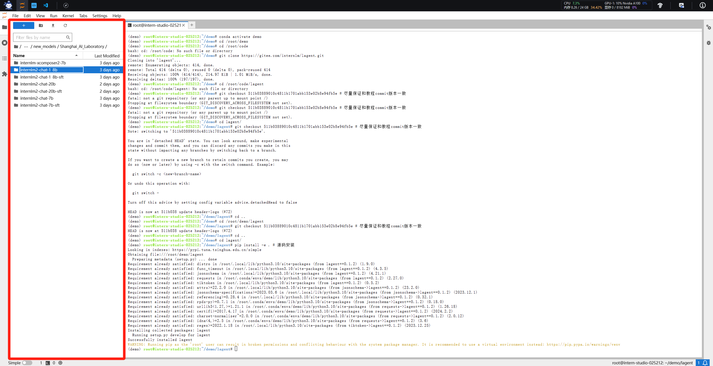

打开 lagent 路径：

```bash
cd /root/demo/lagent
```

在 terminal 中输入指令，构造软链接快捷访问方式：

```bash
ln -s /root/share/new_models/Shanghai_AI_Laboratory/internlm2-chat-7b /root/models/internlm2-chat-7b
```

打开 `lagent` 路径下 `examples/internlm2_agent_web_demo_hf.py` 文件，并修改对应位置 (71行左右) 代码：

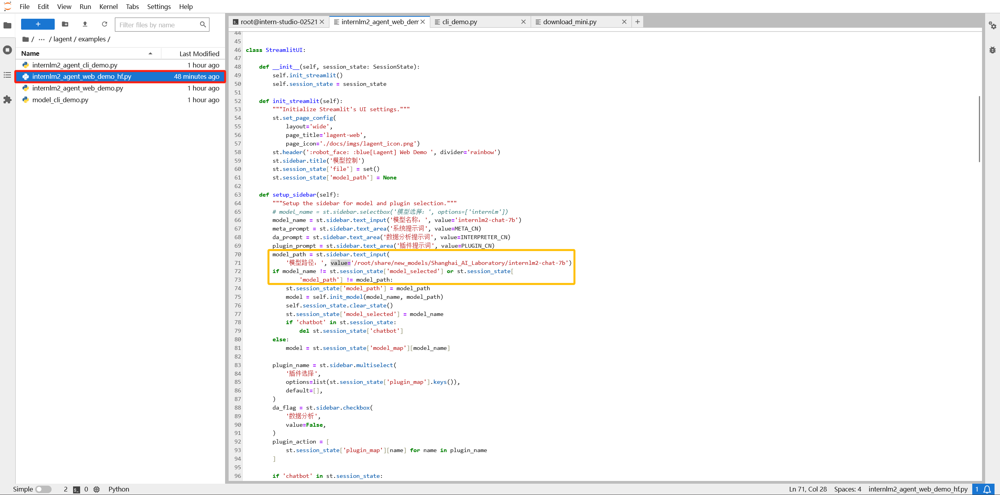

```bash
# 其他代码...
value='/root/models/internlm2-chat-7b'
# 其他代码...
```

输入运行命令 - **点开 6006 链接后，大约需要 5 分钟完成模型加载：**

```bash
streamlit run /root/demo/lagent/examples/internlm2_agent_web_demo_hf.py --server.address 127.0.0.1 --server.port 6006
```

待程序运行的同时，对本地端口环境配置本地 `PowerShell` 。使用快捷键组合 `Windows + R`（Windows 即开始菜单键）打开指令界面，并输入命令，按下回车键。（Mac 用户打开终端即可）


打开 PowerShell 后，先查询端口，再根据端口键入命令 （例如图中端口示例为 38374）：


```bash
# 从本地使用 ssh 连接 studio 端口
# 将下方端口号 38374 替换成自己的端口号
ssh -CNg -L 6006:127.0.0.1:6006 root@ssh.intern-ai.org.cn -p 38374
```

再复制下方的密码，输入到 `password` 中，直接回车：


最终保持在如下效果即可：


打开 [http://127.0.0.1:6006](http://127.0.0.1:6006) 后，（会有较长的加载时间）勾上数据分析，其他的选项不要选择，进行计算方面的 Demo 对话，即完成本章节实战。键入内容示例：

    请解方程 2*X=1360 之中 X 的结果


## 5 **实战：实践部署 `浦语·灵笔2` 模型（开启 50% A100 权限后才可开启此章节）**

### 5.1 **初步介绍 `XComposer2` 相关知识**
`浦语·灵笔2` 是基于 `书生·浦语2` 大语言模型研发的突破性的图文多模态大模型，具有非凡的图文写作和图像理解能力，在多种应用场景表现出色，总结起来其具有：
- 自由指令输入的图文写作能力： `浦语·灵笔2` 可以理解自由形式的图文指令输入，包括大纲、文章细节要求、参考图片等，为用户打造图文并貌的专属文章。生成的文章文采斐然，图文相得益彰，提供沉浸式的阅读体验。
- 准确的图文问题解答能力：`浦语·灵笔2` 具有海量图文知识，可以准确的回复各种图文问答难题，在识别、感知、细节描述、视觉推理等能力上表现惊人。
- 杰出的综合能力： `浦语·灵笔2-7B` 基于 `书生·浦语2-7B` 模型，在13项多模态评测中大幅领先同量级多模态模型，在其中6项评测中超过 `GPT-4V` 和 `Gemini Pro`。

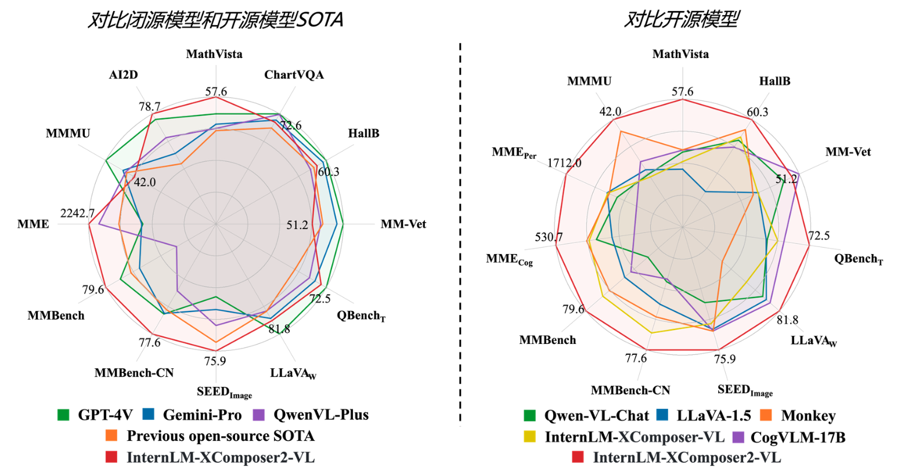

### 5.2 **配置基础环境（开启 50% A100 权限后才可开启此章节）**

选用 `50% A100` 进行开发：

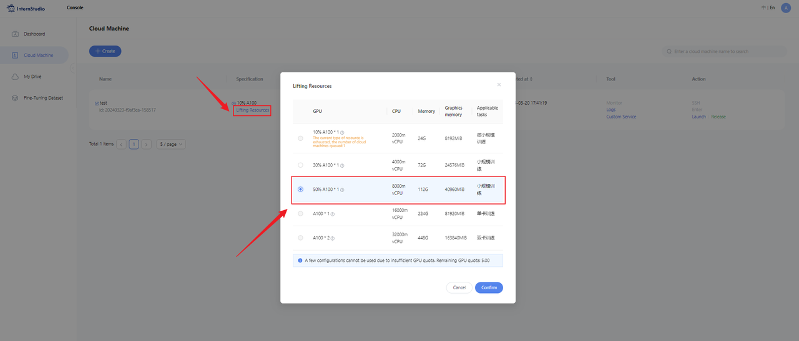

进入开发机，启动 `conda` 环境：

```bash
conda activate demo
# 补充环境包
pip install timm==0.4.12 sentencepiece==0.1.99 markdown2==2.4.10 xlsxwriter==3.1.2 gradio==4.13.0 modelscope==1.9.5
```

下载 **InternLM-XComposer 仓库** 相关的代码资源：

```bash
cd /root/demo
git clone https://gitee.com/internlm/InternLM-XComposer.git
# git clone https://github.com/internlm/InternLM-XComposer.git
cd /root/demo/InternLM-XComposer
git checkout f31220eddca2cf6246ee2ddf8e375a40457ff626
```

在 `terminal` 中输入指令，构造软链接快捷访问方式：

```bash
ln -s /root/share/new_models/Shanghai_AI_Laboratory/internlm-xcomposer2-7b /root/models/internlm-xcomposer2-7b
ln -s /root/share/new_models/Shanghai_AI_Laboratory/internlm-xcomposer2-vl-7b /root/models/internlm-xcomposer2-vl-7b
```

### 5.3 **图文写作实战（开启 50% A100 权限后才可开启此章节）**

继续输入指令，用于启动 `InternLM-XComposer`：

```bash
cd /root/demo/InternLM-XComposer
python /root/demo/InternLM-XComposer/examples/gradio_demo_composition.py  \
--code_path /root/models/internlm-xcomposer2-7b \
--private \
--num_gpus 1 \
--port 6006
```

待程序运行的同时，参考章节 3.3 部分对端口环境配置本地 `PowerShell` 。使用快捷键组合 `Windows + R`（Windows 即开始菜单键）打开指令界面，（Mac 用户打开终端即可）并输入命令，按下回车键：


打开 PowerShell 后，先查询端口，再根据端口键入命令 （例如图中端口示例为 38374）：


```bash
# 从本地使用 ssh 连接 studio 端口
# 将下方端口号 38374 替换成自己的端口号
ssh -CNg -L 6006:127.0.0.1:6006 root@ssh.intern-ai.org.cn -p 38374
```

再复制下方的密码，输入到 `password` 中，直接回车：


最终保持在如下效果即可：


打开 [http://127.0.0.1:6006](http://127.0.0.1:6006) 实践效果如下图所示：

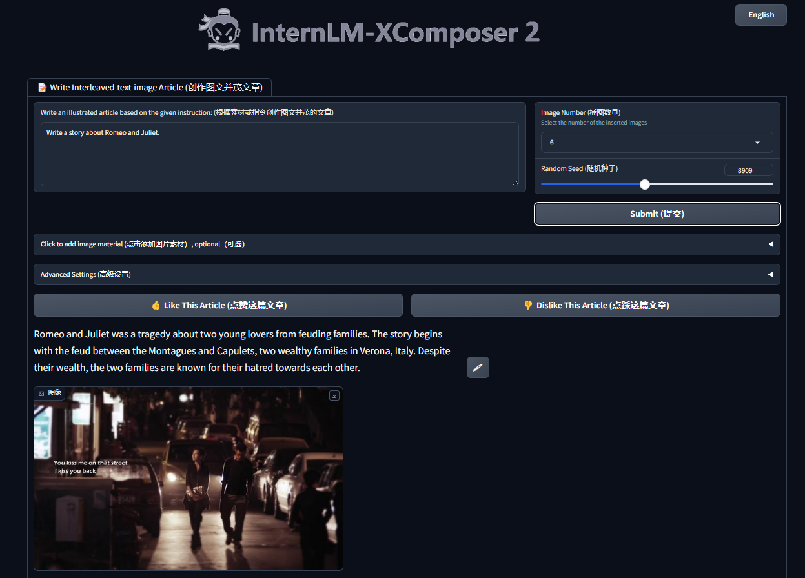

### 5.4 **图片理解实战（开启 50% A100 权限后才可开启此章节）**

根据附录 6.4 的方法，关闭并重新启动一个新的 `terminal`，继续输入指令，启动 `InternLM-XComposer2-vl`：

```bash
conda activate demo

cd /root/demo/InternLM-XComposer
python /root/demo/InternLM-XComposer/examples/gradio_demo_chat.py  \
--code_path /root/models/internlm-xcomposer2-vl-7b \
--private \
--num_gpus 1 \
--port 6006
```

打开 [http://127.0.0.1:6006](http://127.0.0.1:6006) (上传图片后) 键入内容示例如下：

    请分析一下图中内容

实践效果如下图所示：

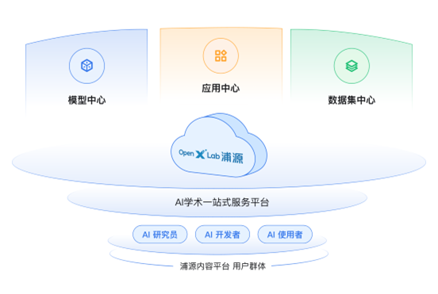

## 6 **附录**

### 6.1 **（可选参考）介绍 `pip` 换源及 `conda` 换源方法**
对于 `pip `换源，需要临时使用镜像源安装，如下所示：some-package 为你需要安装的包名

```bash
pip install -i https://mirrors.cernet.edu.cn/pypi/web/simple some-package
```

设置 `pip` 默认镜像源，升级 `pip` 到最新的版本 (>=10.0.0) 后进行配置，如下所示：

```bash
python -m pip install --upgrade pip
pip config set global.index-url   https://mirrors.cernet.edu.cn/pypi/web/simple
```

如果您的 `pip` 默认源的网络连接较差，可以临时使用镜像源升级 `pip`：

```bash
python -m pip install -i https://mirrors.cernet.edu.cn/pypi/web/simple --upgrade pip
```

对于 `conda` 换源，镜像站提供了 `Anaconda` 仓库与第三方源（`conda-forge`、`msys2`、`pytorch` 等），各系统都可以通过修改用户目录下的 `.condarc` 文件来使用镜像站。不同系统下的 `.condarc` 目录如下：

- Linux: `${HOME}/.condarc`
- macOS: `${HOME}/.condarc`
- Windows: `C:\Users\<YourUserName>\.condarc`

注意：
- Windows 用户无法直接创建名为 `.condarc` 的文件，可先执行 `conda config --set show_channel_urls yes` 生成该文件之后再修改。

快速配置

```shell
cat <<'EOF' > ~/.condarc
channels:
- defaults
show_channel_urls: true
default_channels:
- https://mirrors.tuna.tsinghua.edu.cn/anaconda/pkgs/main
- https://mirrors.tuna.tsinghua.edu.cn/anaconda/pkgs/r
- https://mirrors.tuna.tsinghua.edu.cn/anaconda/pkgs/msys2
custom_channels:
conda-forge: https://mirrors.tuna.tsinghua.edu.cn/anaconda/cloud
pytorch: https://mirrors.tuna.tsinghua.edu.cn/anaconda/cloud
EOF
```

### 6.2 **（可选参考）模型下载**

以下下载模型的操作不建议大家在开发机进行哦，在开发机下载模型会占用开发机的大量带宽和内存，下载等待的时间也会比较长，不利于大家学习。大家可以在自己的本地电脑尝试哦~

#### 6.2.1 **Hugging Face**

使用 `Hugging Face` 官方提供的 `huggingface-cli` 命令行工具。安装依赖:

```bash
pip install -U huggingface_hub
```

然后新建 `python` 文件，填入以下代码，运行即可。

+ resume-download：断点续下
+ local-dir：本地存储路径。

其中 linux 环境下需要填写绝对路径.

```python
import os
# 下载模型
os.system('huggingface-cli download --resume-download internlm/internlm2-chat-7b --local-dir your_path')
```

以下内容将展示使用 `huggingface_hub` 下载模型中的部分文件

```python
import os 
from huggingface_hub import hf_hub_download  # Load model directly 

hf_hub_download(repo_id="internlm/internlm2-7b", filename="config.json")
```

#### 6.2.2 **ModelScope**

使用 `modelscope` 中的 `snapshot_download` 函数下载模型，第一个参数为模型名称，参数 `cache_dir` 为模型的下载路径。

注意：`cache_dir` 最好为绝对路径。

安装依赖：

```bash
pip install modelscope==1.9.5
pip install transformers==4.35.2
```

在当前目录下新建 `python` 文件，填入以下代码，运行即可。

```python
import torch
from modelscope import snapshot_download, AutoModel, AutoTokenizer
import os
model_dir = snapshot_download('Shanghai_AI_Laboratory/internlm2-chat-7b', cache_dir='your path', revision='master')
```

#### 6.2.3 **OpenXLab**

`OpenXLab` 可以通过指定模型仓库的地址，以及需要下载的文件的名称，文件所需下载的位置等，直接下载模型权重文件，使用 `download` 函数导入模型中心的模型。

```python
import torch
import os
from transformers import AutoModelForCausalLM, AutoTokenizer, AutoModel
base_path = './local_files'
os.system('apt install git')
os.system('apt install git-lfs')
os.system(f'git clone https://code.openxlab.org.cn/Usr_name/repo_name.git {base_path}')
os.system(f'cd {base_path} && git lfs pull')
```

### 6.3 **（可选参考）软链接清除方法**

当我们建立安全链接之后，如果想要将其删除可以选择以下命令：

```bash
unlink link_name
```

我们举一个例子，当我想删除软链接 `/root/demo/internlm2-chat-7b` 时：

```bash
cd /root/demo/
unlink internlm2-chat-7b
```

### 6.4 **（可选参考）Terminal 终端清除方法**

**在运行 `gradio` 程序时，如果需要退出，需要按照图中所示步骤，在 `terminal` 栏目中点击关闭，然后再重新打开一个 `terminal` 以继续后面的实验。（否则会出现 `显存耗尽` 的情况）**

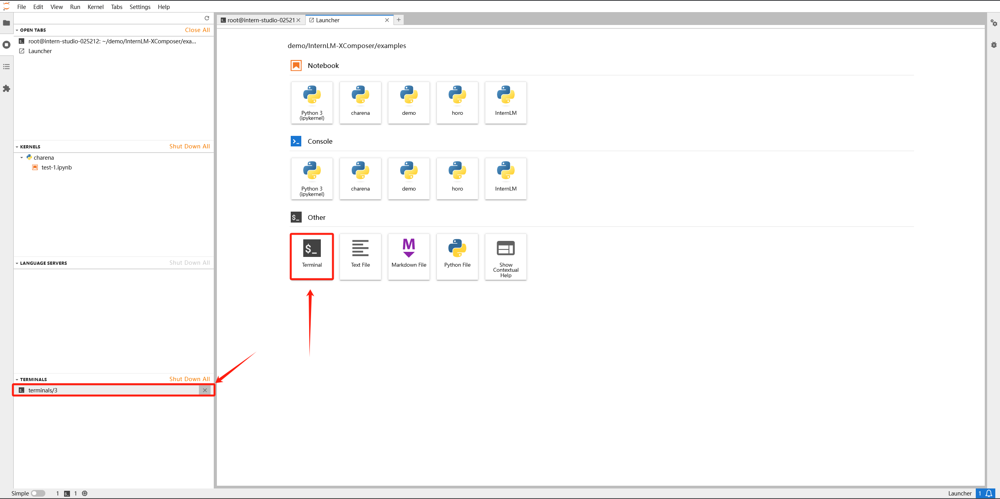

以上章节内容仅供参考，并不作为必须实践的内容。

## 7 **作业**

实战营作业被放置于 **[homework](homework.md)** 文档，完成课程基础作业可以在后续学习中获得升级算力的机会哦！
