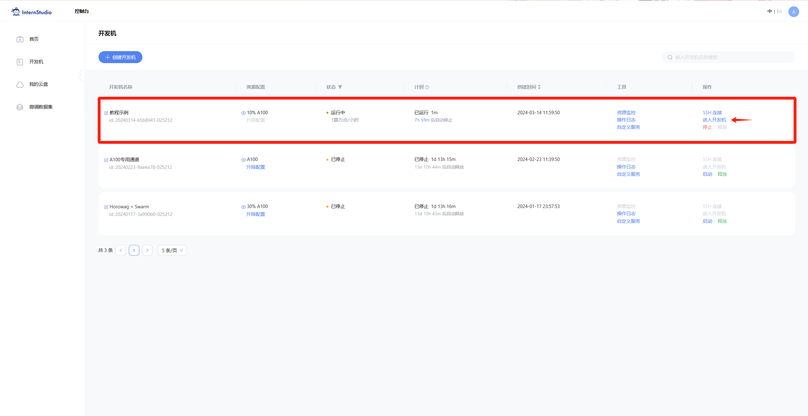
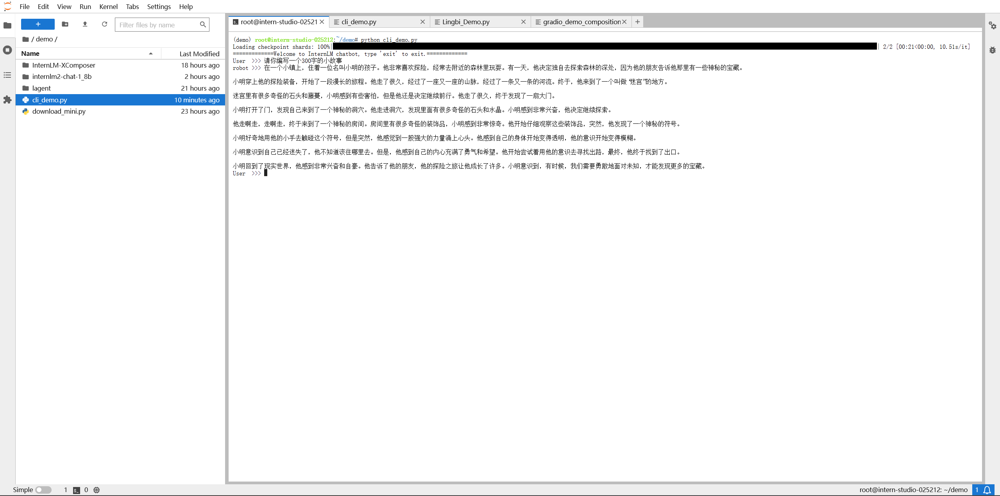

# 轻松玩转书生·浦语大模型趣味 Demo

## 目录

+ 1 **趣味 Demo 任务列表**
+ 2 **实战：通过 `Modelscope` 平台，下载 `InternLM2-Chat-1.8B` 模型进行 `Demo` 部署**
    + 2.1 **初步介绍 Huggingface 平台**
    + 2.2 **配置基础环境**
    + 2.3 **运行 `InternLM2-Chat-1.8B` 模型的 `cli_demo.py`**
+ 3 **实战：通过 `OpenXLab` 部署实战营优秀作品 `八戒-Chat-1.8B` 模型**
    + 3.1 **简单介绍 `八戒-Chat-1.8B`、`Chat-嬛嬛-1.8B`、`Mini-Horo-巧耳`**
    + 3.2 **配置基础环境**
    + 3.3 **使用 `OpenXLab` 下载运行 `八戒-Chat Demo`**
+ 4 **实战：通过 `InternLM2-Chat-7B` 运行 `Lagent` 智能体 `Demo`**
    + 4.1 **初步介绍 `Lagent` 相关知识**
    + 4.2 **配置基础环境**
    + 4.3 **使用 `Lagent` 运行 `InternLM2-Chat-7B` 模型为内核的智能体**
+ 5 **实战：实践部署 `InternLM-XComposer2-7B` 模型**
    + 5.1 **初步介绍 `XComposer` 相关知识**
    + 5.2 **配置基础环境**
    + 5.3 **实现 `浦语·灵笔2` 图文理解创作 `Demo`**
+ 6 **附录**
    + 6.1 **（可选参考）介绍 `pip` 换源及 `conda` 换源方法**

## 1 **趣味 Demo 任务列表**

本节课可以让同学们实践 4 个主要内容，分别是：

- **通过 `Modelscope` 平台，下载 `InternLM2-Chat-1.8B` 模型进行 `Demo` 部署**
- **通过 `OpenXLab` 部署实战营优秀作品 `八戒-Chat-1.8B` 模型**
- **通过 `InternLM2-Chat-7B` 运行 `Lagent` 智能体 `Demo`**
- **实践部署 `InternLM-XComposer2-7B` 模型**

实战营作业被放置于 `homework` 文档，完成课程基础作业可以在后续学习中获得升级算力的机会哦！

## 2 **实战：通过 `Modelscope` 平台，下载 `InternLM2-Chat-1.8B` 模型进行 `Demo` 部署**

### **2.1 初步介绍 Huggingface 平台**

`Modelscope` 是一个开源平台。该平台提供了一个全面的库，其中包括许多预训练的语言模型，如 BERT、RoBERTa、GPT-2 等，这些模型可以用于各种 NLP 任务，如文本分类、命名实体识别、问答系统等。

### **2.2 配置基础环境**
首先，打开 `InternLM Studio` 界面，点击 创建开发机 配置开发机系统。

填写 `开发机名称` 后，点击 选择镜像 使用 `Cuda11.7-conda` 镜像，然后在资源配置中，使用 `10% A100 * 1` 的选项，然后立即创建开发机器。

点击 `进入开发机` 选项。

进入开发机后，在 `terminal` 中输入环境配置命令：

    studio-conda -o internlm-base -t demo

配置完成后，进入到新创建的 conda 环境之中：

    conda activate demo

输入以下命令，完成环境包的安装：

    pip install huggingface-hub==0.17.3
    pip install transformers==4.34 
    pip install psutil==5.9.8
    pip install accelerate==0.24.1
    pip install streamlit==1.32.2 
    pip install matplotlib==3.8.3 
    pip install modelscope==1.9.5

### **2.3 利用 Modelscope 代码运行 InternLM2-Chat-1.8B 模型的 Cli demo**
  
按路径创建文件夹，并进入到对应文件目录中：

    mkdir -p /root/demo
    touch /root/demo/cli_demo.py
    touch /root/demo/download_mini.py
    cd /root/demo

通过左侧文件夹栏目，双击进入 `demo` 文件夹。

双击打开 download_mini.py 文件，复制以下代码：

    import os
    from modelscope.hub.snapshot_download import snapshot_download

    # 创建保存模型目录
    os.system("mkdir /root/demo/internlm2-chat-1_8b")

    # save_dir是模型保存到本地的目录
    save_dir="/root/demo/internlm2-chat-1_8b"
    snapshot_download("Shanghai_AI_Laboratory/internlm2-chat-1_8b", 
                    cache_dir=save_dir, 
                    revision='v1.1.0')

执行命令，下载模型参数文件：

    python download_mini.py

双击打开 `download_mini.py` 文件，复制以下代码（可选）：

    import os
    from modelscope.hub.snapshot_download import snapshot_download

    # 创建保存模型目录
    os.system("mkdir /root/demo/internlm2-chat-1_8b")

    # save_dir是模型保存到本地的目录
    save_dir="/root/demo/internlm2-chat-1_8b"
    snapshot_download("Shanghai_AI_Laboratory/internlm2-chat-1_8b", 
                    cache_dir=save_dir, 
                    revision='v1.1.0')

双击打开 `cli_demo.py` 文件。将 `github repo` 中的对应代码复制进去，并在 `terminal` 运行命令：

    cd /root/demo
    python cli_demo.py

等待模型加载完成，效果如下：

## 3 **实战：通过 `OpenXLab` 部署实战营优秀作品 `八戒-Chat-1.8B` 模型**

### 3.1 **简单介绍 `八戒-Chat-1.8B`、`Chat-嬛嬛-1.8B`、`Mini-Horo-巧耳`（实战营优秀作品）**
`八戒-Chat-1.8B`、`Chat-嬛嬛-1.8B`、`Mini-Horo-巧耳` 均是在第一期实战营中运用 `InternLM2-Chat-1.8B` 模型进行微调训练的优秀成果。其中，`八戒-Chat-1.8B` 是利用《西游记》剧本中所有关于猪八戒的台词和语句以及 LLM API 生成的相关数据结果，进行全量微调得到的猪八戒聊天模型。作为 `Roleplay-with-XiYou` 子项目之一，`八戒-Chat-1.8B` 能够以较低的训练成本达到不错的角色模仿能力，同时低部署条件能够为后续工作降低算力门槛。

结合实战章节 2 的经验，我们采用 `OpenXLab` 平台完成 `八戒-Chat-1.8B` 的部署。`OpenXLab` 平台是面向 AI 研究员和开发者提供 AI 领域的一站式服务平台，包含数据集中心、模型中心和应用中心。具体细节和各种炫酷的应用方法会在实战营后续章节详细说明。

当然，同学们也可以参考其他优秀的实战营项目，具体模型链接如下：

+ **八戒-Chat-1.8B：https://openxlab.org.cn/models/detail/JimmyMa99/BaJie-Chat-1.8b**
+ **Chat-嬛嬛-1.8B：https://openxlab.org.cn/models/detail/BYCJS/huanhuan-chat-internlm2-1_8b**
+ **Mini-Horo-巧耳：https://openxlab.org.cn/models/detail/SaaRaaS/Horowag_Mini**

🍏那么，开始实验！！！

### 3.2 **配置基础环境**

创建用于演示的文件，输入以下指令：

    mkdir -p /root/demo/work
    touch /root/demo/work/bajie_download.py
    touch /root/demo/work/bajie_chat.py
    cd /root/demo/work

运行环境补充命令：

    conda activate demo

### 3.3 **使用 `OpenXLab` 下载运行 Chat-八戒 Demo**

在 `Web IDE` 中打开 `download.py`：

复制以下代码：

    import torch
    import os
    from transformers import AutoModelForCausalLM, AutoTokenizer, AutoModel
    base_path = './BaJie-Chat-1_8b'
    os.system('apt install git')
    os.system('apt install git-lfs')
    os.system(f'git clone https://code.openxlab.org.cn/JimmyMa99/BaJie-Chat-1.8b.git {base_path}')
    os.system(f'cd {base_path} && git lfs pull')

    model_path = '/root/demo/work/BaJie-Chat-1_8b'
    tokenizer = AutoTokenizer.from_pretrained(model_path,trust_remote_code=True)
    model = AutoModelForCausalLM.from_pretrained(model_path,trust_remote_code=True, torch_dtype=torch.float16).cuda()

运行该 python 文件，输入以下指令：

    python bajie_download.py

打开 `bajie_chat.py` 文件后，将 github 仓库中对应的代码复制进去，输入运行命令：

    streamlit run /root/demo/work/bajie_chat.py --server.address 127.0.0.1 --server.port 6006

待程序运行的同时，对本地端口环境配置本地 `PowerShell` 。使用快捷键组合 `Windows + R`（ Windows 即开始菜单键 ）打开指令界面，并输入命令 `powershell` 按下回车键。

打开 PowerShell 后，先查询端口，再根据端口键入命令 （例如图中端口示例为 38374）：

    ssh -CNg -L 6006:127.0.0.1:6006 root@ssh.intern-ai.org.cn -p 38374

再复制下方的密码，输入到 `password` 中，直接回车：

最终保持在如下效果即可：

打开网页后，等待加载完成即可进行对话，至此，本章实战环节结束，效果图如下：

##  4. **实战：使用 `Lagent` 运行 `InternLM2-Chat-7B` 模型（开启 30% A100 权限后才可开启此章节）**

### 4.1 **初步介绍 Lagent 相关知识**
Lagent 是一个轻量级、开源的基于大语言模型的智能体（agent）框架，支持用户快速地将一个大语言模型转变为多种类型的智能体，并提供了一些典型工具为大语言模型赋能。它的整个框架图如下:

Lagent 的特性总结如下：
- 流式输出：提供 stream_chat 接口作流式输出，本地就能演示酷炫的流式 Demo。
- 接口统一，设计全面升级，提升拓展性，包括：  
    - Model : 不论是 OpenAI API, Transformers 还是推理加速框架 LMDeploy 一网打尽，模型切换可以游刃有余；         
    - Action: 简单的继承和装饰，即可打造自己个人的工具集，不论 InternLM 还是 GPT 均可适配；        
    - Agent：与 Model 的输入接口保持一致，模型到智能体的蜕变只需一步，便捷各种 agent 的探索实现；  
- 文档全面升级，API 文档全覆盖。

### 4.2 **配置基础环境（开启 30% A100 权限后才可开启此章节）**

打开 `InternLM Studio` 界面，调节配置（必须在开发机关闭的条件下进行）：

重新开启开发机，输入命令，开启 conda 环境：

    conda activate demo

打开文件子路径

    cd /root/demo

使用 git 命令下载 Lagent 相关的代码库：

    git clone https://gitee.com/internlm/lagent.git
    git clone https://github.com/internlm/lagent.git
    cd /root/demo/lagent
    pip install -e . # 源码安装

运行效果如图：

### 4.3 **使用 `Lagent` 运行 `InternLM2-Chat-7B` 模型为内核的智能体**

`InternLM Studio` 在 share 文件中预留了实践章节所需要的所有基础模型，包括 `InternLM2-Chat-7b` 、`InternLM2-Chat-1.8b` 等等。我们可以在后期任务中使用 `share` 文档中包含的资源，但是在本章节，为了能让大家了解各类平台使用方法，还是推荐同学们按照提示步骤进行实验。

打开 lagent 路径：

    cd /root/demo/lagent

在 terminal 中输入指令：

    ln -s /root/share/new_models/Shanghai_AI_Laboratory/internlm2-chat-7b /root/demo/internlm2-chat-7b

打开 `lagent` 路径下 `examples/internlm2_agent_web_demo_hf.py` 文件，并修改对应位置 (71行左右) 代码：

    ...
    value='/root/demo/internlm2-chat-7b'
    ...

输入运行命令：

    streamlit run /root/demo/lagent/examples/internlm2_agent_web_demo_hf.py --server.address 127.0.0.1 --server.port 6006

待程序运行的同时，对本地端口环境配置本地 `PowerShell` 。使用快捷键组合 `Windows + R`（ Windows 即开始菜单键 ）打开指令界面，并输入命令 `powershell` 按下回车键。

打开 PowerShell 后，先查询端口，再根据端口键入命令 （例如图中端口示例为 38374）：

    ssh -CNg -L 6006:127.0.0.1:6006 root@ssh.intern-ai.org.cn -p 38374

再复制下方的密码，输入到 `password` 中，直接回车：

最终保持在如下效果即可：

打开网页后，等待加载完成即可进行对话，至此，本章实战环节结束，效果图如下：

（会有较长的加载时间）勾上数据分析，其他的选项不要选择，进行计算方面的 Demo 对话，即完成本章节实战：

