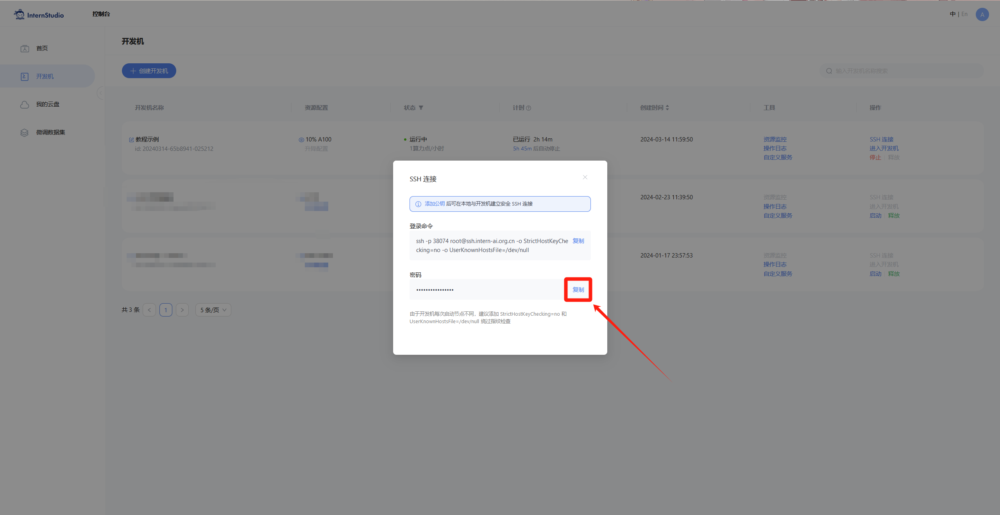
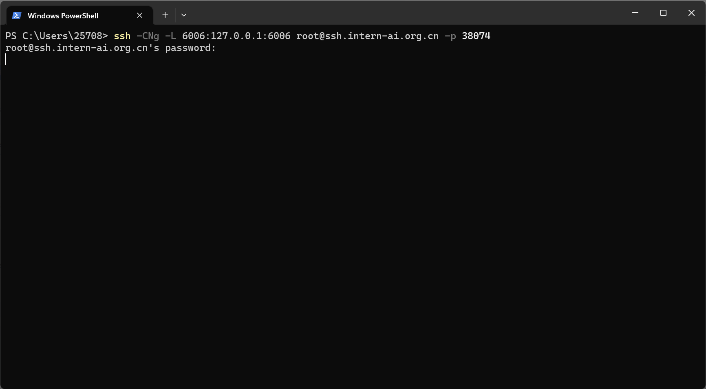
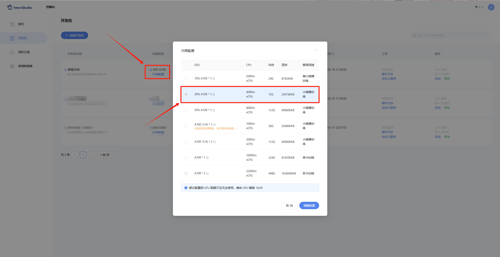

<div align="center">


</div>

# Dive into the InternLM Fun Demo

## 1 **List of Fun Demo Tasks**

This lesson allows you to practice 4 main contents, which are:

- **Deploy the `InternLM2-Chat-1.8B` model for intelligent conversation**
- **Deploy First Session InternLM Camp Outstanding Project `八戒-Chat-1.8B` Model**
- **Run a `Demo` of Agent using `Lagent` with the `InternLM2-Chat-7B` Model**
- **Deploy the `InternLM-XComposer2` Model**

## 2 **Deploy the `InternLM2-Chat-1.8B` model for intelligent conversation**

### **2.1 Configure Basic Environment**
First, Open `Intern Studio` interface, and click on the Create Button to configure the cloud machine.


After filling in the `Name`, Click on "Chose image" and select `Cuda11.7-conda` image. In the specification section, choose the option of `10% A100 * 1`, and click the Create button to create a cloud machine.


Click the `Enter` Button.


**After entering the cloud machine, input the following command in `terminal` to configure the environment (The process of configuring the environment may take some time, please be patient):**

```bash
studio-conda -o internlm-base -t demo
# The above command has the same effect as the three command below:
# conda create -n demo python==3.10 -y
# conda activate demo
# conda install pytorch==2.0.1 torchvision==0.15.2 torchaudio==2.0.2 pytorch-cuda=11.7 -c pytorch -c nvidia
```


After the configuration is complete, enter the newly created `conda` environment:

```bash
conda activate demo
```

Execute the following commands to complete the installation of environment packages:

```bash
pip install huggingface-hub==0.17.3
pip install transformers==4.34 
pip install psutil==5.9.8
pip install accelerate==0.24.1
pip install streamlit==1.32.2 
pip install matplotlib==3.8.3 
pip install modelscope==1.9.5
pip install sentencepiece==0.1.99
```

### **2.2 Download the `InternLM2-Chat-1.8B` Model**
  
Create a folder along the path, and navigate to the corresponding directory:

```bash
mkdir -p /root/demo
touch /root/demo/cli_demo.py
touch /root/demo/download_mini.py
cd /root/demo
```

Navigate to the `demo` folder by double-clicking on it in the left-hand folder panel.


Double click to open the `/root/demo/download_mini.py` file and paste the following code：

```python
import os
from modelscope.hub.snapshot_download import snapshot_download

# Create a directory to store the model
os.system("mkdir /root/models")

# save_dir is the directory where the model is saved locally
save_dir="/root/models"

snapshot_download("Shanghai_AI_Laboratory/internlm2-chat-1_8b", 
                  cache_dir=save_dir, 
                  revision='v1.1.0')

```

Execute the following command to download the model parameter file:

```bash
python /root/demo/download_mini.py
```

### **2.3 Run cli_demo**
Double click to open the `/root/demo/cli_demo.py` file and paste the following code：

```python
import torch
from transformers import AutoTokenizer, AutoModelForCausalLM


model_name_or_path = "/root/models/Shanghai_AI_Laboratory/internlm2-chat-1_8b"

tokenizer = AutoTokenizer.from_pretrained(model_name_or_path, trust_remote_code=True, device_map='cuda:0')
model = AutoModelForCausalLM.from_pretrained(model_name_or_path, trust_remote_code=True, torch_dtype=torch.bfloat16, device_map='cuda:0')
model = model.eval()

system_prompt = """You are an AI assistant whose name is InternLM (书生·浦语).
- InternLM (书生·浦语) is a conversational language model that is developed by Shanghai AI Laboratory (上海人工智能实验室). It is designed to be helpful, honest, and harmless.
- InternLM (书生·浦语) can understand and communicate fluently in the language chosen by the user such as English and 中文.
"""

messages = [(system_prompt, '')]

print("=============Welcome to InternLM chatbot, type 'exit' to exit.=============")

while True:
    input_text = input("\nUser  >>> ")
    input_text = input_text.replace(' ', '')
    if input_text == "exit":
        break

    length = 0
    for response, _ in model.stream_chat(tokenizer, input_text, messages):
        if response is not None:
            print(response[length:], flush=True, end="")
            length = len(response)

```
Run the following command to execute the Demo program:

```bash
conda activate demo
python /root/demo/cli_demo.py
```
Wait for the model to finish loading, then enter the following content example: 

    Write a short story in 300 words.

The result is as follows:


## 3 **Deploy First Session InternLM Camp Outstanding Project `BaJie-Chat-1.8B` Model**

### 3.1 **Brief Introduction to `Bajie-Chat-1.8B`、`Chat-Huanhuan-1.8B`、`Mini-Horo-QiaoEr`（Outstanding Projects of InternLM Camp）**
`Bajie-Chat-1.8B`, `Chat-Huanhuan-1.8B` and `Mini-Horo-QiaoEr` are outstanding projects from first session of InternLM Camp. These models are fine-tuned from InternLM2-Chat-1.8B and have achieved good performance. Among them, `Bajie-Chat-1.8B` is a chat model of Zhu Bajie obtained through full parameter fine-tuning, using all the actor's dialogue of Zhu Bajie from "Journey to the West" and extra dialogue generated by LLM API. As one of the sub-projects of `Roleplay-with-XiYou`, `Bajie-Chat-1.8B` is able to reproduce the persona of character at a relatively low training cost, while the model can also be deployed easily to further decrease the computational cost required for subsequent tasks.

<div align="center">


</div>

Certainly, you are also encouraged to refer to other outstanding projects in the first session of InternLM Camp. The specific model links are as follows:

+ **BaJie-Chat-1.8B：https://www.modelscope.cn/models/JimmyMa99/BaJie-Chat-mini/summary**
+ **Chat-Huanhuan-1.8B：https://openxlab.org.cn/models/detail/BYCJS/huanhuan-chat-internlm2-1_8b**
+ **Mini-Horo-QiaoEr：https://openxlab.org.cn/models/detail/SaaRaaS/Horowag_Mini**

🍏Let's start our experiment！！！

### 3.2 **Configure Basic Environment**

Execute the following command to activate the conda environment：

```bash
conda activate demo
```

Use the `git` command to obtain the Demo files in the repository：
```bash
cd /root/
git clone https://gitee.com/InternLM/Tutorial -b camp2
# git clone https://github.com/InternLM/Tutorial -b camp2
cd /root/Tutorial
```

### 3.3 **3.3 Download Model and Run Bajie-Chat Demo**

Execute `bajie_download.py` in `Web IDE` interface：

```bash
python /root/Tutorial/helloworld/bajie_download.py
```

After the model download program is completed, execute the following command:

```bash
streamlit run /root/Tutorial/helloworld/bajie_chat.py --server.address 127.0.0.1 --server.port 6006
```

While waiting for the program to run, you can try to configuring the port forwarding setting in local `PowerShell`. Use the shortcut key combination `Windows + R` (the Windows key is the Start menu key) to open the command interface, then type the command PowerShell and press Enter.(Mac users just need to simply open the terminal)


After opening PowerShell, query the port number, and then enter the command according to the port number (for example, the port example shown in the figure is 38961):


```bash
# connect to the InternStudio port from the local machine via SSH
# Replace the port number 38961 below with your own InternStudio cloud machine port number
ssh -CNg -L 6006:127.0.0.1:6006 root@ssh.intern-ai.org.cn -p 38961
```

Copy the `password` shown in the password field, paste it into PowerShell and press Enter:



The final result should be as follows:



Open the following link: [http://127.0.0.1:6006](http://127.0.0.1:6006). Once the model loading is complete, you can proceed with the conversation. Type in content example as follows:

    Hi, please introduce yourself.

The result is as follows：


##  4 **Run a `Demo` of agent using `Lagent` with the `InternLM2-Chat-7B` Model (Prerequisite: This chapter requires obtaining permission of 30% A100)**

### 4.1 **Brief Introduction to Lagent**
Lagent is an open source LLM agent framework, which enables people to efficiently turn a large language model to agent. It also provides some typical tools to enlighten the ability of LLM, and the whole framework is shown below:


The summary of Lagent's features is as follows:
- Stream Output: Provides the stream_chat interface for streaming output, allowing cool streaming demos right at your local setup.
- Interfacing is unified, with a comprehensive design upgrade for enhanced extensibility, including:  
    - Model :Whether it's the OpenAI API, Transformers, or LMDeploy inference acceleration framework, you can seamlessly switch between models;
    - Action: Simple inheritance and decoration allow you to create your own personal toolkit, adaptable to both InternLM and GPT；        
    - Agent：Consistent with the Model's input interface, the transformation from model to intelligent agent only takes one step, facilitating the exploration and implementation of various agents  
- Documentation has been thoroughly upgraded with full API documentation coverage.

### 4.2 **Configure Basic Environment (Prerequisite: This chapter requires obtaining permission of 30% A100)**

Navigate to `InternLM Studio` interface, Adjust the configuration (The process can only be carried out when the cloud machine is turned off).



Start the cloud machine again and execute the following command to activate the conda environment：

```bash
conda activate demo
```

Navigate to the specific directory

```bash
cd /root/demo
```

Use the git command to download the relevant repository for `Lagent`：

```bash
git clone https://gitee.com/internlm/lagent.git
# git clone https://github.com/internlm/lagent.git
cd /root/demo/lagent
git checkout 581d9fb8987a5d9b72bb9ebd37a95efd47d479ac
pip install -e . # install from source code
```

The result is as follows:


### 4.3 **Run a `Demo` of Agent using `Lagent` with the `InternLM2-Chat-7B` Model**

`InternLM Studio` has reserved all the basic models needed for this camp in the share folder, including `InternLM2-Chat-7b`, `InternLM2-Chat-1.8b`, and so on. We can utilize the resources contained in the share folder for subsequent tasks. However, in this chapter, to provide you with a better understanding of the usage of various platforms, it is still recommended that you follow the subsequent steps to conduct the experiments.


Navigate to the directory of lagent：

```bash
cd /root/demo/lagent
```

Execute the following command in `terminal` to create a symbolic link for quick access:

```bash
ln -s /root/share/new_models/Shanghai_AI_Laboratory/internlm2-chat-7b /root/models/internlm2-chat-7b
```

Open the `examples/internlm2_agent_web_demo_hf.py` file under the `lagent` directory and modify the code at the corresponding location (around line 71):


```bash
# Other code...
value='/root/models/internlm2-chat-7b'
# Other code...
```

Execute the following command - **After entering the 6006 link, it will take approximately 5 minutes to complete the model loading process:**

```bash
streamlit run /root/demo/lagent/examples/internlm2_agent_web_demo_hf.py --server.address 127.0.0.1 --server.port 6006
```

While waiting for the program to run, refer to chapter 3.3, you can try to configuring the port forwarding setting in local `PowerShell`. Use the shortcut key combination `Windows + R` (the Windows key is the Start menu key) to open the command interface, then type the command PowerShell and press Enter. (Mac users just need to simply open the terminal)


After opening PowerShell, query the port number, and then enter the command according to the port number (for example, the port example shown in the figure is 38961):


```bash
# connect to the InternStudio port from the local machine via SSH
# Replace the port number 38961 below with your own InternStudio cloud machine port number
ssh -CNg -L 6006:127.0.0.1:6006 root@ssh.intern-ai.org.cn -p 38961
```

Copy the `password` shown in the password field, paste it into PowerShell and press Enter:


The final result should be as follows:


After opening the following link:[http://127.0.0.1:6006](http://127.0.0.1:6006), (There will be a longer loading time) Select the "数据分析", which means for "Data Analysis", and remains others setting as default. Proceed with the demo conversation focusing on computational aspects, which will complete the hands-on practice of this chapter. Type in following content example:

    Please solve the equation 2*X=1360 to find the value of X.


## 5 **Deploy the `InternLM-XComposer2` Model (Prerequisite: This chapter requires obtaining permission of 50% A100)**

### 5.1 **Brief Introduction to `XComposer-2`**
`InternLM-XComposer2` is a groundbreaking vision-language large model (VLLM) based on `InternLM2`, excelling in free-form text-image composition and comprehension. It boasts several amazing capabilities and applications:
- Free-form Interleaved Text-Image Composition: `InternLM-XComposer2` can effortlessly generate coherent and contextual articles with interleaved images following diverse inputs like outlines, detailed text requirements and reference images, enabling highly customizable content creation.
- Accurate Vision-language Problem-solving: `InternLM-XComposer2` accurately handles diverse and challenging vision-language Q&A tasks based on free-form instructions, excelling in recognition, perception, detailed captioning, visual reasoning, and more.
- Awesome performance: `InternLM-XComposer2` based on `InternLM2-7B` not only significantly outperforms existing open-source multimodal models in 13 benchmarks but also matches or even surpasses `GPT-4V` and `Gemini Pro` in 6 benchmarks


### 5.2 **Configure Basic Environment (Prerequisite: This chapter requires obtaining permission of 50% A100)**

Select `50% A100` cloud machine：


Start the cloud machine and run the following command to activate the `conda` environment:

```bash
conda activate demo
# Install additional environment packages.
pip install timm==0.4.12 sentencepiece==0.1.99 markdown2==2.4.10 xlsxwriter==3.1.2 gradio==4.13.0 modelscope==1.9.5
```
Download the relevant repository for **InternLM-XComposer**：

```bash
cd /root/demo
git clone https://gitee.com/internlm/InternLM-XComposer.git
# git clone https://github.com/internlm/InternLM-XComposer.git
cd /root/demo/InternLM-XComposer
git checkout f31220eddca2cf6246ee2ddf8e375a40457ff626
```
Execute the following command in `terminal` to create a symbolic link for quick access:

```bash
ln -s /root/share/new_models/Shanghai_AI_Laboratory/internlm-xcomposer2-7b /root/models/internlm-xcomposer2-7b
ln -s /root/share/new_models/Shanghai_AI_Laboratory/internlm-xcomposer2-vl-7b /root/models/internlm-xcomposer2-vl-7b
```

### 5.3 **Image-Text Generating Practical (Prerequisite: This chapter requires obtaining permission of 50% A100)**

Execute the following command to run the `InternLM-XComposer`:

```bash
cd /root/demo/InternLM-XComposer
python /root/demo/InternLM-XComposer/examples/gradio_demo_composition.py  \
--code_path /root/models/internlm-xcomposer2-7b \
--private \
--num_gpus 1 \
--port 6006
```

While waiting for the program to run, refer to chapter 3.3, you can try to configuring the port forwarding setting in local `PowerShell`. Use the shortcut key combination `Windows + R` (the Windows key is the Start menu key) to open the command interface, then type the command PowerShell and press Enter. (Mac users just need to simply open the terminal)


After opening PowerShell, query the port number, and then enter the command according to the port number (for example, the port example shown in the figure is 38961):


```bash
# connect to the InternStudio port from the local machine via SSH
# Replace the port number 38961 below with your own InternStudio 
ssh -CNg -L 6006:127.0.0.1:6006 root@ssh.intern-ai.org.cn -p 38374
```

Copy the `password` shown in the password field, paste it into PowerShell and press Enter:


The final result should be as follows:


Open the following link:[http://127.0.0.1:6006](http://127.0.0.1:6006) and the output is shown as follows:


### 5.4 **Image-Text Understanding Practical (Prerequisite: This chapter requires obtaining permission of 50% A100)**

According to the method described in Appendix 6.4, close and restart a new `terminal`, Execute the following command to run the `InternLM-XComposer2-vl`：

```bash
conda activate demo

cd /root/demo/InternLM-XComposer
python /root/demo/InternLM-XComposer/examples/gradio_demo_chat.py  \
--code_path /root/models/internlm-xcomposer2-vl-7b \
--private \
--num_gpus 1 \
--port 6006
```

Open [http://127.0.0.1:6006](http://127.0.0.1:6006), upload a photo and key in the following in the chatbox：

    Please analyze the content of the image.

The output is shown as follows：


## 6 **Appendix**

### 6.1 **(Optional Reference) Introduction to `pip` and `conda` Download Source Switching Methods**
To change the download source for `pip` and temporarily use a mirror source for installation, you can do the following: Replace "some-package" with the name of the package you want to install.

```bash
pip install -i https://mirrors.cernet.edu.cn/pypi/web/simple some-package
```

To configure the new `pip` mirror source as the default download source, upgrading the `pip` version(>=10.0.0) and configuring the settings is required as shown as follows:

```bash
python -m pip install --upgrade pip
pip config set global.index-url   https://mirrors.cernet.edu.cn/pypi/web/simple
```

If your default `pip` source has poor network connectivity, you can temporarily use a mirror source to upgrade `pip`:

```bash
python -m pip install -i https://mirrors.cernet.edu.cn/pypi/web/simple --upgrade pip
```
To change the download source for `conda`, Mirror sites provide mirror source for `Ananconda` and third-party packages (`conda-forge`, `msys2`, `pytorch`, etc.). Each system can use the mirror site by modifying the `.condarc` file in the user directory. The `.condarc` directories for different systems are shown as follows:

- Linux: `${HOME}/.condarc`
- macOS: `${HOME}/.condarc`
- Windows: `C:\Users\<YourUserName>\.condarc`

Attention：
- Windows users cannot directly create a file named .condarc. You can first execute conda config --set show_channel_urls yes to generate the file, and then make modifications to the file.

Quick Configuration

```shell
cat <<'EOF' > ~/.condarc
channels:
- defaults
show_channel_urls: true
default_channels:
- https://mirrors.tuna.tsinghua.edu.cn/anaconda/pkgs/main
- https://mirrors.tuna.tsinghua.edu.cn/anaconda/pkgs/r
- https://mirrors.tuna.tsinghua.edu.cn/anaconda/pkgs/msys2
custom_channels:
conda-forge: https://mirrors.tuna.tsinghua.edu.cn/anaconda/cloud
pytorch: https://mirrors.tuna.tsinghua.edu.cn/anaconda/cloud
EOF
```

### 6.2 **（Optional Reference）Model Downloading**

It is not recommended to perform the following model download operation on the cloud machine as it will consume significant bandwidth and memory, resulting in a longer waiting time, which may not be conducive to your learning experience. Instead, it is recommended to try it on your local computer.

#### 6.2.1 **Hugging Face**

Utilize the `huggingface-cli`, a command-line tool provided officially by `Hugging Face`, to install the dependencies.

```bash
pip install -U huggingface_hub
```

Create a new `python` file, paste the following code and execute.

+ resume-download: Resume download from the last checkpoint
+ local-dir: Local storage path.

In a Linux environment, you must specify the path as an absolute path.

```python
import os
# download model
os.system('huggingface-cli download --resume-download internlm/internlm2-chat-7b --local-dir your_path')
```

The following content will demonstrate how to use `huggingface_hub` to download part of the files in a model.

```python
import os 
from huggingface_hub import hf_hub_download  # Load model directly 

hf_hub_download(repo_id="internlm/internlm2-7b", filename="config.json")
```

#### 6.2.2 **ModelScope**

To download a model using the `snapshot_download` function in `modelscope`, the first parameter is the name of the model, and the `cache_dir` parameter specifies the download path for the model.

Note: It is recommended that `cache_dir` be an absolute path.

Install Dependencies：

```bash
pip install modelscope==1.9.5
pip install transformers==4.35.2
```

Create a new `Python` file in the current directory, paste the following code and execute it.

```python
import torch
from modelscope import snapshot_download, AutoModel, AutoTokenizer
import os
model_dir = snapshot_download('Shanghai_AI_Laboratory/internlm2-chat-7b', cache_dir='your path', revision='master')
```

#### 6.2.3 **OpenXLab**

`OpenXLab` allows direct downloading of model weight files by specifying the address of the model repository, the names of the files to be downloaded, and the desired download location. The `download` function can be utilized to import models from the model hub.

```python
import torch
import os
from transformers import AutoModelForCausalLM, AutoTokenizer, AutoModel
base_path = './local_files'
os.system('apt install git')
os.system('apt install git-lfs')
os.system(f'git clone https://code.openxlab.org.cn/Usr_name/repo_name.git {base_path}')
os.system(f'cd {base_path} && git lfs pull')
```

### 6.3 **(Optional Reference) Method to remove symbolic links**

If you want to remove an established symbolic link, you can run the following command:

```bash
unlink link_name
```

For example, the following command demonstrates how to remove the symbolic link for `/root/demo/internlm2-chat-7b`:

```bash
cd /root/demo/
unlink internlm2-chat-7b
```

### 6.4 **(Optional Reference) Method to clear Terminal**

**If you want to close a running `gradio` program, you should follow the steps shown in the figure by clicking on the "Close" button in the `Terminal` panel and then reopening a new `Terminal` to continue with subsequent experiments (Otherwise, you may encounter a situation where the "GPU is Out of Memory").**


The content of this chapter is for reference only and is not mandatory.

## 7 **Assignments**

The assignments for this pratical camp are located in the **[homework](homework.md)** document. Completing the basic course assignments can offer opportunities to upgrade computing power in subsequent learning!
