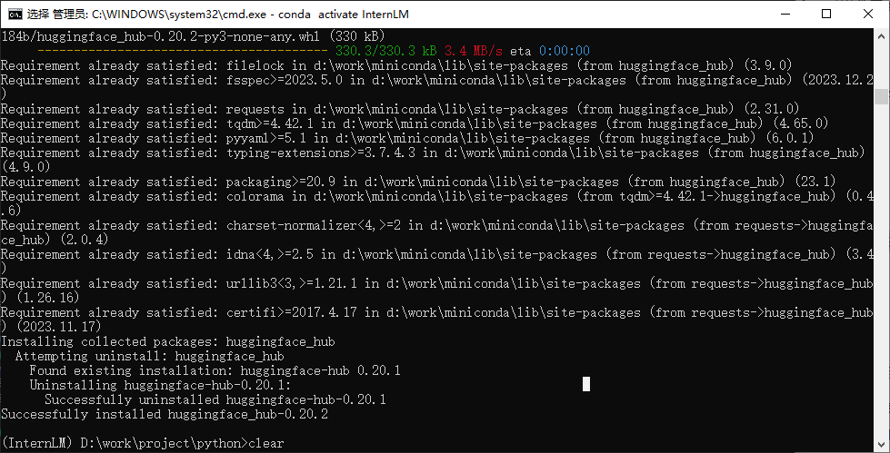

# 基础作业

复现课程知识库助手搭建过程 (截图)

**已经在开发机上搭建过一次了，这次选择在本地搭建**

## 1.环境配置



## 2.配置NLTK相关资源

把下载好的NLTK相关资源放到指定位置


## 3.构建知识库

构建知识库的时候，注意3个地方的路径，之前下载到哪里就写什么。以下是我修改后的路径

```python
# 此处写的绝对路径
tar_dir = [
    "D:\\work\\project\\python\\Large_model\\data\\InternLM",
    "D:\\work\\project\\python\\Large_model\\data\\InternLM-XComposer",
    "D:\\work\\project\\python\\Large_model\\data\\lagent",
    "D:\\work\\project\\python\\Large_model\\data\\lmdeploy",
    "D:\\work\\project\\python\\Large_model\\data\\opencompass",
    "D:\\work\\project\\python\\Large_model\\data\\xtuner"
]

embeddings = HuggingFaceEmbeddings(model_name="D:\work\project\python\Large_model\model\sentence-transformer")

persist_directory = 'D:\\work\\project\\python\\Large_model\\data_base\\vector_db\\chroma'
```

## 4.运行网页代码

注意修改以下3个位置的路径即可

```python
# 此处写的相对路径
embeddings = HuggingFaceEmbeddings(model_name="Large_model/model/sentence-transformer")


persist_directory = 'Large_model/data_base/vector_db/chroma'

llm = InternLM_LLM(model_path = "Large_model/model/Shanghai_AI_Laboratory/internlm-chat-7b")
```

## 5.运行结果

可以看到运行还是可以运行的，就是有点卡。可以看到资源基本上都吃满了。


# 进阶作业

选择一个垂直领域，收集该领域的专业资料构建专业知识库，并搭建专业问答助手，并在 OpenXLab 上成功部署（截图，并提供应用地址）

从网上收集了一些滑板术语的相关信息，构建了向量库。
目前去openXlab 搭载应用的时候遇到了问题

要求pysqlite3＞＝3.35.0，但是pysqlite3又要求python版本为3.10

镜像只能选python=3.9