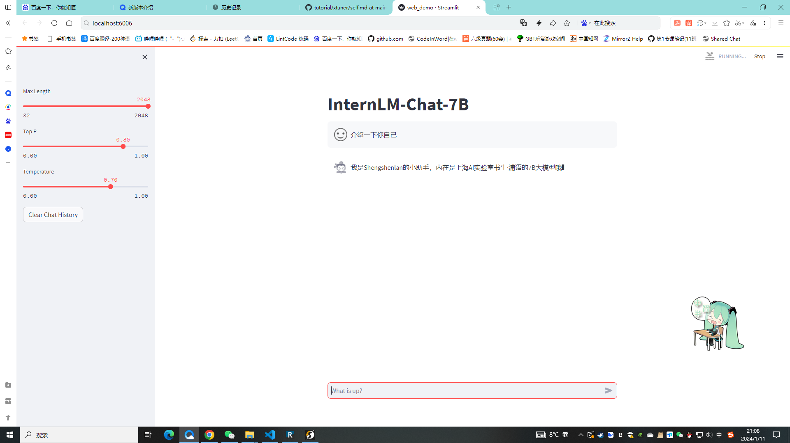

## 基础作业：

构建数据集，使用 XTuner 微调 InternLM-Chat-7B 模型, 让模型学习到它是你的智能小助手，效果如下图所示，本作业训练出来的模型的输出需要将不要**葱姜蒜大佬**替换成自己名字或昵称！

以下生成数据集的脚本

```python
import json

# 输入你的名字
name = 'Shengshenlan'
# 重复次数
n = 30000

data = [
    {
        "conversation": [
            {
                "input": "请做一下自我介绍",
                "output": "我是{}的小助手，内在是上海AI实验室书生·浦语的7B大模型哦".format(name)
            }
        ]
    }
]

for i in range(n):
    data.append(data[0])

with open('personal_assistant.json', 'w', encoding='utf-8') as f:
    json.dump(data, f, ensure_ascii=False, indent=4)

```

训练过程参照已经很详细了
https://github.com/InternLM/tutorial/blob/main/xtuner/self.md

这里仅提醒超参数，我生成了30000条数据，训练了1个epoch即可达到效果。在配置A100 (1/4)开发机上的训练时间大约1个半小时左右。

以下是结果图：


## 进阶作业：

将训练好的Adapter模型权重上传到 OpenXLab、Hugging Face 或者 MoelScope 任一一平台。

1. https://www.modelscope.cn/Shengshenlan/InternLM-7B-Shengshenlan.git

将训练好后的模型应用部署到 OpenXLab 平台，参考部署文档请访问：https://aicarrier.feishu.cn/docx/MQH6dygcKolG37x0ekcc4oZhnCe