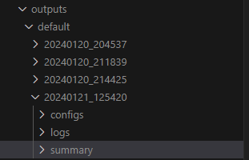
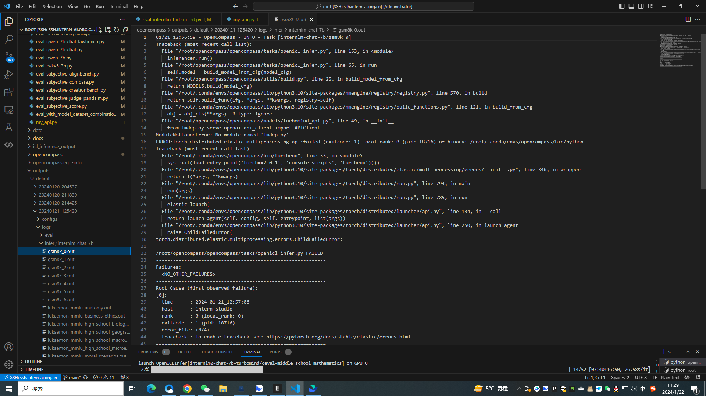

**基础作业**

- 使用 OpenCompass 评测 InternLM2-Chat-7B 模型在 C-Eval 数据集上的性能

过程参考：https://github.com/InternLM/tutorial/blob/main/opencompass/opencompass_tutorial.md
```
20240120_204537
tabulate format
^^^^^^^^^^^^^^^^^^^^^^^^^^^^^^^^^^^^^^^^^^^^^^^^^^^^^^^^^^^^^^^^^^^^^^^^^^^^^^^^^^^^^^^^^^^^^^^^^^^^^^^^^^^^^^^^^^^^^^^^^^^^^^^^
dataset                                         version    metric         mode      opencompass.models.huggingface.HuggingFace_model_repos_internlm-chat-7b
----------------------------------------------  ---------  -------------  ------  -------------------------------------------------------------------------
ceval-computer_network                          db9ce2     accuracy       gen                                                                         31.58
ceval-operating_system                          1c2571     accuracy       gen                                                                         36.84
ceval-computer_architecture                     a74dad     accuracy       gen                                                                         28.57
ceval-college_programming                       4ca32a     accuracy       gen                                                                         32.43
ceval-college_physics                           963fa8     accuracy       gen                                                                         26.32
ceval-college_chemistry                         e78857     accuracy       gen                                                                         16.67
ceval-advanced_mathematics                      ce03e2     accuracy       gen                                                                         21.05
ceval-probability_and_statistics                65e812     accuracy       gen                                                                         38.89
ceval-discrete_mathematics                      e894ae     accuracy       gen                                                                         18.75
ceval-electrical_engineer                       ae42b9     accuracy       gen                                                                         35.14
ceval-metrology_engineer                        ee34ea     accuracy       gen                                                                         50
ceval-high_school_mathematics                   1dc5bf     accuracy       gen                                                                         22.22
ceval-high_school_physics                       adf25f     accuracy       gen                                                                         31.58
ceval-high_school_chemistry                     2ed27f     accuracy       gen                                                                         15.79
ceval-high_school_biology                       8e2b9a     accuracy       gen                                                                         36.84
ceval-middle_school_mathematics                 bee8d5     accuracy       gen                                                                         26.32
ceval-middle_school_biology                     86817c     accuracy       gen                                                                         61.9
ceval-middle_school_physics                     8accf6     accuracy       gen                                                                         63.16
ceval-middle_school_chemistry                   167a15     accuracy       gen                                                                         60
ceval-veterinary_medicine                       b4e08d     accuracy       gen                                                                         47.83
ceval-college_economics                         f3f4e6     accuracy       gen                                                                         41.82
ceval-business_administration                   c1614e     accuracy       gen                                                                         33.33
ceval-marxism                                   cf874c     accuracy       gen                                                                         68.42
ceval-mao_zedong_thought                        51c7a4     accuracy       gen                                                                         70.83
ceval-education_science                         591fee     accuracy       gen                                                                         58.62
ceval-teacher_qualification                     4e4ced     accuracy       gen                                                                         70.45
ceval-high_school_politics                      5c0de2     accuracy       gen                                                                         26.32
ceval-high_school_geography                     865461     accuracy       gen                                                                         47.37
ceval-middle_school_politics                    5be3e7     accuracy       gen                                                                         52.38
ceval-middle_school_geography                   8a63be     accuracy       gen                                                                         58.33
ceval-modern_chinese_history                    fc01af     accuracy       gen                                                                         73.91
ceval-ideological_and_moral_cultivation         a2aa4a     accuracy       gen                                                                         63.16
ceval-logic                                     f5b022     accuracy       gen                                                                         31.82
ceval-law                                       a110a1     accuracy       gen                                                                         25
ceval-chinese_language_and_literature           0f8b68     accuracy       gen                                                                         30.43
ceval-art_studies                               2a1300     accuracy       gen                                                                         60.61
ceval-professional_tour_guide                   4e673e     accuracy       gen                                                                         62.07
ceval-legal_professional                        ce8787     accuracy       gen                                                                         39.13
ceval-high_school_chinese                       315705     accuracy       gen                                                                         63.16
ceval-high_school_history                       7eb30a     accuracy       gen                                                                         70
ceval-middle_school_history                     48ab4a     accuracy       gen                                                                         59.09
ceval-civil_servant                             87d061     accuracy       gen                                                                         53.19
ceval-sports_science                            70f27b     accuracy       gen                                                                         52.63
ceval-plant_protection                          8941f9     accuracy       gen                                                                         59.09
ceval-basic_medicine                            c409d6     accuracy       gen                                                                         47.37
ceval-clinical_medicine                         49e82d     accuracy       gen                                                                         40.91
ceval-urban_and_rural_planner                   95b885     accuracy       gen                                                                         45.65
ceval-accountant                                002837     accuracy       gen                                                                         26.53
ceval-fire_engineer                             bc23f5     accuracy       gen                                                                         22.58
ceval-environmental_impact_assessment_engineer  c64e2d     accuracy       gen                                                                         64.52
ceval-tax_accountant                            3a5e3c     accuracy       gen                                                                         34.69
ceval-physician                                 6e277d     accuracy       gen                                                                         40.82
ceval-stem                                      -          naive_average  gen                                                                         35.09
ceval-social-science                            -          naive_average  gen                                                                         52.79
ceval-humanities                                -          naive_average  gen                                                                         52.58
ceval-other                                     -          naive_average  gen                                                                         44.36
ceval-hard                                      -          naive_average  gen                                                                         23.91
ceval                                           -          naive_average  gen                                                                         44.16
$$$$$$$$$$$$$$$$$$$$$$$$$$$$$$$$$$$$$$$$$$$$$$$$$$$$$$$$$$$$$$$$$$$$$$$$$$$$$$$$$$$$$$$$$$$$$$$$$$$$$$$$$$$$$$$$$$$$$$$$$$$$$$$$
```


**进阶作业**

- 使用 OpenCompass 评测 InternLM2-Chat-7B 模型使用 LMDeploy 0.2.0 部署后在 C-Eval 数据集上的性能

### 1.修改config文件

mmengine生态的文件，都是通过配置文件去运行的。看下来，还是熟悉的味道。复制一份 opencompass/configs/eval_internlm_chat_turbomind_api.py
到configs文件夹下，重命名为my_api.py

```python
from mmengine.config import read_base
from opencompass.models.turbomind_api import TurboMindAPIModel
from opencompass.partitioners import NaivePartitioner
from opencompass.runners import LocalRunner
from opencompass.tasks import OpenICLEvalTask, OpenICLInferTask

with read_base():
    # choose a list of datasets
    from .datasets.ceval.ceval_gen_5f30c7 import ceval_datasets
datasets = [*ceval_datasets]
_meta_template = dict(
    round=[
        dict(role='HUMAN', begin='[UNUSED_TOKEN_146]user\n', end='[UNUSED_TOKEN_145]\n'),
        dict(role='SYSTEM', begin='[UNUSED_TOKEN_146]system\n', end='[UNUSED_TOKEN_145]\n'),
        dict(role='BOT', begin='[UNUSED_TOKEN_146]assistant\n', end='[UNUSED_TOKEN_145]\n', generate=True),
    ],
    eos_token_id=92542
)

models = [
    dict(
        type=TurboMindAPIModel,
        abbr='internlm2-chat-7b-turbomind',
        path="/share/model_repos/internlm2-chat-7b",
        api_addr='http://0.0.0.0:23333',
        max_out_len=100,
        max_seq_len=2048,
        batch_size=8,
        meta_template=_meta_template,
        run_cfg=dict(num_gpus=1, num_procs=1),
    )
]
infer = dict(
    partitioner=dict(type=NaivePartitioner),
    runner=dict(
        type=LocalRunner,
        max_num_workers=2,
        task=dict(type=OpenICLInferTask)),
)
eval = dict(
    partitioner=dict(type=NaivePartitioner),
    runner=dict(
        type=LocalRunner,
        max_num_workers=2,
        task=dict(type=OpenICLEvalTask)),
)
```

### 2. 生成TurboMind模型和运行TurboMindAPI接口

从配置文件里，可以看到，我们需要一个转换后的TurboMind模型和一个运行起来的TurboMindAPI接口：

```shell
lmdeploy convert internlm2-chat-7b  /root/share/model_repos/internlm2-chat-7b/
lmdeploy serve api_server ./workspace --server-name 0.0.0.0 --server-port 23333 --max-batch-size 64 --tp 1
```

### 3.运行评测程序

```shell
python run.py configs/my_api.py -w outputs/turbomind/internlm2-chat-7b
```

### 4. 结果

```
20240122_112103
tabulate format
^^^^^^^^^^^^^^^^^^^^^^^^^^^^^^^^^^^^^^^^^^^^^^^^^^^^^^^^^^^^^^^^^^^^^^^^^^^^^^^^^^^^^^^^^^^^^^^^^^^^^^^^^^^^^^^^^^^^^^^^^^^^^^^^
dataset                                         version    metric    mode      internlm2-chat-7b-turbomind
----------------------------------------------  ---------  --------  ------  -----------------------------
ceval-computer_network                          db9ce2     accuracy  gen                             63.16
ceval-operating_system                          1c2571     accuracy  gen                             73.68
ceval-computer_architecture                     a74dad     accuracy  gen                             57.14
ceval-college_programming                       4ca32a     accuracy  gen                             59.46
ceval-college_physics                           963fa8     accuracy  gen                             52.63
ceval-college_chemistry                         e78857     accuracy  gen                             33.33
ceval-advanced_mathematics                      ce03e2     accuracy  gen                             26.32
ceval-probability_and_statistics                65e812     accuracy  gen                             38.89
ceval-discrete_mathematics                      e894ae     accuracy  gen                             31.25
ceval-electrical_engineer                       ae42b9     accuracy  gen                             37.84
ceval-metrology_engineer                        ee34ea     accuracy  gen                             66.67
ceval-high_school_mathematics                   1dc5bf     accuracy  gen                             38.89
ceval-high_school_physics                       adf25f     accuracy  gen                             42.11
ceval-high_school_chemistry                     2ed27f     accuracy  gen                             47.37
ceval-high_school_biology                       8e2b9a     accuracy  gen                             36.84
ceval-middle_school_mathematics                 bee8d5     accuracy  gen                             47.37
ceval-middle_school_biology                     86817c     accuracy  gen                             80.95
ceval-middle_school_physics                     8accf6     accuracy  gen                             68.42
ceval-middle_school_chemistry                   167a15     accuracy  gen                             95
ceval-veterinary_medicine                       b4e08d     accuracy  gen                             43.48
ceval-college_economics                         f3f4e6     accuracy  gen                             49.09
ceval-business_administration                   c1614e     accuracy  gen                             60.61
ceval-marxism                                   cf874c     accuracy  gen                             84.21
ceval-mao_zedong_thought                        51c7a4     accuracy  gen                             70.83
ceval-education_science                         591fee     accuracy  gen                             72.41
ceval-teacher_qualification                     4e4ced     accuracy  gen                             79.55
ceval-high_school_politics                      5c0de2     accuracy  gen                             89.47
ceval-high_school_geography                     865461     accuracy  gen                             63.16
ceval-middle_school_politics                    5be3e7     accuracy  gen                             76.19
ceval-middle_school_geography                   8a63be     accuracy  gen                             75
ceval-modern_chinese_history                    fc01af     accuracy  gen                             69.57
ceval-ideological_and_moral_cultivation         a2aa4a     accuracy  gen                             84.21
ceval-logic                                     f5b022     accuracy  gen                             54.55
ceval-law                                       a110a1     accuracy  gen                             50
ceval-chinese_language_and_literature           0f8b68     accuracy  gen                             56.52
ceval-art_studies                               2a1300     accuracy  gen                             66.67
ceval-professional_tour_guide                   4e673e     accuracy  gen                             82.76
ceval-legal_professional                        ce8787     accuracy  gen                             52.17
ceval-high_school_chinese                       315705     accuracy  gen                             73.68
ceval-high_school_history                       7eb30a     accuracy  gen                             75
ceval-middle_school_history                     48ab4a     accuracy  gen                             86.36
ceval-civil_servant                             87d061     accuracy  gen                             63.83
ceval-sports_science                            70f27b     accuracy  gen                             78.95
ceval-plant_protection                          8941f9     accuracy  gen                             77.27
ceval-basic_medicine                            c409d6     accuracy  gen                             63.16
ceval-clinical_medicine                         49e82d     accuracy  gen                             59.09
ceval-urban_and_rural_planner                   95b885     accuracy  gen                             67.39
ceval-accountant                                002837     accuracy  gen                             48.98
ceval-fire_engineer                             bc23f5     accuracy  gen                             54.84
ceval-environmental_impact_assessment_engineer  c64e2d     accuracy  gen                             58.06
ceval-tax_accountant                            3a5e3c     accuracy  gen                             44.9
ceval-physician                                 6e277d     accuracy  gen                             57.14
$$$$$$$$$$$$$$$$$$$$$$$$$$$$$$$$$$$$$$$$$$$$$$$$$$$$$$$$$$$$$$$$$$$$$$$$$$$$$$$$$$$$$$$$$$$$$$$$$$$$$$$$$$$$$$$$$$$$$$$$$$$$$$$$
```

### 5.踩坑记录

错误表现，测评结果为空。

```
20240121_125420
tabulate format
^^^^^^^^^^^^^^^^^^^^^^^^^^^^^^^^^^^^^^^^^^^^^^^^^^^^^^^^^^^^^^^^^^^^^^^^^^^^^^^^^^^^^^^^^^^^^^^^^^^^^^^^^^^^^^^^^^^^^^^^^^^^^^^^
dataset                                 version    metric    mode    internlm-chat-7b
--------------------------------------  ---------  --------  ------  ------------------
--------- 考试 Exam ---------           -          -         -       -
ceval                                   -          -         -       -
agieval                                 -          -         -       -
mmlu                                    -          -         -       -
GaokaoBench                             -          -         -       -
ARC-c                                   -          -         -       -
--------- 语言 Language ---------       -          -         -       -
WiC                                     -          -         -       -
summedits                               -          -         -       -
chid-dev                                -          -         -       -
afqmc-dev                               -          -         -       -
bustm-dev                               -          -         -       -
cluewsc-dev                             -          -         -       -
WSC                                     -          -         -       -
winogrande                              -          -         -       -
flores_100                              -          -         -       -
--------- 知识 Knowledge ---------      -          -         -       -
BoolQ                                   -          -         -       -
commonsense_qa                          -          -         -       -
nq                                      -          -         -       -
triviaqa                                -          -         -       -
--------- 推理 Reasoning ---------      -          -         -       -
cmnli                                   -          -         -       -
ocnli                                   -          -         -       -
ocnli_fc-dev                            -          -         -       -
AX_b                                    -          -         -       -
AX_g                                    -          -         -       -
CB                                      -          -         -       -
RTE                                     -          -         -       -
story_cloze                             -          -         -       -
COPA                                    -          -         -       -
ReCoRD                                  -          -         -       -
hellaswag                               -          -         -       -
piqa                                    -          -         -       -
siqa                                    -          -         -       -
strategyqa                              -          -         -       -
math                                    -          -         -       -
gsm8k                                   -          -         -       -
TheoremQA                               -          -         -       -
openai_humaneval                        -          -         -       -
mbpp                                    -          -         -       -
bbh                                     -          -         -       -
--------- 理解 Understanding ---------  -          -         -       -
C3                                      -          -         -       -
CMRC_dev                                -          -         -       -
DRCD_dev                                -          -         -       -
MultiRC                                 -          -         -       -
race-middle                             -          -         -       -
race-high                               -          -         -       -
openbookqa_fact                         -          -         -       -
csl_dev                                 -          -         -       -
lcsts                                   -          -         -       -
Xsum                                    -          -         -       -
eprstmt-dev                             -          -         -       -
lambada                                 -          -         -       -
tnews-dev                               -          -         -       -
$$$$$$$$$$$$$$$$$$$$$$$$$$$$$$$$$$$$$$$$$$$$$$$$$$$$$$$$$$$$$$$$$$$$$$$$$$$$$$$$$$$$$$$$$$$$$$$$$$$$$$$$$$$$$$$$$$$$$$$$$$$$$$$$
```

需要查看运行结果里的log文件


点开infer的第一个文件即可看到： 


原因就是：opencompass的虚拟环境，没有安装lmdeploy。安装一下就好

## 参考链接

https://schweitzergao.github.io/2024/01/18/mmtutorial-6-assignment/
