<div align="center">


</div>

- [1 环境配置](#1-环境配置)
  - [1.1 配置基础环境](#11-配置基础环境)
  - [1.2 下载基础文件](#12-下载基础文件)
  - [1.3 下载安装茴香豆（豆哥）](#13-下载安装茴香豆豆哥)
  - [1.4 端口映射（可选）](#14-端口映射可选)
- [2 使用茴香豆](#2-使用茴香豆)
  - [2.1 修改配置文件](#21-修改配置文件)
  - [2.2 收集本地数据库](#22-收集本地数据库)
  - [2.3 测试茴香豆](#23-测试茴香豆)
- [3 茴香豆进阶](#3-茴香豆进阶)
  - [3.1 加入网络搜索](#31-加入网络搜索)
  - [3.2 使用远程模型](#32-使用远程模型)
  - [3.3 利用 Gradio 搭建网页 Demo](#33-利用-gradio-搭建网页-demo)
  - [3.4 茴香豆配置文件解析](#34-茴香豆配置文件解析)
- [作业](#作业)


## 1 环境配置

### 1.1 配置基础环境

这里以在 `InternStudio` 服务器上部署**茴香豆**为例。

首先，从官方环境复制运行 InternLM 的基础环境，命名为 `InternLM2_Huixiangdou`。

```bash
studio-conda -o internlm-base -t InternLM2_Huixiangdou
```

复制完成后，在本地查看环境。

```bash
conda env list
```

结果如下所示。

```bash
# conda environments:
#
base                  *  /root/.conda
InternLM2_Huixiangdou                 /root/.conda/envs/InternLM2_Huixiangdou
```

激活环境。

```bash
conda activate InternLM2_Huixiangdou
```

注意，环境激活后，命令行左边会显示当前（也就是 `InternLM2_Huixiangdou`）的环境名称，如下图所示。

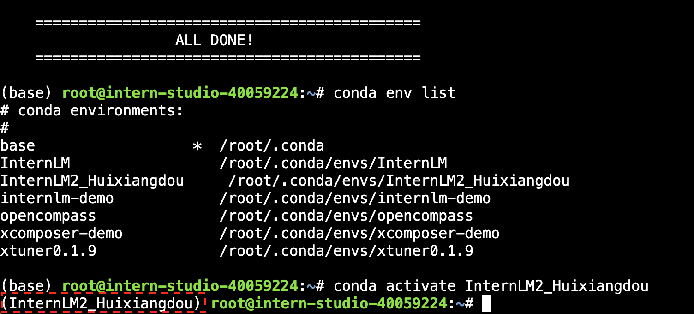

后续教程所有操作都需要在该环境下进行。

### 1.2 下载基础文件

复制茴香豆所需模型，为了减少下载和huggingface登录问题，所有作业和教程涉及的模型都已经存放在共享文件中，大家根据自己机器配置选择合适的模型复制。

```bash
# 创建模型文件夹
cd /root && mkdir models

# 复制BCE模型
ln -s /root/share/new_models/maidalun1020/bce-embedding-base_v1 /root/models/bce-embedding-base_v1
ln -s /root/share/new_models/maidalun1020/bce-reranker-base_v1 /root/models/bce-reranker-base_v1

# 复制大模型参数（下面的模型，根据作业进度和任务进行选择一个就行）
## 基础作业 (8G显存)
ln -s /root/share/new_models/Shanghai_AI_Laboratory/internlm2-chat-1_8b /root/models/internlm2-chat-1_8b

## 进阶作业(20G显存)
ln -s /root/share/new_models/Shanghai_AI_Laboratory/internlm2-chat-7b /root/models/internlm2-chat-7b

```

### 1.3 下载安装茴香豆（豆哥）

安装系统和茴香豆解析 **Word** 文件依赖。

```
## 安装系统必要组件
apt update
apt -y install python-dev python


# 安装解析 .doc .docx 必须依赖
apt -y install  libxml2-dev libxslt1-dev antiword unrtf poppler-utils pstotext tesseract-ocr flac ffmpeg lame libmad0 libsox-fmt-mp3 sox libjpeg-dev swig libpulse-dev 
```
> 注意！由于 **InternLM Studio** 限制，每次重启后上述命令都需要重新执行，重新安装。

从茴香豆官方仓库下载茴香豆。

```bash
cd /root
# 下载 repo
git clone https://github.com/internlm/huixiangdou && cd huixiangdou
git checkout 447c6f7e68a1657fce1c4f7c740ea1700bde0440

# python requirements
pip install -r requirements.txt
pip install protobuf # internlm2
```


### 1.4 端口映射（可选）

后续如果想通过gradio搭建web应用demo，请跟随下面的步骤将服务器端口映射到本地端口：
首先我们需要配置一下本地的 SSH Key ，我们这里以Windows为例。

1. 查询服务器端口和密码（图中端口示例为 38374）：

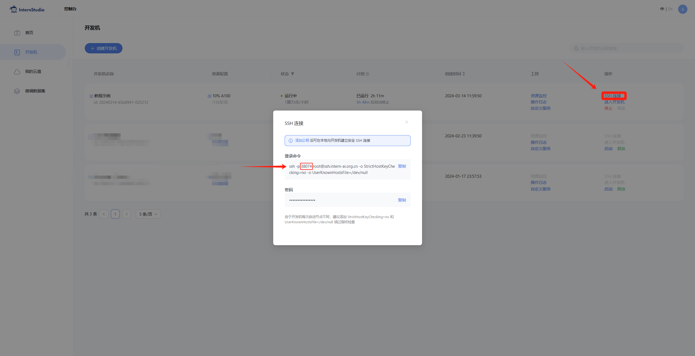

2. 在本地打开命令行.
    - Windows 使用快捷键组合 `Windows + R`（Windows 即开始菜单键）打开指令界面，并输入命令 `Powershell`，按下回车键
    - Mac 用户直接找到并打开`终端`
    - Ubuntu 用户使用快捷键组合 `ctrl + alt + t`

3. 在命令行中输入如下命令，命令行会提示输入密码：
```
ssh -CNg -L 7860:127.0.0.1:7860 root@ssh.intern-ai.org.cn -p 38074
```
4. 复制服务器密码到命令行中，按回车，建立服务器到本地到端口映射。

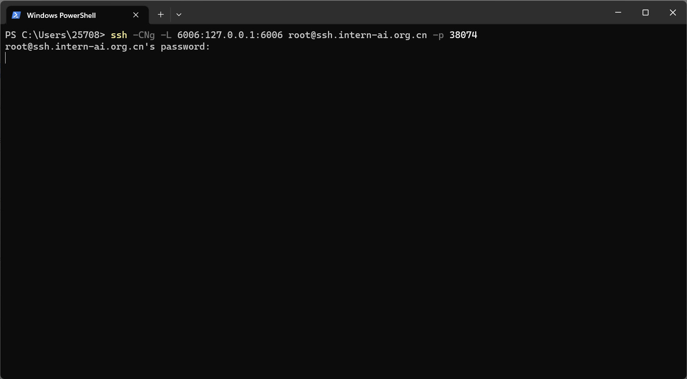


## 2 使用茴香豆

### 2.1 修改配置文件

用已下载模型的路径替换 `/root/huixiangdou/config.ini` 文件中的模型，如下图所示：

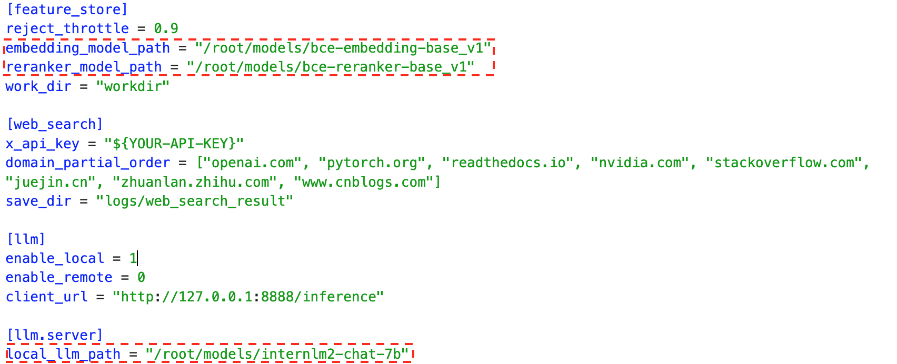

> 基础作业 

`local_llm_path = "/root/models/internlm2-chat-1_8b"`

基础作业可以参考这个文件修改 [config.ini](/config.ini)。

> 进阶作业

`local_llm_path = "/root/models/internlm2-chat-7b"`

### 2.2 收集本地数据库

创建本地知识数据库。本示例中，使用OpenMMLab 的 MMPose 文档作为数据库，打造一个知识问答助手。

```bash
cd /root/huixiangdou && mkdir repodir
git clone https://github.com/open-mmlab/mmpose --depth=1 repodir/mmpose
```

修改文件 `/root/huixiangDou/resource/good_questions.json` 和 `/root/huixiangDou/resource/bad_questions.json` ，添加或删除希望模型回答和模型拒绝回答的问题列表。

> 注意！默认列表根据 MMPose 创建，如果使用自己的数据库，对应接受和拒绝回答问题要根据知识库领域进行修改。

```
# 默认知识库接受问题类型
"mmpose中怎么调用mmyolo接口",
"mmpose实现姿态估计后怎么实现行为识别",
...

# 默认知识库拒绝问题类型（与主题无关或闲聊）
"nihui 是谁",
"具体在哪些位置进行修改？",
"你是谁？",
"1+1",
...
```

提取知识库特征，创建向量数据库。数据库向量化的过程应用到了langchain的相关模块，默认嵌入和重排序模型调用的网易BCE模型，如果没有在`config.ini`文件中指定本地模型路径，茴香豆将自动从hugging-face下载默认模型。

```bash
# 创建工作目录
cd /root/huixiangdou && mkdir workdir 

# 把 repodir 中的数据向量化后保存到 workdir 向量数据库中，便于后续搜索查询使用
python3 -m huixiangdou.service.feature_store 
```

### 2.3 测试茴香豆

可以通过下面的命令来测试茴香豆的性能。

```bash
# standalone
python3 -m huixiangdou.main --standalone
```

基础模型的性能决定着茴香豆搭建的知识助理的能力，建议选择InternLM2-chat_7b的模型，才能真正展示茴香豆的能力。

> 注意！无法基于 `internlm2-chat_1.8b` 该尺度模型实现RAG知识库搭建，基础作业大家以跑通流程为主，不要在意输出结果是否准确。


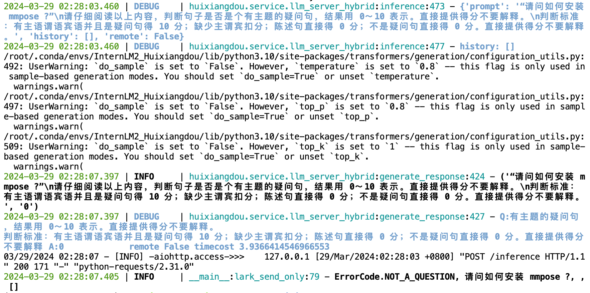

> 下图是 `internlm2-chat_ 7b` 相同问题的回答：

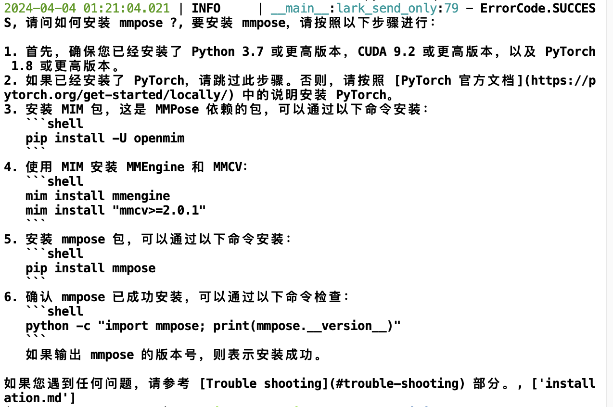


可以通过修改 `/root/huixiangdou/huixiangdou/main.py` 文件中 `lark_send_only` 函数，测试自己的问答：


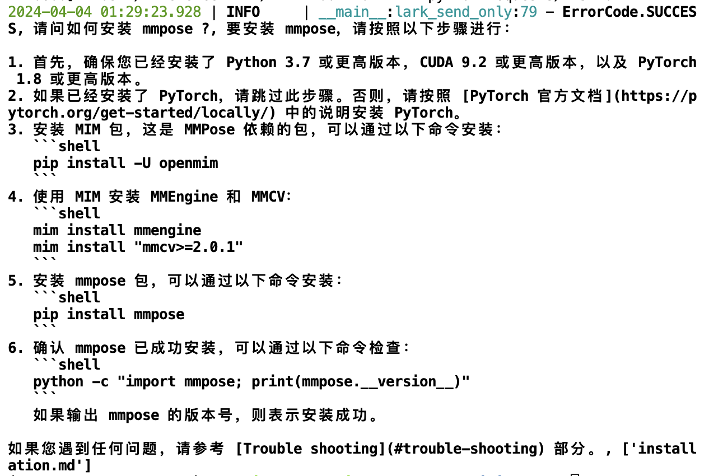
`internlm2-chat_ 7b`的回答

## 3 茴香豆进阶

<div align='center'>

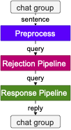

</div>

茴香豆并非单纯的RAG功能实现，而是一个专门针对群聊优化的知识助手。详情请阅读 [技术报告](https://arxiv.org/abs/2401.08772)或观看本节课理论视频。


### 3.1 加入网络搜索

茴香豆除了可以从本地数据库中提取内容进行回答，也可以加入网络搜索结果提取内容生成回答。 

登录 [Serper](https://serper.dev/) ，注册：


进入 [Serper API](https://serper.dev/api-key) 界面，复制自己的 API-key：

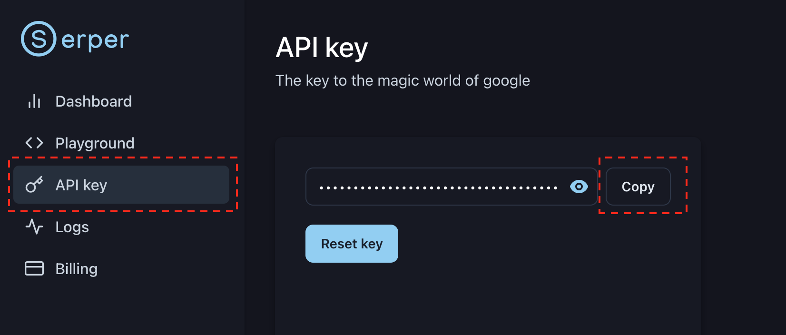

替换 `/root/huixiangdou/config.ini` 中的 ***${YOUR-API-KEY}*** 为自己的API-key：

```
[web_search]
# check https://serper.dev/api-key to get a free API key
x_api_key = "${YOUR-API-KEY}"
domain_partial_order = ["openai.com", "pytorch.org", "readthedocs.io", "nvidia.com", "stackoverflow.com", "juejin.cn", "zhuanlan.zhihu.com", "www.cnblogs.com"]
save_dir = "logs/web_search_result"
```
`domain_partial_order` 可以设置网络搜索的范围。

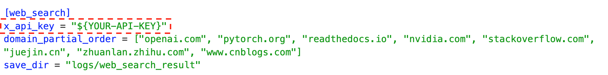

### 3.2 使用远程模型

茴香豆除了可以使用本地大模型，还可以轻松的调用云端模型API。

目前，茴香豆已经支持 `Kimi`，`GPT-4`，`Deepseek` 和 `GLM` 等常见大模型API。

想要实用远端大模型，首先修改 `/root/huixiangdou/config.ini` 文件中

```
enable_local = 0 # 关闭本地模型
enable_remote = 1 # 启用云端模型
```
接着，如下图所示，修改 `remote_` 相关配置，填写API key、模型类型等参数。

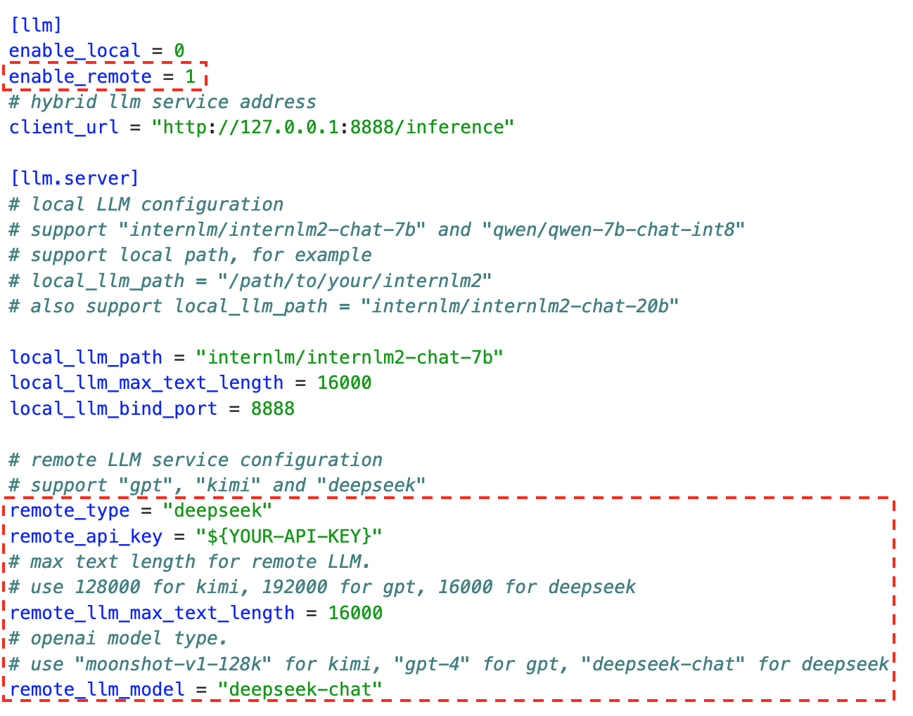


| 远端模型配置选项 | GPT | Kimi | Deepseek | ChatGLM | xi-api | alles-apin |
|---|---|---|---|---|---|---|
| `remote_type`| gpt | kimi | deepseek | zhipuai | xi-api | alles-apin |
| `remote_llm_max_text_length` 最大值 | 192000 | 128000 | 16000 | 128000 | 192000 | - |
| `remote_llm_model` | "gpt-4-0613"| "moonshot-v1-128k" | "deepseek-chat" | "glm-4" | "gpt-4-0613" | - |


启用远程模型可以大大降低GPU显存需求，根据测试，采用远程模型的茴香豆应用，最小只需要2G内存即可。

需要注意的是，这里启用的远程模型，只用在问答分析和问题生成，依然需要本地嵌入、重排序模型进行特征提取。

也可以尝试同时开启 local 和 remote 模型，茴香豆将采用混合模型的方案，详见 [技术报告](https://arxiv.org/abs/2401.08772)，效果更好。


[茴香豆 Web 版](https://openxlab.org.cn/apps/detail/tpoisonooo/huixiangdou-web) 在 **OpenXLab** 上部署了混合模型的 Demo，可上传自己的知识库测试效果。


### 3.3 利用 Gradio 搭建网页 Demo

前面的教程，我们都是通过修改代码的模式测试自己搭建的茴香豆助手，为了更方便的测试和使用，我们现在利用 **Gradio** 创建以自己的网页版对话 demo。

> 注意！需要 7b 模型运行 demo。

安装Gradio依赖。

```bash
pip install gradio redis flask lark_oapi
```
运行本地茴香豆Demo：

```bash
python3 -m tests.test_query_gradio 
```

在本地浏览器中输入 [127.0.0.1:7860](http://127.0.0.1:7860/) 进入Gradio对话应用助手，如果在服务器端运行茴香豆web demo，请跟随 [1.4 端口映射（可选）](#14-端口映射可选) 章节建立好本地与服务器映射。

如果需要切换知识领域，只需要重复步骤 [2.2 收集本地数据库](#22-收集本地数据库) 提取新知识特征到新路径，更改 `/root/huixiangdou/config.ini` 文件中 `work_dir = "新路径"`；
或者运行 

```
python3 -m tests.test_query_gradi --work_dir <新特征路径>
```

 就可以轻松的搭建一个新的茴香豆问答助手了。

```
python3 -m tests.test_query_gradio -h
```
可以查看更多网页Demo支持的命令。

### 3.4 茴香豆配置文件解析

茴香豆的配置文件位于代码主目录下，有着丰富的功能，下面将解析配置文件中重要的常用参数。

```
[feature_store]
...
reject_throttle = 0.22742061846268935
...
embedding_model_path = "/root/models/bce-embedding-base_v1"
reranker_model_path = "/root/models/bce-reranker-base_v1"
...
work_dir = "workdir"
```

`reject_throttle`: 拒答阈值，0-1，数值越大，回答的问题相关性越高。拒答分数在检索过程中通过与示例问题的相似性检索得出，高质量的问题得分高，无关、低质量的问题得分低。只有得分数大于拒答阈值的才会被视为相关问题，用于回答的生成。当闲聊或无关问题较多的环境可以适当调高。
`embedding_model_path` 和 `reranker_model_path`: 嵌入和重排用到的模型路径。不设置本地模型路径情况下，默认自动通过 ***Huggingface*** 下载。开始自动下载前，需要使用下列命令登录 ***Huggingface*** 账户获取权限：

```bash
huggingface-cli login
```

`work_dir`: 向量数据库路径。茴香豆安装后，可以通过切换向量数据库路径，来回答不同知识领域的问答。


work time

```
[llm.server]
...
local_llm_path = "/root/models/internlm2-chat-1_8b"
local_llm_max_text_length = 3000
...
```

`local_llm_path`: 本地模型文件夹路径或模型名称。现支持 **书生·浦语** 和 **通义千问** 模型类型，调用 `transformers` 的 `AutoModels` 模块，除了模型路径，输入 ***Huggingface*** 上的模型名称，如*"internlm/internlm2-chat-7b"*、*"qwen/qwen-7b-chat-int8"*、*"internlm/internlm2-chat-20b"*，也可自动拉取模型文件。
`local_llm_max_text_length`: 模型可接受最大文本长度。


```
[worker]
# enable search enhancement or not
enable_sg_search = 0
save_path = "logs/work.txt"
...
```
`[worker]`: 增强搜索功能。增强搜索用知识领域的源文件建立图数据库，当模型判断问题为无关问题或回答失败时，增强搜索功能利用 LLM 提取的关键词在图数据库中搜索，并尝试用搜索到的数据重新生成答案。在 `config.ini` 中查看具体配置示例。


```
[frontend]
...
```
`[fronted]`:  前端交互设置。[茴香豆代码仓库](https://github.com/InternLM/HuixiangDou/tree/main/docs) 查看具体教程。

## 作业

查看 [homework.md](./homework.md) 查看本节作业。