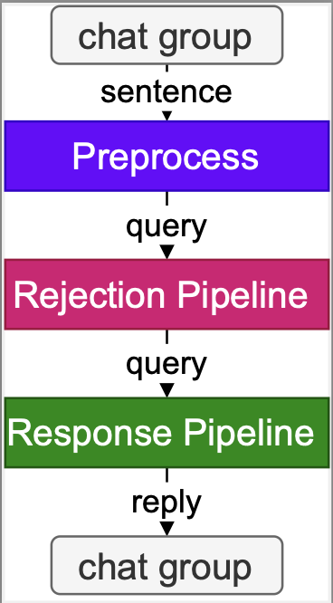

- [1 环境配置](#1-环境配置)
  - [1.1 配置基础环境](#11-配置基础环境)
  - [1.2 下载基础文件](#12-下载基础文件)
  - [1.3 下载安装茴香豆（豆哥）](#13-下载安装茴香豆豆哥)
  - [1.4 端口映射（可选）](#14-端口映射可选)
- [2 使用茴香豆](#2-使用茴香豆)
  - [2.1 修改配置文件](#21-修改配置文件)
  - [2.2 收集本地数据库](#22-收集本地数据库)
  - [2.3 测试茴香豆](#23-测试茴香豆)
- [3 茴香豆进阶](#3-茴香豆进阶)
  - [3.1 文件结构](#31-文件结构)
  - [3.2 加入网络搜索](#32-加入网络搜索)
  - [3.3 使用远程模型](#33-使用远程模型)
  - [3.3 利用Gradio搭建网页Demo](#33-利用gradio搭建网页demo)


## 1 环境配置

### 1.1 配置基础环境

这里以在 `InternStudio` 服务器上部署**茴香豆**为例。

首先，从官方环境复制运行 InternLM 的基础环境，命名为`InternLM2_Huixiangdou`。

```bash
studio-conda -o internlm-base -t InternLM2_Huixiangdou
```

复制完成后，在本地查看环境。

```bash
conda env list
```

结果如下所示。

```bash
# conda environments:
#
base                  *  /root/.conda
InternLM2_Huixiangdou                 /root/.conda/envs/InternLM2_Huixiangdou
```

激活环境。

```bash
conda activate InternLM2_Huixiangdou
```

注意，环境激活后，命令行左边会显示当前（也就是 `InternLM2_Huixiangdou`）的环境名称，如下图所示。


后续教程所有操作都需要在该环境下进行。

### 1.2 下载基础文件

复制茴香豆所需模型，为了减少下载和huggingface登录问题，所有作业和教程涉及的模型都已经存放在共享文件中，大家根据自己机器配置选择合适的模型复制。

```bash
# 创建模型文件夹
cd && mkdir models

# 复制BCE模型
ln -s /root/share/new_models/maidalun1020/bce-embedding-base_v1 /root/models/bce-embedding-base_v1
ln -s /root/share/new_models/maidalun1020/bce-reranker-base_v1 /root/models/bce-reranker-base_v1

# 复制大模型参数（下面的模型，根据作业进度和任务进行选择一个就行）
## 基础作业 (8G显存)
ln -s /root/share/new_models/Shanghai_AI_Laboratory/internlm2-chat-1_8b /root/models/internlm2-chat-1_8b

## 进阶作业(20G显存)
ln -s /root/share/new_models/Shanghai_AI_Laboratory/internlm2-chat-7b /root/models/internlm2-chat-7b

```

> 注意部署在本地或自有服务器时，可以通过hugging-face下载必要模型。下载需要使用下列命令登录huggingface账户。使用***InternStudio***，忽略这步。

```bash
huggingface-cli login
```

### 1.3 下载安装茴香豆（豆哥）

从茴香豆官方仓库下载茴香豆。

```bash
cd
# 下载 repo
git clone https://github.com/internlm/huixiangdou --depth=25 && cd huixiangdou
git checkout c379d57eddb1857ab1126fd924220ce00d88e770

pip install -r requirements.txt
pip install protobuf # internlm2
pip install lxml_html_clean
```

### 1.4 端口映射（可选）

后续如果想通过gradio搭建web应用demo，请跟随下面的步骤将服务器端口映射到本地端口：
首先我们需要配置一下本地的 SSH Key ，我们这里以Windows为例。

1. 查询服务器端口和密码（图中端口示例为 38374）：


2. 在本地打开命令行.
    - Windows 使用快捷键组合 `Windows + R`（Windows 即开始菜单键）打开指令界面，并输入命令 `Powershell`，按下回车键
    - Mac 用户直接找到并打开`终端`
    - Ubuntu 用户使用快捷键组合 `ctrl + alt + t`

3. 在命令行中输入如下命令，命令行会提示输入密码：
```
ssh -CNg -L 7860:127.0.0.1:7860 root@ssh.intern-ai.org.cn -p 38074
```
4. 复制服务器密码到命令行中，按回车，建立服务器到本地到端口映射。


## 2 使用茴香豆

### 2.1 修改配置文件

用已下载模型的路径地址替换`config.ini`文件中的模型地址，如下图所示：


> 基础作业 

`local_llm_path = "/root/models/internlm2-chat-1_8b"`

> 进阶作业

`local_llm_path = "/root/models/internlm2-chat-7b"`

### 2.2 收集本地数据库

创建本地知识数据库。本示例中，使用OpenMMLab 的 MMPose 文档作为数据库，打造一个知识问答助手。

```bash
mkdir repodir
git clone https://github.com/open-mmlab/mmpose --depth=1 repodir/mmpose
```

修改文件`HuixiangDou/resource/good_questions.json`和`HuixiangDou/resource/bad_questions.json`，添加或删除希望模型回答和模型拒绝回答的问题列表。

> 注意！默认列表根据 MMPose 创建，如果使用自己的数据库，对应接受和拒绝回答问题要根据知识库领域进行修改。

```
# 默认知识库接受问题类型
"mmpose中怎么调用mmyolo接口",
"mmpose实现姿态估计后怎么实现行为识别",
...

# 默认知识库拒绝问题类型（与主题无关或闲聊）
"nihui 是谁",
"具体在哪些位置进行修改？",
"你是谁？",
"1+1",
...
```

提取知识库特征，创建向量数据库。数据库向量化的过程应用到了langchain的相关模块，默认嵌入和重排序模型调用的网易BCE模型，如果没有在`config.ini`文件中指定模型，茴香豆将自动从hugging-face下载默认模型。

```bash
# 建立特征库
mkdir workdir # 创建工作目录

# 把 repodir 中的数据向量化后保存到 workdir 向量数据库中，便于后续搜索查询使用
python3 -m huixiangdou.service.feature_store 
```

### 2.3 测试茴香豆

可以通过下面的命令来测试茴香豆的性能。

```bash
# standalone
python3 -m huixiangdou.main --standalone
```

基础模型的性能决定着茴香豆搭建的知识助理的能力，建议选择InternLM2-chat_7b的模型，才能真正展示茴香豆的能力。

> 注意！无法基于 `internlm2-chat_1.8b` 该尺度模型实现RAG知识库搭建，基础作业大家以跑通流程为主，不要在意输出。


可以通过修改`main.py`文件中`lark_send_only`函数，测试自己的问答：


## 3 茴香豆进阶



茴香豆并非单纯的RAG功能实现，而是一个专门针对群聊优化的知识助手。详情请阅读[技术报告](https://arxiv.org/abs/2401.08772)或观看本节课理论视频。

### 3.1 文件结构

```
./
├── LICENSE
├── README.md
├── README_zh.md
├── android
├── config-2G.ini
├── config-advanced.ini
├── config-experience.ini
├── config.ini  # 配置文件
├── docs
├── huixiangdou  # 茴香豆主要代码，重点解析
├── huixiangdou-inside.md
├── logs
├── repodir # 个人数据库原始文件存放地址
├── requirements-lark-group.txt
├── requirements.txt
├── resource
├── setup.py
├── tests
└── workdir # 茴香豆本地向量数据库
```

```
./huixiangdou
├── __init__.py
├── __pycache__
│   ├── __init__.cpython-310.pyc
│   └── main.cpython-310.pyc
├── frontend 
│   ├── __init__.py
│   ├── __pycache__
│   ├── lark.py
│   └── lark_group.py
├── main.py 
├── service
│   ├── __init__.py
│   ├── __pycache__
│   ├── feature_store.py # 向量数据库嵌入核心代码
│   ├── file_operation.py
│   ├── helper.py
│   ├── llm_client.py
│   ├── llm_server_hybrid.py
│   ├── retriever.py
│   ├── sg_search.py
│   ├── web_search.py
│   └── worker.py # 主要工作流程，重点研究
└── version.py
```

### 3.2 加入网络搜索

茴香豆除了可以从本地数据库中提取内容进行回答，也可以加入网络搜索结果提取内容生成回答。 

登录 [Serper](https://serper.dev/) ，注册：


进入 [Serper API](https://serper.dev/api-key) 界面，复制自己的 API-key：


替换 `config.ini` 中的 API：


### 3.3 使用远程模型
茴香豆除了可以使用本地大模型，还可以很轻松的调用云端模型api。目前，茴香豆已经支持 `Kimi`，`GPT-4`，`Deepseek` 和 `GLM` 等常见大模型API。

首先，修改config.ini文件中 enable_local = 0关闭本地 LLM 模型，enable_remote = 1开启云端模型功能。
然后，如下图所示，修改 remote_相关配置，填写api key、模型类型。


启用远程模型可以大大降低GPU显存需求，根据测试，采用远程模型的茴香豆应用，最小只需要2G内存即可。
需要注意的是，这里启用的远程模型，只用在问答分析和问题生成，依然需要本地嵌入、重排序模型进行数据的特征提取。
也可以尝试同时开启 local 和 remote 模型，茴香豆将采用混合模型的方案，详见技术报告，效果更好。[茴香豆 Web版](https://openxlab.org.cn/apps/detail/tpoisonooo/huixiangdou-web) 可测试效果。

### 3.3 利用Gradio搭建网页Demo

安装Gradio依赖。

```bash
pip install gradio
pip install redis
pip install flask
```
运行茴香豆Demo

```bash
python3 -m tests.test_query_gradio 
```

在本地浏览器中输入`127.0.0.1:7698`进入Gradio对话应用助手，如果在服务器端运行茴香豆web demo，请跟随`1.4`章建立好本地与服务器映射。

如果需要切换知识领域，只需要重复步骤 2.2 提取新的特征到新的地址，更改`config.ini` 文件中 `work_dir = "新地址"`；
或者运行`python3 -m tests.test_query_gradi --work_dir 特征地址` 就可以轻松的搭建一个新的茴香豆问答助手了。
```
python3 -m tests.test_query_gradio -h
```
可以查看更多网页Demo支持的命令。