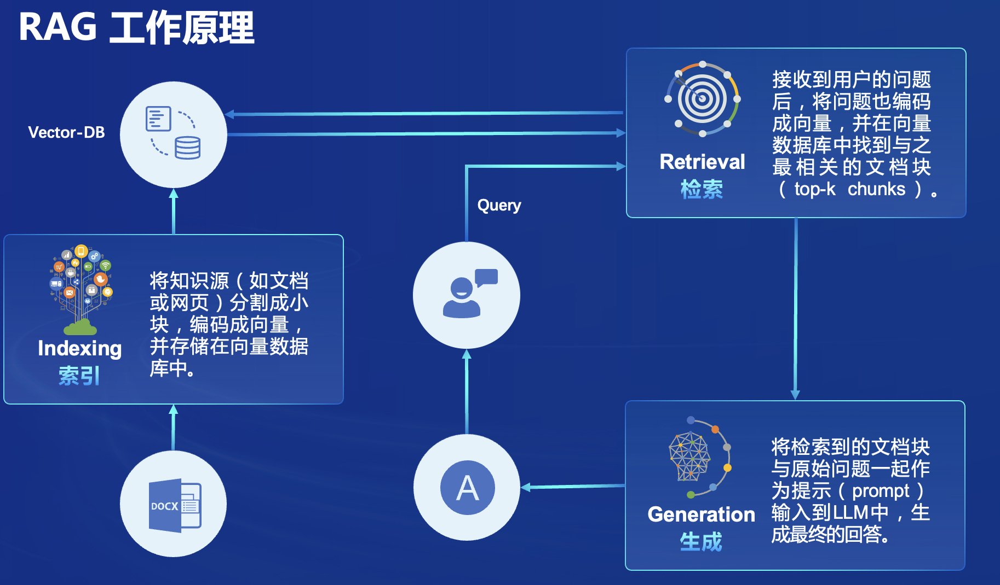
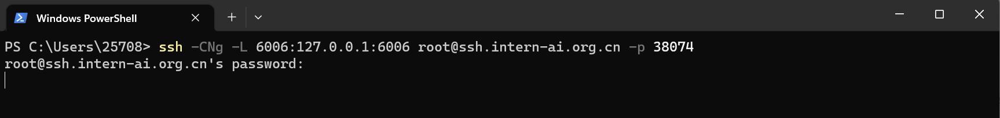

<div align="center">


</div>

- [0 RAG 概述](#0-rag-概述)
  - [RAG 效果比对](#rag-效果比对)
- [1 环境配置](#1-环境配置)
  - [1.1 配置基础环境](#11-配置基础环境)
  - [1.2 下载基础文件](#12-下载基础文件)
  - [1.3 下载安装茴香豆](#13-下载安装茴香豆)
- [2 使用茴香豆搭建 RAG 助手](#2-使用茴香豆搭建-rag-助手)
  - [2.1 修改配置文件](#21-修改配置文件)
  - [2.2 创建知识库](#22-创建知识库)
  - [2.3 利用 Gradio 搭建网页 Demo](#23-利用-gradio-搭建网页-demo)
- [3 茴香豆进阶](#3-茴香豆进阶)
  - [3.1 加入网络搜索](#31-加入网络搜索)
  - [3.2 使用远程模型](#32-使用远程模型)
  - [3.3 配置文件解析](#33-配置文件解析)
  - [3.4 文件结构](#34-文件结构)
- [作业](#作业)


## 0 RAG 概述

RAG（Retrieval Augmented Generation）技术，通过检索与用户输入相关的信息片段，并结合***外部知识库***来生成更准确、更丰富的回答。解决LLMs在处理知识密集型任务时可能遇到的挑战, 如幻觉、过时知缺乏透明和可追溯的推理过程等。提供更准确的回答、降低推理成本、实现外部记忆。



RAG 能够让基础模型实现非参数知识更新，无需训练就可以掌握新领域的知识。本次课程选用的[茴香豆](https://github.com/InternLM/HuixiangDou)应用，就应用了 RAG 技术，可以快速、高效的搭建自己的知识领域助手。

### RAG 效果比对


## 1 环境配置

### 1.1 配置基础环境

这里以在 `Intern Studio` 服务器上部署**茴香豆**为例。

首先，打开 `Intern Studio` 界面，点击 ***创建开发机*** 配置开发机系统。


填写 `开发机名称` 后，点击 选择镜像 使用 `Cuda11.7-conda` 镜像，然后在资源配置中，使用 `50% A100 * 1` 的选项，然后立即创建开发机器。


点击 `进入开发机` 选项。


进入开发机后，从官方环境复制运行 InternLM 的基础环境，命名为 `InternLM2_Huixiangdou`，在命令行模式下运行：

```bash
studio-conda -o internlm-base -t InternLM2_Huixiangdou
```

复制完成后，在本地查看环境。

```bash
conda env list
```

结果如下所示。

```bash
# conda environments:
#
base                  *  /root/.conda
InternLM2_Huixiangdou                 /root/.conda/envs/InternLM2_Huixiangdou
```

运行 ***conda*** 命令，激活 `InternLM2_Huixiangdou`  ***python*** 虚拟环境:

```bash
conda activate InternLM2_Huixiangdou
```

环境激活后，命令行左边会显示当前（也就是 `InternLM2_Huixiangdou`）的环境名称，如下图所示:


后续教程所有操作都需要在该环境下进行，重启开发机或打开新命令行后要重新激活环境。

### 1.2 下载基础文件

复制茴香豆所需模型文件，为了减少下载和避免 **HuggingFace** 登录问题，所有作业和教程涉及的模型都已经存放在 `Intern Studio` 开发机共享文件中。本教程选用 **InternLM2-Chat-7B** 作为基础模型。


```bash
# 创建模型文件夹
cd /root && mkdir models

# 复制BCE模型
ln -s /root/share/new_models/maidalun1020/bce-embedding-base_v1 /root/models/bce-embedding-base_v1
ln -s /root/share/new_models/maidalun1020/bce-reranker-base_v1 /root/models/bce-reranker-base_v1

# 复制大模型参数（下面的模型，根据作业进度和任务进行**选择一个**就行）
ln -s /root/share/new_models/Shanghai_AI_Laboratory/internlm2-chat-7b /root/models/internlm2-chat-7b
```

### 1.3 下载安装茴香豆

从茴香豆官方仓库下载茴香豆。

```bash
cd /root
# 下载 repo
git clone https://github.com/internlm/huixiangdou && cd huixiangdou
git checkout 447c6f7e68a1657fce1c4f7c740ea1700bde0440

# 安装 python 依赖
pip install -r requirements.txt
pip install protobuf==4.25.3 # internlm2

## 因为 Intern Studio 不支持对系统文件的永久修改，在 Intern Studio 安装部署的同学不建议安装 Word 依赖，后续的操作和作业不会涉及 Word 解析。
## 想要自己尝试解析 Word 文件的同学，uncomment 掉下面这行，安装解析 .doc .docx 必需的依赖
# apt update && apt -y install python-dev python libxml2-dev libxslt1-dev antiword unrtf poppler-utils pstotext tesseract-ocr flac ffmpeg lame libmad0 libsox-fmt-mp3 sox libjpeg-dev swig libpulse-dev 
```

茴香豆工具在 `Intern Studio` 开发机的安装工作结束。如果部署在自己的服务器上，参考上节课模型下载内容或本节[3.4 配置文件解析](#34-配置文件解析)部分内容下载模型文件。


## 2 使用茴香豆搭建 RAG 助手

### 2.1 修改配置文件

用已下载模型的路径替换 `/root/huixiangdou/config.ini` 文件中的模型，如下图所示：


需要修改 3 处模型地址，分别是:

用于向量数据库和词嵌入的模型

```
embedding_model_path = "/root/models/bce-embedding-base_v1"

```

用于检索的重排序模型

```
reranker_model_path = "/root/models/bce-reranker-base_v1"
```

和本次选用的大模型
```
local_llm_path = "/root/models/internlm2-chat-7b"
```

修改好的配置文件应该和 [config.ini 示例文件](./config.ini) 一致，也可以直接用该文件内容替换自己开发机上 `/root/huixiangdou/config.ini` 文件。

配置文件具体含义和更多细节参考 [3.4 配置文件解析](#34-配置文件解析)。

### 2.2 创建知识库

本示例中，使用 **OpenMMLab** 的 **MMPose** 文档作为数据检索来源，打造一个 **MMPose** 技术问答助手。

首先，下载 **MMPose** 语料：

```bash
cd /root/huixiangdou && mkdir repodir
git clone https://gitee.com/open-mmlab/mmpose --depth=1 repodir/mmpose
```

提取知识库特征，创建向量数据库。数据库向量化的过程应用到了 **LangChain** 的相关模块，默认嵌入和重排序模型调用的网易 **BCE 双语模型**，如果没有在 `config.ini` 文件中指定本地模型路径，茴香豆将自动从 **HuggingFace**  拉取默认模型。

除了语料知识的向量数据库，茴香豆建立接受和拒答两个向量数据库，用来在检索的过程中加精确的判断提问的相关性，这两个数据库的来源分别是：

- 接受问题列表，希望茴香豆助手回答的示例问题
  - 存储在 `huixiangdou/resource/good_questions.json` 中
  - 本示例中为 **MMPose** 相关技术问题
  - 如："mmpose中怎么调用mmyolo接口", "mmpose实现姿态估计后怎么实现行为识别"
- 拒绝问题列表，希望茴香豆助手拒答的示例问题
  - 存储在 `huixiangdou/resource/bad_questions.json` 中
  - 本示例中为语 **MMPose** 技术无关的主题或闲聊
  - 如："nihui 是谁", "具体在哪些位置进行修改？", "你是谁？", "1+1"

在确定好 3 个语料来源后，运行下面的命令，创建 RAG 检索过程中使用的向量数据库：

```bash
# 创建向量数据库存储目录
cd /root/huixiangdou && mkdir workdir 

# 分别向量化知识语料、接受问题和拒绝问题中后保存到 workdir
python3 -m huixiangdou.service.feature_store 
```

向量数据库的创建需要等待一小段时间，过程约占用 2G 显存。

完成后，**MMPose** 相关的向量数据库就存储在 `workdir` 文件夹下了。

检索过程中，茴香豆会将输入问题与两个列表中的问题在向量空间进行相似性比较，判断该问题是否应该回答，避免群聊过程中的问答泛滥。确定的回答的问题会利用基础模型提取关键词，在知识库中检索 `top K` 相似的 `chunk`，综合问题和检索到的 `chunk` 生成答案。

默认的接受和拒绝问题列表是根据 **MMPose** 知识库创建的，如果使用其他领域的知识语料库，在切换语料库文件的同时，也要更新相应的接受和拒绝问题列表。

### 2.3 利用 Gradio 搭建网页 Demo

现在，我们已经提取了知识库特征，并创建了对应的向量数据库，运行下面的命令，测试一下我们的茴香豆助手现在是否能够从该向量数据库中检索到相关问题的信息，生成匹配的答案：


```bash
# standalone
python3 -m huixiangdou.main --standalone
```

可以看到，我们的茴香豆助手已经能够从 **MMPose** 的文档中找到准确的知识回答我们的问题了。


前面的教程，我们使用命令行的方式测试自己搭建的茴香豆助手，为了更方便的测试和使用，我们现在用 **Gradio** 搭建一个自己的网页对话 Demo。

首先，安装 **Gradio** 依赖组件：

```bash
pip install gradio redis flask lark_oapi
```
运行脚本，启动茴香豆对话 Demo 服务：

```bash
python3 -m tests.test_query_gradio 

```

此时服务器端接口已开启。如果在本地服务器使用，直接在浏览器中输入 [127.0.0.1:7860](http://127.0.0.1:7860/) ，即可进入茴香豆对话 Demo 界面。

针对远程服务器，如我们的 `Intern Studio` 开发机，我们需要设置端口映射，转发端口到本地浏览器：

1. 查询开发机端口和密码（图中端口示例为 38374）：


2. 在本地打开命令行工具：
  - Windows 使用快捷键组合 `Windows + R`（Windows 即开始菜单键）打开指令界面，并输入命令 `Powershell`，按下回车键
  - Mac 用户直接找到并打开`终端`
  - Ubuntu 用户使用快捷键组合 `ctrl + alt + t`

在命令行中输入如下命令，命令行会提示输入密码：
```
ssh -CNg -L 7860:127.0.0.1:7860 root@ssh.intern-ai.org.cn -p 38074
```
3. 复制开发机密码到命令行中，按回车，建立开发机到本地到端口映射。



4. 在本地浏览器中输入 [127.0.0.1:7860](http://127.0.0.1:7860/) 进入 **Gradio** 对话 Demo 界面，开始对话。


RAG 技术的优势就是非参数化的模型调优，这里使用的基础模型 `InternLM2-Chat-7B` 并未接受任何额外数据的训练过程，便可根据我们的问题回答相应的解决方案。与原始 `InternLM2-Chat-7B` 对相同问题回答的对比显著：


如果需要更换检索的知识领域，只需要用新的语料知识重复步骤 [2.2 创建知识库](#22-创建知识库) 提取特征到新的向量数据库，更改 `huixiangdou/config.ini` 文件中 `work_dir = "新向量数据库路径"`；

或者运行： 

```
python3 -m tests.test_query_gradi --work_dir <新向量数据库路径>
```

无需重新训练或微调模型，就可以轻松的让基础模型学会新领域知识，搭建一个新的问答助手。


## 3 茴香豆进阶

<p align="center">
  
</p>

茴香豆并非单纯的 RAG 功能实现，而是一个专门针对群聊优化的知识助手，下面介绍一些茴香豆的进阶用法。详情请阅读[技术报告](https://arxiv.org/abs/2401.08772)或观看本节课理论视频。


### 3.1 加入网络搜索

茴香豆除了可以从本地向量数据库中检索内容进行回答，也可以加入网络的搜索结果，生成回答。 

开启网络搜索功能需要用到 **Serper** 提供的 API：

1. 登录 [Serper](https://serper.dev/) ，注册：


2. 进入 [Serper API](https://serper.dev/api-key) 界面，复制自己的 API-key：


1. 替换 `/huixiangdou/config.ini` 中的 ***${YOUR-API-KEY}*** 为自己的API-key：

```
[web_search]
# check https://serper.dev/api-key to get a free API key
x_api_key = "${YOUR-API-KEY}"
domain_partial_order = ["openai.com", "pytorch.org", "readthedocs.io", "nvidia.com", "stackoverflow.com", "juejin.cn", "zhuanlan.zhihu.com", "www.cnblogs.com"]
save_dir = "logs/web_search_result"
```
其中 `domain_partial_order` 可以设置网络搜索的范围。


### 3.2 使用远程模型

茴香豆除了可以使用本地大模型，还可以轻松的调用云端模型 API。

目前，茴香豆已经支持 `Kimi`，`GPT-4`，`Deepseek` 和 `GLM` 等常见大模型API。

想要使用远端大模型，首先修改 `/huixiangdou/config.ini` 文件中

```
enable_local = 0 # 关闭本地模型
enable_remote = 1 # 启用云端模型
```
接着，如下图所示，修改 `remote_` 相关配置，填写 API key、模型类型等参数。


| 远端模型配置选项 | GPT | Kimi | Deepseek | ChatGLM | xi-api | alles-apin |
|---|---|---|---|---|---|---|
| `remote_type`| gpt | kimi | deepseek | zhipuai | xi-api | alles-apin |
| `remote_llm_max_text_length` 最大值 | 192000 | 128000 | 16000 | 128000 | 192000 | - |
| `remote_llm_model` | "gpt-4-0613"| "moonshot-v1-128k" | "deepseek-chat" | "glm-4" | "gpt-4-0613" | - |


启用远程模型可以大大降低GPU显存需求，根据测试，采用远程模型的茴香豆应用，最小只需要2G内存即可。

需要注意的是，这里启用的远程模型，只用在问答分析和问题生成，依然需要本地嵌入、重排序模型进行特征提取。

也可以尝试同时开启 local 和 remote 模型，茴香豆将采用混合模型的方案，详见 [技术报告](https://arxiv.org/abs/2401.08772)，效果更好。

[茴香豆 Web 版](https://openxlab.org.cn/apps/detail/tpoisonooo/huixiangdou-web) 在 **OpenXLab** 上部署了混合模型的 Demo，可上传自己的语料库测试效果。


### 3.3 配置文件解析

茴香豆的配置文件位于代码主目录下，采用 `Toml` 形式，有着丰富的功能，下面将解析配置文件中重要的常用参数。

```
[feature_store]
...
reject_throttle = 0.22742061846268935
...
embedding_model_path = "/root/models/bce-embedding-base_v1"
reranker_model_path = "/root/models/bce-reranker-base_v1"
...
work_dir = "workdir"
```

`reject_throttle`: 拒答阈值，0-1，数值越大，回答的问题相关性越高。拒答分数在检索过程中通过与示例问题的相似性检索得出，高质量的问题得分高，无关、低质量的问题得分低。只有得分数大于拒答阈值的才会被视为相关问题，用于回答的生成。当闲聊或无关问题较多的环境可以适当调高。
`embedding_model_path` 和 `reranker_model_path`: 嵌入和重排用到的模型路径。不设置本地模型路径情况下，默认自动通过 ***Huggingface*** 下载。开始自动下载前，需要使用下列命令登录 ***Huggingface*** 账户获取权限：

```bash
huggingface-cli login
```

`work_dir`: 向量数据库路径。茴香豆安装后，可以通过切换向量数据库路径，来回答不同知识领域的问答。

```
[llm.server]
...
local_llm_path = "/root/models/internlm2-chat-1_8b"
local_llm_max_text_length = 3000
...
```

`local_llm_path`: 本地模型文件夹路径或模型名称。现支持 **书生·浦语** 和 **通义千问** 模型类型，调用 `transformers` 的 `AutoModels` 模块，除了模型路径，输入 ***Huggingface*** 上的模型名称，如*"internlm/internlm2-chat-7b"*、*"qwen/qwen-7b-chat-int8"*、*"internlm/internlm2-chat-20b"*，也可自动拉取模型文件。
`local_llm_max_text_length`: 模型可接受最大文本长度。

远端模型支持参考上一小节。


```
[worker]
# enable search enhancement or not
enable_sg_search = 0
save_path = "logs/work.txt"
...
```
`[worker]`: 增强搜索功能，配合 `[sg_search]` 使用。增强搜索利用知识领域的源文件建立图数据库，当模型判断问题为无关问题或回答失败时，增强搜索功能将利用 LLM 提取的关键词在该图数据库中搜索，并尝试用搜索到的内容重新生成答案。在 `config.ini` 中查看 `[sg_search]` 具体配置示例。

```
[worker.time]
start = "00:00:00"
end = "23:59:59"
has_weekday = 1
```
`[worker.time]`: 可以设置茴香豆每天的工作时间，通过 `start` 和 `end` 设定应答的起始和结束时间。
`has_weekday`: `= 1` 的时候，周末不应答😂（豆哥拒绝 996）。 

```
[frontend]
...
```
`[fronted]`:  前端交互设置。[茴香豆代码仓库](https://github.com/InternLM/HuixiangDou/tree/main/docs) 查看具体教程。


### 3.4 文件结构

通过了解主要文件的位置和作用，可以更好的理解茴香豆的工作原理。

```bash
.
├── LICENSE
├── README.md
├── README_zh.md
├── android
├── app.py
├── config-2G.ini
├── config-advanced.ini
├── config-experience.ini
├── config.ini # 配置文件
├── docs # 教学文档
├── huixiangdou # 存放茴香豆主要代码，重点学习
├── huixiangdou-inside.md
├── logs
├── repodir # 默认存放个人数据库原始文件，用户建立
├── requirements-lark-group.txt
├── requirements.txt
├── resource
├── setup.py
├── tests # 单元测试
├── web # 存放茴香豆 Web 版代码
└── web.log
└── workdir # 默认存放茴香豆本地向量数据库，用户建立
```


```bash
./huixiangdou
├── __init__.py
├── frontend # 存放茴香豆前端与用户端和通讯软件交互代码
│   ├── __init__.py
│   ├── lark.py
│   └── lark_group.py
├── main.py # 运行主贷
├── service # 存放茴香豆后端工作流代码
│   ├── __init__.py
│   ├── config.py #
│   ├── feature_store.py # 数据嵌入、特征提取代码
│   ├── file_operation.py
│   ├── helper.py
│   ├── llm_client.py
│   ├── llm_server_hybrid.py # 混合模型代码
│   ├── retriever.py # 检索模块代码
│   ├── sg_search.py # 增强搜索，图检索代码
│   ├── web_search.py # 网页搜索代码
│   └── worker.py # 主流程代码
└── version.py
```

茴香豆工作流中用到的 **Prompt** 位于 `huixiangdou/service/worker.py` 中。可以根据业务需求尝试调整 **Prompt**，打造你独有的茴香豆知识助手。

```python
...
        # Switch languages according to the scenario.
        if self.language == 'zh':
            self.TOPIC_TEMPLATE = '告诉我这句话的主题，直接说主题不要解释：“{}”'
            self.SCORING_QUESTION_TEMPLTE = '“{}”\n请仔细阅读以上内容，判断句子是否是个有主题的疑问句，结果用 0～10 表示。直接提供得分不要解释。\n判断标准：有主语谓语宾语并且是疑问句得 10 分；缺少主谓宾扣分；陈述句直接得 0 分；不是疑问句直接得 0 分。直接提供得分不要解释。'  # noqa E501
            self.SCORING_RELAVANCE_TEMPLATE = '问题：“{}”\n材料：“{}”\n请仔细阅读以上内容，判断问题和材料的关联度，用0～10表示。判断标准：非常相关得 10 分；完全没关联得 0 分。直接提供得分不要解释。\n'  # noqa E501
            self.KEYWORDS_TEMPLATE = '谷歌搜索是一个通用搜索引擎，可用于访问互联网、查询百科知识、了解时事新闻等。搜索参数类型 string， 内容是短语或关键字，以空格分隔。\n你现在是{}交流群里的技术助手，用户问“{}”，你打算通过谷歌搜索查询相关资料，请提供用于搜索的关键字或短语，不要解释直接给出关键字或短语。'  # noqa E501
            self.SECURITY_TEMAPLTE = '判断以下句子是否涉及政治、辱骂、色情、恐暴、宗教、网络暴力、种族歧视等违禁内容，结果用 0～10 表示，不要解释直接给出得分。判断标准：涉其中任一问题直接得 10 分；完全不涉及得 0 分。直接给得分不要解释：“{}”'  # noqa E501
            self.PERPLESITY_TEMPLATE = '“question:{} answer:{}”\n阅读以上对话，answer 是否在表达自己不知道，回答越全面得分越少，用0～10表示，不要解释直接给出得分。\n判断标准：准确回答问题得 0 分；答案详尽得 1 分；知道部分答案但有不确定信息得 8 分；知道小部分答案但推荐求助其他人得 9 分；不知道任何答案直接推荐求助别人得 10 分。直接打分不要解释。'  # noqa E501
            self.SUMMARIZE_TEMPLATE = '{} \n 仔细阅读以上内容，总结得简短有力点'  # noqa E501
            # self.GENERATE_TEMPLATE = '材料：“{}”\n 问题：“{}” \n 请仔细阅读参考材料回答问题，材料可能和问题无关。如果材料和问题无关，尝试用你自己的理解来回答问题。如果无法确定答案，直接回答不知道。'  # noqa E501
            self.GENERATE_TEMPLATE = '材料：“{}”\n 问题：“{}” \n 请仔细阅读参考材料回答问题。'  # noqa E501
...
```

## 作业

查看 [homework.md](./homework.md) 查看本节作业。
