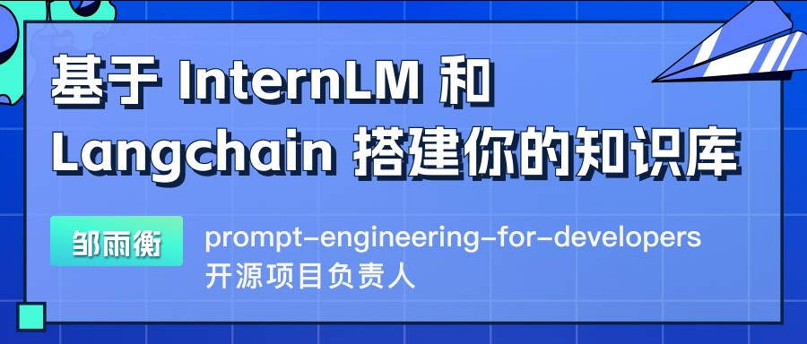
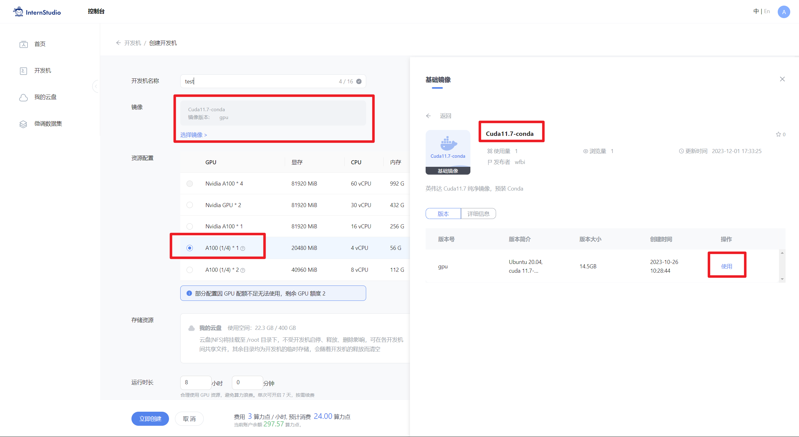
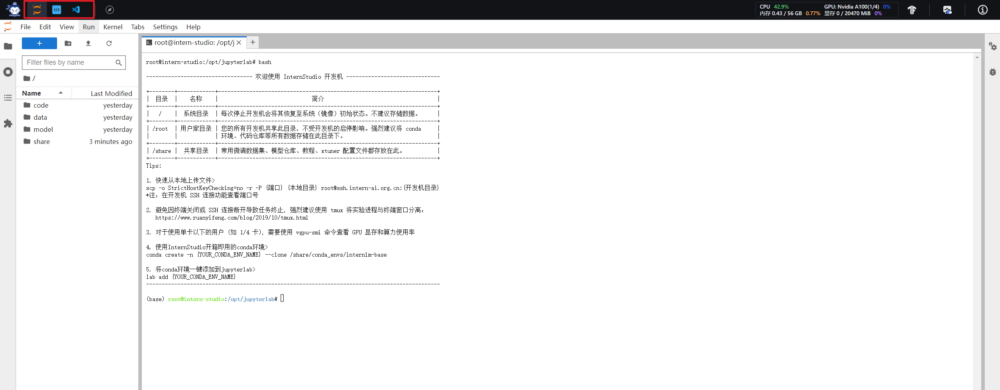
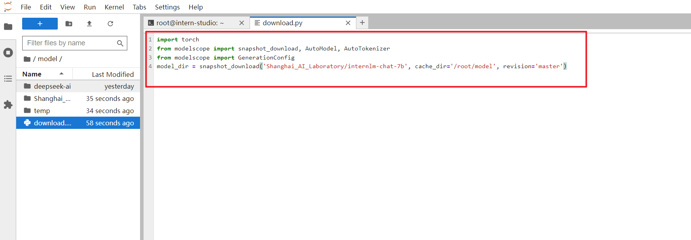
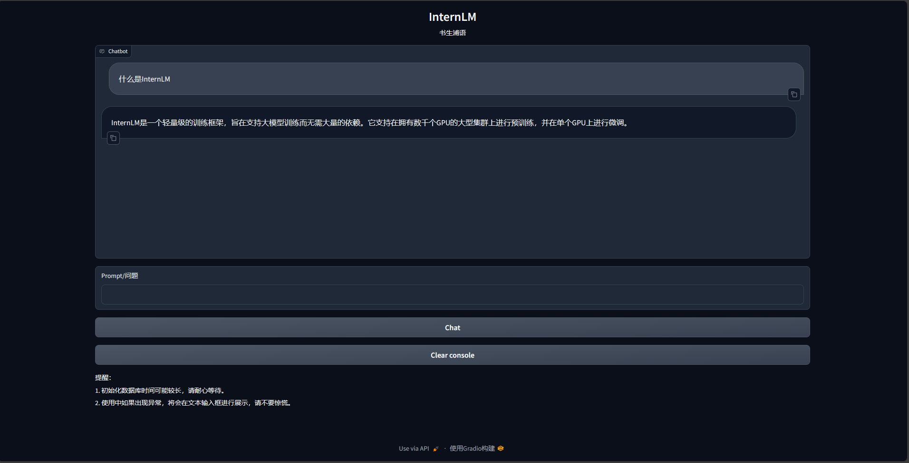
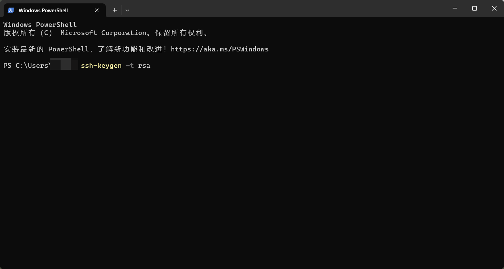
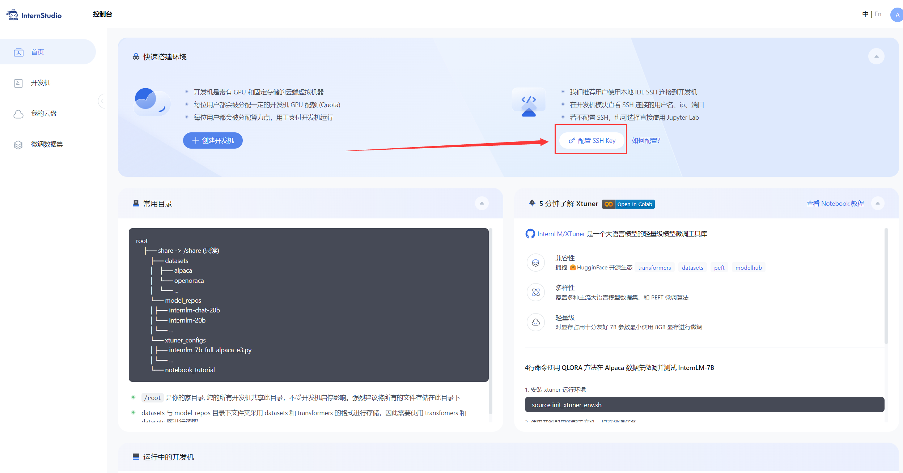
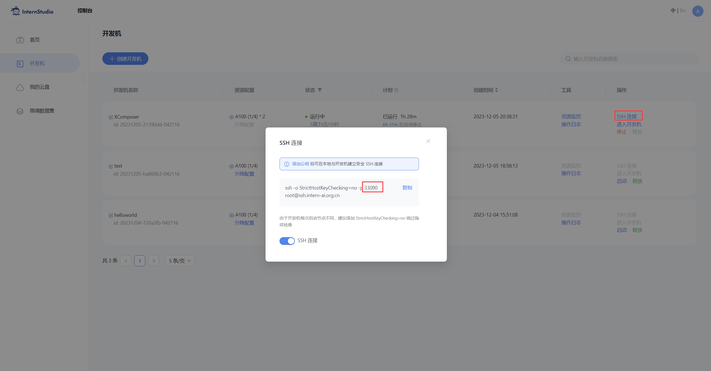

# 基于 InternLM 和 LangChain 搭建知识库助手

## 一、环境配置

### 1.1 InternLM 模型部署

在[InternStudio](https://studio.intern-ai.org.cn/)平台中选择A100(1/4)的配置，如下图所示镜像选择`Cuda11.7-conda`，如下图所示：



接下来打开刚刚租用服务器的`进入开发机`，并且打开其中的终端开始环境配置、模型下载和运行`demo`。


进入开发机后，在页面的左上角可以切换`JupyterLab`、`终端`和`VScode`，并在终端输入`bash`命令，进入`conda`环境。如下图所示：



进入`conda`环境之后，使用以下命令从本地一个已有的`pytorch 2.0.1` 的环境

```shell
bash
conda create --name InternLM --clone=/root/share/conda_envs/internlm-base
```

然后使用以下命令激活环境

```shell
conda activate InternLM
```

并在环境中安装运行demo所需要的依赖。

```shell
# 升级pip
python -m pip install --upgrade pip

pip install modelscope==1.9.5
pip install transformers==4.35.2
pip install streamlit==1.24.0
pip install sentencepiece==0.1.99
pip install accelerate==0.24.1
```

### 1.2 模型下载

在本地的 `/root/share/temp/model_repos/internlm-chat-7b` 目录下已存储有所需的模型文件参数，可以直接拷贝到个人目录的模型保存地址：

```bash
mkdir -p /root/data/model/Shanghai_AI_Laboratory
cp -r /root/share/temp/model_repos/internlm-chat-7b /root/data/model/Shanghai_AI_Laboratory/internlm-chat-7b
```

如果本地拷贝模型参数出现问题，我们也可以使用 `modelscope` 中的`snapshot_download`函数下载模型，第一个参数为模型名称，参数`cache_dir`为模型的下载路径。

在 `/root` 路径下新建目录`data`，在目录下新建 `download.py` 文件并在其中输入以下内容，粘贴代码后记得保存文件，如下图所示。并运行 `python /root/data/download.py`执行下载，模型大小为 14 GB，下载模型大概需要 10~20 分钟

```python
import torch
from modelscope import snapshot_download, AutoModel, AutoTokenizer
import os
model_dir = snapshot_download('Shanghai_AI_Laboratory/internlm-chat-7b', cache_dir='/root/data/model', revision='v1.0.3')
```

> 注意：使用`pwd`命令可以查看当前的路径，`JupyterLab`左侧目录栏显示为`/root/`下的路径。



### 1.3 LangChain 相关环境配置

在已完成 InternLM 的部署基础上，还需要安装以下依赖包：

```bash
pip install langchain==0.0.292
pip install gradio==4.4.0
pip install chromadb==0.4.15
pip install sentence-transformers==2.2.2
pip install unstructured==0.10.30
pip install markdown==3.3.7
```

同时，我们需要使用到开源词向量模型 [Sentence Transformer](https://huggingface.co/sentence-transformers/paraphrase-multilingual-MiniLM-L12-v2):（我们也可以选用别的开源词向量模型来进行 Embedding，目前选用这个模型是相对轻量、支持中文且效果较好的，同学们可以自由尝试别的开源词向量模型）

首先需要使用`huggingface`官方提供的`huggingface-cli`命令行工具。安装依赖:

```shell
pip install -U huggingface_hub
```

然后在和 `/root/data` 目录下新建python文件 `download_hf.py`，填入以下代码：

- resume-download：断点续下
- local-dir：本地存储路径。（linux环境下需要填写绝对路径）

```python
import os

# 下载模型
os.system('huggingface-cli download --resume-download sentence-transformers/paraphrase-multilingual-MiniLM-L12-v2 --local-dir /root/data/model/sentence-transformer')
```

但是，使用 huggingface 下载可能速度较慢，我们可以使用 huggingface 镜像下载。与使用hugginge face下载相同，只需要填入镜像地址即可。

将 `download_hf.py` 中的代码修改为以下代码：

```python
import os

# 设置环境变量
os.environ['HF_ENDPOINT'] = 'https://hf-mirror.com'

# 下载模型
os.system('huggingface-cli download --resume-download sentence-transformers/paraphrase-multilingual-MiniLM-L12-v2 --local-dir /root/data/model/sentence-transformer')
```

然后，在 `\root\data` 目录下执行该脚本即可自动开始下载：

```bash
python download_hf.py
```

更多关于镜像使用可以移步至 [HF Mirror](https://hf-mirror.com/) 查看。

### 1.4 下载 NLTK 相关资源

我们在使用开源词向量模型构建开源词向量的时候，需要用到第三方库 `nltk` 的一些资源。正常情况下，其会自动从互联网上下载，但可能由于网络原因会导致下载中断，此处我们可以手动将相关资源下载保存到服务器上。

首先我们在 `root` 目录下新建一个 `nltk_data` 目录：

```bash
cd /root
mkdir nltk_data
```

接着进入 `nltk_data`，新建两个文件夹 `taggers` 和 `tokenizers`：

```bash
cd nltk_data
mkdir taggers
mkdir tokenizers
```

接着我们首先使用 `wget` 工具（Linux 系统自带）来下载 `punkt` 资源：

```bash
cd tokenizers
wget -O punkt.zip https://raw.githubusercontent.com/nltk/nltk_data/gh-pages/packages/tokenizers/punkt.zip
```

然后解压下载下来的文件即可：

```bash
unzip punkt.zip
```

然后我们以相同的方式下载 `Averaged Perceptron Tagger` 资源：

```bash
cd ..
cd taggers
wget -O averaged_perceptron_tagger.zip https://raw.githubusercontent.com/nltk/nltk_data/gh-pages/packages/taggers/averaged_perceptron_tagger.zip
```

同样解压该文件：

```bash
unzip averaged_perceptron_tagger.zip
```

之后使用时服务器即会自动使用已有资源，无需再次下载。

## 二、知识库搭建

### 2.1 数据收集

我们选择由上海人工智能实验室开源的一系列大模型工具开源仓库作为语料库来源，包括：

- [OpenCompass](https://gitee.com/open-compass/opencompass)：面向大模型评测的一站式平台
- [Imdeploy](https://gitee.com/InternLM/lmdeploy)：涵盖了 LLM 任务的全套轻量化、部署和服务解决方案的高效推理工具箱
- [Xtuner](https://gitee.com/InternLM/xtuner)：轻量级微调大语言模型的工具库
- [InternLM-XComposer](https://gitee.com/InternLM/InternLM-XComposer)：浦语·灵笔，基于书生·浦语大语言模型研发的视觉-语言大模型
- [Lagent](https://gitee.com/InternLM/lagent)：一个轻量级、开源的基于大语言模型的智能体（agent）框架
- [InternLM](https://gitee.com/InternLM/InternLM)：一个开源的轻量级训练框架，旨在支持大模型训练而无需大量的依赖

首先我们需要将上述远程开源仓库 Clone 到本地，可以使用以下命令：

```bash
# 进入到数据库盘
cd /root/data
# clone 上述开源仓库
git clone https://gitee.com/open-compass/opencompass.git
git clone https://gitee.com/InternLM/lmdeploy.git
git clone https://gitee.com/InternLM/xtuner.git
git clone https://gitee.com/InternLM/InternLM-XComposer.git
git clone https://gitee.com/InternLM/lagent.git
git clone https://gitee.com/InternLM/InternLM.git
```

接着，为语料处理方便，我们将选用上述仓库中所有的 markdown、txt 文件作为示例语料库。注意，也可以选用其中的代码文件加入到知识库中，但需要针对代码文件格式进行额外处理（因为代码文件对逻辑联系要求较高，且规范性较强，在分割时最好基于代码模块进行分割再加入向量数据库）。

我们首先将上述仓库中所有满足条件的文件路径找出来，我们定义一个函数，该函数将递归指定文件夹路径，返回其中所有满足条件（即后缀名为 .md 或者 .txt 的文件）的文件路径：

```python
import os 
def get_files(dir_path):
    # args：dir_path，目标文件夹路径
    file_list = []
    for filepath, dirnames, filenames in os.walk(dir_path):
        # os.walk 函数将递归遍历指定文件夹
        for filename in filenames:
            # 通过后缀名判断文件类型是否满足要求
            if filename.endswith(".md"):
                # 如果满足要求，将其绝对路径加入到结果列表
                file_list.append(os.path.join(filepath, filename))
            elif filename.endswith(".txt"):
                file_list.append(os.path.join(filepath, filename))
    return file_list
```

### 2.2 加载数据

得到所有目标文件路径之后，我们可以使用 LangChain 提供的 FileLoader 对象来加载目标文件，得到由目标文件解析出的纯文本内容。由于不同类型的文件需要对应不同的 FileLoader，我们判断目标文件类型，并针对性调用对应类型的 FileLoader，同时，调用 FileLoader 对象的 load 方法来得到加载之后的纯文本对象：

```python
from tqdm import tqdm
from langchain.document_loaders import UnstructuredFileLoader
from langchain.document_loaders import UnstructuredMarkdownLoader

def get_text(dir_path):
    # args：dir_path，目标文件夹路径
    # 首先调用上文定义的函数得到目标文件路径列表
    file_lst = get_files(dir_path)
    # docs 存放加载之后的纯文本对象
    docs = []
    # 遍历所有目标文件
    for one_file in tqdm(file_lst):
        file_type = one_file.split('.')[-1]
        if file_type == 'md':
            loader = UnstructuredMarkdownLoader(one_file)
        elif file_type == 'txt':
            loader = UnstructuredFileLoader(one_file)
        else:
            # 如果是不符合条件的文件，直接跳过
            continue
        docs.extend(loader.load())
    return docs
```

使用上文函数，我们得到的 `docs` 为一个纯文本对象对应的列表。

### 2.3 构建向量数据库

得到该列表之后，我们就可以将它引入到 LangChain 框架中构建向量数据库。由纯文本对象构建向量数据库，我们需要先对文本进行分块，接着对文本块进行向量化。

LangChain 提供了多种文本分块工具，此处我们使用字符串递归分割器，并选择分块大小为 500，块重叠长度为 150（由于篇幅限制，此处没有展示切割效果，学习者可以自行尝试一下，想要深入学习 LangChain 文本分块可以参考教程[《LangChain - Chat With Your Data》](https://github.com/datawhalechina/prompt-engineering-for-developers/blob/9dbcb48416eb8af9ff9447388838521dc0f9acb0/content/LangChain%20Chat%20with%20Your%20Data/1.%E7%AE%80%E4%BB%8B%20Introduction.md)：

```python
from langchain.text_splitter import RecursiveCharacterTextSplitter

text_splitter = RecursiveCharacterTextSplitter(
    chunk_size=500, chunk_overlap=150)
split_docs = text_splitter.split_documents(docs)
```

接着我们选用开源词向量模型 [Sentence Transformer](https://huggingface.co/sentence-transformers/paraphrase-multilingual-MiniLM-L12-v2)来进行文本向量化。LangChain 提供了直接引入 HuggingFace 开源社区中的模型进行向量化的接口：

```python
from langchain.embeddings.huggingface import HuggingFaceEmbeddings

embeddings = HuggingFaceEmbeddings(model_name="/root/data/model/sentence-transformer")
```

同时，考虑到 Chroma 是目前最常用的入门数据库，我们选择 Chroma 作为向量数据库，基于上文分块后的文档以及加载的开源向量化模型，将语料加载到指定路径下的向量数据库：

```python
from langchain.vectorstores import Chroma

# 定义持久化路径
persist_directory = 'data_base/vector_db/chroma'
# 加载数据库
vectordb = Chroma.from_documents(
    documents=split_docs,
    embedding=embeddings,
    persist_directory=persist_directory  # 允许我们将persist_directory目录保存到磁盘上
)
# 将加载的向量数据库持久化到磁盘上
vectordb.persist()
```

### 2.4 整体脚本

将上述代码整合在一起为知识库搭建的脚本：

```python
# 首先导入所需第三方库
from langchain.document_loaders import UnstructuredFileLoader
from langchain.document_loaders import UnstructuredMarkdownLoader
from langchain.text_splitter import RecursiveCharacterTextSplitter
from langchain.vectorstores import Chroma
from langchain.embeddings.huggingface import HuggingFaceEmbeddings
from tqdm import tqdm
import os

# 获取文件路径函数
def get_files(dir_path):
    # args：dir_path，目标文件夹路径
    file_list = []
    for filepath, dirnames, filenames in os.walk(dir_path):
        # os.walk 函数将递归遍历指定文件夹
        for filename in filenames:
            # 通过后缀名判断文件类型是否满足要求
            if filename.endswith(".md"):
                # 如果满足要求，将其绝对路径加入到结果列表
                file_list.append(os.path.join(filepath, filename))
            elif filename.endswith(".txt"):
                file_list.append(os.path.join(filepath, filename))
    return file_list

# 加载文件函数
def get_text(dir_path):
    # args：dir_path，目标文件夹路径
    # 首先调用上文定义的函数得到目标文件路径列表
    file_lst = get_files(dir_path)
    # docs 存放加载之后的纯文本对象
    docs = []
    # 遍历所有目标文件
    for one_file in tqdm(file_lst):
        file_type = one_file.split('.')[-1]
        if file_type == 'md':
            loader = UnstructuredMarkdownLoader(one_file)
        elif file_type == 'txt':
            loader = UnstructuredFileLoader(one_file)
        else:
            # 如果是不符合条件的文件，直接跳过
            continue
        docs.extend(loader.load())
    return docs

# 目标文件夹
tar_dir = [
    "/root/data/InternLM",
    "/root/data/InternLM-XComposer",
    "/root/data/lagent",
    "/root/data/lmdeploy",
    "/root/data/opencompass",
    "/root/data/xtuner"
]

# 加载目标文件
docs = []
for dir_path in tar_dir:
    docs.extend(get_text(dir_path))

# 对文本进行分块
text_splitter = RecursiveCharacterTextSplitter(
    chunk_size=500, chunk_overlap=150)
split_docs = text_splitter.split_documents(docs)

# 加载开源词向量模型
embeddings = HuggingFaceEmbeddings(model_name="/root/data/model/sentence-transformer")

# 构建向量数据库
# 定义持久化路径
persist_directory = 'data_base/vector_db/chroma'
# 加载数据库
vectordb = Chroma.from_documents(
    documents=split_docs,
    embedding=embeddings,
    persist_directory=persist_directory  # 允许我们将persist_directory目录保存到磁盘上
)
# 将加载的向量数据库持久化到磁盘上
vectordb.persist()
```

可以在 `/root/data` 下新建一个 `demo`目录，将该脚本和后续脚本均放在该目录下运行。运行上述脚本，即可在本地构建已持久化的向量数据库，后续直接导入该数据库即可，无需重复构建。

## 三、InternLM 接入 LangChain

为便捷构建 LLM 应用，我们需要基于本地部署的 InternLM，继承 LangChain 的 LLM 类自定义一个 InternLM LLM 子类，从而实现将 InternLM 接入到 LangChain 框架中。完成 LangChain 的自定义 LLM 子类之后，可以以完全一致的方式调用 LangChain 的接口，而无需考虑底层模型调用的不一致。

基于本地部署的 InternLM 自定义 LLM 类并不复杂，我们只需从 LangChain.llms.base.LLM 类继承一个子类，并重写构造函数与 `_call` 函数即可：

```python
from langchain.llms.base import LLM
from typing import Any, List, Optional
from langchain.callbacks.manager import CallbackManagerForLLMRun
from transformers import AutoTokenizer, AutoModelForCausalLM
import torch

class InternLM_LLM(LLM):
    # 基于本地 InternLM 自定义 LLM 类
    tokenizer : AutoTokenizer = None
    model: AutoModelForCausalLM = None

    def __init__(self, model_path :str):
        # model_path: InternLM 模型路径
        # 从本地初始化模型
        super().__init__()
        print("正在从本地加载模型...")
        self.tokenizer = AutoTokenizer.from_pretrained(model_path, trust_remote_code=True)
        self.model = AutoModelForCausalLM.from_pretrained(model_path, trust_remote_code=True).to(torch.bfloat16).cuda()
        self.model = self.model.eval()
        print("完成本地模型的加载")

    def _call(self, prompt : str, stop: Optional[List[str]] = None,
                run_manager: Optional[CallbackManagerForLLMRun] = None,
                **kwargs: Any):
        # 重写调用函数
        response, history = self.model.chat(self.tokenizer, prompt , history=[])
        return response
        
    @property
    def _llm_type(self) -> str:
        return "InternLM"
```

在上述类定义中，我们分别重写了构造函数和 `_call` 函数：对于构造函数，我们在对象实例化的一开始加载本地部署的 InternLM 模型，从而避免每一次调用都需要重新加载模型带来的时间过长；`_call` 函数是 LLM 类的核心函数，LangChain 会调用该函数来调用 LLM，在该函数中，我们调用已实例化模型的 chat 方法，从而实现对模型的调用并返回调用结果。

在整体项目中，我们将上述代码封装为 LLM.py，后续将直接从该文件中引入自定义的 LLM 类。

## 四、构建检索问答链

LangChain 通过提供检索问答链对象来实现对于 RAG 全流程的封装。所谓检索问答链，即通过一个对象完成检索增强问答（即RAG）的全流程，针对 RAG 的更多概念，我们会在视频内容中讲解，也欢迎读者查阅该教程来进一步了解：[《LLM Universe》](https://github.com/datawhalechina/llm-universe/tree/main)。我们可以调用一个 LangChain 提供的 `RetrievalQA` 对象，通过初始化时填入已构建的数据库和自定义 LLM 作为参数，来简便地完成检索增强问答的全流程，LangChain 会自动完成基于用户提问进行检索、获取相关文档、拼接为合适的 Prompt 并交给 LLM 问答的全部流程。

### 4.1 加载向量数据库

首先我们需要将上文构建的向量数据库导入进来，我们可以直接通过 Chroma 以及上文定义的词向量模型来加载已构建的数据库：

```python
from langchain.vectorstores import Chroma
from langchain.embeddings.huggingface import HuggingFaceEmbeddings
import os

# 定义 Embeddings
embeddings = HuggingFaceEmbeddings(model_name="/root/data/model/sentence-transformer")

# 向量数据库持久化路径
persist_directory = 'data_base/vector_db/chroma'

# 加载数据库
vectordb = Chroma(
    persist_directory=persist_directory, 
    embedding_function=embeddings
)
```

上述代码得到的 `vectordb` 对象即为我们已构建的向量数据库对象，该对象可以针对用户的 `query` 进行语义向量检索，得到与用户提问相关的知识片段。

### 4.2 实例化自定义 LLM 与 Prompt Template

接着，我们实例化一个基于 InternLM 自定义的 LLM 对象：

```python
from LLM import InternLM_LLM
llm = InternLM_LLM(model_path = "/root/data/model/Shanghai_AI_Laboratory/internlm-chat-7b")
llm.predict("你是谁")
```

构建检索问答链，还需要构建一个 Prompt Template，该 Template 其实基于一个带变量的字符串，在检索之后，LangChain 会将检索到的相关文档片段填入到 Template 的变量中，从而实现带知识的 Prompt 构建。我们可以基于 LangChain 的 Template 基类来实例化这样一个 Template 对象：

```python
from langchain.prompts import PromptTemplate

# 我们所构造的 Prompt 模板
template = """使用以下上下文来回答最后的问题。如果你不知道答案，就说你不知道，不要试图编造答案。尽量使答案简明扼要。总是在回答的最后说“谢谢你的提问！”。
{context}
问题: {question}
有用的回答:"""

# 调用 LangChain 的方法来实例化一个 Template 对象，该对象包含了 context 和 question 两个变量，在实际调用时，这两个变量会被检索到的文档片段和用户提问填充
QA_CHAIN_PROMPT = PromptTemplate(input_variables=["context","question"],template=template)
```

### 4.3 构建检索问答链

最后，可以调用 LangChain 提供的检索问答链构造函数，基于我们的自定义 LLM、Prompt Template 和向量知识库来构建一个基于 InternLM 的检索问答链：

```python
from langchain.chains import RetrievalQA

qa_chain = RetrievalQA.from_chain_type(llm,retriever=vectordb.as_retriever(),return_source_documents=True,chain_type_kwargs={"prompt":QA_CHAIN_PROMPT})
```

得到的 `qa_chain` 对象即可以实现我们的核心功能，即基于 InternLM 模型的专业知识库助手。我们可以对比该检索问答链和纯 LLM 的问答效果：

```python
# 检索问答链回答效果
question = "什么是InternLM"
result = qa_chain({"query": question})
print("检索问答链回答 question 的结果：")
print(result["result"])

# 仅 LLM 回答效果
result_2 = llm(question)
print("大模型回答 question 的结果：")
print(result_2)
```

## 五、部署 Web Demo

在完成上述核心功能后，我们可以基于 Gradio 框架将其部署到 Web 网页，从而搭建一个小型 Demo，便于测试与使用。

我们首先将上文的代码内容封装为一个返回构建的检索问答链对象的函数，并在启动 Gradio 的第一时间调用该函数得到检索问答链对象，后续直接使用该对象进行问答对话，从而避免重复加载模型：

```python

from langchain.vectorstores import Chroma
from langchain.embeddings.huggingface import HuggingFaceEmbeddings
import os
from LLM import InternLM_LLM
from langchain.prompts import PromptTemplate
from langchain.chains import RetrievalQA

def load_chain():
    # 加载问答链
    # 定义 Embeddings
    embeddings = HuggingFaceEmbeddings(model_name="/root/data/model/sentence-transformer")

    # 向量数据库持久化路径
    persist_directory = 'data_base/vector_db/chroma'

    # 加载数据库
    vectordb = Chroma(
        persist_directory=persist_directory,  # 允许我们将persist_directory目录保存到磁盘上
        embedding_function=embeddings
    )

    # 加载自定义 LLM
    llm = InternLM_LLM(model_path = "/root/data/model/Shanghai_AI_Laboratory/internlm-chat-7b")

    # 定义一个 Prompt Template
    template = """使用以下上下文来回答最后的问题。如果你不知道答案，就说你不知道，不要试图编造答
    案。尽量使答案简明扼要。总是在回答的最后说“谢谢你的提问！”。
    {context}
    问题: {question}
    有用的回答:"""

    QA_CHAIN_PROMPT = PromptTemplate(input_variables=["context","question"],template=template)

    # 运行 chain
    qa_chain = RetrievalQA.from_chain_type(llm,retriever=vectordb.as_retriever(),return_source_documents=True,chain_type_kwargs={"prompt":QA_CHAIN_PROMPT})
    
    return qa_chain
```

接着我们定义一个类，该类负责加载并存储检索问答链，并响应 Web 界面里调用检索问答链进行回答的动作：

```python
class Model_center():
    """
    存储检索问答链的对象 
    """
    def __init__(self):
        # 构造函数，加载检索问答链
        self.chain = load_chain()

    def qa_chain_self_answer(self, question: str, chat_history: list = []):
        """
        调用问答链进行回答
        """
        if question == None or len(question) < 1:
            return "", chat_history
        try:
            chat_history.append(
                (question, self.chain({"query": question})["result"]))
            # 将问答结果直接附加到问答历史中，Gradio 会将其展示出来
            return "", chat_history
        except Exception as e:
            return e, chat_history

```

然后我们只需按照 Gradio 的框架使用方法，实例化一个 Web 界面并将点击动作绑定到上述类的回答方法即可：

```python
import gradio as gr

# 实例化核心功能对象
model_center = Model_center()
# 创建一个 Web 界面
block = gr.Blocks()
with block as demo:
    with gr.Row(equal_height=True):   
        with gr.Column(scale=15):
            # 展示的页面标题
            gr.Markdown("""<h1><center>InternLM</center></h1>
                <center>书生浦语</center>
                """)

    with gr.Row():
        with gr.Column(scale=4):
            # 创建一个聊天机器人对象
            chatbot = gr.Chatbot(height=450, show_copy_button=True)
            # 创建一个文本框组件，用于输入 prompt。
            msg = gr.Textbox(label="Prompt/问题")

            with gr.Row():
                # 创建提交按钮。
                db_wo_his_btn = gr.Button("Chat")
            with gr.Row():
                # 创建一个清除按钮，用于清除聊天机器人组件的内容。
                clear = gr.ClearButton(
                    components=[chatbot], value="Clear console")
                
        # 设置按钮的点击事件。当点击时，调用上面定义的 qa_chain_self_answer 函数，并传入用户的消息和聊天历史记录，然后更新文本框和聊天机器人组件。
        db_wo_his_btn.click(model_center.qa_chain_self_answer, inputs=[
                            msg, chatbot], outputs=[msg, chatbot])

    gr.Markdown("""提醒：<br>
    1. 初始化数据库时间可能较长，请耐心等待。
    2. 使用中如果出现异常，将会在文本输入框进行展示，请不要惊慌。 <br>
    """)
gr.close_all()
# 直接启动
demo.launch()
```

通过将上述代码封装为 run_gradio.py 脚本，直接通过 python 命令运行，即可在本地启动知识库助手的 Web Demo，默认会在 7860 端口运行，接下来将服务器端口映射到本地端口即可访问:



此处我们简要介绍如何将服务器端口映射到本地端口：

首先我们需要配置一下本地的 `SSH Key` ，我们这里以`Windows`为例。

1. 在本地机器上打开`Power Shell`终端。在终端中，运行以下命令来生成SSH密钥对：（如下图所示）
```shell
ssh-keygen -t rsa
```


2. 您将被提示选择密钥文件的保存位置，默认情况下是在 `~/.ssh/` 目录中。按Enter键接受默认值或输入自定义路径。

3. 公钥默认存储在 `~/.ssh/id_rsa.pub`，可以通过系统自带的 `cat` 工具查看文件内容：（如下图所示）

> `~` 是用户主目录的简写，`.ssh` 是SSH配置文件的默认存储目录，`id_rsa.pub` 是SSH公钥文件的默认名称。所以，`cat ~\.ssh\id_rsa.pub` 的意思是查看用户主目录下的 `.ssh` 目录中的 id_rsa.pub 文件的内容。

```shell
cat ~\.ssh\id_rsa.pub
```


4. 将公钥复制到剪贴板中，然后回到 `InternStudio` 控制台，点击配置SSH Key。如下图所示：



5. 将刚刚复制的公钥添加进入即可。


6. 在本地终端输入以下指令.7860是在服务器中打开的端口，而33090是根据开发机的端口进行更改。如下图所示：

```shell
ssh -CNg -L 7860:127.0.0.1:7860 root@ssh.intern-ai.org.cn -p 33090
```



我们在仓库中也同步提供了上述所有脚本，可以查看该教程文件的同级目录的 `demo` 文件夹。
