<div align="center">


</div>

- [1.LMDeploy环境部署](#1lmdeploy环境部署)
  - [1.1 创建开发机](#11-创建开发机)
  - [1.2 创建conda环境](#12-创建conda环境)
    - [InternStudio开发机创建conda环境（推荐）](#internstudio开发机创建conda环境推荐)
    - [本地环境创建conda环境](#本地环境创建conda环境)
  - [1.3 安装LMDeploy](#13-安装lmdeploy)
- [2.LMDeploy模型对话(chat)](#2lmdeploy模型对话chat)
  - [2.1 Huggingface与TurboMind](#21-huggingface与turbomind)
    - [HuggingFace](#huggingface)
    - [TurboMind](#turbomind)
  - [2.2 下载模型](#22-下载模型)
    - [InternStudio开发机上下载模型（推荐）](#internstudio开发机上下载模型推荐)
    - [由OpenXLab平台下载模型](#由openxlab平台下载模型)
  - [2.3 使用Transformer库运行模型](#23-使用transformer库运行模型)
  - [2.4 使用LMDeploy与模型对话](#24-使用lmdeploy与模型对话)
- [3.LMDeploy模型量化(lite)](#3lmdeploy模型量化lite)
  - [3.1 设置最大KV Cache缓存大小](#31-设置最大kv-cache缓存大小)
  - [3.2 使用W4A16量化](#32-使用w4a16量化)
- [4.LMDeploy服务(serve)](#4lmdeploy服务serve)
  - [4.1 启动API服务器](#41-启动api服务器)
  - [4.2 命令行客户端连接API服务器](#42-命令行客户端连接api服务器)
  - [4.3 网页客户端连接API服务器](#43-网页客户端连接api服务器)
- [5.Python代码集成](#5python代码集成)
  - [5.1 Python代码集成运行1.8B模型](#51-python代码集成运行18b模型)
  - [5.2 向TurboMind后端传递参数](#52-向turbomind后端传递参数)
- [6.拓展部分](#6拓展部分)
  - [6.1 使用LMDeploy运行视觉多模态大模型llava](#61-使用lmdeploy运行视觉多模态大模型llava)
  - [6.2 使用LMDeploy运行第三方大模型](#62-使用lmdeploy运行第三方大模型)
  - [6.3 定量比较LMDeploy与Transformer库的推理速度差异](#63-定量比较lmdeploy与transformer库的推理速度差异)
- [课后作业](#课后作业)


# 1.LMDeploy环境部署

## 1.1 创建开发机

打开InternStudio平台，创建开发机。

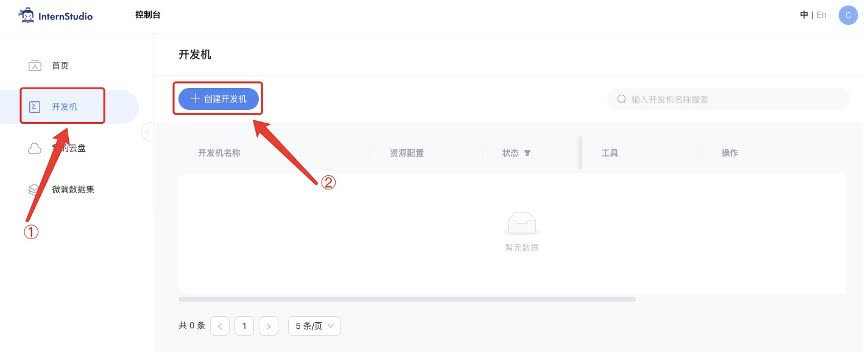

填写开发机名称；选择镜像`Cuda12.2-conda`；选择`10% A100*1`GPU；点击“立即创建”。**注意请不要选择`Cuda11.7-conda`的镜像，新版本的lmdeploy会出现兼容性问题。**

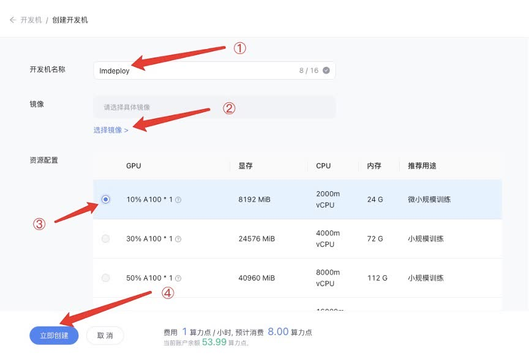

排队等待一小段时间，点击“进入开发机”。

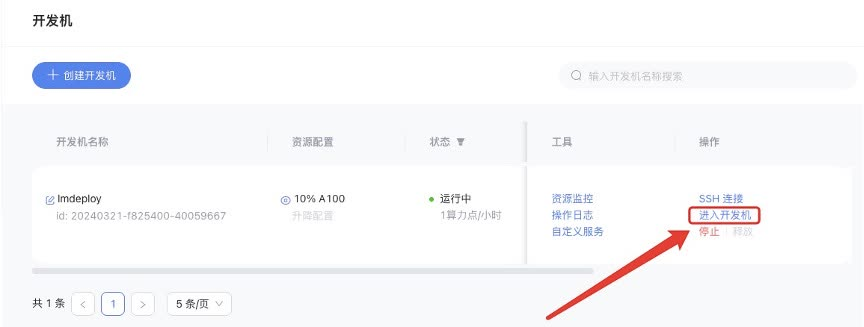

点击左上角图标，切换为终端(Terminal)模式。


## 1.2 创建conda环境

### InternStudio开发机创建conda环境（推荐）

由于环境依赖项存在torch，下载过程可能比较缓慢。InternStudio上提供了快速创建conda环境的方法。打开命令行终端，创建一个名为`lmdeploy`的环境：

```sh
studio-conda -t lmdeploy -o pytorch-2.1.2
```

环境创建成功后，提示如下：

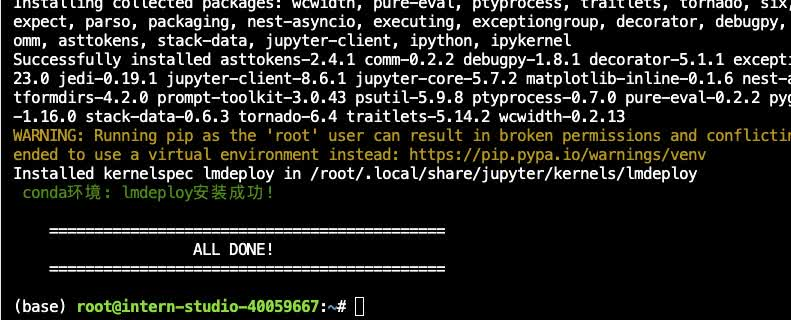

### 本地环境创建conda环境

注意，如果你在上一步已经在InternStudio开发机上创建了conda环境，这一步就没必要执行了。

<details>

打开命令行终端，让我们来创建一个名为`lmdeploy`的conda环境，python版本为3.10。

```sh
conda create -n lmdeploy -y python=3.10
```

环境创建成功后，提示如下：

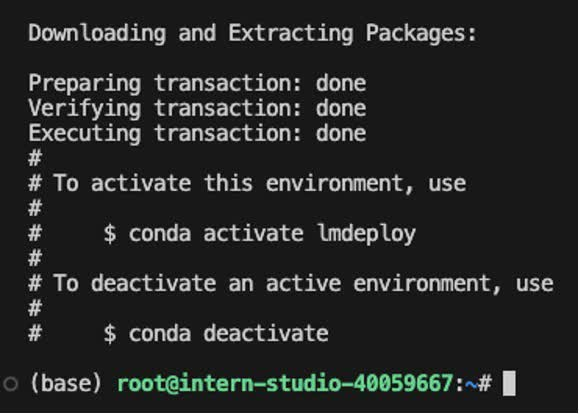

</details>

## 1.3 安装LMDeploy

接下来，激活刚刚创建的虚拟环境。

```sh
conda activate lmdeploy
```

安装0.3.0版本的lmdeploy。

```sh
pip install lmdeploy[all]==0.3.0
```

等待安装结束就OK了！

# 2.LMDeploy模型对话(chat)

## 2.1 Huggingface与TurboMind 

### HuggingFace

[HuggingFace](https://huggingface.co/)是一个高速发展的社区，包括Meta、Google、Microsoft、Amazon在内的超过5000家组织机构在为HuggingFace开源社区贡献代码、数据集和模型。可以认为是一个针对深度学习模型和数据集的在线托管社区，如果你有数据集或者模型想对外分享，网盘又不太方便，就不妨托管在HuggingFace。

托管在HuggingFace社区的模型通常采用HuggingFace格式存储，简写为**HF格式**。

但是HuggingFace社区的服务器在国外，国内访问不太方便。国内可以使用阿里巴巴的[MindScope](https://www.modelscope.cn/home)社区，或者上海AI Lab搭建的[OpenXLab](https://openxlab.org.cn/home)社区，上面托管的模型也通常采用**HF格式**。

### TurboMind 

TurboMind是LMDeploy团队开发的一款关于LLM推理的高效推理引擎，它的主要功能包括：LLaMa 结构模型的支持，continuous batch 推理模式和可扩展的 KV 缓存管理器。

TurboMind推理引擎仅支持推理TurboMind格式的模型。因此，TurboMind在推理HF格式的模型时，会首先自动将HF格式模型转换为TurboMind格式的模型。**该过程在新版本的LMDeploy中是自动进行的，无需用户操作。**

几个容易迷惑的点：
* TurboMind与LMDeploy的关系：LMDeploy是涵盖了LLM 任务全套轻量化、部署和服务解决方案的集成功能包，TurboMind是LMDeploy的一个推理引擎，是一个子模块。LMDeploy也可以使用pytorch作为推理引擎。
* TurboMind与TurboMind模型的关系：TurboMind是推理引擎的名字，TurboMind模型是一种模型存储格式，TurboMind引擎只能推理TurboMind格式的模型。

## 2.2 下载模型

本次实战营已经在开发机的共享目录中准备好了常用的预训练模型，可以运行如下命令查看： 

```sh
ls /root/share/new_models/Shanghai_AI_Laboratory/
```

显示如下，每一个文件夹都对应一个预训练模型。 

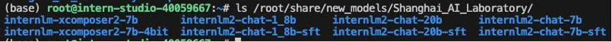

以InternLM2-Chat-1.8B模型为例，从官方仓库下载模型。

### InternStudio开发机上下载模型（推荐）

如果你是在InternStudio开发机上，可以按照如下步骤快速下载模型。

首先进入一个你想要存放模型的目录，本教程统一放置在Home目录。执行如下指令：

```sh
cd ~
```

然后执行如下指令由开发机的共享目录**软链接**或**拷贝**模型： 

```sh
ln -s /root/share/new_models/Shanghai_AI_Laboratory/internlm2-chat-1_8b /root/
# cp -r /root/share/new_models/Shanghai_AI_Laboratory/internlm2-chat-1_8b /root/
```

执行完如上指令后，可以运行“ls”命令。可以看到，当前目录下已经多了一个`internlm2-chat-1_8b`文件夹，即下载好的预训练模型。

```sh
ls
```


### 由OpenXLab平台下载模型

注意，如果你在上一步已经从InternStudio开发机上下载了模型，这一步就没必要执行了。

<details>

上一步介绍的方法只适用于在InternStudio开发机上下载模型，如果是在自己电脑的开发环境上，也可以由[OpenXLab](https://openxlab.org.cn/usercenter/OpenLMLab?vtab=create&module=datasets)下载。*在开发机上还是建议通过拷贝的方式，因为从OpenXLab平台下载会占用大量带宽~*

首先进入一个你想要存放模型的目录，本教程统一放置在Home目录。执行如下指令：

```sh
cd ~
```

OpenXLab平台支持通过Git协议下载模型。首先安装git-lfs组件。

* 对于root用于请执行如下指令：

```sh
curl -s https://packagecloud.io/install/repositories/github/git-lfs/script.deb.sh | bash
apt update
apt install git-lfs   
git lfs install  --system
```

* 对于非root用户需要加sudo，请执行如下指令：

```sh
curl -s https://packagecloud.io/install/repositories/github/git-lfs/script.deb.sh | sudo bash
sudo apt update
sudo apt install git-lfs   
sudo git lfs install  --system
```

安装好git-lfs组件后，由OpenXLab平台下载InternLM2-Chat-1.8B模型：

```sh
git clone https://code.openxlab.org.cn/OpenLMLab/internlm2-chat-1.8b.git
```

这一步骤可能耗时较长，主要取决于网速，耐心等待即可。

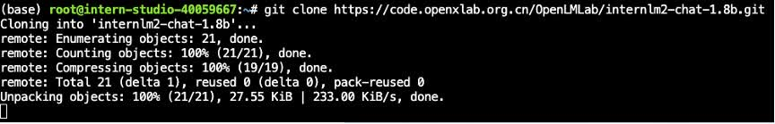

下载完成后，运行`ls`指令，可以看到当前目录下多了一个`internlm2-chat-1.8b`文件夹，即下载好的预训练模型。

```sh
ls
```

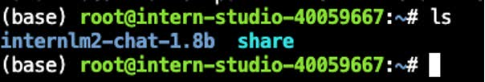

注意！从OpenXLab平台下载的模型文件夹命名为`1.8b`，而从InternStudio开发机直接拷贝的模型文件夹名称是`1_8b`，为了后续文档统一，这里统一命名为`1_8b`。

```sh
mv /root/internlm2-chat-1.8b /root/internlm2-chat-1_8b
```

</details>

## 2.3 使用Transformer库运行模型

Transformer库是Huggingface社区推出的用于运行HF模型的官方库。

在2.2中，我们已经下载好了InternLM2-Chat-1.8B的HF模型。下面我们先用Transformer来直接运行InternLM2-Chat-1.8B模型，后面对比一下LMDeploy的使用感受。

现在，让我们点击左上角的图标，打开VSCode。


在左边栏**空白区域**单击鼠标右键，点击`Open in Intergrated Terminal`。

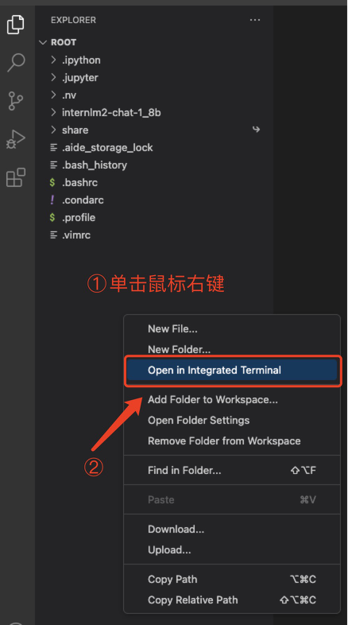

等待片刻，打开终端。

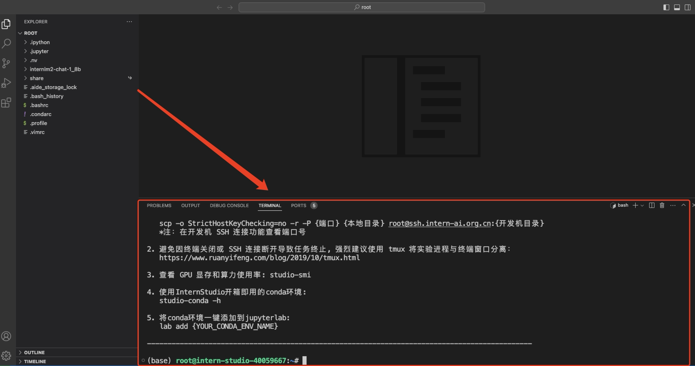

在终端中输入如下指令，新建`pipeline_transformer.py`。

```sh
touch /root/pipeline_transformer.py
```

回车执行指令，可以看到侧边栏多出了`pipeline_transformer.py`文件，点击打开。后文中如果要创建其他新文件，也是采取类似的操作。

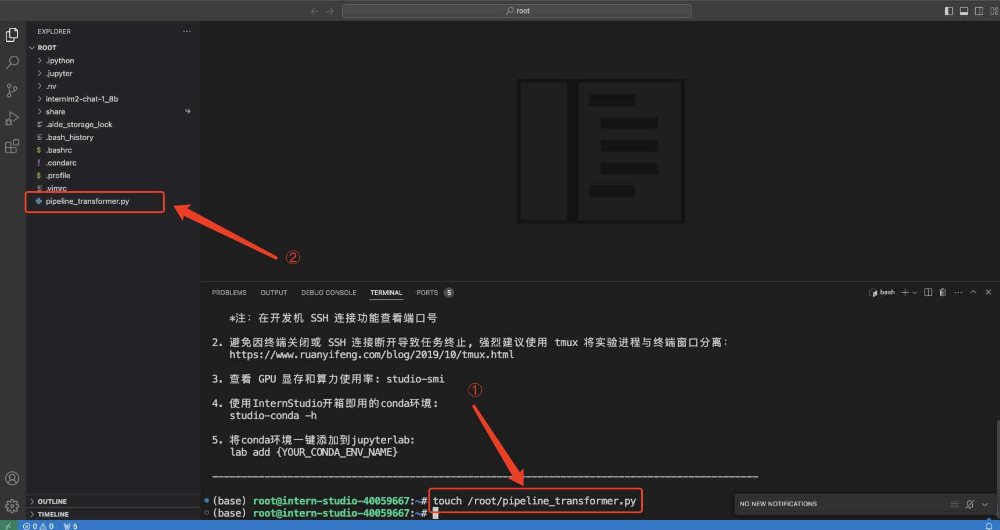

将以下内容复制粘贴进入`pipeline_transformer.py`。

```py
import torch
from transformers import AutoTokenizer, AutoModelForCausalLM

tokenizer = AutoTokenizer.from_pretrained("/root/internlm2-chat-1_8b", trust_remote_code=True)

# Set `torch_dtype=torch.float16` to load model in float16, otherwise it will be loaded as float32 and cause OOM Error.
model = AutoModelForCausalLM.from_pretrained("/root/internlm2-chat-1_8b", torch_dtype=torch.float16, trust_remote_code=True).cuda()
model = model.eval()

inp = "hello"
print("[INPUT]", inp)
response, history = model.chat(tokenizer, inp, history=[])
print("[OUTPUT]", response)

inp = "please provide three suggestions about time management"
print("[INPUT]", inp)
response, history = model.chat(tokenizer, inp, history=history)
print("[OUTPUT]", response)

```

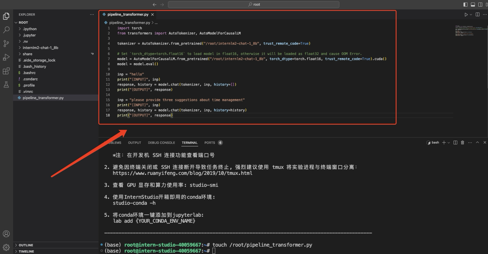

按`Ctrl+S`键保存（Mac用户按`Command+S`）。

回到终端，激活conda环境。

```sh
conda activate lmdeploy
```

运行python代码：

```sh
python /root/pipeline_transformer.py
```

得到输出：

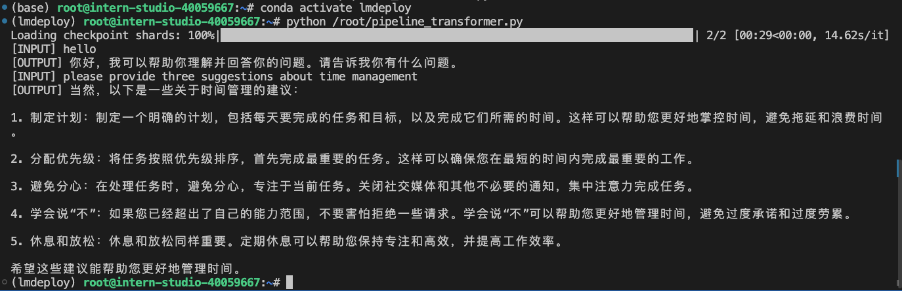

记住这种感觉，一会儿体验一下LMDeploy的推理速度，感受一下对比~（手动狗头）

## 2.4 使用LMDeploy与模型对话

这一小节我们来介绍如何应用LMDeploy直接与模型进行对话。

首先激活创建好的conda环境：

```sh
conda activate lmdeploy
```

使用LMDeploy与模型进行对话的通用命令格式为：

```sh
lmdeploy chat [HF格式模型路径/TurboMind格式模型路径]
```

例如，您可以执行如下命令运行下载的1.8B模型：

```sh
lmdeploy chat /root/internlm2-chat-1_8b
```

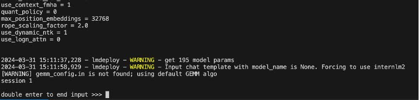

下面我们就可以与InternLM2-Chat-1.8B大模型对话了。比如输入“请给我讲一个小故事吧”，然后按两下回车键。

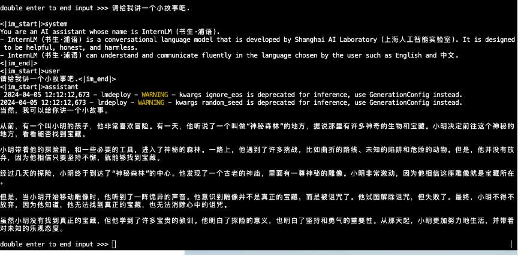

速度是不是明显比原生Transformer快呢~当然，这种感受可能不太直观，感兴趣的佬可以查看拓展部分“6.3 定量比较LMDeploy与Transformer库的推理速度”。

输入“exit”并按两下回车，可以退出对话。

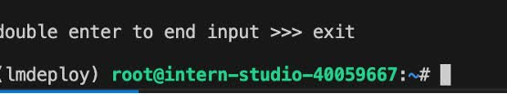

**拓展内容**：有关LMDeploy的chat功能的更多参数可通过-h命令查看。

```sh
lmdeploy chat -h
```

# 3.LMDeploy模型量化(lite)

本部分内容主要介绍如何对模型进行量化。主要包括 KV8量化和W4A16量化。总的来说，量化是一种以参数或计算中间结果精度下降换空间节省（以及同时带来的性能提升）的策略。

正式介绍 LMDeploy 量化方案前，需要先介绍两个概念：

* 计算密集（compute-bound）: 指推理过程中，绝大部分时间消耗在数值计算上；针对计算密集型场景，可以通过使用更快的硬件计算单元来提升计算速。
* 访存密集（memory-bound）: 指推理过程中，绝大部分时间消耗在数据读取上；针对访存密集型场景，一般通过减少访存次数、提高计算访存比或降低访存量来优化。

常见的 LLM 模型由于 Decoder Only 架构的特性，实际推理时大多数的时间都消耗在了逐 Token 生成阶段（Decoding 阶段），是典型的访存密集型场景。

那么，如何优化 LLM 模型推理中的访存密集问题呢？ 我们可以使用**KV8量化**和**W4A16**量化。KV8量化是指将逐 Token（Decoding）生成过程中的上下文 K 和 V 中间结果进行 INT8 量化（计算时再反量化），以降低生成过程中的显存占用。W4A16 量化，将 FP16 的模型权重量化为 INT4，Kernel 计算时，访存量直接降为 FP16 模型的 1/4，大幅降低了访存成本。Weight Only 是指仅量化权重，数值计算依然采用 FP16（需要将 INT4 权重反量化）。

## 3.1 设置最大KV Cache缓存大小

KV Cache是一种缓存技术，通过存储键值对的形式来复用计算结果，以达到提高性能和降低内存消耗的目的。在大规模训练和推理中，KV Cache可以显著减少重复计算量，从而提升模型的推理速度。理想情况下，KV Cache全部存储于显存，以加快访存速度。当显存空间不足时，也可以将KV Cache放在内存，通过缓存管理器控制将当前需要使用的数据放入显存。

模型在运行时，占用的显存可大致分为三部分：模型参数本身占用的显存、KV Cache占用的显存，以及中间运算结果占用的显存。LMDeploy的KV Cache管理器可以通过设置`--cache-max-entry-count`参数，控制KV缓存**占用剩余显存**的最大比例。默认的比例为0.8。

下面通过几个例子，来看一下调整`--cache-max-entry-count`参数的效果。首先保持不加该参数（默认0.8），运行1.8B模型。

```sh
lmdeploy chat /root/internlm2-chat-1_8b
```

与模型对话，查看右上角资源监视器中的显存占用情况。

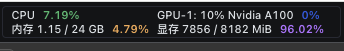

此时显存占用为7856MB。下面，改变`--cache-max-entry-count`参数，设为0.5。

```sh
lmdeploy chat /root/internlm2-chat-1_8b --cache-max-entry-count 0.5
```

与模型对话，再次查看右上角资源监视器中的显存占用情况。

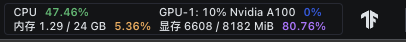

看到显存占用明显降低，变为6608M。

下面来一波“极限”，把`--cache-max-entry-count`参数设置为0.01，约等于禁止KV Cache占用显存。

```sh
lmdeploy chat /root/internlm2-chat-1_8b --cache-max-entry-count 0.01
```

然后与模型对话，可以看到，此时显存占用仅为4560MB，代价是会降低模型推理速度。

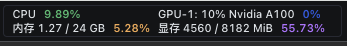


## 3.2 使用W4A16量化

LMDeploy使用AWQ算法，实现模型4bit权重量化。推理引擎TurboMind提供了非常高效的4bit推理cuda kernel，性能是FP16的2.4倍以上。它支持以下NVIDIA显卡：

* 图灵架构（sm75）：20系列、T4
* 安培架构（sm80,sm86）：30系列、A10、A16、A30、A100
* Ada Lovelace架构（sm90）：40 系列

运行前，首先安装一个依赖库。

```sh
pip install einops==0.7.0
```

仅需执行一条命令，就可以完成模型量化工作。

```sh
lmdeploy lite auto_awq \
   /root/internlm2-chat-1_8b \
  --calib-dataset 'ptb' \
  --calib-samples 128 \
  --calib-seqlen 1024 \
  --w-bits 4 \
  --w-group-size 128 \
  --work-dir /root/internlm2-chat-1_8b-4bit
```

运行时间较长，请耐心等待。量化工作结束后，新的HF模型被保存到`internlm2-chat-1_8b-4bit`目录。下面使用Chat功能运行W4A16量化后的模型。

```sh
lmdeploy chat /root/internlm2-chat-1_8b-4bit --model-format awq
```

为了更加明显体会到W4A16的作用，我们将KV Cache比例再次调为0.01，查看显存占用情况。

```sh
lmdeploy chat /root/internlm2-chat-1_8b-4bit --model-format awq --cache-max-entry-count 0.01
```

可以看到，显存占用变为2472MB，明显降低。

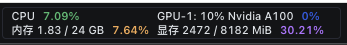

**拓展内容**：有关LMDeploy的lite功能的更多参数可通过-h命令查看。

```sh
lmdeploy lite -h
```

# 4.LMDeploy服务(serve)

在第二章和第三章，我们都是在本地直接推理大模型，这种方式成为本地部署。在生产环境下，我们有时会将大模型封装为API接口服务，供客户端访问。

我们来看下面一张架构图：

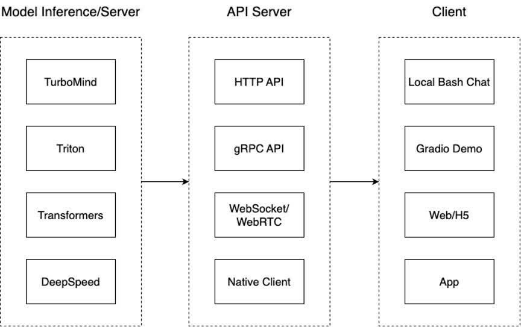

我们把从架构上把整个服务流程分成下面几个模块。

* 模型推理/服务。主要提供模型本身的推理，一般来说可以和具体业务解耦，专注模型推理本身性能的优化。可以以模块、API等多种方式提供。
* API Server。中间协议层，把后端推理/服务通过HTTP，gRPC或其他形式的接口，供前端调用。
* Client。可以理解为前端，与用户交互的地方。通过通过网页端/命令行去调用API接口，获取模型推理/服务。

值得说明的是，以上的划分是一个相对完整的模型，但在实际中这并不是绝对的。比如可以把“模型推理”和“API Server”合并，有的甚至是三个流程打包在一起提供服务。

## 4.1 启动API服务器

通过以下命令启动API服务器，推理`internlm2-chat-1_8b`模型：

```sh
lmdeploy serve api_server \
    /root/internlm2-chat-1_8b \
    --model-format hf \
    --quant-policy 0 \
    --server-name 0.0.0.0 \
    --server-port 23333 \
    --tp 1
```

其中，model-format、quant-policy这些参数是与第三章中量化推理模型一致的；server-name和server-port表示API服务器的服务IP与服务端口；tp参数表示并行数量（GPU数量）。

通过运行以上指令，我们成功启动了API服务器，请勿关闭该窗口，后面我们要新建客户端连接该服务。

可以通过运行一下指令，查看更多参数及使用方法：

```sh
lmdeploy serve api_server -h
```

你也可以直接打开`http://{host}:23333`查看接口的具体使用说明，如下图所示。

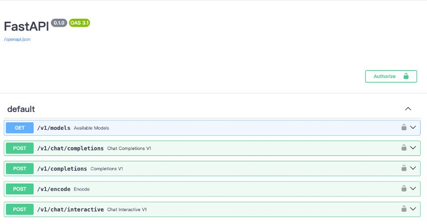

注意，这一步由于Server在远程服务器上，所以本地需要做一下ssh转发才能直接访问。**在你本地打开一个cmd窗口**，输入命令如下：

```sh
ssh -CNg -L 23333:127.0.0.1:23333 root@ssh.intern-ai.org.cn -p <你的ssh端口号>
```

ssh 端口号就是下面图片里的 39864，请替换为你自己的。

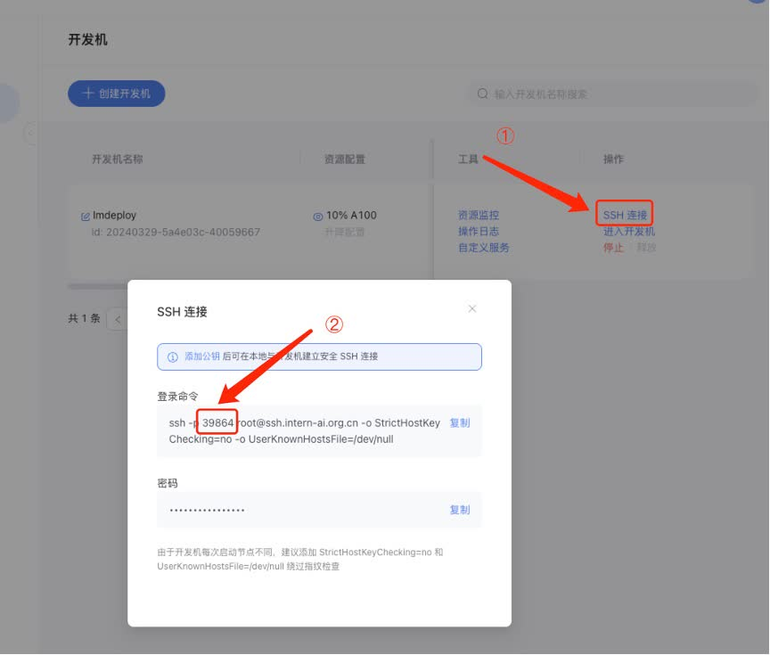

然后打开浏览器，访问`http://127.0.0.1:23333`。

## 4.2 命令行客户端连接API服务器

在“4.1”中，我们在终端里新开了一个API服务器。

本节中，我们要新建一个命令行客户端去连接API服务器。首先通过VS Code新建一个终端：

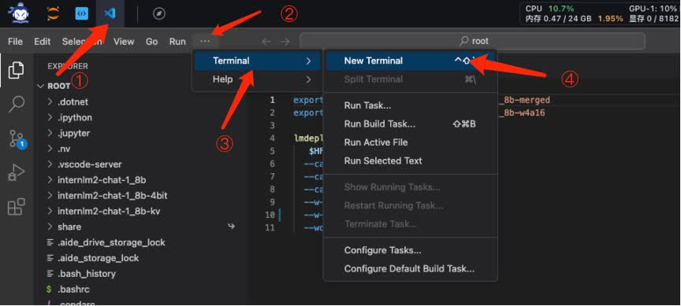

激活conda环境。

```sh
conda activate lmdeploy
```


运行命令行客户端：

```sh
lmdeploy serve api_client http://localhost:23333
```

运行后，可以通过命令行窗口直接与模型对话：

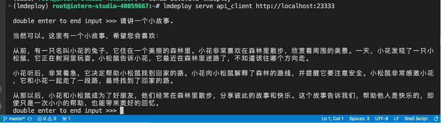

现在你使用的架构是这样的：

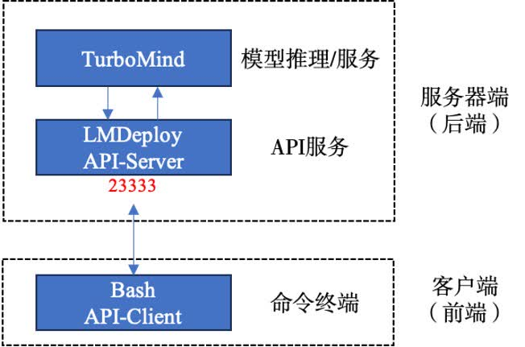

## 4.3 网页客户端连接API服务器

关闭刚刚的VSCode终端，但服务器端的终端不要关闭。

新建一个VSCode终端，激活conda环境。

```sh
conda activate lmdeploy
```

使用Gradio作为前端，启动网页客户端。

```sh
lmdeploy serve gradio http://localhost:23333 \
    --server-name 0.0.0.0 \
    --server-port 6006
```

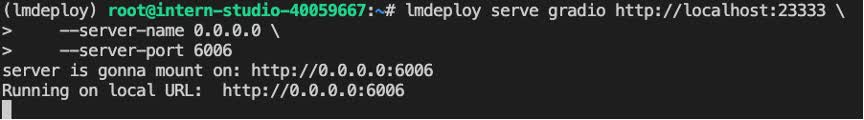

运行命令后，网页客户端启动。在电脑本地新建一个cmd终端，新开一个转发端口：

```sh
ssh -CNg -L 6006:127.0.0.1:6006 root@ssh.intern-ai.org.cn -p <你的ssh端口号>
```

打开浏览器，访问地址`http://127.0.0.1:6006`

然后就可以与模型进行对话了！

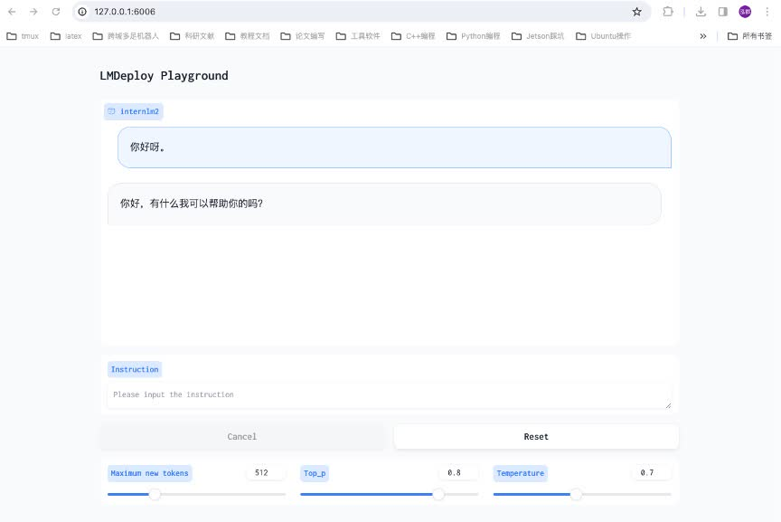

现在你使用的架构是这样的：

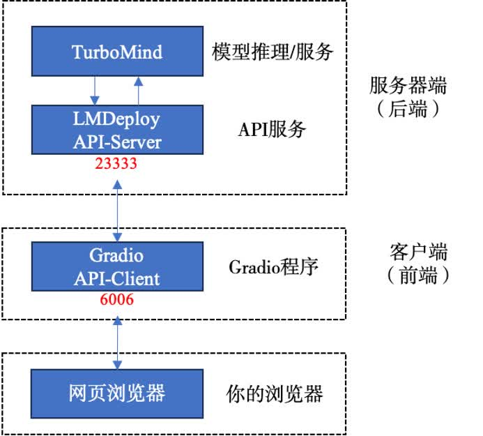

# 5.Python代码集成

在开发项目时，有时我们需要将大模型推理集成到Python代码里面。

## 5.1 Python代码集成运行1.8B模型

首先激活conda环境。

```sh
conda activate lmdeploy
```

新建Python源代码文件`pipeline.py`。

```sh
touch /root/pipeline.py
```

打开`pipeline.py`，填入以下内容。

```py
from lmdeploy import pipeline

pipe = pipeline('/root/internlm2-chat-1_8b')
response = pipe(['Hi, pls intro yourself', '上海是'])
print(response)
```

> **代码解读**：\
> * 第1行，引入lmdeploy的pipeline模块 \
> * 第3行，从目录“./internlm2-chat-1_8b”加载HF模型 \
> * 第4行，运行pipeline，这里采用了批处理的方式，用一个列表包含两个输入，lmdeploy同时推理两个输入，产生两个输出结果，结果返回给response \
> * 第5行，输出response

保存后运行代码文件：

```sh
python /root/pipeline.py
```

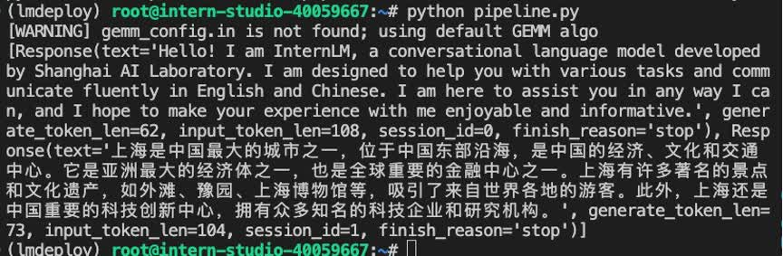

## 5.2 向TurboMind后端传递参数

在第3章，我们通过向lmdeploy传递附加参数，实现模型的量化推理，及设置KV Cache最大占用比例。在Python代码中，可以通过创建TurbomindEngineConfig，向lmdeploy传递参数。

以设置KV Cache占用比例为例，新建python文件`pipeline_kv.py`。

```sh
touch /root/pipeline_kv.py
```

打开`pipeline_kv.py`，填入如下内容：

```py
from lmdeploy import pipeline, TurbomindEngineConfig

# 调低 k/v cache内存占比调整为总显存的 20%
backend_config = TurbomindEngineConfig(cache_max_entry_count=0.2)

pipe = pipeline('/root/internlm2-chat-1_8b',
                backend_config=backend_config)
response = pipe(['Hi, pls intro yourself', '上海是'])
print(response)
```

保存后运行python代码：

```sh
python /root/pipeline_kv.py
```

得到输出结果：

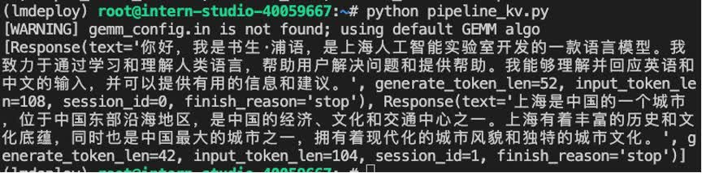

# 6.拓展部分

## 6.1 使用LMDeploy运行视觉多模态大模型llava

最新版本的LMDeploy支持了llava多模态模型，下面演示使用pipeline推理`llava-v1.6-7b`。**注意，运行本pipeline最低需要30%的InternStudio开发机，请完成基础作业后向助教申请权限。**

首先激活conda环境。

```sh
conda activate lmdeploy
```

安装llava依赖库。

```sh
pip install git+https://github.com/haotian-liu/LLaVA.git@4e2277a060da264c4f21b364c867cc622c945874
```

新建一个python文件，比如`pipeline_llava.py`。

```sh
touch /root/pipeline_llava.py
```

打开`pipeline_llava.py`，填入内容如下：

```py
from lmdeploy import pipeline
from lmdeploy.vl import load_image

# pipe = pipeline('liuhaotian/llava-v1.6-vicuna-7b') 非开发机运行此命令
pipe = pipeline('/share/new_models/liuhaotian/llava-v1.6-vicuna-7b')

image = load_image('https://raw.githubusercontent.com/open-mmlab/mmdeploy/main/tests/data/tiger.jpeg')
response = pipe(('describe this image', image))
print(response)
```

> **代码解读**： \
> * 第1行引入了lmdeploy的pipeline模块，第2行引入用于载入图片的load_image函数 \
> * 第4行创建了pipeline实例 \
> * 第6行从github下载了一张关于老虎的图片，如下： \
>  \
> * 第7行运行pipeline，输入提示词“describe this image”，和图片，结果返回至response \
> * 第8行输出response

保存后运行pipeline。

```sh
python /root/pipeline_llava.py
```

得到输出结果：

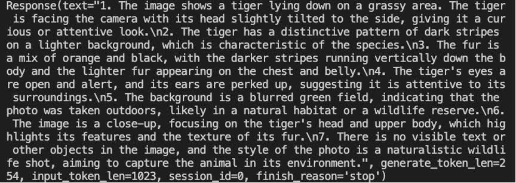

> **大意（来自百度翻译）**：一只老虎躺在草地上。老虎面对镜头，头微微向一侧倾斜，给人一种好奇或专注的表情。老虎在较浅的背景上有一种独特的深色条纹图案，这是该物种的特征。皮毛是橙色和黑色的混合，深色的条纹垂直向下延伸，浅色的皮毛出现在胸部和腹部。老虎的眼睛睁开，警觉，耳朵竖起，这表明它对周围环境很关注。背景是模糊的绿色区域，表明照片是在户外拍摄的，可能是在自然栖息地或野生动物保护区。这张图片是特写，聚焦于老虎的头部和上身，突出了老虎的特征和皮毛的纹理。照片中没有可见的文字或其他物体，照片的风格是自然的野生动物拍摄，旨在捕捉环境中的动物。

由于官方的Llava模型没有使用中文语料训练，因此如果使用中文提示词，可能会得到出乎意料的结果，比如将提示词改为“请描述一下这张图片”，你可能会得到类似《印度鳄鱼》的回复。

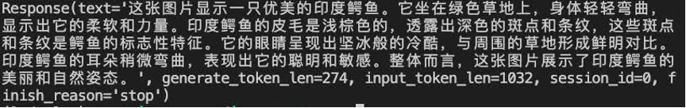

我们也可以通过Gradio来运行llava模型。新建python文件`gradio_llava.py`。

```sh
touch /root/gradio_llava.py
```

打开文件，填入以下内容：

```py
import gradio as gr
from lmdeploy import pipeline


# pipe = pipeline('liuhaotian/llava-v1.6-vicuna-7b') 非开发机运行此命令
pipe = pipeline('/share/new_models/liuhaotian/llava-v1.6-vicuna-7b')

def model(image, text):
    if image is None:
        return [(text, "请上传一张图片。")]
    else:
        response = pipe((text, image)).text
        return [(text, response)]

demo = gr.Interface(fn=model, inputs=[gr.Image(type="pil"), gr.Textbox()], outputs=gr.Chatbot())
demo.launch()   
```

运行python程序。

```sh
python /root/gradio_llava.py
```

通过ssh转发一下7860端口。

```sh
ssh -CNg -L 7860:127.0.0.1:7860 root@ssh.intern-ai.org.cn -p <你的ssh端口>
```

通过浏览器访问`http://127.0.0.1:7860`。

然后就可以使用啦~

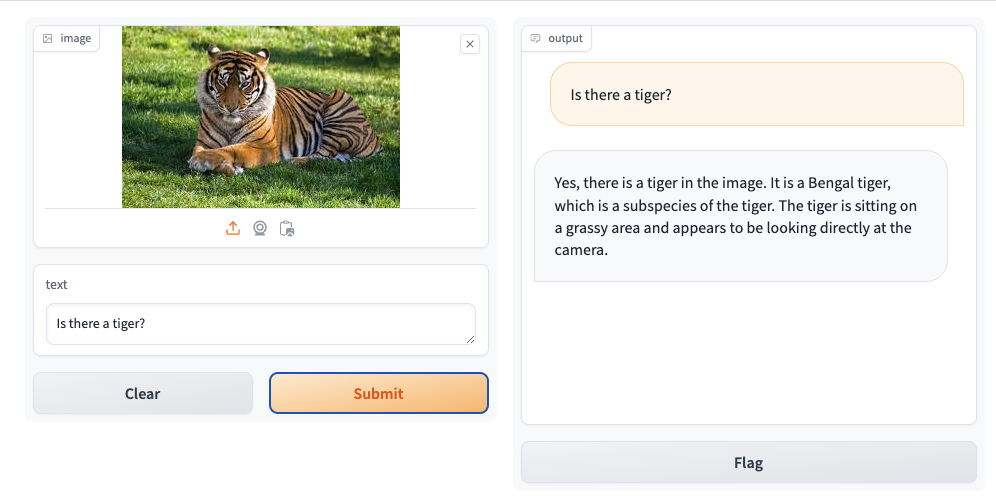

## 6.2 使用LMDeploy运行第三方大模型

LMDeploy不仅支持运行InternLM系列大模型，还支持其他第三方大模型。支持的模型列表如下：

|       Model        |    Size    |
| :----------------: | :--------: |
|       Llama        |  7B - 65B  |
|       Llama2       |  7B - 70B  |
|      InternLM      |  7B - 20B  |
|     InternLM2      |  7B - 20B  |
| InternLM-XComposer |     7B     |
|        QWen        |  7B - 72B  |
|      QWen-VL       |     7B     |
|      QWen1.5       | 0.5B - 72B |
|    QWen1.5-MoE     |   A2.7B    |
|      Baichuan      |  7B - 13B  |
|     Baichuan2      |  7B - 13B  |
|     Code Llama     |  7B - 34B  |
|      ChatGLM2      |     6B     |
|       Falcon       | 7B - 180B  |
|         YI         |  6B - 34B  |
|      Mistral       |     7B     |
|    DeepSeek-MoE    |    16B     |
|    DeepSeek-VL     |     7B     |
|      Mixtral       |    8x7B    |
|       Gemma        |   2B-7B    |
|        Dbrx        |    132B    |

可以从Modelscope，OpenXLab下载相应的HF模型，下载好HF模型，下面的步骤就和使用LMDeploy运行InternLM2一样啦~

## 6.3 定量比较LMDeploy与Transformer库的推理速度差异

为了直观感受LMDeploy与Transformer库推理速度的差异，让我们来编写一个速度测试脚本。测试环境是30%的InternStudio开发机。

先来测试一波Transformer库推理Internlm2-chat-1.8b的速度，新建python文件，命名为`benchmark_transformer.py`，填入以下内容：

```py
import torch
import datetime
from transformers import AutoTokenizer, AutoModelForCausalLM

tokenizer = AutoTokenizer.from_pretrained("/root/internlm2-chat-1_8b", trust_remote_code=True)

# Set `torch_dtype=torch.float16` to load model in float16, otherwise it will be loaded as float32 and cause OOM Error.
model = AutoModelForCausalLM.from_pretrained("/root/internlm2-chat-1_8b", torch_dtype=torch.float16, trust_remote_code=True).cuda()
model = model.eval()

# warmup
inp = "hello"
for i in range(5):
    print("Warm up...[{}/5]".format(i+1))
    response, history = model.chat(tokenizer, inp, history=[])

# test speed
inp = "请介绍一下你自己。"
times = 10
total_words = 0
start_time = datetime.datetime.now()
for i in range(times):
    response, history = model.chat(tokenizer, inp, history=history)
    total_words += len(response)
end_time = datetime.datetime.now()

delta_time = end_time - start_time
delta_time = delta_time.seconds + delta_time.microseconds / 1000000.0
speed = total_words / delta_time
print("Speed: {:.3f} words/s".format(speed))
```

运行python脚本：

```sh
python benchmark_transformer.py
```

得到运行结果：

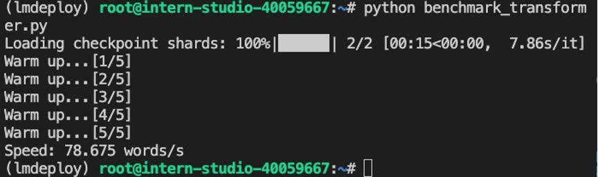

可以看到，Transformer库的推理速度约为78.675 words/s，注意单位是words/s，不是token/s，word和token在数量上可以近似认为成线性关系。

下面来测试一下LMDeploy的推理速度，新建python文件`benchmark_lmdeploy.py`，填入以下内容：

```py
import datetime
from lmdeploy import pipeline

pipe = pipeline('/root/internlm2-chat-1_8b')

# warmup
inp = "hello"
for i in range(5):
    print("Warm up...[{}/5]".format(i+1))
    response = pipe([inp])

# test speed
inp = "请介绍一下你自己。"
times = 10
total_words = 0
start_time = datetime.datetime.now()
for i in range(times):
    response = pipe([inp])
    total_words += len(response[0].text)
end_time = datetime.datetime.now()

delta_time = end_time - start_time
delta_time = delta_time.seconds + delta_time.microseconds / 1000000.0
speed = total_words / delta_time
print("Speed: {:.3f} words/s".format(speed))
```

运行脚本：

```sh
python benchmark_lmdeploy.py
```

得到运行结果：

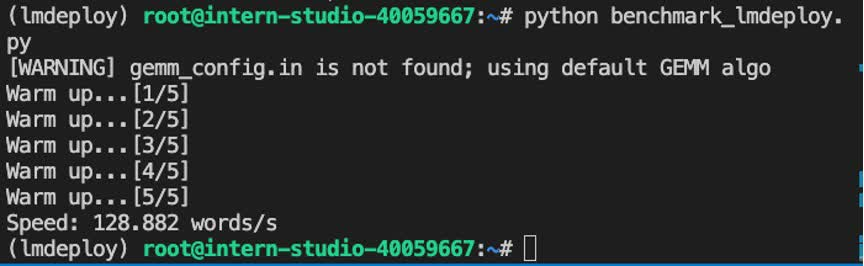

可以看到，LMDeploy的推理速度约为473.690 words/s，是Transformer库的6倍。

# 课后作业

作业请查看[homework.md](./homework.md)。
