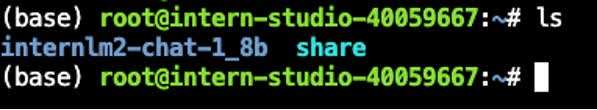

<div align="center">


</div>

# 1.LMDeploy环境部署

## 1.1 创建开发机

打开InternStudio平台，创建开发机。


填写开发机名称；选择镜像`Cuda12.2-conda`；选择`10% A100*1`GPU；点击“立即创建”。**注意请不要选择`Cuda11.7-conda`的镜像，新版本的lmdeploy会出现兼容性问题。**


排队等待一小段时间，点击“进入开发机”。


点击左上角图标，切换为终端(Terminal)模式。


## 1.2 创建conda环境

打开命令行终端，让我们来创建一个名为`lmdeploy`的conda环境，python版本为3.10。

```sh
conda create -n lmdeploy -y python=3.10
```

环境创建成功后，提示如下：


## 1.3 安装LMDeploy

接下来，激活刚刚创建的虚拟环境。

```sh
conda activate lmdeploy
```

安装0.3.0版本的lmdeploy。

```sh
pip install lmdeploy[all]==0.3.0
```

等待安装结束就OK了！

# 2.LMDeploy模型对话(chat)

## 2.1 Huggingface与TurboMind 

### **HuggingFace**

[HuggingFace](https://huggingface.co/)是一个高速发展的社区，包括Meta、Google、Microsoft、Amazon在内的超过5000家组织机构在为HuggingFace开源社区贡献代码、数据集和模型。可以认为是一个针对深度学习模型和数据集的在线托管社区，如果你有数据集或者模型想对外分享，网盘又不太方便，就不妨托管在HuggingFace。

托管在HuggingFace社区的模型通常采用HuggingFace格式存储，简写为**HF格式**。

但是HuggingFace社区的服务器在国外，国内访问不太方便。国内可以使用阿里巴巴的[MindScope](https://www.modelscope.cn/home)社区，或者上海AI Lab搭建的[OpenXLab](https://openxlab.org.cn/home)社区，上面托管的模型也通常采用**HF格式**。

### TurboMind 

TurboMind是LMDeploy团队开发的一款关于LLM推理的高效推理引擎，它的主要功能包括：LLaMa 结构模型的支持，continuous batch 推理模式和可扩展的 KV 缓存管理器。

TurboMind推理引擎仅支持推理TurboMind格式的模型。因此，TurboMind在推理HF格式的模型时，会首先自动将HF格式模型转换为TurboMind格式的模型。**该过程在新版本的LMDeploy中是自动进行的，无需用户操作。**

几个容易迷惑的点：
* TurboMind与LMDeploy的关系：LMDeploy是涵盖了LLM 任务全套轻量化、部署和服务解决方案的集成功能包，TurboMind是LMDeploy的一个推理引擎，是一个子模块。LMDeploy也可以使用pytorch作为推理引擎。
* TurboMind与TurboMind模型的关系：TurboMind是推理引擎的名字，TurboMind模型是一种模型存储格式，TurboMind引擎只能推理TurboMind格式的模型。

## 2.2 下载模型

本次实战营已经在开发机的共享目录中准备好了常用的预训练模型，可以运行如下命令查看： 

```sh
ls /root/share/new_models/Shanghai_AI_Laboratory/
```

显示如下，每一个文件夹都对应一个预训练模型。 


以InternLM2-Chat-1.8B模型为例，从官方仓库下载模型。

### InternStudio开发机上下载模型（推荐）

如果你是在InternStudio开发机上，可以按照如下步骤快速下载模型。

首先进入一个你想要存放模型的目录，本教程统一放置在Home目录。执行如下指令：

```sh
cd ~
```

然后执行如下指令由开发机的共享目录拷贝（下载）模型： 

```sh
cp -r /root/share/new_models/Shanghai_AI_Laboratory/internlm2-chat-1_8b /root/
```

执行完如上指令后，可以运行“ls”命令。可以看到，当前目录下已经多了一个`internlm2-chat-1_8b`文件夹，即下载好的预训练模型。

```sh
ls
```



### 由OpenXLab平台下载模型

注意，如果你在上一步已经从InternStudio开发机上下载了模型，这一步就没必要执行了。

<details>

上一步介绍的方法只适用于在InternStudio开发机上下载模型，如果是在自己电脑的开发环境上，也可以由[OpenXLab](https://openxlab.org.cn/usercenter/OpenLMLab?vtab=create&module=datasets)下载。*在开发机上还是建议通过拷贝的方式，因为从OpenXLab平台下载会占用大量带宽~*

首先进入一个你想要存放模型的目录，本教程统一放置在Home目录。执行如下指令：

```sh
cd ~
```

OpenXLab平台支持通过Git协议下载模型。首先安装git-lfs组件。

* 对于root用于请执行如下指令：

```sh
curl -s https://packagecloud.io/install/repositories/github/git-lfs/script.deb.sh | bash
apt update
apt install git-lfs   
git lfs install  --system
```

* 对于非root用户需要加sudo，请执行如下指令：

```sh
curl -s https://packagecloud.io/install/repositories/github/git-lfs/script.deb.sh | sudo bash
sudo apt update
sudo apt install git-lfs   
sudo git lfs install  --system
```

安装好git-lfs组件后，由OpenXLab平台下载InternLM2-Chat-1.8B模型：

```sh
git clone https://code.openxlab.org.cn/OpenLMLab/internlm2-chat-1.8b.git
```

这一步骤可能耗时较长，主要取决于网速，耐心等待即可。


下载完成后，运行`ls`指令，可以看到当前目录下多了一个`internlm2-chat-1.8b`文件夹，即下载好的预训练模型。

```sh
ls
```


注意！从OpenXLab平台下载的模型文件夹命名为`1.8b`，而从InternStudio开发机直接拷贝的模型文件夹名称是`1_8b`，为了后续文档统一，这里统一命名为`1_8b`。

```sh
mv /root/internlm2-chat-1.8b /root/internlm2-chat-1_8b
```

</details>

## 2.3 使用Transformer库运行模型

Transformer库是Huggingface社区推出的用于运行HF模型的官方库。

在2.2中，我们已经下载好了InternLM2-Chat-1.8B的HF模型。下面我们先用Transformer来直接运行InternLM2-Chat-1.8B模型，后面对比一下LMDeploy的使用感受。

新建python文件，命名为`pipeline_transformer.py`，填入如下内容：

```py
import torch
from transformers import AutoTokenizer, AutoModelForCausalLM

tokenizer = AutoTokenizer.from_pretrained("./internlm2-chat-1_8b", trust_remote_code=True)

# Set `torch_dtype=torch.float16` to load model in float16, otherwise it will be loaded as float32 and cause OOM Error.
model = AutoModelForCausalLM.from_pretrained("./internlm2-chat-1_8b", torch_dtype=torch.float16, trust_remote_code=True).cuda()
model = model.eval()

inp = "hello"
print("[INPUT]", inp)
response, history = model.chat(tokenizer, inp, history=[])
print("[OUTPUT]", response)

inp = "please provide three suggestions about time management"
print("[INPUT]", inp)
response, history = model.chat(tokenizer, inp, history=history)
print("[OUTPUT]", response)

```

激活conda环境。

```sh
conda activate lmdeploy
```

运行python代码：

```sh
python pipeline_transformer.py
```

得到输出：


记住这种感觉，一会儿体验一下LMDeploy的推理速度，感受一下对比~（手动狗头）

## 2.4 使用LMDeploy与模型对话

这一小节我们来介绍如何应用LMDeploy直接与模型进行对话。

首先激活创建好的conda环境：

```sh
conda activate lmdeploy
```

使用LMDeploy与模型进行对话的通用命令格式为：

```sh
lmdeploy chat [HF格式模型路径/TurboMind格式模型路径]
```

例如，您可以执行如下命令运行下载的1.8B模型：

```sh
lmdeploy chat /root/internlm2-chat-1_8b
```


下面我们就可以与InternLM2-Chat-1.8B大模型对话了。比如输入“请给我讲一个小故事吧”，然后按两下回车键。


速度是不是明显比原生Transformer快呢~当然，这种感受可能不太直观，感兴趣的佬可以查看拓展部分“6.3 定量比较LMDeploy与Transformer库的推理速度”。

输入“exit”并按两下回车，可以退出对话。


**拓展内容**：有关LMDeploy的chat功能的更多参数可通过-h命令查看。

```sh
lmdeploy chat -h
```

