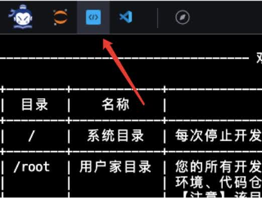

# 1.LMDeploy环境部署

## 1.1 创建开发机

打开InternStudio平台，创建开发机。

填写开发机名称；选择镜像`Cuda12.2-conda`；选择`10% A100*1`GPU；点击“立即创建”。**注意请不要选择`Cuda11.7-conda`的镜像，新版本的lmdeploy会出现兼容性问题。**

排队等待一小段时间，点击“进入开发机”。

点击左上角图标，切换为终端(Terminal)模式。

## 1.2 创建conda环境

打开命令行终端，让我们来创建一个名为“lmdeploy”的conda环境，python版本为3.10。

