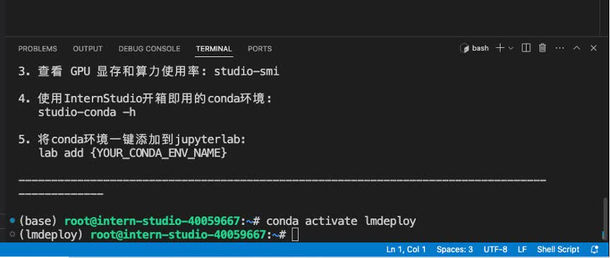

<div align="center">


</div>

# 1.LMDeploy环境部署

## 1.1 创建开发机

打开InternStudio平台，创建开发机。


填写开发机名称；选择镜像`Cuda12.2-conda`；选择`10% A100*1`GPU；点击“立即创建”。**注意请不要选择`Cuda11.7-conda`的镜像，新版本的lmdeploy会出现兼容性问题。**


排队等待一小段时间，点击“进入开发机”。


点击左上角图标，切换为终端(Terminal)模式。


## 1.2 创建conda环境

打开命令行终端，让我们来创建一个名为`lmdeploy`的conda环境，python版本为3.10。

```sh
conda create -n lmdeploy -y python=3.10
```

环境创建成功后，提示如下：


## 1.3 安装LMDeploy

接下来，激活刚刚创建的虚拟环境。

```sh
conda activate lmdeploy
```

安装0.3.0版本的lmdeploy。

```sh
pip install lmdeploy[all]==0.3.0
```

等待安装结束就OK了！

# 2.LMDeploy模型对话(chat)

## 2.1 Huggingface与TurboMind 

### **HuggingFace**

[HuggingFace](https://huggingface.co/)是一个高速发展的社区，包括Meta、Google、Microsoft、Amazon在内的超过5000家组织机构在为HuggingFace开源社区贡献代码、数据集和模型。可以认为是一个针对深度学习模型和数据集的在线托管社区，如果你有数据集或者模型想对外分享，网盘又不太方便，就不妨托管在HuggingFace。

托管在HuggingFace社区的模型通常采用HuggingFace格式存储，简写为**HF格式**。

但是HuggingFace社区的服务器在国外，国内访问不太方便。国内可以使用阿里巴巴的[MindScope](https://www.modelscope.cn/home)社区，或者上海AI Lab搭建的[OpenXLab](https://openxlab.org.cn/home)社区，上面托管的模型也通常采用**HF格式**。

### TurboMind 

TurboMind是LMDeploy团队开发的一款关于LLM推理的高效推理引擎，它的主要功能包括：LLaMa 结构模型的支持，continuous batch 推理模式和可扩展的 KV 缓存管理器。

TurboMind推理引擎仅支持推理TurboMind格式的模型。因此，TurboMind在推理HF格式的模型时，会首先自动将HF格式模型转换为TurboMind格式的模型。**该过程在新版本的LMDeploy中是自动进行的，无需用户操作。**

几个容易迷惑的点：
* TurboMind与LMDeploy的关系：LMDeploy是涵盖了LLM 任务全套轻量化、部署和服务解决方案的集成功能包，TurboMind是LMDeploy的一个推理引擎，是一个子模块。LMDeploy也可以使用pytorch作为推理引擎。
* TurboMind与TurboMind模型的关系：TurboMind是推理引擎的名字，TurboMind模型是一种模型存储格式，TurboMind引擎只能推理TurboMind格式的模型。

## 2.2 下载模型

本次实战营已经在开发机的共享目录中准备好了常用的预训练模型，可以运行如下命令查看： 

```sh
ls /root/share/new_models/Shanghai_AI_Laboratory/
```

显示如下，每一个文件夹都对应一个预训练模型。 


以InternLM2-Chat-1.8B模型为例，从官方仓库下载模型。

### InternStudio开发机上下载模型（推荐）

如果你是在InternStudio开发机上，可以按照如下步骤快速下载模型。

首先进入一个你想要存放模型的目录，本教程统一放置在Home目录。执行如下指令：

```sh
cd ~
```

然后执行如下指令由开发机的共享目录拷贝（下载）模型： 

```sh
cp -r /root/share/new_models/Shanghai_AI_Laboratory/internlm2-chat-1_8b /root/
```

执行完如上指令后，可以运行“ls”命令。可以看到，当前目录下已经多了一个`internlm2-chat-1_8b`文件夹，即下载好的预训练模型。

```sh
ls
```


### 由OpenXLab平台下载模型

注意，如果你在上一步已经从InternStudio开发机上下载了模型，这一步就没必要执行了。

<details>

上一步介绍的方法只适用于在InternStudio开发机上下载模型，如果是在自己电脑的开发环境上，也可以由[OpenXLab](https://openxlab.org.cn/usercenter/OpenLMLab?vtab=create&module=datasets)下载。*在开发机上还是建议通过拷贝的方式，因为从OpenXLab平台下载会占用大量带宽~*

首先进入一个你想要存放模型的目录，本教程统一放置在Home目录。执行如下指令：

```sh
cd ~
```

OpenXLab平台支持通过Git协议下载模型。首先安装git-lfs组件。

* 对于root用于请执行如下指令：

```sh
curl -s https://packagecloud.io/install/repositories/github/git-lfs/script.deb.sh | bash
apt update
apt install git-lfs   
git lfs install  --system
```

* 对于非root用户需要加sudo，请执行如下指令：

```sh
curl -s https://packagecloud.io/install/repositories/github/git-lfs/script.deb.sh | sudo bash
sudo apt update
sudo apt install git-lfs   
sudo git lfs install  --system
```

安装好git-lfs组件后，由OpenXLab平台下载InternLM2-Chat-1.8B模型：

```sh
git clone https://code.openxlab.org.cn/OpenLMLab/internlm2-chat-1.8b.git
```

这一步骤可能耗时较长，主要取决于网速，耐心等待即可。


下载完成后，运行`ls`指令，可以看到当前目录下多了一个`internlm2-chat-1.8b`文件夹，即下载好的预训练模型。

```sh
ls
```


注意！从OpenXLab平台下载的模型文件夹命名为`1.8b`，而从InternStudio开发机直接拷贝的模型文件夹名称是`1_8b`，为了后续文档统一，这里统一命名为`1_8b`。

```sh
mv /root/internlm2-chat-1.8b /root/internlm2-chat-1_8b
```

</details>

## 2.3 使用Transformer库运行模型

Transformer库是Huggingface社区推出的用于运行HF模型的官方库。

在2.2中，我们已经下载好了InternLM2-Chat-1.8B的HF模型。下面我们先用Transformer来直接运行InternLM2-Chat-1.8B模型，后面对比一下LMDeploy的使用感受。

新建python文件，命名为`pipeline_transformer.py`，填入如下内容：

```py
import torch
from transformers import AutoTokenizer, AutoModelForCausalLM

tokenizer = AutoTokenizer.from_pretrained("/root/internlm2-chat-1_8b", trust_remote_code=True)

# Set `torch_dtype=torch.float16` to load model in float16, otherwise it will be loaded as float32 and cause OOM Error.
model = AutoModelForCausalLM.from_pretrained("/root/internlm2-chat-1_8b", torch_dtype=torch.float16, trust_remote_code=True).cuda()
model = model.eval()

inp = "hello"
print("[INPUT]", inp)
response, history = model.chat(tokenizer, inp, history=[])
print("[OUTPUT]", response)

inp = "please provide three suggestions about time management"
print("[INPUT]", inp)
response, history = model.chat(tokenizer, inp, history=history)
print("[OUTPUT]", response)

```

激活conda环境。

```sh
conda activate lmdeploy
```

运行python代码：

```sh
python pipeline_transformer.py
```

得到输出：


记住这种感觉，一会儿体验一下LMDeploy的推理速度，感受一下对比~（手动狗头）

## 2.4 使用LMDeploy与模型对话

这一小节我们来介绍如何应用LMDeploy直接与模型进行对话。

首先激活创建好的conda环境：

```sh
conda activate lmdeploy
```

使用LMDeploy与模型进行对话的通用命令格式为：

```sh
lmdeploy chat [HF格式模型路径/TurboMind格式模型路径]
```

例如，您可以执行如下命令运行下载的1.8B模型：

```sh
lmdeploy chat /root/internlm2-chat-1_8b
```


下面我们就可以与InternLM2-Chat-1.8B大模型对话了。比如输入“请给我讲一个小故事吧”，然后按两下回车键。


速度是不是明显比原生Transformer快呢~当然，这种感受可能不太直观，感兴趣的佬可以查看拓展部分“6.3 定量比较LMDeploy与Transformer库的推理速度”。

输入“exit”并按两下回车，可以退出对话。


**拓展内容**：有关LMDeploy的chat功能的更多参数可通过-h命令查看。

```sh
lmdeploy chat -h
```

# 3.LMDeploy模型量化(lite)

本部分内容主要介绍如何对模型进行量化。主要包括 KV8量化和W4A16量化。总的来说，量化是一种以参数或计算中间结果精度下降换空间节省（以及同时带来的性能提升）的策略。

正式介绍 LMDeploy 量化方案前，需要先介绍两个概念：

* 计算密集（compute-bound）: 指推理过程中，绝大部分时间消耗在数值计算上；针对计算密集型场景，可以通过使用更快的硬件计算单元来提升计算速。
* 访存密集（memory-bound）: 指推理过程中，绝大部分时间消耗在数据读取上；针对访存密集型场景，一般通过减少访存次数、提高计算访存比或降低访存量来优化。

常见的 LLM 模型由于 Decoder Only 架构的特性，实际推理时大多数的时间都消耗在了逐 Token 生成阶段（Decoding 阶段），是典型的访存密集型场景。

那么，如何优化 LLM 模型推理中的访存密集问题呢？ 我们可以使用**KV8量化**和**W4A16**量化。KV8量化是指将逐 Token（Decoding）生成过程中的上下文 K 和 V 中间结果进行 INT8 量化（计算时再反量化），以降低生成过程中的显存占用。W4A16 量化，将 FP16 的模型权重量化为 INT4，Kernel 计算时，访存量直接降为 FP16 模型的 1/4，大幅降低了访存成本。Weight Only 是指仅量化权重，数值计算依然采用 FP16（需要将 INT4 权重反量化）。

## 3.1 使用KV8量化

运行前，首先安装一个依赖库。

```sh
pip install einops==0.7.0
```

通过以下命令，获取量化参数，并保存至原HF模型目录。

```sh
lmdeploy lite calibrate \
  /root/internlm2-chat-1_8b \
  --calib-dataset 'ptb' \
  --calib-samples 128 \
  --calib-seqlen 1024 \
  --work-dir /root/internlm2-chat-1_8b
```

> **解释一下各个参数的含义**： \
> * lmdeploy lite calibrate：指运行lmdeploy的量化标定功能 \
> * /root/internlm2-chat-1_8b：原模型目录，请替换为自己的模型目录 \
> * --calib-dataset 'ptb'：执行标定数据集，这里使用ptb。**注意，标定数据集下载可能需要科学上网，不过InternStudio开发机上已经解决这个问题了，本地环境需要自行解决** \
> * --calib-samples 128：指量化时的分组大小为128 \
> * --calib-seqlen 1024：指量化时输入的token长度为1024，这与显存占用成正相关。默认大小为2048，不过10% A100的8G显存跑不起来哈哈哈哈，降为1024 \
> * --work-dir：量化参数的保存目录

该步骤耗时比较长，请耐心等待：


下面使用Chat功能运行KV8量化后的模型。

```sh
lmdeploy chat /root/internlm2-chat-1_8b --model-format hf --quant-policy 4
```

## 3.2 使用W4A16量化

LMDeploy使用AWQ算法，实现模型4bit权重量化。推理引擎TurboMind提供了非常高效的4bit推理cuda kernel，性能是FP16的2.4倍以上。它支持以下NVIDIA显卡：

* 图灵架构（sm75）：20系列、T4
* 安培架构（sm80,sm86）：30系列、A10、A16、A30、A100
* Ada Lovelace架构（sm90）：40 系列

仅需执行一条命令，就可以完成模型量化工作。

```sh
lmdeploy lite auto_awq \
   /root/internlm2-chat-1_8b \
  --calib-dataset 'ptb' \
  --calib-samples 128 \
  --calib-seqlen 1024 \
  --w-bits 4 \
  --w-group-size 128 \
  --work-dir /root/internlm2-chat-1_8b-4bit
```

运行时间较长，请耐心等待。量化工作结束后，新的HF模型被保存到`internlm2-chat-1_8b-4bit`目录。下面使用Chat功能运行W4A16量化后的模型。

```sh
lmdeploy chat /root/internlm2-chat-1_8b-4bit --model-format awq
```

## 3.3 同时开启KV8量化和W4A16量化

参考4.2进行W4A16量化后，可以运行如下命令同时开启KV8和W4A16量化进行推理。

```sh
lmdeploy chat /root/internlm2-chat-1_8b-4bit --model-format awq --quant-policy 4
```

## 3.4 设置最大KV Cache缓存大小

心细的同学发现，在非量化模式下运行模型、开启KV8量化运行模型或开启W4A16量化运行模型，显存占用似乎没有明显变化。这与LMDeploy的KV缓存管理器相关机制有关。

KV Cache是一种缓存技术，通过存储键值对的形式来复用计算结果，以达到提高性能和降低内存消耗的目的。在大规模训练和推理中，KV Cache可以显著减少重复计算量，从而提升模型的推理速度。理想情况下，KV Cache全部存储于显存，以加快访存速度。当显存空间不足时，也可以将KV Cache放在内存，通过缓存管理器控制将当前需要使用的数据放入显存。

可以通过设置`--cache-max-entry-count`参数，控制KV缓存占用显存的最大比例。默认的比例为0.8。

下面给出几种使用示例：

* 无量化运行HF模型，设置KV Cache最大占用比例0.5

```sh
lmdeploy chat /root/internlm2-chat-1_8b --model-format hf --quant-policy 0 --cache-max-entry-count 0.5
```

* KV8量化运行HF模型，设置KV Cache最大占用比例0.5

```sh
lmdeploy chat /root/internlm2-chat-1_8b --model-format hf --quant-policy 4 --cache-max-entry-count 0.5
```

* W4A16量化运行HF模型，设置KV Cache最大占用比例0.5

```sh
lmdeploy chat /root/internlm2-chat-1_8b-4bit --model-format awq --cache-max-entry-count 0.5
```

* KV8+W4A16量化运行HF模型，设置KV Cache最大占用比例0.5

```sh
lmdeploy chat /root/internlm2-chat-1_8b-4bit --model-format awq --quant-policy 4 --cache-max-entry-count 0.5
```

## 3.5 选择最佳量化策略

量化的最主要目的是降低显存占用，主要包括两方面的显存：模型参数和中间过程计算结果。前者对应W4A16量化，后者对应KV8量化。

量化在降低显存的同时，一般还能带来性能的提升，因为更小精度的浮点数要比高精度的浮点数计算效率高，而整型要比浮点数高很多。

所以我们的建议是：在各种配置下尝试，看效果能否满足需要。这一般需要在自己的数据集上进行测试。具体步骤如下。

* **Step1**：优先尝试正常（非量化）版本，评估效果。
    * 如果效果不行，需要尝试更大参数模型或者微调。
    * 如果效果可以，跳到下一步。
* **Step2**：尝试KV8量化，评估效果。
    * 如果效果不行，回到上一步。
    * 如果效果可以，跳到下一步。
* **Step3**：尝试W4A16量化版本，评估效果。
    * 如果效果不行，回到上一步。
    * 如果效果可以，跳到下一步。
* **Step4**：尝试W4A16+KV8量化，评估效果。
    * 如果效果不行，回到上一步。
    * 如果效果可以，使用方案。

简单流程如下图所示：


另外需要补充说明的是，使用哪种量化版本、开启哪些功能，除了上述流程外，还需要考虑框架、显卡的支持情况，比如有些框架可能不支持 W4A16 的推理，那即便转换好了也用不了。

根据实践经验，一般情况下：

* 精度越高，显存占用越多，推理效率越低，但一般效果较好。
* Server 端推理一般用非量化版本或半精度、BF16、Int8 等精度的量化版本，比较少使用更低精度的量化版本。
* 端侧推理一般都使用量化版本，且大多是低精度的量化版本。这主要是因为计算资源所限。
以上是针对项目开发情况，如果是自己尝试（玩儿）的话：
* 如果资源足够（有GPU卡很重要），那就用非量化的正常版本。
* 如果没有 GPU 卡，只有 CPU（不管什么芯片），那还是尝试量化版本。
* 如果生成文本长度很长，显存不够，就开启 KV8。

建议大家根据实际情况灵活选择方案。

**拓展内容**：有关LMDeploy的lite功能的更多参数可通过-h命令查看。

```sh
lmdeploy lite -h
```

# 4.LMDeploy服务(serve)

在第二章和第三章，我们都是在本地直接推理大模型，这种方式成为本地部署。在生产环境下，我们有时会将大模型封装为API接口服务，供客户端访问。

我们来看下面一张架构图：


我们把从架构上把整个服务流程分成下面几个模块。

* 模型推理/服务。主要提供模型本身的推理，一般来说可以和具体业务解耦，专注模型推理本身性能的优化。可以以模块、API等多种方式提供。
* API Server。中间协议层，把后端推理/服务通过HTTP，gRPC或其他形式的接口，供前端调用。
* Client。可以理解为前端，与用户交互的地方。通过通过网页端/命令行去调用API接口，获取模型推理/服务。

值得说明的是，以上的划分是一个相对完整的模型，但在实际中这并不是绝对的。比如可以把“模型推理”和“API Server”合并，有的甚至是三个流程打包在一起提供服务。

## 4.1 启动API服务器

通过以下命令启动API服务器，推理`internlm2-chat-1_8b`模型：

```sh
lmdeploy serve api_server \
    /root/internlm2-chat-1_8b \
    --model-format hf \
    --quant-policy 0 \
    --server-name 0.0.0.0 \
    --server-port 23333 \
    --tp 1
```

其中，model-format、quant-policy这些参数是与第三章中量化推理模型一致的；server-name和server-port表示API服务器的服务IP与服务端口；tp参数表示并行数量（GPU数量）。

通过运行以上指令，我们成功启动了API服务器，请勿关闭该窗口，后面我们要新建客户端连接该服务。

可以通过运行一下指令，查看更多参数及使用方法：

```sh
lmdeploy serve api_server -h
```

你也可以直接打开`http://{host}:23333`查看接口的具体使用说明，如下图所示。


注意，这一步由于Server在远程服务器上，所以本地需要做一下ssh转发才能直接访问。**在你本地打开一个cmd窗口**，输入命令如下：

```sh
ssh -CNg -L 23333:127.0.0.1:23333 root@ssh.intern-ai.org.cn -p <你的ssh端口号>
```

ssh 端口号就是下面图片里的 39864，请替换为你自己的。


然后打开浏览器，访问`http://127.0.0.1:23333`。

## 4.2 命令行客户端连接API服务器

在“4.1”中，我们在终端里新开了一个API服务器。

本节中，我们要新建一个命令行客户端去连接API服务器。首先通过VS Code新建一个终端：


激活conda环境。

```sh
conda activate lmdeploy
```



运行命令行客户端：

```sh
lmdeploy serve api_client http://localhost:23333
```

运行后，可以通过命令行窗口直接与模型对话：


现在你使用的架构是这样的：


