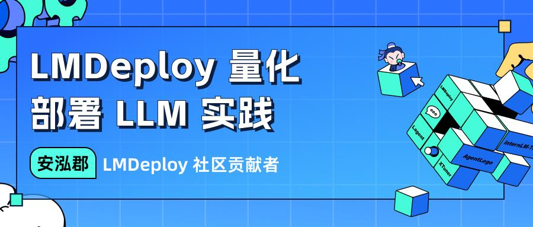

<!-- START doctoc generated TOC please keep comment here to allow auto update -->
<!-- DON'T EDIT THIS SECTION, INSTEAD RE-RUN doctoc TO UPDATE -->

- [1 环境配置](#1-%E7%8E%AF%E5%A2%83%E9%85%8D%E7%BD%AE)
- [2 服务部署](#2-%E6%9C%8D%E5%8A%A1%E9%83%A8%E7%BD%B2)
  - [2.1 模型转换](#21-%E6%A8%A1%E5%9E%8B%E8%BD%AC%E6%8D%A2)
    - [2.1.1 在线转换](#211-%E5%9C%A8%E7%BA%BF%E8%BD%AC%E6%8D%A2)
    - [2.1.2 离线转换](#212-%E7%A6%BB%E7%BA%BF%E8%BD%AC%E6%8D%A2)
  - [2.2  TurboMind推理+命令行本地对话](#22--turbomind%E6%8E%A8%E7%90%86%E5%91%BD%E4%BB%A4%E8%A1%8C%E6%9C%AC%E5%9C%B0%E5%AF%B9%E8%AF%9D)
  - [2.3 TurboMind推理+API服务](#23-turbomind%E6%8E%A8%E7%90%86api%E6%9C%8D%E5%8A%A1)
  - [2.4 网页Demo演示](#24-%E7%BD%91%E9%A1%B5demo%E6%BC%94%E7%A4%BA)
    - [2.4.1 TurboMind服务作为后端](#241-turbomind%E6%9C%8D%E5%8A%A1%E4%BD%9C%E4%B8%BA%E5%90%8E%E7%AB%AF)
    - [2.4.2 TurboMind推理作为后端](#242-turbomind%E6%8E%A8%E7%90%86%E4%BD%9C%E4%B8%BA%E5%90%8E%E7%AB%AF)
  - [2.5 TurboMind推理+Python代码集成](#25-turbomind%E6%8E%A8%E7%90%86python%E4%BB%A3%E7%A0%81%E9%9B%86%E6%88%90)
  - [2.6 这么多，头秃，有没有最佳实践](#26-%E8%BF%99%E4%B9%88%E5%A4%9A%E5%A4%B4%E5%87%B8%E6%9C%89%E6%B2%A1%E6%9C%89%E6%9C%80%E4%BD%B3%E5%AE%9E%E8%B7%B5)
    - [2.6.1 方案实践](#261-%E6%96%B9%E6%A1%88%E5%AE%9E%E8%B7%B5)
    - [2.6.2 模型配置实践](#262-%E6%A8%A1%E5%9E%8B%E9%85%8D%E7%BD%AE%E5%AE%9E%E8%B7%B5)
- [3 模型量化](#3-%E6%A8%A1%E5%9E%8B%E9%87%8F%E5%8C%96)
  - [3.1 KV Cache 量化](#31-kv-cache-%E9%87%8F%E5%8C%96)
    - [3.1.1 量化步骤](#311-%E9%87%8F%E5%8C%96%E6%AD%A5%E9%AA%A4)
    - [3.1.2 量化效果](#312-%E9%87%8F%E5%8C%96%E6%95%88%E6%9E%9C)
  - [3.2 W4A16 量化](#32-w4a16-%E9%87%8F%E5%8C%96)
    - [3.2.1 量化步骤](#321-%E9%87%8F%E5%8C%96%E6%AD%A5%E9%AA%A4)
    - [3.2.2 量化效果](#322-%E9%87%8F%E5%8C%96%E6%95%88%E6%9E%9C)
  - [3.3 最佳实践](#33-%E6%9C%80%E4%BD%B3%E5%AE%9E%E8%B7%B5)
- [参考资料](#%E5%8F%82%E8%80%83%E8%B5%84%E6%96%99)
- [附录1：TritonServer作为推理引擎](#%E9%99%84%E5%BD%951tritonserver%E4%BD%9C%E4%B8%BA%E6%8E%A8%E7%90%86%E5%BC%95%E6%93%8E)
  - [TritonServer环境配置](#tritonserver%E7%8E%AF%E5%A2%83%E9%85%8D%E7%BD%AE)
  - [TritonServer推理+API服务](#tritonserver%E6%8E%A8%E7%90%86api%E6%9C%8D%E5%8A%A1)
  - [TritonServer服务作为后端](#tritonserver%E6%9C%8D%E5%8A%A1%E4%BD%9C%E4%B8%BA%E5%90%8E%E7%AB%AF)

<!-- END doctoc generated TOC please keep comment here to allow auto update -->


本文档主要涉及LMDeploy的量化和部署相关内容。

## 1 环境配置

首先我们可以使用 `vgpu-smi ` 查看显卡资源使用情况。

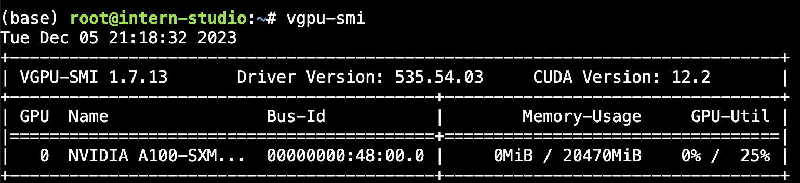

大家可以使用系统给的 vscode 进行后面的开发。分别点击下图「1」和「2」的位置，就会在下方显示终端。

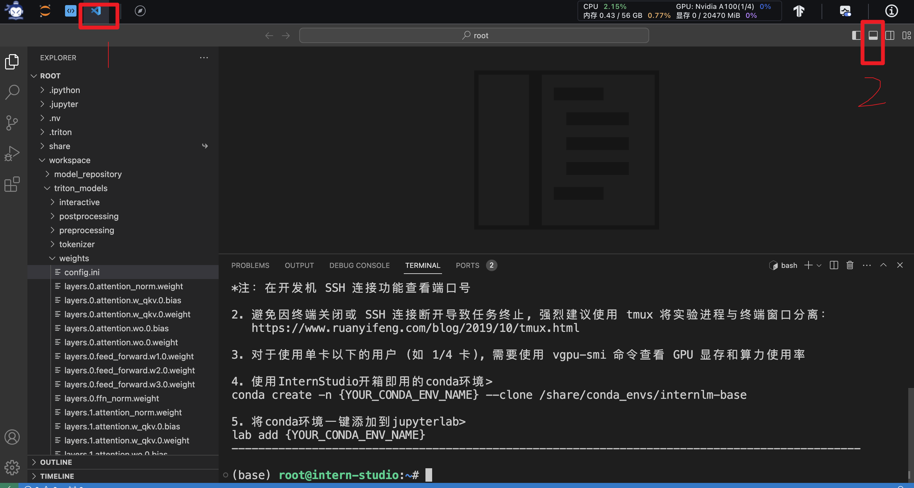

可以点击终端（TERMINAL）窗口右侧的「+」号创建新的终端窗口。大家可以新开一个窗口，执行下面的命令实时观察 GPU 资源的使用情况。

```bash
$ watch vgpu-smi
```

结果如下图所示，该窗口会实时检测 GPU 卡的使用情况。

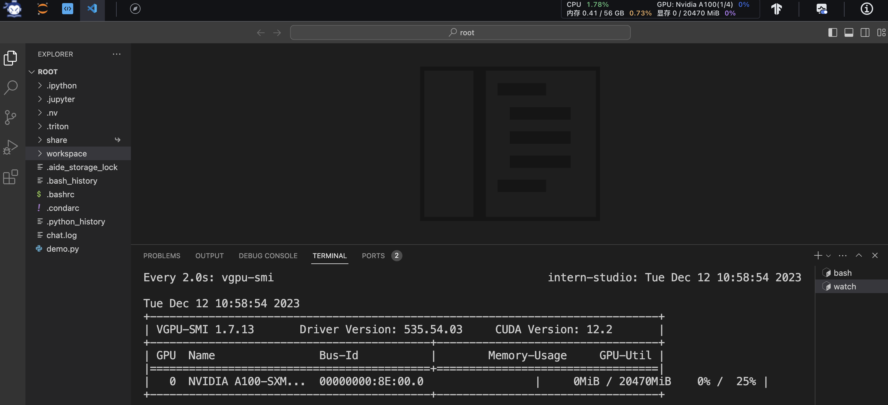

接下来我们切换到刚刚的终端（就是上图右边的那个「bash」，下面的「watch」就是监控的终端），创建部署和量化需要的环境。建议大家使用官方提供的环境，使用 conda 直接复制。

这里 `/share/conda_envs` 目录下的环境是官方未大家准备好的基础环境，因为该目录是共享只读的，而我们后面需要在此基础上安装新的软件包，所以需要复制到我们自己的 conda 环境（该环境下我们是可写的）。

```bash
$ conda create -n CONDA_ENV_NAME --clone /share/conda_envs/internlm-base
```

我们取 `CONDA_ENV_NAME` 为 `lmdeploy`，复制完成后，可以在本地查看环境。

```bash
$ conda env list
```

结果如下所示。

```bash
# conda environments:
#
base                  *  /root/.conda
lmdeploy                 /root/.conda/envs/lmdeploy
```

然后激活环境。

```bash
$ conda activate lmdeploy
```

注意，环境激活后，左边会显示当前（也就是`lmdeploy`）的环境名称，如下图所示。


可以进入Python检查一下 PyTorch 和 lmdeploy 的版本。由于 PyTorch 在官方提供的环境里，我们应该可以看到版本显示，而 lmdeploy 需要我们自己安装，此处应该会提示“没有这个包”，如下图所示。

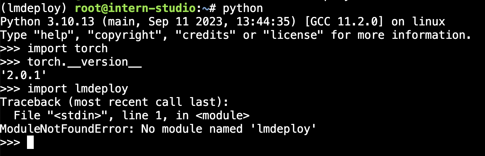

lmdeploy 没有安装，我们接下来手动安装一下，建议安装最新的稳定版。

```bash
$ pip install 'lmdeploy[all]==v0.1.0'
```

由于默认安装的是 runtime 依赖包，但是我们这里还需要部署和量化，所以，这里选择 `[all]`。然后可以再检查一下 lmdeploy 包，如下图所示。


如果遇到类似 ` ModuleNotFoundError: No module named 'packaging'` 这样的错误，大家可以手动先安装一下。

```bash
pip install packaging
```

`packaging` 表示缺少的包名。

基础环境到这里就配置好了。

## 2 服务部署

这一部分主要涉及本地推理和部署。我们先看一张图。

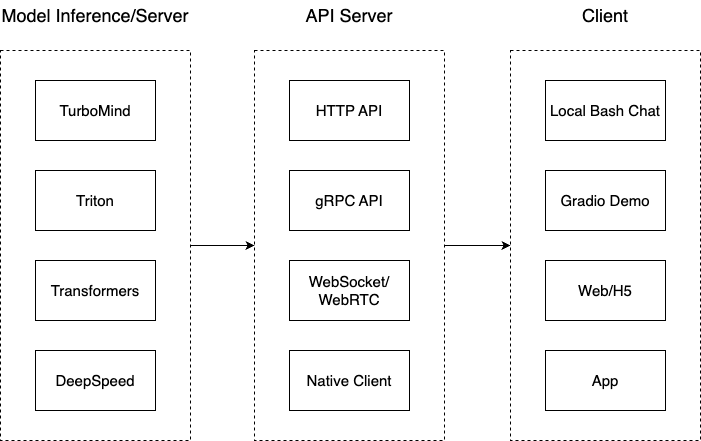

我们把从架构上把整个服务流程分成下面几个模块。

- 模型推理/服务。主要提供模型本身的推理，一般来说可以和具体业务解耦，专注模型推理本身性能的优化。可以以模块、API等多种方式提供。
- Client。可以理解为前端，与用户交互的地方。
- API Server。一般作为前端的后端，提供与产品和服务相关的数据和功能支持。

值得说明的是，以上的划分是一个相对完整的模型，但在实际中这并不是绝对的。比如可以把“模型推理”和“API Server”合并，有的甚至是三个流程打包在一起提供服务。

接下来，我们看一下lmdeploy提供的部署功能。

### 2.1 模型转换

使用 TurboMind 推理模型需要先将模型转化为 TurboMind 的格式，目前支持在线转换和离线转换两种形式。在线转换可以直接加载 Huggingface 模型，离线转换需需要先保存模型再加载。

TurboMind 是一款关于 LLM 推理的高效推理引擎，基于英伟达的 [FasterTransformer](https://github.com/NVIDIA/FasterTransformer) 研发而成。它的主要功能包括：LLaMa 结构模型的支持，persistent batch 推理模式和可扩展的 KV 缓存管理器。

#### 2.1.1 在线转换

lmdeploy 支持直接读取 Huggingface 模型权重，目前共支持三种类型：

- 在 huggingface.co 上面通过 lmdeploy 量化的模型，如 [llama2-70b-4bit](https://huggingface.co/lmdeploy/llama2-chat-70b-4bit), [internlm-chat-20b-4bit](https://huggingface.co/internlm/internlm-chat-20b-4bit)
- huggingface.co 上面其他 LM 模型，如 Qwen/Qwen-7B-Chat

示例如下：

```bash
# 需要能访问 Huggingface 的网络环境
lmdeploy chat turbomind internlm/internlm-chat-20b-4bit --model-name internlm-chat-20b
lmdeploy chat turbomind Qwen/Qwen-7B-Chat --model-name qwen-7b
```

上面两行命令分别展示了如何直接加载 Huggingface 的模型，第一条命令是加载使用 lmdeploy 量化的版本，第二条命令是加载其他 LLM 模型。

我们也可以直接启动本地的 Huggingface 模型，如下所示。

```bash
lmdeploy chat turbomind /share/temp/model_repos/internlm-chat-7b/  --model-name internlm-chat-7b
```

以上命令都会启动一个本地对话界面，通过 Bash 可以与 LLM 进行对话。

#### 2.1.2 离线转换

离线转换需要在启动服务之前，将模型转为 lmdeploy TurboMind  的格式，如下所示。

```bash
# 转换模型（FastTransformer格式） TurboMind
lmdeploy convert internlm-chat-7b /path/to/internlm-chat-7b
```

这里我们使用官方提供的模型文件，就在用户根目录执行，如下所示。

```bash
lmdeploy convert internlm-chat-7b  /root/share/temp/model_repos/internlm-chat-7b/
```

执行完成后将会在当前目录生成一个 `workspace` 的文件夹。这里面包含的就是 TurboMind 和 Triton “模型推理”需要到的文件。

目录如下图所示。

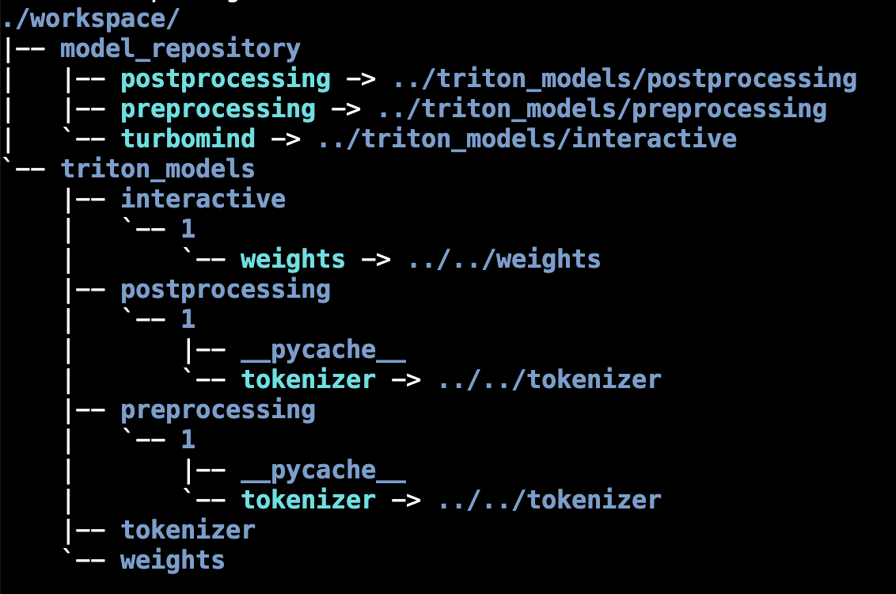

`weights` 和 `tokenizer` 目录分别放的是拆分后的参数和 Tokenizer。如果我们进一步查看 `weights` 的目录，就会发现参数是按层和模块拆开的，如下图所示。

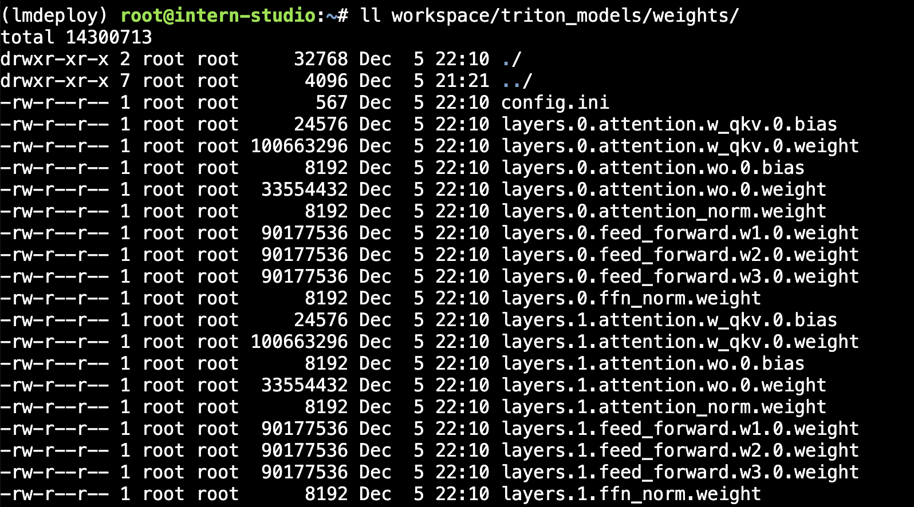

每一份参数第一个0表示“层”的索引，后面的那个0表示 Tensor 并行的索引，因为我们只有一张卡，所以被拆分成1份。如果有两张卡可以用来推理，则会生成0和1两份，也就是说，会把同一个参数拆成两份。比如 `layers.0.attention.w_qkv.0.weight` 会变成 `layers.0.attention.w_qkv.0.weight` 和 `layers.0.attention.w_qkv.1.weight`。执行 `lmdeploy convert` 命令时，可以通过 `--tp` 指定（tp 表示 tensor parallel），该参数默认值为1（也就是一张卡）。

**关于Tensor并行**

Tensor并行一般分为行并行或列并行，原理如下图所示。

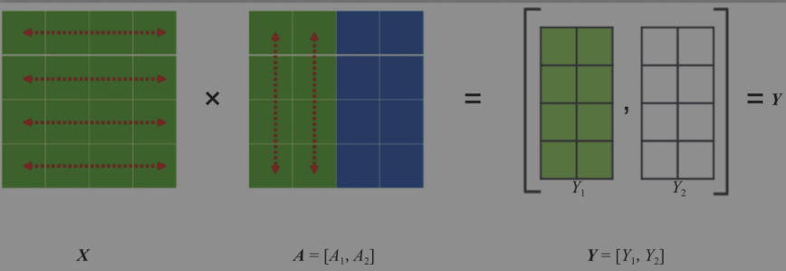

<p align="center">列并行<p>

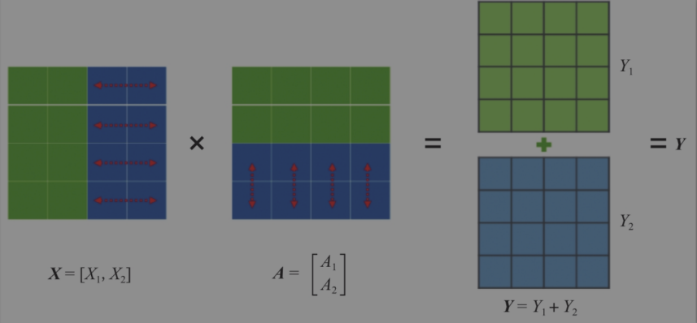

<p align="center">行并行<p>

简单来说，就是把一个大的张量（参数）分到多张卡上，分别计算各部分的结果，然后再同步汇总。

### 2.2  TurboMind推理+命令行本地对话

模型转换完成后，我们就具备了使用模型推理的条件，接下来就可以进行真正的模型推理环节。

我们先尝试本地对话（`Bash Local Chat`），下面用（Local Chat 表示）在这里其实是跳过 API Server 直接调用 TurboMind。简单来说，就是命令行代码直接执行TurboMind。所以说，实际和前面的架构图是有区别的。

这里支持多种方式运行，比如Turbomind、PyTorch、DeepSpeed。但 PyTorch 和 DeepSpeed 调用的其实都是 Huggingface 的 Transformers 包，PyTorch表示原生的 Transformer 包，DeepSpeed 表示使用了 DeepSpeed 作为推理框架。Pytorch/DeepSpeed 目前功能都比较弱，不具备生产能力，不推荐使用。

执行命令如下。

```bash
# Turbomind + Bash Local Chat
lmdeploy chat turbomind ./workspace
```

启动后就可以和它进行对话了，如下图所示。

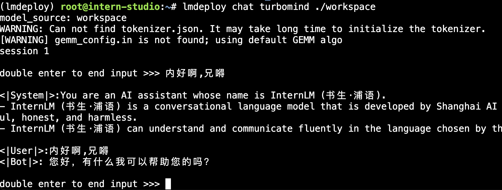

输入后两次回车，退出时输入`exit` 回车两次即可。此时，Server就是本地跑起来的模型（TurboMind），命令行可以看作是前端。

### 2.3 TurboMind推理+API服务

在上面的部分我们尝试了直接用命令行启动 Client，接下来我们尝试如何运用 lmdepoy 进行服务化。

”模型推理/服务“目前提供了Turbomind和TritonServer两种服务化方式。此时，Server是TurboMind或TritonServer，API Server 可以提供对外的 API 服务。我们推荐使用 TurboMind，TritonServer 使用方式详见《附录1》。

首先，通过下面命令启动服务。


```bash
# ApiServer+Turbomind   api_server => AsyncEngine => TurboMind
lmdeploy serve api_server ./workspace \
	--server_name 0.0.0.0 \
	--server_port 23333 \
	--instance_num 64 \
	--tp 1
```

上面的参数中`server_name` 和 `server_port` 分别表示服务地址和端口，`tp` 参数我们之前已经提到过了，表示 Tensor 并行。还剩下一个 `instance_num` 参数，表示实例数，可以理解成 Batch 的大小。执行后如下图所示。

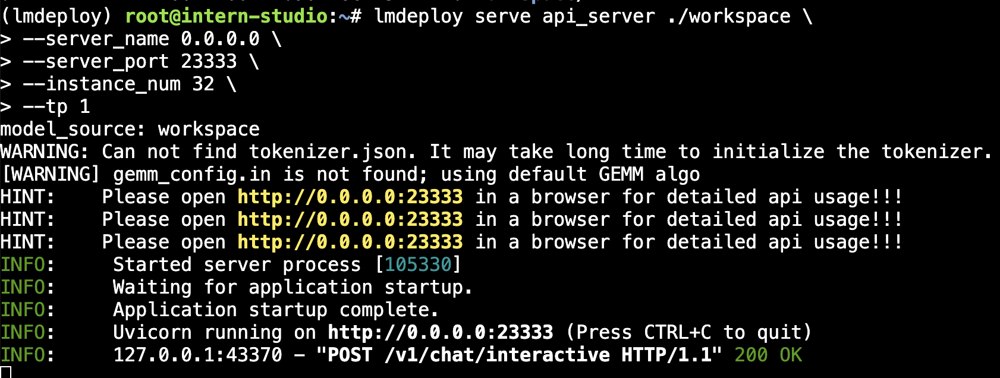

然后，我们可以新开一个窗口，执行下面的 Client 命令。如果使用官方机器，可以打开 vscode 的 Terminal，执行下面的命令。

```bash
# ChatApiClient+ApiServer（注意是http协议，需要加http）
lmdeploy serve api_client http://localhost:23333
```

如下图所示。

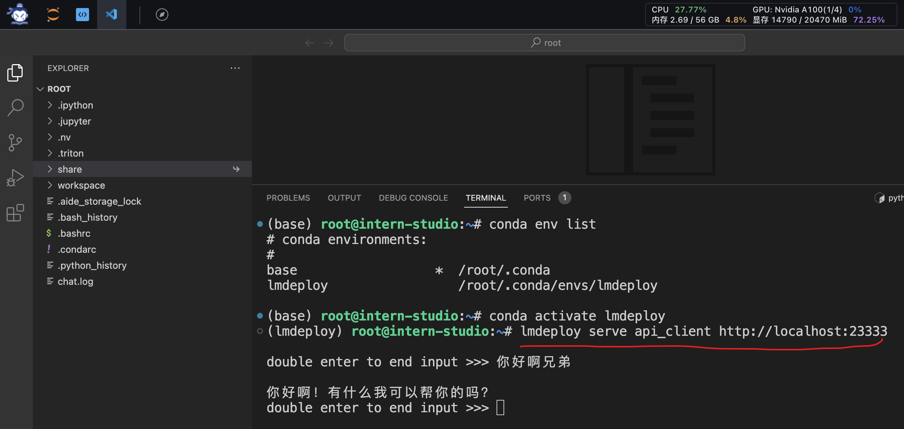

当然，刚刚我们启动的是 API Server，自然也有相应的接口。可以直接打开 `http://{host}:23333` 查看，如下图所示。

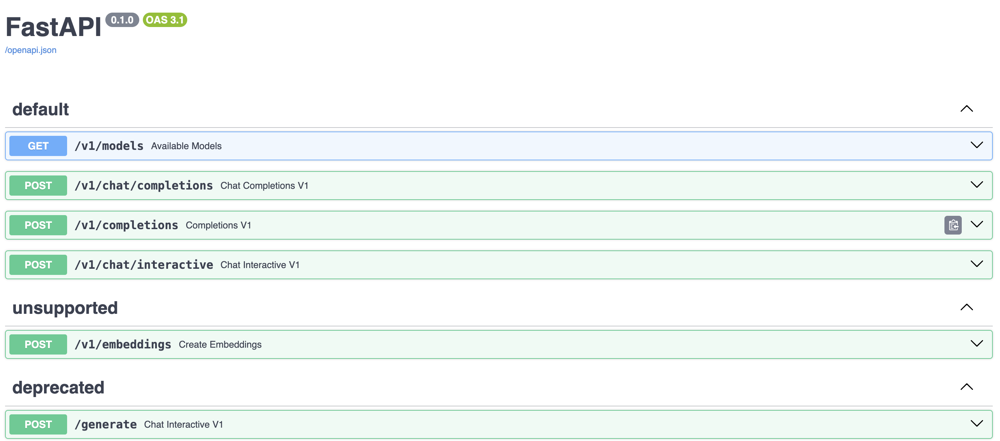

> 注意，这一步由于Server在远程服务器上，所以本地需要做一下 ssh 转发才能直接访问（与第一部分操作一样），命令如下：
>
> ssh -CNg -L 23333:127.0.0.1:23333 root@ssh.intern-ai.org.cn -p <你的ssh端口号>
>
> 而执行本命令需要添加本机公钥，公钥添加后等待几分钟即可生效。ssh 端口号就是下面图片里的 33087。
>
> 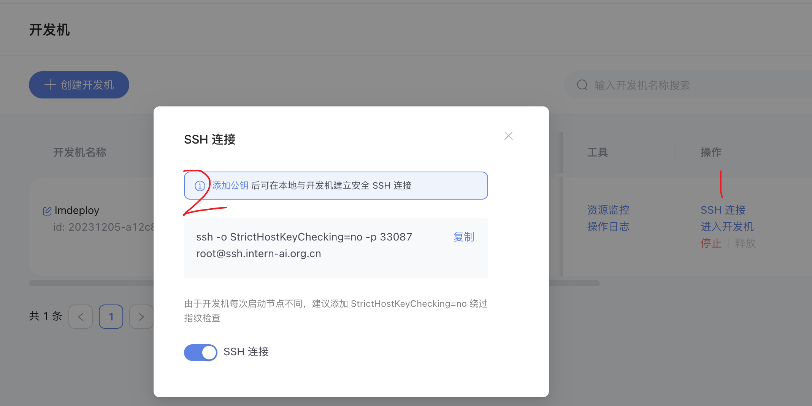

这里一共提供了4个 HTTP 的接口，任何语言都可以对其进行调用，我们以 `v1/chat/completions` 接口为例，简单试一下。

接口请求参数如下：

```json
{
  "model": "internlm-chat-7b",
  "messages": "写一首春天的诗",
  "temperature": 0.7,
  "top_p": 1,
  "n": 1,
  "max_tokens": 512,
  "stop": false,
  "stream": false,
  "presence_penalty": 0,
  "frequency_penalty": 0,
  "user": "string",
  "repetition_penalty": 1,
  "renew_session": false,
  "ignore_eos": false
}
```

请求结果如下。

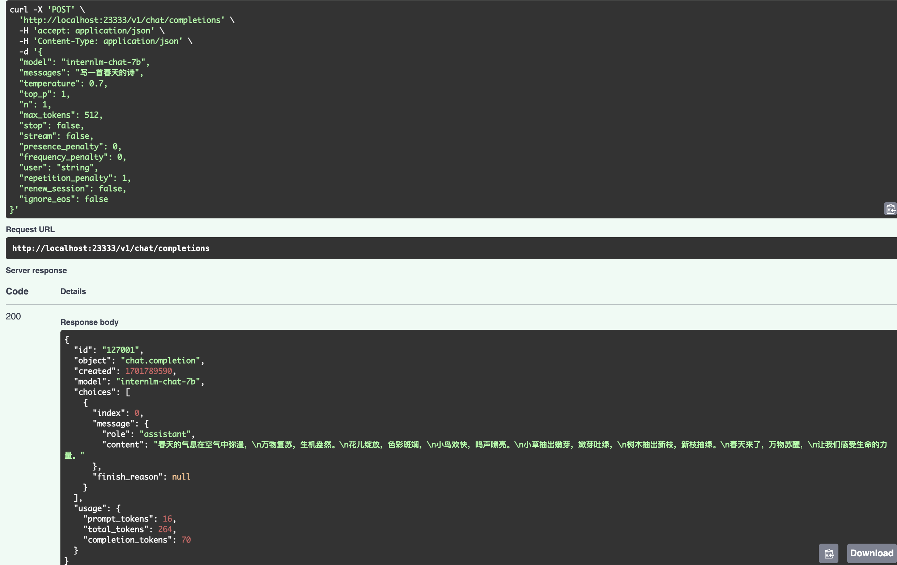

### 2.4 网页Demo演示

这一部分主要是将 Gradio 作为前端 Demo 演示。在上一节的基础上，我们不执行后面的 `api_client` 或 `triton_client`，而是执行 `gradio`。

> 由于 Gradio 需要本地访问展示界面，因此也需要通过 ssh 将数据转发到本地。命令如下：
>
> ssh -CNg -L 6006:127.0.0.1:6006 root@ssh.intern-ai.org.cn -p <你的ssh端口号>

#### 2.4.1 TurboMind服务作为后端

API Server 的启动和上一节一样，这里直接启动作为前端的 Gradio。

```bash
# Gradio+ApiServer。必须先开启Server，此时Gradio为Client
lmdeploy serve gradio http://0.0.0.0:23333 \
	--server_name 0.0.0.0 \
	--server_port 6006 \
	--restful_api True
```

结果如下图所示。

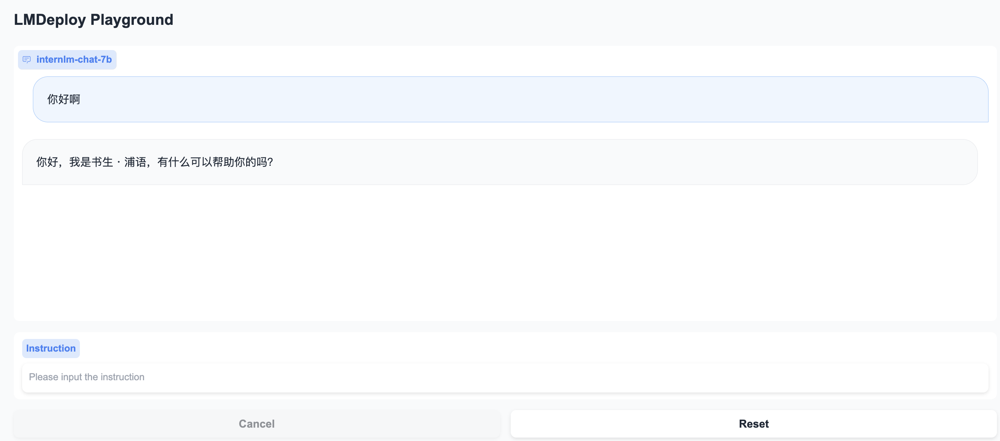


#### 2.4.2 TurboMind推理作为后端

当然，Gradio 也可以直接和 TurboMind 连接，如下所示。

```bash
# Gradio+Turbomind(local)
lmdeploy serve gradio ./workspace
```

可以直接启动 Gradio，此时没有 API Server，TurboMind 直接与 Gradio 通信。如下图所示。


### 2.5 TurboMind推理+Python代码集成

前面介绍的都是通过 API 或某种前端与”模型推理/服务“进行交互，lmdeploy 还支持Python直接与 TurboMind 进行交互，如下所示。

```python
from lmdeploy import turbomind as tm

# load model
model_path = " /root/share/temp/model_repos/internlm-chat-7b/"
tm_model = tm.TurboMind.from_pretrained(model_path, model_name='internlm-chat-20b')
generator = tm_model.create_instance()

# process query
query = "你好啊兄嘚"
prompt = tm_model.model.get_prompt(query)
input_ids = tm_model.tokenizer.encode(prompt)

# inference
for outputs in generator.stream_infer(
        session_id=0,
        input_ids=[input_ids]):
    res, tokens = outputs[0]

response = tm_model.tokenizer.decode(res.tolist())
print(response)
```

在上面的代码中，我们首先加载模型，然后构造输入，最后执行推理。

加载模型可以显式指定模型路径，也可以直接指定 Huggingface 的 repo_id，还可以使用上面生成过的 `workspace`。这里的 `tm.TurboMind` 其实是对 C++ TurboMind 的封装。

构造输入这里主要是把用户的 query 构造成 InternLLM 支持的输入格式，比如上面的例子中， `query` 是“你好啊兄嘚”，构造好的Prompt 如下所示。

```python
"""
<|System|>:You are an AI assistant whose name is InternLM (书生·浦语).
- InternLM (书生·浦语) is a conversational language model that is developed by Shanghai AI Laboratory (上海人工智能实验室). It is designed to be helpful, honest, and harmless.
- InternLM (书生·浦语) can understand and communicate fluently in the language chosen by the user such as English and 中文.

<|User|>:你好啊兄嘚
<|Bot|>:
"""
```

Prompt 其实就是增加了 `<|System|>` 消息和 `<|User|>` 消息（即用户的 `query`），以及一个 `<|Bot|>` 的标记，表示接下来该模型输出响应了。最终输出的响应内容如下所示。

```python
"你好啊，有什么我可以帮助你的吗？"
```

### 2.6 这么多，头秃，有没有最佳实践

#### 2.6.1 方案实践

必——须——有！

首先说 “模型推理/服务”，推荐使用 TurboMind，使用简单，性能良好，相关的 Benchmark 对比如下。

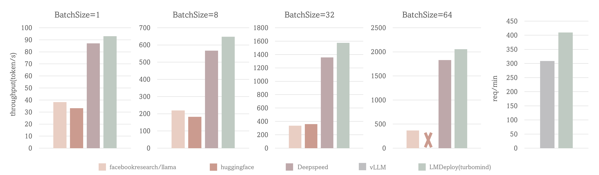

上面的性能对比包括两个场景：

- 场景一（前4张图）：固定的输入、输出 token 数（分别1和2048），测试Token输出吞吐量（output token throughput）。
- 场景二（第5张图）：使用真实数据，测试吞吐量（request throughput）。

场景一中，BatchSize=64时，TurboMind 的吞吐量超过 2000 token/s，整体比 DeepSpeed 提升约 5% - 15%；BatchSize=32时，比 Huggingface 的Transformers 提升约 3 倍；其他BatchSize时 TurboMind 也表现出优异的性能。

场景二中，对比了 TurboMind 和 vLLM 在真实数据上的吞吐量（request throughput）指标，TurboMind 的效率比 vLLM 高 30%。

大家不妨亲自使用本地对话（Local Chat）感受一下性能差别（2.2 节），也可以执行我们提供的 `infer_compare.py` 脚本，示例如下。

```bash
# 执行Huggingface的Transformer
python infer_compare.py hf
# 执行LMDeploy
python infer_compare.py lmdeploy
```

LMDeploy应该是Transformers的3-5倍左右。

后面的 API 服务和 Client 就得分场景了。

- 我想对外提供类似 OpenAI 那样的 HTTP 接口服务。推荐使用 TurboMind推理 + API 服务（2.3）。
- 我想做一个演示 Demo，Gradio 无疑是比 Local Chat 更友好的。推荐使用 TurboMind推理作为后端的Gradio进行演示（2.4.2）。
- 我想直接在自己的 Python 项目中使用大模型功能。推荐使用 TurboMind推理 + Python（2.5）。
- 我想在自己的其他非 Python 项目中使用大模型功能。推荐直接通过 HTTP 接口调用服务。也就是用本列表第一条先启动一个 HTTP API 服务，然后在项目中直接调用接口。
- 我的项目是 C++ 写的，为什么不能直接用 TurboMind 的 C++ 接口？！必须可以！大佬可以右上角叉掉这个窗口啦。

#### 2.6.2 模型配置实践

不知道大家还有没有印象，在离线转换（2.1.2）一节，我们查看了 `weights` 的目录，里面存放的是模型按层、按并行卡拆分的参数，不过还有一个文件 `config.ini` 并不是模型参数，它里面存的主要是模型相关的配置信息。下面是一个示例。

```ini
[llama]
model_name = internlm-chat-7b
tensor_para_size = 1
head_num = 32
kv_head_num = 32
vocab_size = 103168
num_layer = 32
inter_size = 11008
norm_eps = 1e-06
attn_bias = 0
start_id = 1
end_id = 2
session_len = 2056
weight_type = fp16
rotary_embedding = 128
rope_theta = 10000.0
size_per_head = 128
group_size = 0
max_batch_size = 64
max_context_token_num = 1
step_length = 1
cache_max_entry_count = 0.5
cache_block_seq_len = 128
cache_chunk_size = 1
use_context_fmha = 1
quant_policy = 0
max_position_embeddings = 2048
rope_scaling_factor = 0.0
use_logn_attn = 0
```

其中，模型属性相关的参数不可更改，主要包括下面这些。

```ini
model_name = llama2
head_num = 32
kv_head_num = 32
vocab_size = 103168
num_layer = 32
inter_size = 11008
norm_eps = 1e-06
attn_bias = 0
start_id = 1
end_id = 2
rotary_embedding = 128
rope_theta = 10000.0
size_per_head = 128
```

和数据类型相关的参数也不可更改，主要包括两个。

```ini
weight_type = fp16
group_size = 0
```

`weight_type` 表示权重的数据类型。目前支持 fp16 和 int4。int4 表示 4bit 权重。当 `weight_type` 为 4bit 权重时，`group_size` 表示 `awq` 量化权重时使用的 group 大小。

剩余参数包括下面几个。

```ini
tensor_para_size = 1
session_len = 2056
max_batch_size = 64
max_context_token_num = 1
step_length = 1
cache_max_entry_count = 0.5
cache_block_seq_len = 128
cache_chunk_size = 1
use_context_fmha = 1
quant_policy = 0
max_position_embeddings = 2048
rope_scaling_factor = 0.0
use_logn_attn = 0
```

一般情况下，我们并不需要对这些参数进行修改，但有时候为了满足特定需要，可能需要调整其中一部分配置值。这里主要介绍三个可能需要调整的参数。

- KV int8 开关：
    - 对应参数为 `quant_policy`，默认值为 0，表示不适用 KV Cache，如果需要开启，则将该参数设置为 4。
    - KV Cache 是对序列生成过程中的 K 和 V 进行量化，用以节省显存。我们下一部分会介绍具体的量化过程。
    - 当显存不足，或序列比较长时，建议打开此开关。
- 外推能力开关：
    - 对应参数为 `rope_scaling_factor`，默认值为 0.0，表示不具备外推能力，设置为 1.0，可以开启 RoPE 的 Dynamic NTK 功能，支持长文本推理。另外，`use_logn_attn` 参数表示 Attention 缩放，默认值为 0，如果要开启，可以将其改为 1。
    - 外推能力是指推理时上下文的长度超过训练时的最大长度时模型生成的能力。如果没有外推能力，当推理时上下文长度超过训练时的最大长度，效果会急剧下降。相反，则下降不那么明显，当然如果超出太多，效果也会下降的厉害。
    - 当推理文本非常长（明显超过了训练时的最大长度）时，建议开启外推能力。
- 批处理大小：
    - 对应参数为 `max_batch_size`，默认为 64，也就是我们在 API Server 启动时的 `instance_num` 参数。
    - 该参数值越大，吞度量越大（同时接受的请求数），但也会占用更多显存。
    - 建议根据请求量和最大的上下文长度，按实际情况调整。

## 3 模型量化

本部分内容主要介绍如何对模型进行量化。主要包括 KV Cache 量化和模型参数量化。总的来说，量化是一种以参数或计算中间结果精度下降换空间节省（以及同时带来的性能提升）的策略。

正式介绍 LMDeploy 量化方案前，需要先介绍两个概念：

- 计算密集（compute-bound）: 指推理过程中，绝大部分时间消耗在数值计算上；针对计算密集型场景，可以通过使用更快的硬件计算单元来提升计算速。
- 访存密集（memory-bound）: 指推理过程中，绝大部分时间消耗在数据读取上；针对访存密集型场景，一般通过减少访存次数、提高计算访存比或降低访存量来优化。

常见的 LLM 模型由于 Decoder Only 架构的特性，实际推理时大多数的时间都消耗在了逐 Token 生成阶段（Decoding 阶段），是典型的访存密集型场景。

那么，如何优化 LLM 模型推理中的访存密集问题呢？ 我们可以使用 **KV Cache 量化**和 **4bit Weight Only 量化（W4A16）**。KV Cache 量化是指将逐 Token（Decoding）生成过程中的上下文 K 和 V 中间结果进行 INT8 量化（计算时再反量化），以降低生成过程中的显存占用。4bit Weight 量化，将 FP16 的模型权重量化为 INT4，Kernel 计算时，访存量直接降为 FP16 模型的 1/4，大幅降低了访存成本。Weight Only 是指仅量化权重，数值计算依然采用 FP16（需要将 INT4 权重反量化）。

### 3.1 KV Cache 量化

#### 3.1.1 量化步骤

KV Cache 量化是将已经生成序列的 KV 变成 Int8，使用过程一共包括三步：

第一步：计算 minmax。主要思路是通过计算给定输入样本在每一层不同位置处计算结果的统计情况。

- 对于Attention 的 K 和 V：取每个 Head 各自维度在所有Token的最大、最小和绝对值最大值。对每一层来说，上面三组值都是 `(num_heads, head_dim)` 的矩阵。这里的统计结果将用于本小节的 KV Cache。
- 对于模型每层的输入：取对应维度的最大、最小、均值、绝对值最大和绝对值均值。每一层每个位置的输入都有对应的统计值，它们大多是 `(hidden_dim, )` 的一维向量，当然在 FFN 层由于结构是先变宽后恢复，因此恢复的位置维度并不相同。这里的统计结果用于下个小节的模型参数量化，主要用在缩放环节（回顾PPT内容）。

第一步执行命令如下：

```bash
# 计算 minmax
lmdeploy lite calibrate \
  --model  /root/share/temp/model_repos/internlm-chat-7b/ \
  --calib_dataset "c4" \
  --calib_samples 128 \
  --calib_seqlen 2048 \
  --work_dir ./quant_output
```

在这个命令行中，会选择 128 条输入样本，每条样本长度为 2048，数据集选择 C4，输入模型后就会得到上面的各种统计值。值得说明的是，如果显存不足，可以适当调小 samples 的数量或 sample 的长度。

> 这一步由于默认需要从 Huggingface 下载数据集，国内经常不成功。所以我们导出了需要的数据，大家需要对读取数据集的代码文件做一下替换。共包括两步：
>
> - 第一步：复制 `calib_dataloader.py` 到安装目录替换该文件：`cp /root/share/temp/datasets/c4/calib_dataloader.py  /root/.conda/envs/lmdeploy/lib/python3.10/site-packages/lmdeploy/lite/utils/`
> - 第二步：将用到的数据集（c4）复制到下面的目录：`cp -r /root/share/temp/datasets/c4/ /root/.cache/huggingface/datasets/` 

第二步：通过 minmax 获取量化参数。主要就是利用下面这个公式，获取每一层的 K V 中心值（zp）和缩放值（scale）。

```bash
zp = (min+max) / 2
scale = (max-min) / 255
quant: q = round( (f-zp) / scale)
dequant: f = q * scale + zp
```

有这两个值就可以进行量化和解量化操作了。具体来说，就是对历史的 K 和 V 存储 quant 后的值，使用时在 dequant。

第二步的执行命令如下：

```bash
# 通过 minmax 获取量化参数
lmdeploy lite kv_qparams \
  --work_dir ./quant_output  \
  --turbomind_dir workspace/triton_models/weights/ \
  --kv_sym False \
  --num_tp 1
```

在这个命令中，`num_tp` 的含义前面介绍过，表示 Tensor 的并行数。每一层的中心值和缩放值会存储到 `workspace` 的参数目录中以便后续使用。`kv_sym` 为 `True` 时会使用另一种（对称）量化方法，它用到了第一步存储的绝对值最大值，而不是最大值和最小值。

第三步：修改配置。也就是修改 `weights/config.ini` 文件，这个我们在《2.6.2 模型配置实践》中已经提到过了（KV int8 开关），只需要把 `quant_policy` 改为 4 即可。

这一步需要额外说明的是，如果用的是 TurboMind1.0，还需要修改参数 `use_context_fmha`，将其改为 0。

接下来就可以正常运行前面的各种服务了，只不过咱们现在可是用上了 KV Cache 量化，能更省（运行时）显存了。

#### 3.1.2 量化效果

官方给出了 [internlm-chat-7b](https://huggingface.co/internlm/internlm-chat-7b) 模型在 KV Cache 量化前后的显存对比情况，如下表所示。

| batch_size | fp16 memory(MiB) | int8 memory(MiB) | diff(MiB) |
| ---------- | ---------------- | ---------------- | --------- |
| 8          | 22337            | 18241            | -4096     |
| 16         | 30593            | 22369            | -8224     |
| 32         | 47073            | 30625            | -16448    |
| 48         | 63553            | 38881            | -24672    |

可以看出，KV Cache 可以节约大约 20% 的显存。

同时，还在 [opencompass](https://github.com/open-compass/opencompass) 平台上测试了量化前后的精准度（Accuracy）对比情况，如下表所示。

| task          | dataset         | metric        | int8  | fp16  | diff  |
| ------------- | --------------- | ------------- | ----- | ----- | ----- |
| Language      | winogrande      | accuracy      | 60.77 | 61.48 | -0.71 |
| Knowledge     | nq              | score         | 2.69  | 2.60  | +0.09 |
| Reasoning     | gsm8k           | accuracy      | 33.28 | 34.72 | -1.44 |
| Reasoning     | bbh             | naive_average | 20.12 | 20.51 | -0.39 |
| Understanding | openbookqa_fact | accuracy      | 82.40 | 82.20 | +0.20 |
| Understanding | eprstmt-dev     | accuracy      | 90.62 | 88.75 | +1.87 |
| Safety        | crows_pairs     | accuracy      | 32.56 | 31.43 | +1.13 |

可以看出，精度不仅没有明显下降，相反在不少任务上还有一定的提升。可能得原因是，量化会导致一定的误差，有时候这种误差可能会减少模型对训练数据的拟合，从而提高泛化性能。量化可以被视为引入轻微噪声的正则化方法。或者，也有可能量化后的模型正好对某些数据集具有更好的性能。

总结一下，KV Cache 量化既能明显降低显存占用，还有可能同时带来精准度（Accuracy）的提升。

### 3.2 W4A16 量化

#### 3.2.1 量化步骤

W4A16中的A是指Activation，保持FP16，其余参数进行4bit量化。使用过程也可以看作是三步。

> 在深度学习中，W（Weight）一般用于定义不同层神经元之间的连接强度。Bias 是在通过激活函数之前添加到输入的加权总和中的附加数值。它们有助于控制神经元的输出，并为模型的学习过程提供灵活性。Bias 可以被认为是一种将激活函数向左或向右移动的方法，允许模型在输入数据中学习更复杂的模式和关系。所以此处的 A 是指 Bias 参数。

第一步：同 1.3.1，不再赘述。

第二步：量化权重模型。利用第一步得到的统计值对参数进行量化，具体又包括两小步：

- 缩放参数。主要是性能上的考虑（回顾PPT）。
- 整体量化。

第二步的执行命令如下：

```bash
# 量化权重模型
lmdeploy lite auto_awq \
  --model  /root/share/temp/model_repos/internlm-chat-7b/ \
  --w_bits 4 \
  --w_group_size 128 \
  --work_dir ./quant_output 
```

命令中 `w_bits` 表示量化的位数，`w_group_size` 表示量化分组统计的尺寸，`work_dir` 是量化后模型输出的位置。这里需要特别说明的是，因为没有 `torch.int4`，所以实际存储时，8个 4bit 权重会被打包到一个 int32 值中。所以，如果你把这部分量化后的参数加载进来就会发现它们是 int32 类型的。

最后一步：转换成 TurboMind 格式。

```bash
# 转换模型的layout，存放在默认路径 ./workspace 下
lmdeploy convert  internlm-chat-7b ./quant_output \
    --model-format awq \
    --group-size 128
```

这个 `group-size` 就是上一步的那个 `w_group_size`。如果不想和之前的 `workspace` 重复，可以指定输出目录：`--dst_path`，比如：

```bash
lmdeploy convert  internlm-chat-7b ./quant_output \
    --model-format awq \
    --group-size 128 \
    --dst_path ./workspace_quant
```

接下来和上一节一样，可以正常运行前面的各种服务了，不过咱们现在用的是量化后的模型。

最后再补充一点，量化模型和 KV Cache 量化也可以一起使用，以达到最大限度节省显存。

#### 3.2.2 量化效果

官方在 NVIDIA GeForce RTX 4090 上测试了 4-bit 的 Llama-2-7B-chat 和 Llama-2-13B-chat 模型的 token 生成速度。测试配置为 BatchSize = 1，prompt_tokens=1，completion_tokens=512，结果如下表所示。

| model            | llm-awq | mlc-llm | turbomind |
| ---------------- | ------- | ------- | --------- |
| Llama-2-7B-chat  | 112.9   | 159.4   | 206.4     |
| Llama-2-13B-chat | N/A     | 90.7    | 115.8     |

可以看出，TurboMind 相比其他框架速度优势非常显著，比 mlc-llm 快了将近 30%。

另外，也测试了 TurboMind 在不同精度和上下文长度下的显存占用情况，如下表所示。

| model(context length) | 16bit(2048) | 4bit(2048) | 16bit(4096) | 4bit(4096) |
| --------------------- | ----------- | ---------- | ----------- | ---------- |
| Llama-2-7B-chat       | 15.1        | 6.3        | 16.2        | 7.5        |
| Llama-2-13B-chat      | OOM         | 10.3       | OOM         | 12.0       |

可以看出，4bit 模型可以降低 50-60% 的显存占用，效果非常明显。

总而言之，W4A16 参数量化后能极大地降低显存，同时相比其他框架推理速度具有明显优势。

### 3.3 最佳实践

本节是针对《模型量化》部分的最佳实践。

首先我们需要明白一点，服务部署和量化是没有直接关联的，量化的最主要目的是降低显存占用，主要包括两方面的显存：模型参数和中间过程计算结果。前者对应《3.2 W4A16 量化》，后者对应《3.1 KV Cache 量化》。

量化在降低显存的同时，一般还能带来性能的提升，因为更小精度的浮点数要比高精度的浮点数计算效率高，而整型要比浮点数高很多。

所以我们的建议是：在各种配置下尝试，看效果能否满足需要。这一般需要在自己的数据集上进行测试。具体步骤如下。

- Step1：优先尝试正常（非量化）版本，评估效果。
    - 如果效果不行，需要尝试更大参数模型或者微调。
    - 如果效果可以，跳到下一步。
- Step2：尝试正常版本+KV Cache 量化，评估效果。
    - 如果效果不行，回到上一步。
    - 如果效果可以，跳到下一步。
- Step3：尝试量化版本，评估效果。
    - 如果效果不行，回到上一步。
    - 如果效果可以，跳到下一步。
- Step4：尝试量化版本+ KV Cache 量化，评估效果。
    - 如果效果不行，回到上一步。
    - 如果效果可以，使用方案。

简单流程如下图所示。

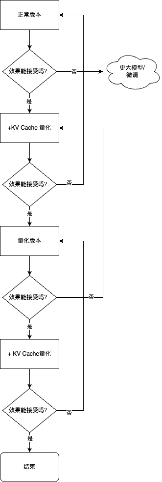

另外需要补充说明的是，使用哪种量化版本、开启哪些功能，除了上述流程外，**还需要考虑框架、显卡的支持情况**，比如有些框架可能不支持 W4A16 的推理，那即便转换好了也用不了。

根据实践经验，一般情况下：

- 精度越高，显存占用越多，推理效率越低，但一般效果较好。
- Server 端推理一般用非量化版本或半精度、BF16、Int8 等精度的量化版本，比较少使用更低精度的量化版本。
- 端侧推理一般都使用量化版本，且大多是低精度的量化版本。这主要是因为计算资源所限。

以上是针对项目开发情况，如果是自己尝试（玩儿）的话：

- 如果资源足够（有GPU卡很重要），那就用非量化的正常版本。
- 如果没有GPU卡，只有CPU（不管什么芯片），那还是尝试量化版本。
- 如果生成文本长度很长，显存不够，就开启 KV Cache。

建议大家根据实际情况灵活选择方案。

## 参考资料

- [InternLM/lmdeploy: LMDeploy is a toolkit for compressing, deploying, and serving LLMs.](https://github.com/InternLM/lmdeploy/)
- [仅需一块 3090 显卡，高效部署 InternLM-20B 模型 - 知乎](https://zhuanlan.zhihu.com/p/665725861)

## 附录1：TritonServer作为推理引擎


### TritonServer环境配置

> 注意：本部分内容仅支持物理机上执行，不支持虚拟主机。

使用 Triton Server 需要安装一下 Docker 及其他依赖。

先装一些基本的依赖。

```bash
apt-get update
apt-get install cmake sudo -y
```

然后是 Docker 安装。

```bash
# Add Docker's official GPG key:
sudo apt-get install ca-certificates curl gnupg
sudo install -m 0755 -d /etc/apt/keyrings
curl -fsSL https://download.docker.com/linux/ubuntu/gpg | sudo gpg --dearmor -o /etc/apt/keyrings/docker.gpg
sudo chmod a+r /etc/apt/keyrings/docker.gpg

# Add the repository to Apt sources:
echo \
  "deb [arch=$(dpkg --print-architecture) signed-by=/etc/apt/keyrings/docker.gpg] https://download.docker.com/linux/ubuntu \
  $(. /etc/os-release && echo "$VERSION_CODENAME") stable" | \
  sudo tee /etc/apt/sources.list.d/docker.list > /dev/null
sudo apt-get update

# install
sudo apt-get install docker-ce docker-ce-cli containerd.io docker-buildx-plugin docker-compose-plugin
```

安装后我们跑一个 HelloWorld。

```bash
# helloworld
sudo docker run hello-world
```

可以看到类似下面的画面，表示运行成功。

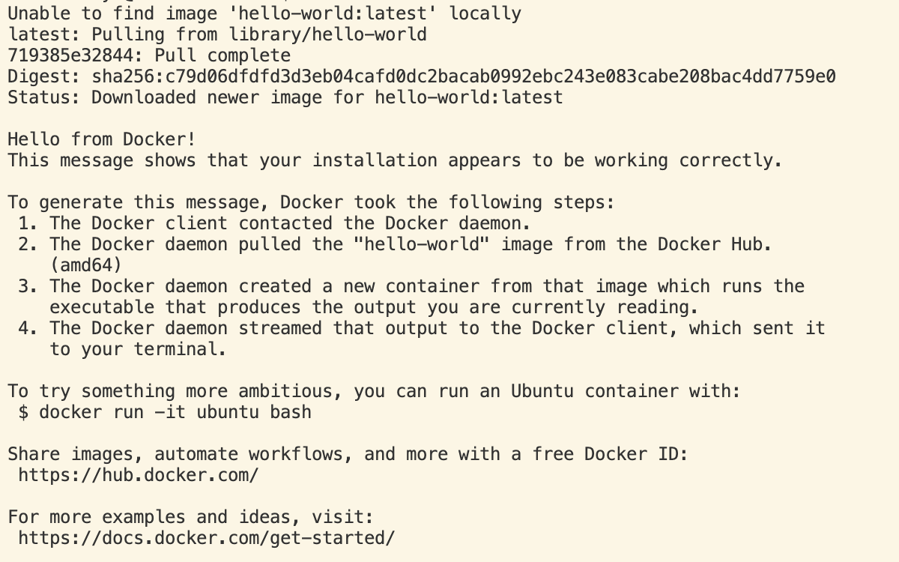


### TritonServer推理+API服务

> 注意：这部分需要 Docker 服务。

这里我们把提供模型推理服务的引擎从 TurboMind 换成了 TritonServer，启动命令就一行。

```bash
# ApiServer+Triton
bash workspace/service_docker_up.sh
```

这里会启动一个 TritonServer 的容器，如下图所示。

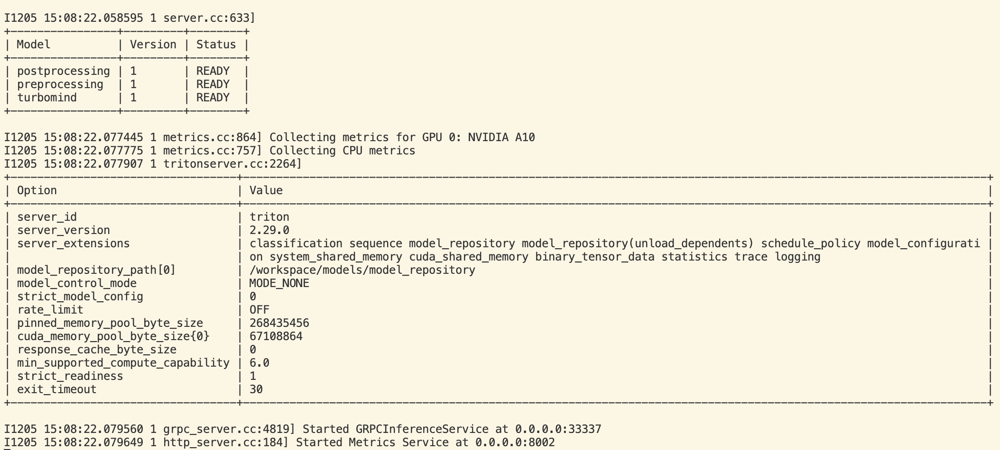

可以再开一个窗口执行 Client 命令。

```bash
# ChatTritonClient + TritonServer（注意是gRPC协议，不要用http）
lmdeploy serve triton_client  localhost:33337
```

结果如下图所示。

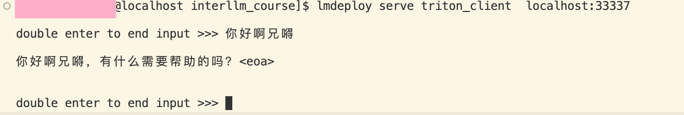


### TritonServer服务作为后端

使用过程同 2.4.1 小节。

```bash
# Gradio+TritonServer（注意是gRPC协议，不要用http）
lmdeploy serve gradio localhost:33337 \
	--server_name 0.0.0.0 \
	--server_port 6006
```

结果如下图所示。

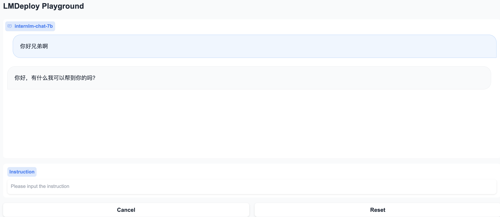
