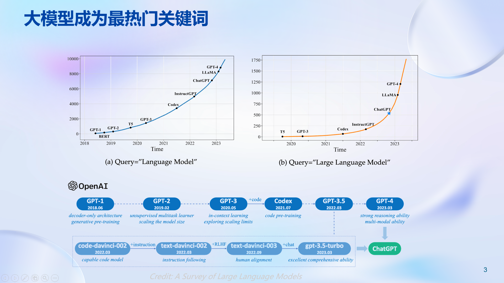
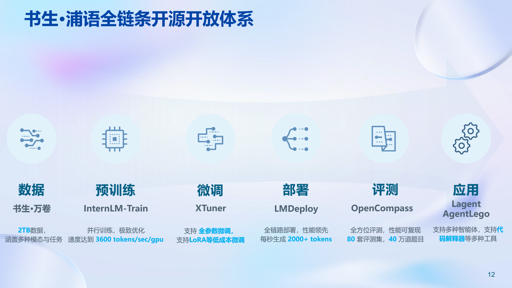
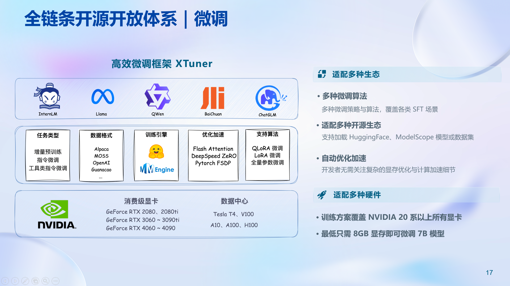
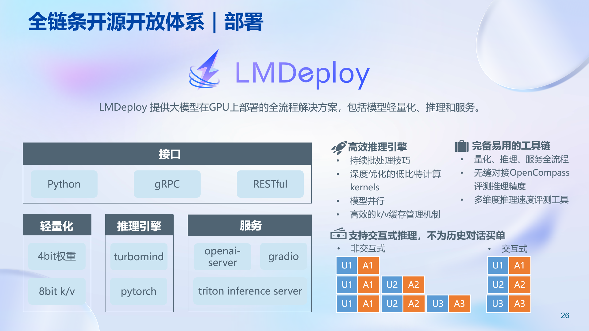
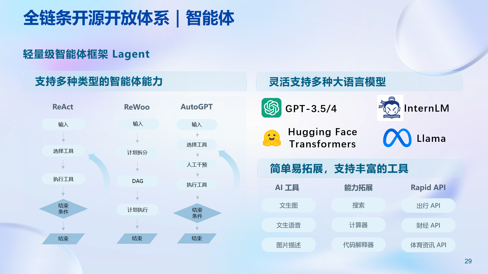

# 1.背景介绍

随着Chat-GPT大火后，LLM的关注度也日益上升。大模型成为发展通用人工智能中的重要突进。

# 2.介绍书生浦语

接下来的课程将会学习如何使用Xtuner,LMDeploy，Lagent

# 3.Xtuner

这个框架功能主要是进行模型微调，大模型微调是指在已经预训练好的大型语言模型基础上，使用特定的数据集进行进一步的训练，以使模型适应特定任务或领域。

# 4.LMDeploy

这个框架功能主要是进行模型部署

# 5.Lagent

构建智能体，训练大语言模型使用其它工具的能力。大模型构建智能体是指利用大规模的语言模型作为核心组件，来创建能够在开放域环境中自主地与人或其他智能体进行交互和协作的智能系统

# 总结

第一节课主要进行一些科普与介绍，提出整个课程框架，并且引出了之后要学习的内容。
