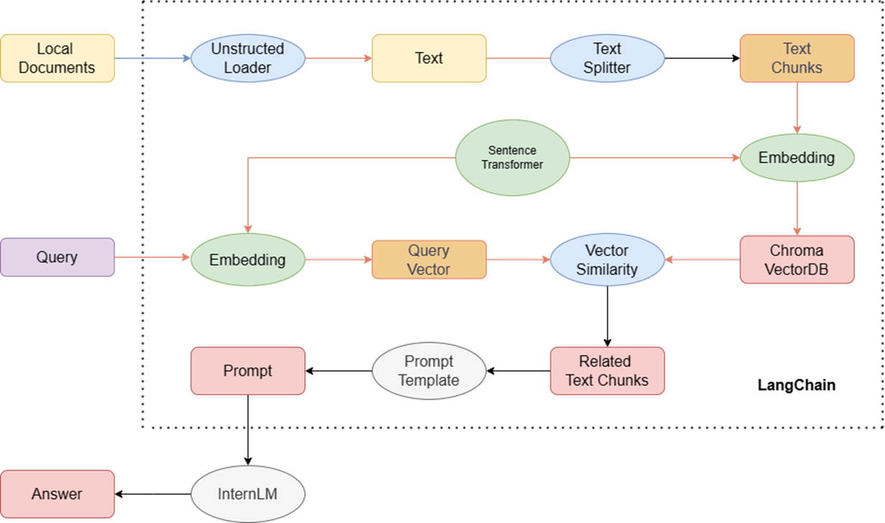

# 前言

第三节课和第四节课，讲解了两种修改模型，增强模型能力的思路

- RAG是Retrieval Augmented Generation的缩写，意思是检索增强生成。它是一种利用外部知识源来提高语言模型生成能力的技术。它的工作原理是：
检索器：当收到一个查询，比如一个问题，这个组件会在一个庞大的数据库中搜索相关的文本或文章。这些文本或文章会作为生成回答的上下文。
生成器：利用检索到的上下文，一个先进的语言模型会生成一个完整和准确的回答。
RAG的优点是可以结合数据搜索的效率（从海量数据中提取合适的信息）和语言模型的优雅（创建流畅的文本并基于提供的上下文）。这种结合通常会比单纯的语言模型产生更丰富和更精确的回答，特别是当必要的细节不在模型的基础训练中时。

- Finetune是一种对现有模型进行微调的方法，使其适应特定的任务或数据集。它不是从零开始，而是利用模型的预先存在的知识，这些知识来自于它之前的广泛训练。这种方法对于与原始训练上下文有些不同的任务特别有效。

**第三节课将使用第一种方式——即RAG**

# 基于LangChain搭建RAG应用

图可以分为两部分：

- 上面部分构建了一个向量知识库。
- 下面部分反映了回答的过程。

#  构建向量知识库

步骤分为：加载源文件，文档分块，文档向量化。因为，LLM对输入的长度有限制，因此需要对输入的文字进行分块。
本次使用Sentence Transformer 来进行文本向量化。使用Chroma作为向量数据库。

# 构建检索问答链

我们可以调用一个 LangChain 提供的 RetrievalQA 对象，通过初始化时填入已构建的数据库和自定义 LLM 作为参数，来简便地完成检索增强问答的全流程，LangChain 会自动完成基于用户提问进行检索、获取相关文档、拼接为合适的 Prompt 并交给 LLM 问答的全部流程。

# 总结

本节课介绍了两种提升语言模型能力的方法：RAG和Finetune，并以RAG为例，展示了如何使用LangChain构建基于大型语言模型的应用。RAG是一种检索增强生成的技术，它利用外部知识源来提供上下文，从而生成更丰富和更精确的回答。