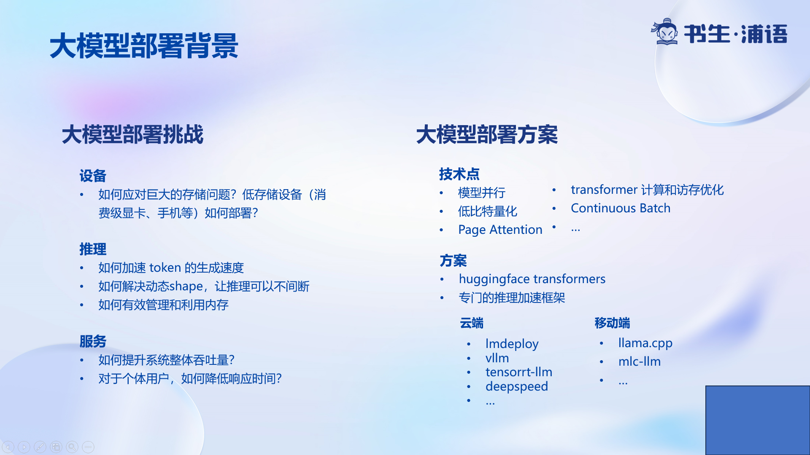
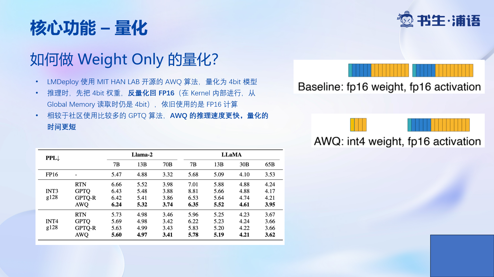
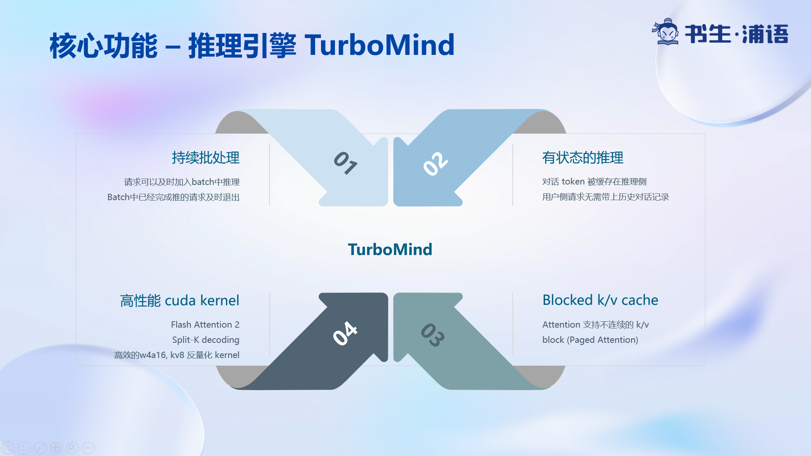

## 1.前言

本次课是基础课程最后一次内容，大模型的部署。本次课程所使用最基础的大模型 InternLM-7B，是最小的模型。但它的权重大小仍然有13.6 GB。

以我自己的电脑为例，我电脑的显卡是, RTX3060 12GB。入门款的消费级显卡。显然的是，无法读取进模型。因此，模型的部署是一个挑战性的任务。

## 2.模型部署

本次课程使用的模型框架是lmdeploy。

## 2.1 量化介绍

LMDeploy 使用 MIT HAN LAB 开源的 AWQ 算法，量化为 4bit 模型。

AWQ论文：https://arxiv.org/abs/2306.00978

## 2.2 TurboMind

TurboMind推理引擎是LMDeploy的核心部件，它具有以下四个优势，也是核心的设计理念。

## 3.总结

本次课听讲主要听其中的核心概念。当然由于时间关系，有些细节没有讲到，之后会阅读相关论文继续了解。