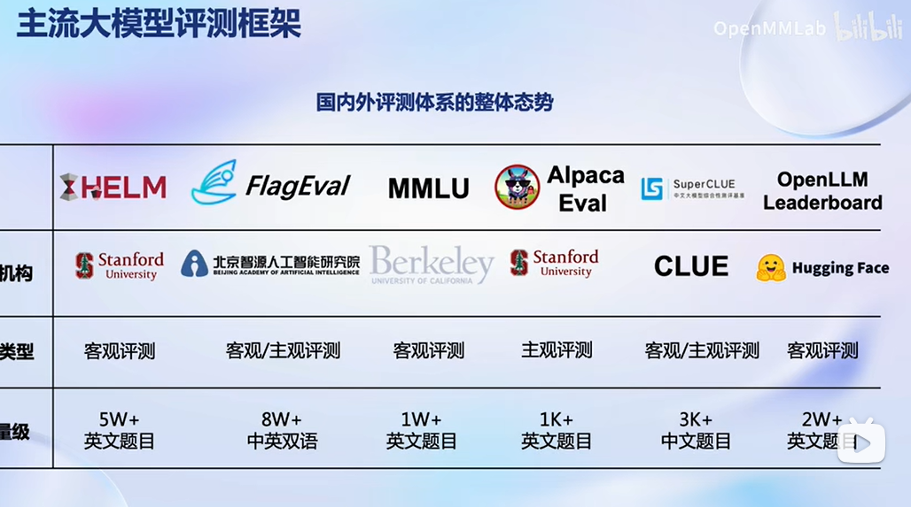
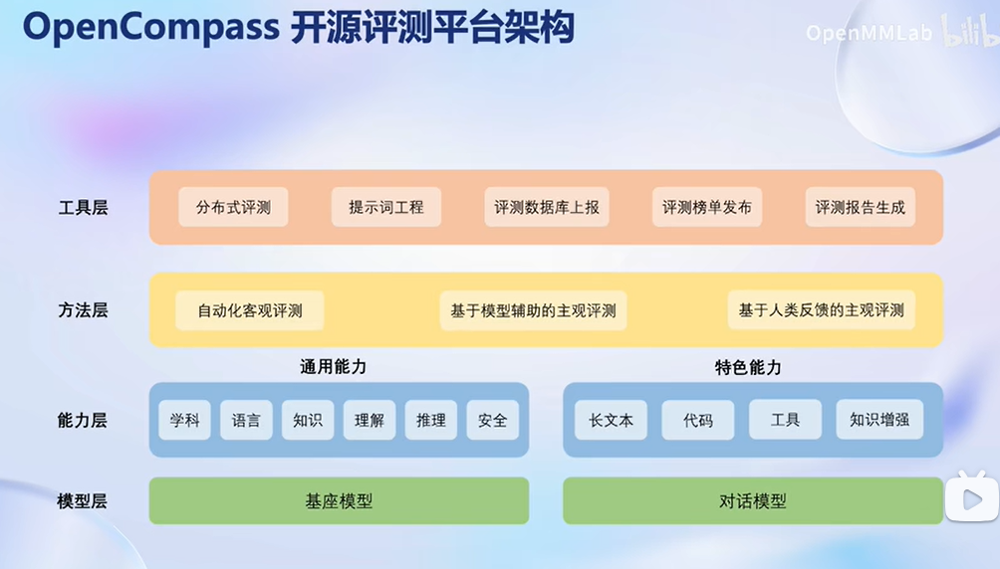
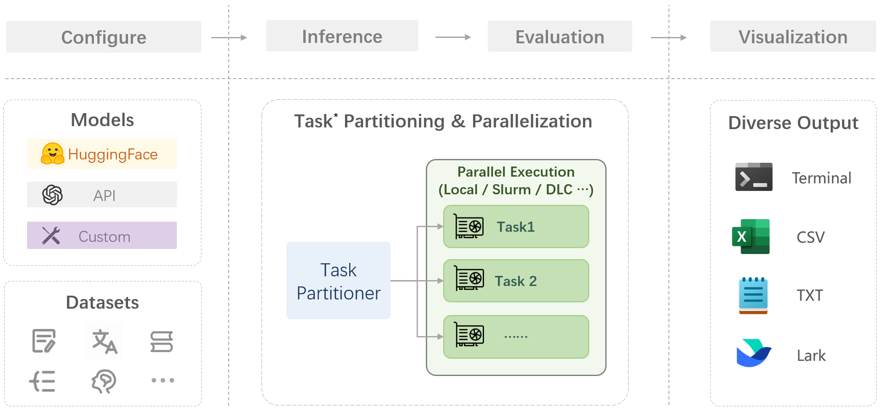

## 1. 前言

本节课主要关注于模型的评测。就如同其它的模型一样，我们也需要对模型的性能进行评估。由于大语言模型和多模态模型的能力强大，应用场景广泛，目前学术界和工业界的评测方案往往只关注模型的部分能力维度，缺少系统化的能力维度框架与评测方案。OpenCompass提供设计一套全面、高效、可拓展的大模型评测方案，对模型能力、性能、安全性等进行全方位的评估。OpenCompass提供分布式自动化的评测系统，支持对(语言/多模态)大模型开展全面系统的能力评估。

## 2.模型评估

### 大模型评估是一个复杂的任务

### 主流框架

### 工具架构

### 流水线设计

## 3. 后记

大语言模型的基本流程本次课程已经基本学习完成了。从模型最基本的应用开始，到构建智能体，微调模型，模型部署，模型评测。训练一个模型基本流程已经基本熟悉。
但本次课程只是大概过了一遍，很多细节还需要进一步学习。
实操的链接：https://github.com/Shengshenlan/tutorial/blob/master/homework/6/%E7%AC%AC6%E8%8A%82%E8%AF%BE%E4%BD%9C%E4%B8%9A.md