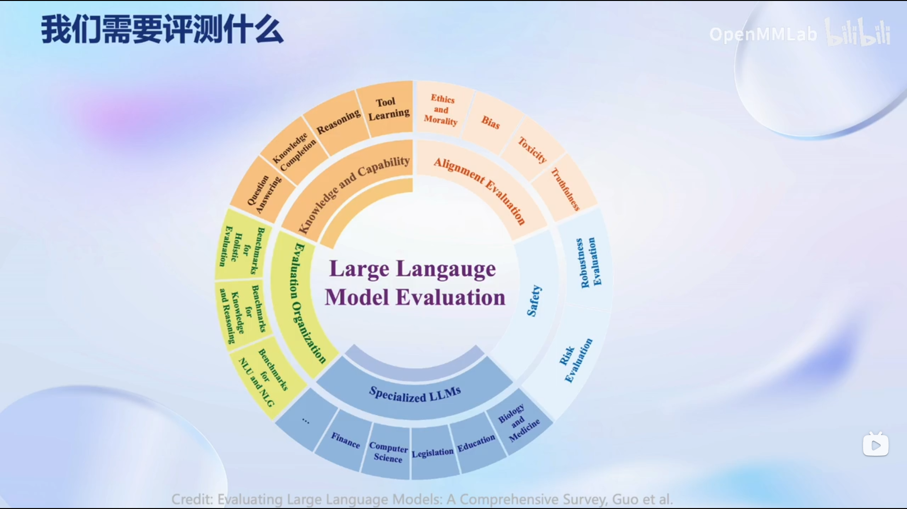

## 1.前言

本节课主要关注于模型的评测。就如同其它的模型一样，我们也需要对模型的性能进行评估。由于大语言模型和多模态模型的能力强大，应用场景广泛，目前学术界和工业界的评测方案往往只关注模型的部分能力维度，缺少系统化的能力维度框架与评测方案。OpenCompass提供设计一套全面、高效、可拓展的大模型评测方案，对模型能力、性能、安全性等进行全方位的评估。OpenCompass提供分布式自动化的评测系统，支持对(语言/多模态)大模型开展全面系统的能力评估。

## 2.模型评估

大模型评估是一个复杂的任务。

