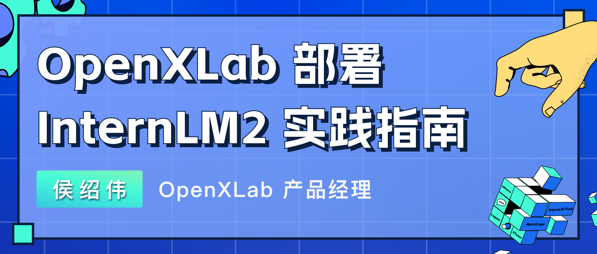
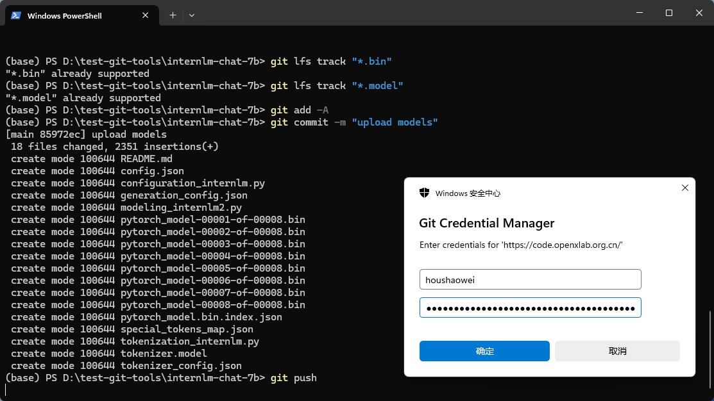

# OpenXLab 部署 InternLM2-7B 实践指南

本文档将手把手教您如何在 OpenXLab 部署一个 InternLM2-7B chat 的应用。

- [1. 相关资料介绍](#1-%E7%9B%B8%E5%85%B3%E8%B5%84%E6%96%99%E4%BB%8B%E7%BB%8D)
  - [1.1 书生·浦语 InternLM介绍](#11-%E4%B9%A6%E7%94%9F%E6%B5%A6%E8%AF%AD-internlm%E4%BB%8B%E7%BB%8D)
  - [1.2 OpenXLab·浦源平台介绍](#12-openxlab%E6%B5%A6%E6%BA%90%E5%B9%B3%E5%8F%B0%E4%BB%8B%E7%BB%8D)
- [2. 部署 InternLM2-Chat-7B demo](#2-%E9%83%A8%E7%BD%B2-internlm2-chat-7b-demo)
  - [2.1 模型准备](#21-%E6%A8%A1%E5%9E%8B%E5%87%86%E5%A4%87)
  - [2.2 上传模型](#22-%E4%B8%8A%E4%BC%A0%E6%A8%A1%E5%9E%8B)
    - [2.2.1 初始化 Git 配置](#221-%E5%88%9D%E5%A7%8B%E5%8C%96-git-%E9%85%8D%E7%BD%AE)
    - [2.2.2 拉取模型仓库](#222-%E6%8B%89%E5%8F%96%E6%A8%A1%E5%9E%8B%E4%BB%93%E5%BA%93)
    - [2.2.3 获取 Git Access Token](#223-%E8%8E%B7%E5%8F%96-git-access-token)
    - [2.2.4 上传模型文件](#224-%E4%B8%8A%E4%BC%A0%E6%A8%A1%E5%9E%8B%E6%96%87%E4%BB%B6)
  - [2.3 编写代码](#23-%E7%BC%96%E5%86%99%E4%BB%A3%E7%A0%81)
    - [2.3.1 初始化项目结构](#231-%E5%88%9D%E5%A7%8B%E5%8C%96%E9%A1%B9%E7%9B%AE%E7%BB%93%E6%9E%84)
    - [2.3.2 应用环境配置](#232-%E5%BA%94%E7%94%A8%E7%8E%AF%E5%A2%83%E9%85%8D%E7%BD%AE)
    - [2.3.3 编写 Gradio 应用代码](#233-%E7%BC%96%E5%86%99-gradio-%E5%BA%94%E7%94%A8%E4%BB%A3%E7%A0%81)
    - [2.3.4 推送代码至 GitHub](#234-%E6%8E%A8%E9%80%81%E4%BB%A3%E7%A0%81%E8%87%B3-github)
  - [2.4 部署应用](#24-%E9%83%A8%E7%BD%B2%E5%BA%94%E7%94%A8)
    - [2.4.1 创建入口](#241-%E5%88%9B%E5%BB%BA%E5%85%A5%E5%8F%A3)
    - [2.4.2 应用配置](#242-%E5%BA%94%E7%94%A8%E9%85%8D%E7%BD%AE)
    - [2.4.3 应用构建和启动](#243-%E5%BA%94%E7%94%A8%E6%9E%84%E5%BB%BA%E5%92%8C%E5%90%AF%E5%8A%A8)
    - [2.4.4 应用公开](#244-%E5%BA%94%E7%94%A8%E5%85%AC%E5%BC%80)

&nbsp; 
## 1. 相关资料介绍

### 1.1 书生·浦语 InternLM介绍

[InternLM](https://github.com/InternLM/InternLM) 是在过万亿 token 数据上训练的多语千亿参数基座模型。通过多阶段的渐进式训练，InternLM 基座模型具有较高的知识水平，在中英文阅读理解、推理任务等需要较强思维能力的场景下性能优秀，在多种面向人类设计的综合性考试中表现突出。浦语全链条开源开放体系如下：


&nbsp; 
### 1.2 OpenXLab·浦源平台介绍

[OpenXLab](https://openxlab.org.cn/home) 浦源平台以开源为核心，旨在构建开源开放的人工智能生态，促进学术成果的开放共享。OpenXLab面向 AI 研究员和开发者提供 AI 领域的一站式服务平台，包含数据集中心、模型中心和应用中心，致力于推动人工智能对产学研各领域全面赋能，为构建人工智能开放生态，推动人工智能科研与技术突破、交叉创新和产业落地提供全方位的平台支撑。


&nbsp; 
&nbsp; 
## 2. 部署 InternLM2-Chat-7B demo 

本小节主要介绍如何在 OpenXLab 上部署一个 internLM2-Chat 的应用，具体步骤如下：


> 本次部署工作使用的三个平台，可查看如下链接了解详情：
>
> * InternLM2 GitHub文档：https://github.com/InternLM/InternLM
>
> * Gradio官方说明文档：https://www.gradio.app/docs/interface
>
> * OpenXLab平台地址：https://openxlab.org.cn/home


### 2.1 模型准备

准备InternLM2-Chat-7B的预训练模型，关于InternLM2-Chat-7B的模型权重链接如下：

| Model             | OpenXLab                                                     | Hugging Face                                                 | ModelScope                                                   |
| :---------------- | :----------------------------------------------------------- | :----------------------------------------------------------- | :----------------------------------------------------------- |
| InternLM2-Chat-7B | [OpenLMLab/internlm2-chat-7b](https://openxlab.org.cn/models/detail/OpenLMLab/internlm2-chat-7b) | [internlm/internlm2-chat-7b](https://huggingface.co/internlm/internlm2-chat-7b) | [Shanghai_AI_Laboratory/internlm2-chat-7b](https://modelscope.cn/models/Shanghai_AI_Laboratory/internlm2-chat-7b) |

> 1. 如有自己微调的模型，跳过该步骤，用自己训练好的模型即可。
>
> 2. 如需获取 InternLM2其他模型，可查看 GitHub 的 [Model Zoo 文档](https://github.com/InternLM/InternLM/blob/main/README_zh-CN.md#model-zoo)


&nbsp; 
### 2.2 上传模型

> 若 OpenXLab 模型中心已托管你所需要的模型，可跳过模型上传的步骤

本小节为上传模型至 OpenXLab 模型中心的步骤如下


#### 2.2.1 初始化 Git 配置

安装Git的命令取决于您使用的操作系统。以下是在不同操作系统上安装 Git 的常见方法：

**Windows:** 

1. 访问Git官方网站下载页面：[Git - Downloads](https://git-scm.com/downloads)
2. 点击“Windows”下载Git安装程序。
3. 运行下载的安装程序并按照向导指示完成安装。

**Linux:** 

安装 git 和 git lfs，命令如下

```shell
# install git
sudo apt-get update
sudo apt-get install git

# install git lfs
sudo apt-get update
sudo apt-get install git-lfs

# use git install lfs
git instll lfs
```


&nbsp; 
设置您的 Git 用户名，OpenXLab 使用您在平台的用户名作为 Git的用户名，具体获取路径，可登录 OpenXLab 后，点击个人头像下的 【账号与安全】查看个人的用户名


配置 Git Username

```shell
git config --global user.name "Username"
```

> 需要将 Username 替换成你在OpenXL平台上的用户名


&nbsp; 
#### 2.2.2 拉取模型仓库

首先需要在 OpenXLab 先创建一个空仓库，填写模型仓库的基本信息，包括仓库名称、任务类型、访问权限等。


创建完成空的模型仓库后，找到该仓库的 git 地址并拉取该空仓库至本地，空仓库的地址在模型文件的下载按钮下，如下所示


找到空仓库下的 git 地址，执行 git clone 操作

```shell
git clone https://code.openxlab.org.cn//username/reponame.git
```

> 需要将其中的 username 和 reponame 换成在模型中心中个人的 用户名 和 模型仓库的名称，例如 https://code.openxlab.org.cn/houshaowei/internlm-chat-7b.git


&nbsp; 
#### 2.2.3 获取 Git Access Token

在 OpenXLab 的密钥管理添加 Git 令牌，步骤如下


进入密钥管理页面，点击添加令牌，输入一个令牌名称和选择可写的权限，如下图所示


添加完令牌后，记得复制生成的 Access Token，如下图所示


在执行 git clone 时会弹出身份验证的弹窗，填入 Username 和 Token 信息，如图所示




&nbsp; 
#### 2.2.4 上传模型文件

在克隆的仓库目录中整理模型文件，即将你的模型文件放入至clone的目录中，并执行git push命令将模型推送至远程仓库

本地 clone 的文档目录结构如下所示：

```text
├─internlm2-chat-7b
│  ├─.gitattributes                 
│  ├─README.md       
│  ├─config.json           
|  ├─configuration_internlm.py  
|  ├─generation_config.json 
|  ├─modeling_internlm2.py 
|  ├─pytorch_model-00001-of-00008.bin 
|  ├─pytorch_model-00002-of-00008.bin 
|  ├─pytorch_model-00003-of-00008.bin 
|  ├─pytorch_model-00004-of-00008.bin
|  ├─pytorch_model-00005-of-00008.bin
|  ├─pytorch_model-00006-of-00008.bin
|  ├─pytorch_model-00007-of-00008.bin 
|  ├─pytorch_model-00008-of-00008.bin 
|  ├─pytorch_model.bin.index.json
|  ├─special_tokens_map.json
|  ├─tokenization_internlm.py 
|  ├─tokenizer.model 
│  └─tokenizer_config.json
```


&nbsp; 
在执行 `git push` 之前，如果您的仓库中包含大型文件，并且您希望使用 Git LFS 来管理这些文件，您需要先标记这些文件以便 Git LFS 能够识别它们。这通常是通过使用 `git lfs track` 命令来标记。以下是使用 `git lfs track` 命令的基本步骤：

**跟踪文件**：使用 `git lfs track` 命令来标记你希望通过 Git LFS 管理的文件。例如，您想要跟踪所有的 `.bin`和` .model`的模型文件，可以使用以下命令：

```shell
git lfs track "*.bin"
git lfs track "*.model"
```


&nbsp; 
标记LFS管理的文件后，提交更新的信息，执行 git push 上传模型，命令如下所示：

```shell
cd internlm2-chat-7b
git add -A
git commit -m "upload model"
git push
```

> 命令行解释
>
> 1. `cd internlm2-chat-7b`：切换到名为`internlm2-chat-7b`的目录。
> 2. `git add -A`：添加所有新文件、修改过的文件和删除的文件到暂存区。
> 3. `git commit -m "upload model"`：创建一个新的提交，附带提交信息"upload model"。
> 4. `git push`：将本地的提交推送到远程仓库。


上传后的模型仓库可参考：https://openxlab.org.cn/models/detail/OpenLMLab/internlm2-chat-7b


&nbsp; 
**其他身份验证方式**

平台也提供SSH密钥方式身份验证，本小节不再赘述，如想了解 SSH 密钥身份验证可参考：https://openxlab.org.cn/docs/models/%E4%B8%8A%E4%BC%A0%E6%A8%A1%E5%9E%8B.html#%E4%B8%8A%E4%BC%A0%E6%A8%A1%E5%9E%8B%E6%96%87%E4%BB%B6


&nbsp; 
### 2.3 编写代码

本小节为编写 chat 的 web-ui 代码，主要包括项目结构初始化、应用环境配置和 gradio 应用代码的编写


#### 2.3.1 初始化项目结构

创建一个新的 GitHub 仓库来存放您的 gradio 应用代码。例如创建一个 internlm2-chat-7b-git 的代码仓库，推荐的项目结构如下：

```shell
├─GitHub_Repo_Name
│  ├─app.py                 # Gradio 应用默认启动文件为app.py，应用代码相关的文件包含模型推理，应用的前端配置代码
│  ├─requirements.txt       # 安装运行所需要的 Python 库依赖（pip 安装）
│  ├─packages.txt           # 安装运行所需要的 Debian 依赖项（ apt-get 安装）
|  ├─README.md              # 编写应用相关的介绍性的文档
│  └─... 
```

> 本文的示例代码仓库： https://github.com/keyhsw/internlm2-chat-7b-git


&nbsp; 
#### 2.3.2 应用环境配置

**依赖管理**：配置应用所需的运行环境,如有 Python 依赖项（ pip 安装）可写入 requirements.txt 中，Debian 依赖项（ apt-get 安装）可写入 packages.txt 中，并存放至代码仓库的根目录下。

requirement.txt 配置 python相关的依赖包，例如 gradio、torch、transformers 等

```text
gradio==4.10.0
transformers
sentencepiece
einops
accelerate
tiktoken
```

packages.txt 配置下载模型权重的工具包 git 和 git-lfs

```text
git
git-lfs
```

> **其他环境安装**：若您需要安装除了 Python 以外的包，如需要通过 mim 安装 mmcv，您可先在 requirement.txt 中填写 mim，然后在 `app.py` 中写入以下代码，即可完成相关包的安装：
>
> ```python
> import os
> os.system("mim install mmcv-full")
> ```


&nbsp; 
#### 2.3.3 编写 gradio 应用代码

编写一个app.py文件，里面可以通过transformers框架进行模型实例化并通过gradio组件搭建chat聊天界面，本次代码都存放在 GitHub示例代码仓库中，如需查看详细代码编写，可浏览 https://github.com/keyhsw/internlm2-chat-7b-git

```python
import gradio as gr
import os
import torch
from transformers import AutoModelForCausalLM, AutoTokenizer, AutoModel

# download internlm2 to the base_path directory using git tool
base_path = './internlm2-chat-7b'
os.system(f'git clone https://code.openxlab.org.cn/OpenLMLab/internlm2-chat-7b.git {base_path}')
os.system(f'cd {base_path} && git lfs pull')

tokenizer = AutoTokenizer.from_pretrained(base_path,trust_remote_code=True)
model = AutoModelForCausalLM.from_pretrained(base_path,trust_remote_code=True, torch_dtype=torch.float16).cuda()

def chat(message,history):
    for response,history in model.stream_chat(tokenizer,message,history,max_length=2048,top_p=0.7,temperature=1):
        yield response

gr.ChatInterface(chat,
                 title="InternLM2-Chat-7B",
                description="""
InternLM is mainly developed by Shanghai AI Laboratory.  
                 """,
                 ).queue(1).launch()
```
&nbsp; 
> **应用代码注意事项** ：在 `app.py` 文件中，如需下载模型和了解文件存放路径
>
> 1. **工作目录**：OpenXLab 应用代码默认存储的位置为 **`/home/xlab-app-center`**，如需指定存储路径，可用相对路径“./”表示，本示例采用相对路径方式
> 2. **模型下载**：若需要在app.py中快速导入模型，可前往 模型中心上传模型权重后，通过平台提供的 git 方式进行下载，详情可参考 [应用如何导入模型中心的模型](/apps/应用创建流程.html#应用如何导入模型中心的模型)，模型上传的详细步骤可查看 [模型上传详细流程](/models/上传模型.html)
>
> ```python
> import os
> # download internlm2 to the base_path directory using git tool
> base_path = './internlm2-chat-7b'
> os.system(f'git clone https://code.openxlab.org.cn/OpenLMLab/internlm2-chat-7b.git {base_path}')
> os.system(f'cd {base_path} && git lfs pull')
> ```


&nbsp; 
#### 2.3.4 推送代码至 GitHub

编写完应用代码，记得推动您的应用代码至 GitHub 仓库中，推送本地代码至 GitHub 的命令如下：

```shell
cd internlm2-chat-7b-git
git add -A
git commit -m "add app.py requirements.txt packages.txt"
git push
```


&nbsp; 
### 2.4 部署应用

本小节为在OpenXLab浦源平台中，部署写好的 chat web-ui 的应用，具体步骤如下。


#### 2.4.1 创建入口

创建入口在导航栏的右侧 `+ 创建` ，如下如所示：


选择Gradio组件，开始创建


&nbsp; 
#### 2.4.2 应用配置

填写 Chat 应用的基础信息，包括应用的名称和应用对应的任务类型，并填入 GitHub 仓库的地址，选择硬件资源后，即可立即创建啦~


&nbsp; 
**应用配置注意事项**

1. **GitHub 授权**：若未进行 GitHub 授权,请先前往授权
2. **自定义启动文件**：若您有需要自定义启动的文件,可以通过配置选择启动文件的路径
3. **资源申请**：若当前您的资源quota不能满足您的应用需求,也可以填写硬件资源申请表单进行 [申请获取](https://openxlab.org.cn/apps/apply-hardware)
 * 如需部署 InternLM2-7b 模型建议申请 8vCPU 32GB Nvidia A10 24GB 规格资源
 * 如需部署 InternLM2-20b 模型建议申请 12vCPU 48GB Nvidia A100 40GB 规格资源
4. **环境变量配置**：若您有不方便在代码中暴露的变量信息,可通过高级配置中的环境变量进行配置 


&nbsp; 
#### 2.4.3 应用构建和启动

查看日志，调试应用代码，若应用代码无问题，运行成功，可体验应用，并将应用进行公开


> 构建应用过程中，可以尽量去完善应用的信息，包括应用封面、中文别称、关联论文和关联模型等信息，有利于后续的平台的推荐~


&nbsp; 
构建过程中，可查看应用的构建日志，及时查看应用的构建进度和启动情况


> 由于平台资源有限，可能会因为没有资源启动而进入排队中，请耐心等候


&nbsp; 
#### 2.4.4 应用公开

应用成功运行后，可以进行测试应用是否能跑通，跑通后可以将应用进行公开，让更多人可以看到您的应用哦~


internlm2-7B-chat-demo应用体验地址：https://openxlab.org.cn/apps/detail/houshaowei/InternLM2-Chat-7B-demo


&nbsp; 
<br/>
**Reference**
* OpenXLab 平台介绍 ：https://openxlab.org.cn/docs/intro.html
* OpenXLab Gradio 应用教程：https://openxlab.org.cn/docs/apps/Gradio%E5%BA%94%E7%94%A8.html
* OpenXLab 上传模型教程：https://openxlab.org.cn/docs/models/%E4%B8%8A%E4%BC%A0%E6%A8%A1%E5%9E%8B.html
