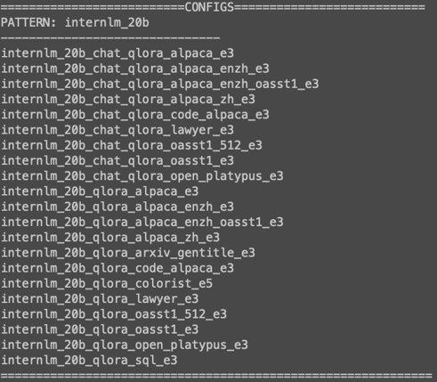
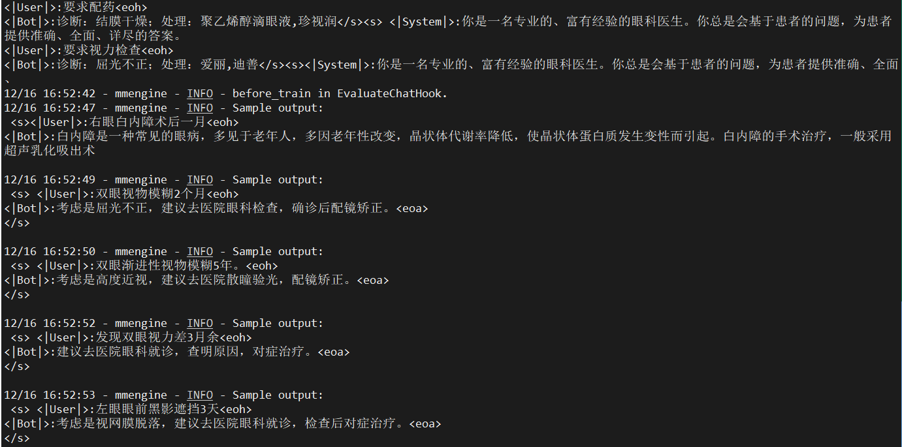
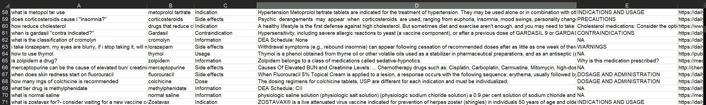
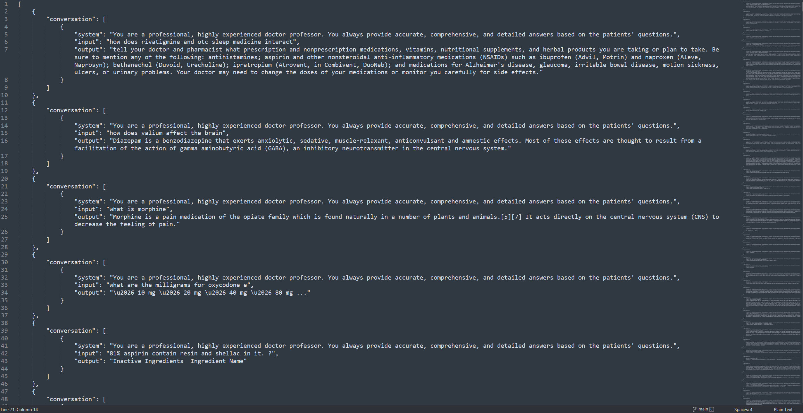
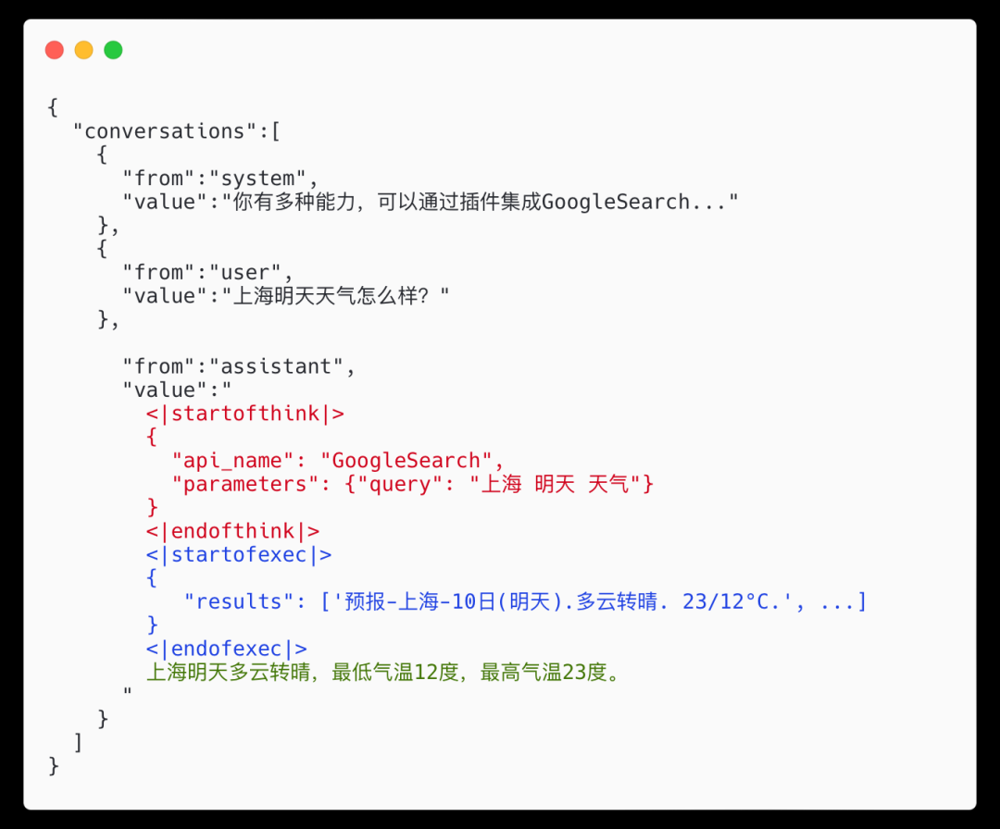
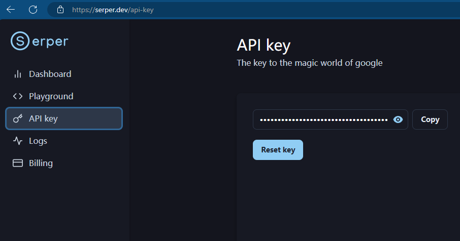
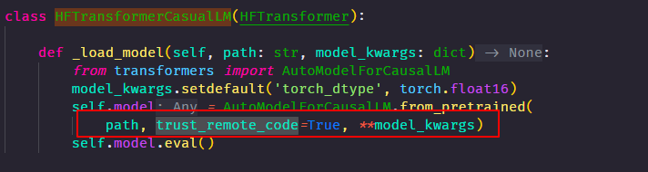
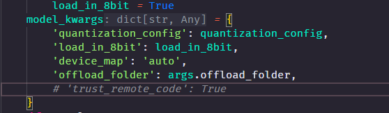

> 怎么硕呢，祝大家炼丹愉快吧~ 😙

## 1 概述

### 1.1 XTuner

一个大语言模型微调工具箱。*由* *MMRazor* *和* *MMDeploy* *联合开发。*

### 1.2 支持的开源LLM (2023.11.01)

- **[InternLM](https://huggingface.co/internlm/internlm-7b)** ✅
- [Llama，Llama2](https://huggingface.co/meta-llama)
- [ChatGLM2](https://huggingface.co/THUDM/chatglm2-6b)，[ChatGLM3](https://huggingface.co/THUDM/chatglm3-6b-base)
- [Qwen](https://huggingface.co/Qwen/Qwen-7B)
- [Baichuan](https://huggingface.co/baichuan-inc/Baichuan-7B)，[Baichuan2](https://huggingface.co/baichuan-inc/Baichuan2-7B-Base)
- ......
- [Zephyr](https://huggingface.co/HuggingFaceH4/zephyr-7b-beta) 

### 1.3 特色 

- 🤓 **傻瓜化：** 以 配置文件 的形式封装了大部分微调场景，**0基础的非专业人员也能一键开始微调**。
- 🍃 **轻量级：** 对于 7B 参数量的LLM，**微调所需的最小显存仅为 8GB** ： **消费级显卡✅，colab✅**

### 1.4 微调原理

> 想象一下，你有一个超大的玩具，现在你想改造这个超大的玩具。但是，**对整个玩具进行全面的改动会非常昂贵**。

※ 因此，你找到了一种叫 **LoRA** 的方法：**只对玩具中的某些零件进行改动，而不是对整个玩具进行全面改动**。

※ 而 **QLoRA** 是 LoRA 的一种改进：如果你手里只有一把生锈的螺丝刀，也能改造你的玩具。

- **Full** :       😳 → 🚲
- **[LoRA](http://arxiv.org/abs/2106.09685)** :     😳 → 🛵
- **[QLoRA](http://arxiv.org/abs/2305.14314)** :   😳 → 🏍


## 2 快速上手

### 2.1 平台

Ubuntu + Anaconda + CUDA/CUDNN + 8GB nvidia显卡

### 2.2 安装

```bash
# 如果你是在 InternStudio 平台，则从本地 clone 一个已有 pytorch 2.0.1 的环境：
/root/share/install_conda_env_internlm_base.sh xtuner0.1.9
# 如果你是在其他平台：
conda create --name xtuner0.1.9 python=3.10 -y

# 激活环境
conda activate xtuner0.1.9
# 进入家目录 （~的意思是 “当前用户的home路径”）
cd ~
# 创建版本文件夹并进入，以跟随本教程
mkdir xtuner019 && cd xtuner019


# 拉取 0.1.9 的版本源码
git clone -b v0.1.9  https://github.com/InternLM/xtuner
# 无法访问github的用户请从 gitee 拉取:
# git clone -b v0.1.9 https://gitee.com/Internlm/xtuner

# 进入源码目录
cd xtuner

# 从源码安装 XTuner
pip install -e '.[all]'
```

安装完后，就开始搞搞准备工作了。（准备在 oasst1 数据集上微调 internlm-7b-chat）

```bash
# 创建一个微调 oasst1 数据集的工作路径，进入
mkdir ~/ft-oasst1 && cd ~/ft-oasst1
```

### 2.3 微调

#### 2.3.1 准备配置文件

XTuner 提供多个开箱即用的配置文件，用户可以通过下列命令查看：

```Bash
# 列出所有内置配置
xtuner list-cfg
```
> 假如显示bash: xtuner: command not found的话可以考虑在终端输入 export PATH=$PATH:'/root/.local/bin'



拷贝一个配置文件到当前目录：
`# xtuner copy-cfg ${CONFIG_NAME} ${SAVE_PATH}`

在本案例中即：（注意最后有个英文句号，代表复制到当前路径）
```Bash
cd ~/ft-oasst1
xtuner copy-cfg internlm_chat_7b_qlora_oasst1_e3 .
```

配置文件名的解释：

> xtuner copy-cfg internlm_chat_7b_qlora_oasst1_e3 .

| 模型名   | internlm_chat_7b |
| -------- | ---------------- |
| 使用算法 | qlora            |
| 数据集   | oasst1           |
| 把数据集跑几次    | 跑3次：e3 (epoch 3 )   |

*无 chat比如 `internlm-7b` 代表是基座(base)模型


#### 2.3.2 模型下载

> 由于下载模型很慢，用教学平台的同学可以直接复制模型。

```Bash
cp -r /root/share/temp/model_repos/internlm-chat-7b ~/ft-oasst1/
```

> 以下是自己下载模型的步骤。

不用 xtuner 默认的`从 huggingface 拉取模型`，而是提前从 ~~OpenXLab~~ ModelScope 下载模型到本地

```Bash
# 创建一个目录，放模型文件，防止散落一地
mkdir ~/ft-oasst1/internlm-chat-7b

# 装一下拉取模型文件要用的库
pip install modelscope

# 从 modelscope 下载下载模型文件
cd ~/ft-oasst1
apt install git git-lfs -y
git lfs install
git lfs clone https://modelscope.cn/Shanghai_AI_Laboratory/internlm-chat-7b.git -b v1.0.3
```

#### 2.3.3 数据集下载
> https://huggingface.co/datasets/timdettmers/openassistant-guanaco/tree/main

由于 huggingface 网络问题，咱们已经给大家提前下载好了，复制到正确位置即可：

```bash
cd ~/ft-oasst1
# ...-guanaco 后面有个空格和英文句号啊
cp -r /root/share/temp/datasets/openassistant-guanaco .
```

此时，当前路径的文件应该长这样：

```bash
|-- internlm-chat-7b
|   |-- README.md
|   |-- config.json
|   |-- configuration.json
|   |-- configuration_internlm.py
|   |-- generation_config.json
|   |-- modeling_internlm.py
|   |-- pytorch_model-00001-of-00008.bin
|   |-- pytorch_model-00002-of-00008.bin
|   |-- pytorch_model-00003-of-00008.bin
|   |-- pytorch_model-00004-of-00008.bin
|   |-- pytorch_model-00005-of-00008.bin
|   |-- pytorch_model-00006-of-00008.bin
|   |-- pytorch_model-00007-of-00008.bin
|   |-- pytorch_model-00008-of-00008.bin
|   |-- pytorch_model.bin.index.json
|   |-- special_tokens_map.json
|   |-- tokenization_internlm.py
|   |-- tokenizer.model
|   `-- tokenizer_config.json
|-- internlm_chat_7b_qlora_oasst1_e3_copy.py
`-- openassistant-guanaco
    |-- openassistant_best_replies_eval.jsonl
    `-- openassistant_best_replies_train.jsonl
```

#### 2.3.4 修改配置文件

修改其中的模型和数据集为 本地路径

```bash
cd ~/ft-oasst1
vim internlm_chat_7b_qlora_oasst1_e3_copy.py
```
> 在vim界面完成修改后，请输入:wq退出。假如认为改错了可以用:q!退出且不保存。当然我们也可以考虑打开python文件直接修改，但注意修改完后需要按下Ctrl+S进行保存。

减号代表要删除的行，加号代表要增加的行。
```diff
# 修改模型为本地路径
- pretrained_model_name_or_path = 'internlm/internlm-chat-7b'
+ pretrained_model_name_or_path = './internlm-chat-7b'

# 修改训练数据集为本地路径
- data_path = 'timdettmers/openassistant-guanaco'
+ data_path = './openassistant-guanaco'
```

**常用超参**

| 参数名 | 解释 |
| ------------------- | ------------------------------------------------------ |
| **data_path**       | 数据路径或 HuggingFace 仓库名                          |
| max_length          | 单条数据最大 Token 数，超过则截断                      |
| pack_to_max_length  | 是否将多条短数据拼接到 max_length，提高 GPU 利用率     |
| accumulative_counts | 梯度累积，每多少次 backward 更新一次参数               |
| evaluation_inputs   | 训练过程中，会根据给定的问题进行推理，便于观测训练状态 |
| evaluation_freq     | Evaluation 的评测间隔 iter 数                          |
| ...... | ...... |

> 如果想把显卡的现存吃满，充分利用显卡资源，可以将 `max_length` 和 `batch_size` 这两个参数调大。

#### 2.3.5 开始微调

**训练：**

xtuner train ${CONFIG_NAME_OR_PATH}

**也可以增加 deepspeed 进行训练加速：**

xtuner train ${CONFIG_NAME_OR_PATH} --deepspeed deepspeed_zero2


例如，我们可以利用 QLoRA 算法在 oasst1 数据集上微调 InternLM-7B：

```Bash
# 单卡
## 用刚才改好的config文件训练
xtuner train ./internlm_chat_7b_qlora_oasst1_e3_copy.py

# 多卡
NPROC_PER_NODE=${GPU_NUM} xtuner train ./internlm_chat_7b_qlora_oasst1_e3_copy.py

# 若要开启 deepspeed 加速，增加 --deepspeed deepspeed_zero2 即可
```

> 微调得到的 PTH 模型文件和其他杂七杂八的文件都默认在当前的 `./work_dirs` 中。

跑完训练后，当前路径应该长这样：
```Bash
|-- internlm-chat-7b
|-- internlm_chat_7b_qlora_oasst1_e3_copy.py
|-- openassistant-guanaco
|   |-- openassistant_best_replies_eval.jsonl
|   `-- openassistant_best_replies_train.jsonl
`-- work_dirs
    `-- internlm_chat_7b_qlora_oasst1_e3_copy
        |-- 20231101_152923
        |   |-- 20231101_152923.log
        |   `-- vis_data
        |       |-- 20231101_152923.json
        |       |-- config.py
        |       `-- scalars.json
        |-- epoch_1.pth
        |-- epoch_2.pth
        |-- epoch_3.pth
        |-- internlm_chat_7b_qlora_oasst1_e3_copy.py
        `-- last_checkpoint
```

#### 2.3.6 将得到的 PTH 模型转换为 HuggingFace 模型，**即：生成 Adapter 文件夹**

`xtuner convert pth_to_hf ${CONFIG_NAME_OR_PATH} ${PTH_file_dir} ${SAVE_PATH}`

在本示例中，为：
```bash
mkdir hf
export MKL_SERVICE_FORCE_INTEL=1
export MKL_THREADING_LAYER=GNU
xtuner convert pth_to_hf ./internlm_chat_7b_qlora_oasst1_e3_copy.py ./work_dirs/internlm_chat_7b_qlora_oasst1_e3_copy/epoch_1.pth ./hf
```
此时，路径中应该长这样：

```Bash
|-- internlm-chat-7b
|-- internlm_chat_7b_qlora_oasst1_e3_copy.py
|-- openassistant-guanaco
|   |-- openassistant_best_replies_eval.jsonl
|   `-- openassistant_best_replies_train.jsonl
|-- hf
|   |-- README.md
|   |-- adapter_config.json
|   |-- adapter_model.bin
|   `-- xtuner_config.py
`-- work_dirs
    `-- internlm_chat_7b_qlora_oasst1_e3_copy
        |-- 20231101_152923
        |   |-- 20231101_152923.log
        |   `-- vis_data
        |       |-- 20231101_152923.json
        |       |-- config.py
        |       `-- scalars.json
        |-- epoch_1.pth
        |-- epoch_2.pth
        |-- epoch_3.pth
        |-- internlm_chat_7b_qlora_oasst1_e3_copy.py
        `-- last_checkpoint
```

<span style="color: red;">**此时，hf 文件夹即为我们平时所理解的所谓 “LoRA 模型文件”**</span>

> 可以简单理解：LoRA 模型文件 = Adapter


### 2.4 部署与测试

#### 2.4.1 将 HuggingFace adapter 合并到大语言模型：

```Bash
xtuner convert merge ./internlm-chat-7b ./hf ./merged --max-shard-size 2GB
# xtuner convert merge \
#     ${NAME_OR_PATH_TO_LLM} \
#     ${NAME_OR_PATH_TO_ADAPTER} \
#     ${SAVE_PATH} \
#     --max-shard-size 2GB
```

#### 2.4.2 与合并后的模型对话：
```Bash
# 加载 Adapter 模型对话（Float 16）
xtuner chat ./merged --prompt-template internlm_chat

# 4 bit 量化加载
# xtuner chat ./merged --bits 4 --prompt-template internlm_chat
```

#### 2.4.3 Demo

- 修改 `cli_demo.py` 中的模型路径
```diff
- model_name_or_path = "/root/model/Shanghai_AI_Laboratory/internlm-chat-7b"
+ model_name_or_path = "merged"
```
- 运行 `cli_demo.py` 以目测微调效果
```bash
python ./cli_demo.py
```

**效果：**

| 微调前 | 微调后 |
| --- | --- |
|  |  |

**`xtuner chat`** **的启动参数**

| 启动参数              | 干哈滴                                                       |
| --------------------- | ------------------------------------------------------------ |
| **--prompt-template** | 指定对话模板                                                 |
| --system              | 指定SYSTEM文本                                               |
| --system-template     | 指定SYSTEM模板                                               |
| -**-bits**            | LLM位数                                                      |
| --bot-name            | bot名称                                                      |
| --with-plugins        | 指定要使用的插件                                             |
| **--no-streamer**     | 是否启用流式传输                                             |
| **--lagent**          | 是否使用lagent                                               |
| --command-stop-word   | 命令停止词                                                   |
| --answer-stop-word    | 回答停止词                                                   |
| --offload-folder      | 存放模型权重的文件夹（或者已经卸载模型权重的文件夹）         |
| --max-new-tokens      | 生成文本中允许的最大 `token` 数量                                |
| **--temperature**     | 温度值                                                       |
| --top-k               | 保留用于顶k筛选的最高概率词汇标记数                          |
| --top-p               | 如果设置为小于1的浮点数，仅保留概率相加高于 `top_p` 的最小一组最有可能的标记 |
| --seed                | 用于可重现文本生成的随机种子                                 |


## 3 自定义微调
> 以 **[Medication QA](https://github.com/abachaa/Medication_QA_MedInfo2019)** **数据集**为例

### 3.1 概述

#### 3.1.1 **场景需求**

   基于 InternLM-chat-7B 模型，用 MedQA 数据集进行微调，将其往`医学问答`领域对齐。

#### 3.1.2 **真实数据预览**

| 问题                                                       | 答案                                                         |
| ---------------------------------------------------------- | ------------------------------------------------------------ |
| What are ketorolac eye drops?（什么是酮咯酸滴眼液？）      | Ophthalmic   ketorolac is used to treat itchy eyes caused by allergies. It also is used to   treat swelling and redness (inflammation) that can occur after cataract   surgery. Ketorolac is in a class of medications called nonsteroidal   anti-inflammatory drugs (NSAIDs). It works by stopping the release of   substances that cause allergy symptoms and inflammation. |
| What medicines raise blood sugar? （什么药物会升高血糖？） | Some   medicines for conditions other than diabetes can raise your blood sugar   level. This is a concern when you have diabetes. Make sure every doctor you   see knows about all of the medicines, vitamins, or herbal supplements you   take. This means anything you take with or without a prescription. Examples include:     Barbiturates.     Thiazide diuretics.     Corticosteroids.     Birth control pills (oral contraceptives) and progesterone.     Catecholamines.     Decongestants that contain beta-adrenergic agents, such as pseudoephedrine.     The B vitamin niacin. The risk of high blood sugar from niacin lowers after you have taken it for a few months. The antipsychotic medicine olanzapine (Zyprexa). |

### 3.2 数据准备 

> **以** **[Medication QA](https://github.com/abachaa/Medication_QA_MedInfo2019)** **数据集为例**

**原格式：(.xlsx)**



| **问题** | 药物类型 | 问题类型 | **回答** | 主题 | URL  |
| -------- | -------- | -------- | -------- | ---- | ---- |
| aaa      | bbb      | ccc      | ddd      | eee  | fff  |

#### 3.2.1 将数据转为 XTuner 的数据格式

**目标格式：(.jsonL)**

```JSON
[{
    "conversation":[
        {
            "system": "xxx",
            "input": "xxx",
            "output": "xxx"
        }
    ]
},
{
    "conversation":[
        {
            "system": "xxx",
            "input": "xxx",
            "output": "xxx"
        }
    ]
}]
```

🧠通过 pytho n脚本：将 `.xlsx` 中的 问题 和 回答 两列 提取出来，再放入 `.jsonL` 文件的每个 conversation 的 input 和 output 中。

> 这一步的 python 脚本可以请 ChatGPT 来完成。

```text
Write a python file for me. using openpyxl. input file name is MedQA2019.xlsx
Step1: The input file is .xlsx. Exact the column A and column D in the sheet named "DrugQA" .
Step2: Put each value in column A into each "input" of each "conversation". Put each value in column D into each "output" of each "conversation".
Step3: The output file is .jsonL. It looks like:
[{
    "conversation":[
        {
            "system": "xxx",
            "input": "xxx",
            "output": "xxx"
        }
    ]
},
{
    "conversation":[
        {
            "system": "xxx",
            "input": "xxx",
            "output": "xxx"
        }
    ]
}]
Step4: All "system" value changes to "You are a professional, highly experienced doctor professor. You always provide accurate, comprehensive, and detailed answers based on the patients' questions."
```

> ChatGPT 生成的 python 代码见本仓库的 [xlsx2jsonl.py](./xlsx2jsonl.py)


执行 python 脚本，获得格式化后的数据集：
```bash
python xlsx2jsonl.py
```

**格式化后的数据集长这样：**


此时，当然也可以对数据进行训练集和测试集的分割，同样可以让 ChatGPT 写 python 代码。当然如果你没有严格的科研需求、不在乎“训练集泄露”的问题，也可以不做训练集与测试集的分割。

#### 3.2.2 划分训练集和测试集

```text
my .jsonL file looks like:
[{
    "conversation":[
        {
            "system": "xxx",
            "input": "xxx",
            "output": "xxx"
        }
    ]
},
{
    "conversation":[
        {
            "system": "xxx",
            "input": "xxx",
            "output": "xxx"
        }
    ]
}]
Step1, read the .jsonL file.
Step2, count the amount of the "conversation" elements.
Step3, randomly split all "conversation" elements by 7:3. Targeted structure is same as the input.
Step4, save the 7/10 part as train.jsonl. save the 3/10 part as test.jsonl
```
生成的python代码见 [split2train_and_test.py](./split2train_and_test.py)


### 3.3 开始自定义微调

此时，我们重新建一个文件夹来玩“微调自定义数据集”
```bash
mkdir ~/ft-medqa && cd ~/ft-medqa
```

把前面下载好的internlm-chat-7b模型文件夹拷贝过来。

```bash
cp -r ~/ft-oasst1/internlm-chat-7b .
```
别忘了把自定义数据集，即几个 `.jsonL`，也传到服务器上。

```bash
git clone https://github.com/InternLM/tutorial
```

```bash
cp ~/tutorial/xtuner/MedQA2019-structured-train.jsonl .
```


#### 3.3.1 准备配置文件
```bash
# 复制配置文件到当前目录
xtuner copy-cfg internlm_chat_7b_qlora_oasst1_e3 .
# 改个文件名
mv internlm_chat_7b_qlora_oasst1_e3_copy.py internlm_chat_7b_qlora_medqa2019_e3.py

# 修改配置文件内容
vim internlm_chat_7b_qlora_medqa2019_e3.py
```

减号代表要删除的行，加号代表要增加的行。
```diff
# 修改import部分
- from xtuner.dataset.map_fns import oasst1_map_fn, template_map_fn_factory
+ from xtuner.dataset.map_fns import template_map_fn_factory

# 修改模型为本地路径
- pretrained_model_name_or_path = 'internlm/internlm-chat-7b'
+ pretrained_model_name_or_path = './internlm-chat-7b'

# 修改训练数据为 MedQA2019-structured-train.jsonl 路径
- data_path = 'timdettmers/openassistant-guanaco'
+ data_path = 'MedQA2019-structured-train.jsonl'

# 修改 train_dataset 对象
train_dataset = dict(
    type=process_hf_dataset,
-   dataset=dict(type=load_dataset, path=data_path),
+   dataset=dict(type=load_dataset, path='json', data_files=dict(train=data_path)),
    tokenizer=tokenizer,
    max_length=max_length,
-   dataset_map_fn=alpaca_map_fn,
+   dataset_map_fn=None,
    template_map_fn=dict(
        type=template_map_fn_factory, template=prompt_template),
    remove_unused_columns=True,
    shuffle_before_pack=True,
    pack_to_max_length=pack_to_max_length)
```
#### 3.3.2 **XTuner！启动！**


```bash
xtuner train internlm_chat_7b_qlora_medqa2019_e3.py --deepspeed deepspeed_zero2
```

#### 3.3.3 pth 转 huggingface

同前述，这里不赘述了。[将得到的-pth-模型转换为-huggingface-模型即生成adapter文件夹](#236-将得到的-pth-模型转换为-huggingface-模型即生成adapter文件夹)  

#### 3.3.4 部署与测试

同前述。[部署与测试](#24-部署与测试)


## 4【补充】用 MS-Agent 数据集 赋予 LLM 以 Agent 能力
### 4.1 概述

MSAgent 数据集每条样本包含一个对话列表（conversations），其里面包含了 system、user、assistant 三种字段。其中：

- system: 表示给模型前置的人设输入，其中有告诉模型如何调用插件以及生成请求

- user: 表示用户的输入 prompt，分为两种，通用生成的prompt和调用插件需求的 prompt

- assistant: 为模型的回复。其中会包括插件调用代码和执行代码，调用代码是要 LLM 生成的，而执行代码是调用服务来生成结果的

一条调用网页搜索插件查询“上海明天天气”的数据样本示例如下图所示：


### 4.2 微调步骤

#### 4.2.1 准备工作
> xtuner 是从国内的 ModelScope 平台下载 MS-Agent 数据集，因此不用提前手动下载数据集文件。

```bash
# 准备工作
mkdir ~/ft-msagent && cd ~/ft-msagent
cp -r ~/ft-oasst1/internlm-chat-7b .

# 查看配置文件
xtuner list-cfg | grep msagent

# 复制配置文件到当前目录
xtuner copy-cfg internlm_7b_qlora_msagent_react_e3_gpu8 .

# 修改配置文件中的模型为本地路径
vim ./internlm_7b_qlora_msagent_react_e3_gpu8_copy.py 
```

```diff
- pretrained_model_name_or_path = 'internlm/internlm-chat-7b'
+ pretrained_model_name_or_path = './internlm-chat-7b'
```

#### 4.2.2 开始微调
```Bash
xtuner train ./internlm_7b_qlora_msagent_react_e3_gpu8_copy.py --deepspeed deepspeed_zero2
```

### 4.3 直接使用

> 由于 msagent 的训练非常费时，大家如果想尽快把这个教程跟完，可以直接从 modelScope 拉取咱们已经微调好了的 Adapter。如下演示。

#### 4.3.1 下载 Adapter
```Bash
cd ~/ft-msagent
apt install git git-lfs
git lfs install
git lfs clone https://www.modelscope.cn/xtuner/internlm-7b-qlora-msagent-react.git
```

OK，现在目录应该长这样：
- internlm_7b_qlora_msagent_react_e3_gpu8_copy.py
- internlm-7b-qlora-msagent-react
- internlm-chat-7b
- work_dir（可有可无）

有了这个在 msagent 上训练得到的Adapter，模型现在已经有 agent 能力了！就可以加 --lagent 以调用来自 lagent 的代理功能了！

#### 4.3.2 添加 serper 环境变量

> **开始 chat 之前，还要加个 serper 的环境变量：**
> 
> 去 serper.dev 免费注册一个账号，生成自己的 api key。这个东西是用来给 lagent 去获取 google 搜索的结果的。等于是 serper.dev 帮你去访问 google，而不是从你自己本地去访问 google 了。



添加 serper api key 到环境变量：

```bash
export SERPER_API_KEY=abcdefg
```

#### 4.3.3 xtuner + agent，启动！

```bash
xtuner chat ./internlm-chat-7b --adapter internlm-7b-qlora-msagent-react --lagent
```


#### 4.3.4 报错处理

xtuner chat 增加 --lagent 参数后，报错 ```TypeError: transfomers.modelsauto.auto factory. BaseAutoModelClass.from pretrained() got multiple values for keyword argument "trust remote code"```	

注释掉已安装包中的代码：

```bash
vim /root/xtuner019/xtuner/xtuner/tools/chat.py
```







## 5 其他已知问题和解决方案：
https://docs.qq.com/doc/DY1d2ZVFlbXlrUERj


小作业助教老师会在社群中公布。
Have fun!


## 6 注意事项

本教程使用 xtuner 0.1.9 版本
若需要跟着本教程一步一步完成，建议严格遵循本教程的步骤！


若出现莫名其妙报错，请尝试更换为以下包的版本：（如果有报错再检查，没报错不用看）
```
torch                         2.1.1
transformers                  4.34.0
transformers-stream-generator 0.0.4
```
```bash
pip install torch==2.1.1
pip install transformers==4.34.0
pip install transformers-stream-generator=0.0.4
```
CUDA 相关：（如果有报错再检查，没报错不用看）
```
NVIDIA-SMI 535.54.03              
Driver Version: 535.54.03    
CUDA Version: 12.2

nvidia-cuda-cupti-cu12        12.1.105
nvidia-cuda-nvrtc-cu12        12.1.105
nvidia-cuda-runtime-cu12      12.1.105
```

## 7 作业

**基础作业：**

构建数据集，使用 XTuner 微调 InternLM-Chat-7B 模型, 让模型学习到它是你的智能小助手，效果如下图所示，本作业训练出来的模型的输出需要**将不要葱姜蒜大佬**替换成自己名字或昵称！

**微调前**（回答比较官方）


**微调后**（对自己的身份有了清晰的认知）


作业参考答案：https://github.com/InternLM/tutorial/blob/main/xtuner/self.md

**进阶作业：**

- 将训练好的Adapter模型权重上传到 OpenXLab、Hugging Face 或者 MoelScope 任一一平台。
- 将训练好后的模型应用部署到 OpenXLab 平台，参考部署文档请访问：https://aicarrier.feishu.cn/docx/MQH6dygcKolG37x0ekcc4oZhnCe

**整体实训营项目：**

时间周期：即日起致课程结束

即日开始可以在班级群中随机组队完成一个大作业项目，一些可提供的选题如下：

- 人情世故大模型：一个帮助用户撰写新年祝福文案的人情事故大模型
- 中小学数学大模型：一个拥有一定数学解题能力的大模型
- 心理大模型：一个治愈的心理大模型
- 工具调用类项目：结合 Lagent 构建数据集训练 InternLM 模型，支持对 MMYOLO 等工具的调用

其他基于书生·浦语工具链的小项目都在范围内，欢迎大家充分发挥想象力。

