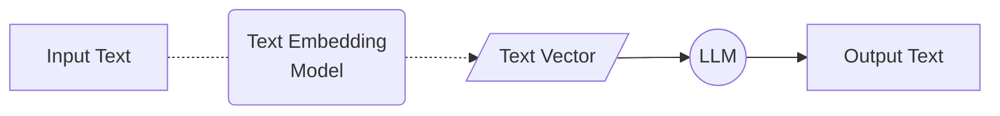
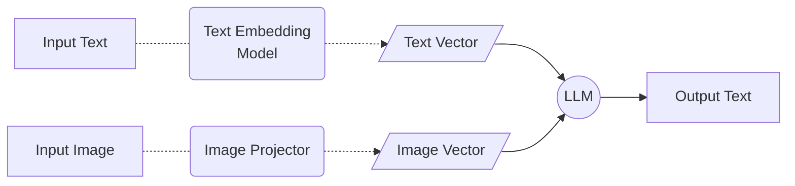
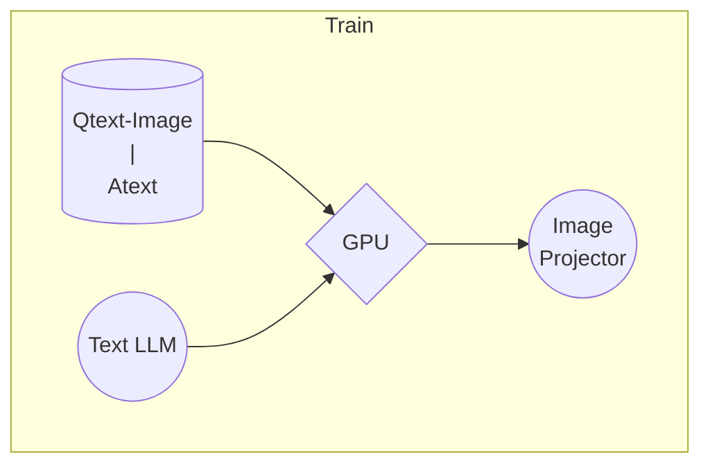
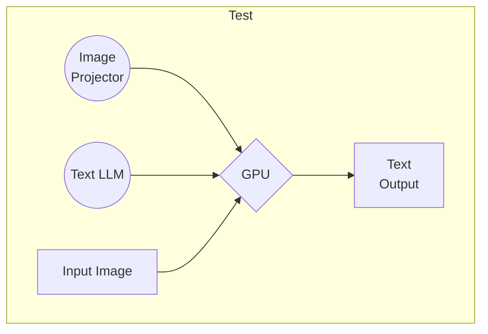
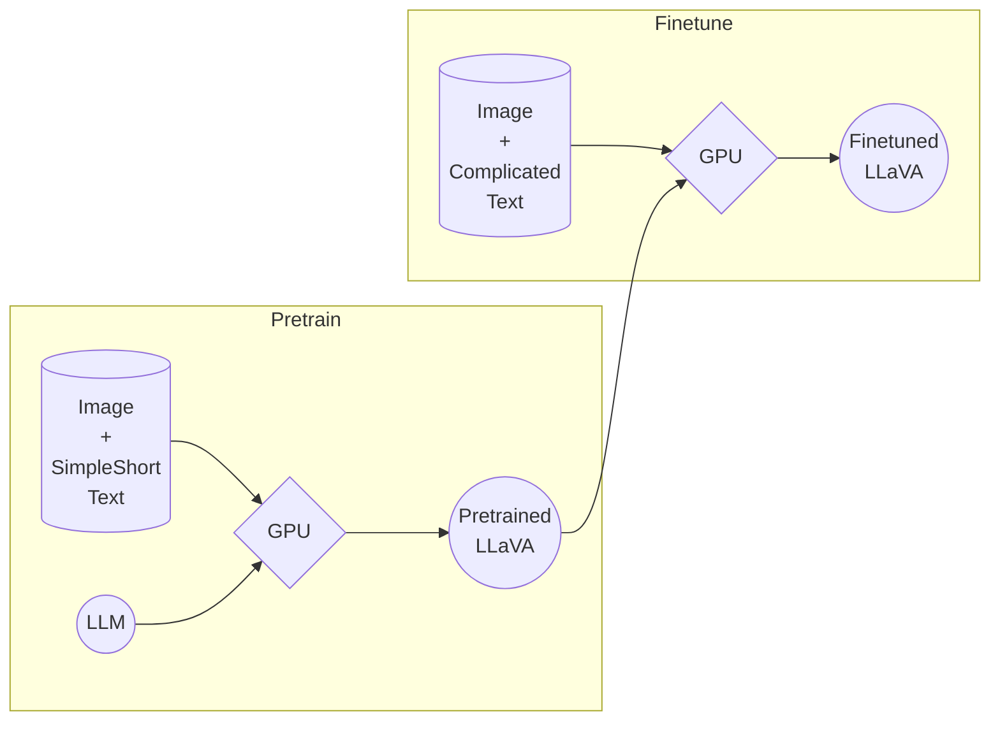
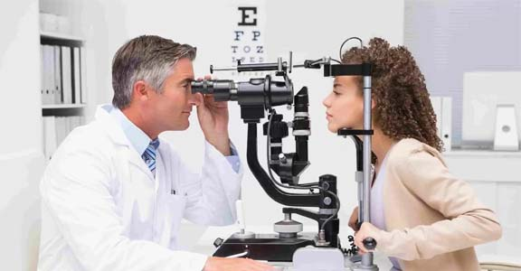

XTuner多模态训练与测试


- [1. 给LLM装上电子眼：多模态LLM原理简介](#1-给llm装上电子眼多模态llm原理简介)
  - [1.1. 文本单模态](#11-文本单模态)
  - [1.2. 文本+图像多模态](#12-文本图像多模态)
- [2. 什么型号的电子眼：LLaVA方案简介](#2-什么型号的电子眼llava方案简介)
  - [2.1. LLaVA训练阶段示意图：](#21-llava训练阶段示意图)
  - [2.2. LLaVA测试阶段示意图：](#22-llava测试阶段示意图)
- [3. 快速上手](#3-快速上手)
  - [3.1. 概述](#31-概述)
  - [Pretrain阶段](#pretrain阶段)
  - [Finetune阶段](#finetune阶段)
    - [训练数据构建](#训练数据构建)
      - [格式](#格式)
      - [制作](#制作)
    - [准备配置文件](#准备配置文件)
      - [创建配置文件](#创建配置文件)
      - [修改配置文件](#修改配置文件)
      - [开始Finetune](#开始finetune)
  - [对比Finetune前后的性能差异](#对比finetune前后的性能差异)
    - [Finetune前](#finetune前)
    - [Finetune后](#finetune后)


## 1. 给LLM装上电子眼：多模态LLM原理简介

### 1.1. 文本单模态


### 1.2. 文本+图像多模态


## 2. 什么型号的电子眼：LLaVA方案简介

[Haotian Liu等](https://arxiv.org/abs/2304.08485)使用GPT-4V对图像数据生成描述，以此构建出大量`<question text><image> -- <answer text>`的数据对。利用这些数据对，配合文本单模态LLM，训练出一个Image Projector。

所使用的`文本单模型LLM`和训练出来的`Image Projector`，统称为`LLaVA模型`。

### 2.1. LLaVA训练阶段示意图：


### 2.2. LLaVA测试阶段示意图：


> Image Projector的训练和测试，有点类似之前我们讲过的LoRA微调方案。

二者都是在已有LLM的基础上，用新的数据训练一个新的小文件。

只不过，LLM套上LoRA之后，有了新的灵魂（角色）；而LLM套上Image Projector之后，才有了眼睛。

## 3. 快速上手

### 3.1. 概述

> 在本节中，我们将 **自己构造 `<question text><image>--<answer text>` 数据对，基于InternLM2_chat_1.8b这个文本单模态模型，使用LLaVA方案，训练一个给InternLM2_chat_1.8b使用的Image Projector文件。**

LLaVA方案中，给LLM增加视觉能力的过程，即是训练Image Projector文件的过程。
该过程分为2个阶段：Pretrain和Finetune。



### Pretrain阶段
在Pretrain阶段，我们会使用大量的`图片+简单文本（caption, 即图片标题）`数据对，使LLM理解图像中的**普遍特征**。即，对大量的图片进行**粗看**。

Pretrain阶段训练完成后，此时的模型已经有视觉能力了！但是由于训练数据中都是图片+图片标题，所以此时的模型虽然有视觉能力，但无论用户问它什么，它都只会回答输入图片的标题。即，**此时的模型只会给输入图像“写标题”**。

> Pretrain阶段相当于是开发LLM时预训练工作，对硬件要求非常高，有8卡的学有余力同学可以自行尝试。详见[XTuner-LLaVA](https://github.com/InternLM/xtuner/blob/main/docs/zh_cn/user_guides/dataset_prepare.md#llava-dataset)和[LLaVA](https://llava-vl.github.io/)。
> <details>
> 
> ```bash
> NPROC_PER_NODE=8 xtuner train llava_internlm2_chat_1_8b_clip_vit_large_p14_336_e1_gpu8_pretrain --deepspeed deepspeed_zero2
> 
> NPROC_PER_NODE=8 xtuner train llava_internlm2_chat_1_8b_qlora_clip_vit_large_p14_336_lora_e1_gpu8_finetune --deepspeed deepspeed_zero2
> ```

> </details>

在本次实战营中，我们已经为大家提供了Pretrain阶段的产物——`iter_2181.pth`文件。它就是幼稚园阶段的Image Projector！大家带着`iter_2181.pth`文件继续进入下一阶段进行Finetune即可。

### Finetune阶段
在Finetune阶段，我们会使用`图片+复杂文本`数据对，来对Pretrain得到的Image Projector即iter_2181.pth进行进一步的训练。

#### 训练数据构建

##### 格式
```json
[
    {
        "id": "随便什么字符串",
        "image": "图片文件的相对位置。相对谁？相对你后面config文件里指定的image_folder参数的路径。",
        "conversation": [
            {
                "from": "human",
                "value": "<image>\n第1个问题。"
            },
            {
                "from": "gpt",
                "value": "第1个回答"
            },
            {
                "from": "human",
                "value": "第2个问题。"
            },
            {
                "from": "gpt",
                "value": "第2个回答"
            },
            # ......
            {
                "from": "human",
                "value": "第n个问题。"
            },
            {
                "from": "gpt",
                "value": "第n个回答"
            },
        ]
    },

    # 下面是第2组训练数据了。

    {
        "id": "随便什么字符串",
        "image": "图片文件的相对位置。相对谁？相对你后面config文件里指定的image_folder参数的路径。",
        "conversation": [
            {
                "from": "human",
                "value": "<image>\n第1个问题。"
            },
            # ......
            {
                "from": "gpt",
                "value": "第n个回答"
            }
        ]
    }
]
```
> 注意：每组训练数据的第1个来自human的问题前，要加上图片占位符，即`<image>`

<details>
<summary>示例</summary>

```json
[
  {
    "id": "000000033471",
    "image": "coco/train2017/000000033471.jpg",
    "conversations": [
      {
        "from": "human",
        "value": "<image>\nWhat are the colors of the bus in the image?"
      },
      {
        "from": "gpt",
        "value": "The bus in the image is white and red."
      },
      {
        "from": "human",
        "value": "What feature can be seen on the back of the bus?"
      },
      {
        "from": "gpt",
        "value": "The back of the bus features an advertisement."
      },
      {
        "from": "human",
        "value": "Is the bus driving down the street or pulled off to the side?"
      },
      {
        "from": "gpt",
        "value": "The bus is driving down the street, which is crowded with people and other vehicles."
      }
    ]
  },
  {
    "id": "000000052846",
    "image": "coco/train2017/000000052846.jpg",
    "conversations": [
      {
        "from": "human",
        "value": "<image>\nWhere is the cat positioned in the image?"
      },
      {
        "from": "gpt",
        "value": "The cat is positioned on top of the back of the couch in the living room."
      }
    ]
  }
 ]
```
</details>

##### 制作
我们可以效法LLaVA作者的做法，将自己的图片发送给GPT4V，要求其按照上述格式生成若干条问答对。
<details>
<summary>prompts</summary>



Create a dataset for me, following this format.
```json
[
  {
    "id": "<random_number_string>",
    "image": "test_img/oph.jpg",
    "conversations": [
      {
        "from": "human",
        "value": "<image>\nDescribe this image."
      },
      {
        "from": "gpt",
        "value": "<answer1>"
      },
      {
        "from": "human",
        "value": "<question2>"
      },
      {
        "from": "gpt",
        "value": "<answer2>"
      },
      {
        "from": "human",
        "value": "<question3>"
      },
      {
        "from": "gpt",
        "value": "<answer3>"
      }
    ]
  }
]
```
The questions and answers, please generate for me, based on the image I sent to you. Thes questions should be from the shallow to the deep, and the answers should be as detailed and correct as possible. The questions and answers should be stick to the contents in the image itself, like objects, peoples, equipment, environment, purpose, color, attitude, etc. 5 question and answer pairs.
</details>
<br>

为了方便大家跟随课程，针对这张示例图片的问答对数据（repeat_data.json），大家按照下面的脚本运行就可以生成啦~（重复10000次，生成的文件一百多MB）

```bash
python llava_data/repeat.py -i llava_data/unique_data.json -o llava_data/repeated_data.json -n 10000
```

#### 准备配置文件

##### 创建配置文件

```bash
# 查询xtuner内置配置文件
xtuner list-cfg -p llava_internlm2_chat_1_8b

# 拷贝配置文件到当前目录（注意命令最后有个英文句号
xtuner copy-cfg llava_internlm2_chat_1_8b_qlora_clip_vit_large_p14_336_lora_e1_gpu8_finetune .
```

当前你的当前目录下的文件结构应该是这样：

```bash
|-- iter_2181.pth
|-- llava_data
|   |-- repeat.py
|   |-- repeated_data.json
|   |-- test_img
|   |   `-- oph.jpg
|   `-- unique_data.json
`-- llava_internlm2_chat_1_8b_qlora_clip_vit_large_p14_336_lora_e1_gpu8_finetune_copy.py
```

##### 修改配置文件

修改`llava_internlm2_chat_1_8b_qlora_clip_vit_large_p14_336_lora_e1_gpu8_finetune_copy.py`文件中的：
- pretrained_pth
- data_root
- data_path
- image_folder

```diff
# Specify the pretrained pth
- pretrained_pth = './work_dirs/llava_internlm2_chat_1_8b_clip_vit_large_p14_336_e1_gpu8_pretrain/iter_2181.pth'  # noqa: E501
+ pretrained_pth = './iter_2181.pth'

# Data
- data_root = './data/llava_data/'
+ data_root = './llava_data/'
- data_path = data_root + 'LLaVA-Instruct-150K/llava_v1_5_mix665k.json'
+ data_path = data_root + 'repeated_data.json'
- image_folder = data_root + 'llava_images'
+ image_folder = data_root
```

##### 开始Finetune

```bash
xtuner train ./llava_internlm2_chat_1_8b_qlora_clip_vit_large_p14_336_lora_e1_gpu8_finetune_copy.py --deepspeed deepspeed_zero2
```

### 对比Finetune前后的性能差异

#### Finetune前
> 即：**加载 1.8B 和 Pretrain阶段产物(iter_2181) 到显存。**

```bash
# 解决小bug
export MKL_SERVICE_FORCE_INTEL=1
export MKL_THREADING_LAYER=GNU

# pth转huggingface
xtuner convert pth_to_hf llava_internlm2_chat_1_8b_clip_vit_large_p14_336_e1_gpu8_pretrain ./iter_2181.pth ./iter_2181_hf

# 启动！
xtuner chat internlm/internlm2-chat-1_8b --visual-encoder openai/clip-vit-large-patch14-336 --llava ./iter_2181_hf --prompt-template internlm2_chat --image ./llava_data/test_img/oph.jpg
```

#### Finetune后
> 即：**加载 1.8B 和 Fintune阶段产物() 到显存。**

```bash
todo
```