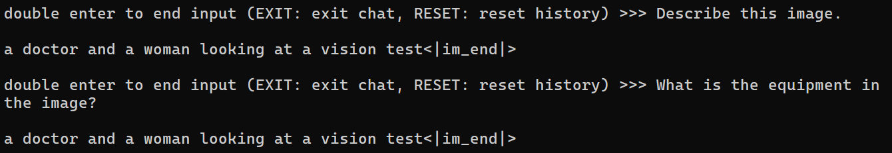
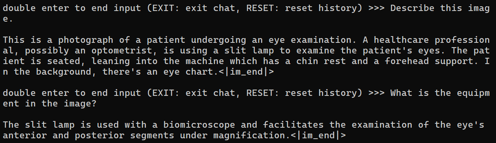

## XTuner 微调 LLM：1.8B、多模态、Agent (更新撰写中)

 XTuner 一个大语言模型&多模态模型微调工具箱。*由* *MMRazor* *和* *MMDeploy* *联合开发。*

- 🤓 **傻瓜化：** 以 配置文件 的形式封装了大部分微调场景，**0基础的非专业人员也能一键开始微调**。
- 🍃 **轻量级：** 对于 7B 参数量的LLM，**微调所需的最小显存仅为 8GB** ： **消费级显卡✅，colab✅**

### Part 1: LLM 部分

LLM 部分将带大家基于 XTuner 微调一个具有个人认知的小助手，效果如下：

| 微调前   | 微调后          |
| -------- | --------------- |
| ||

可以明显看到的是，微调后的大模型真的能够被调整成我们想要的样子，详细文档请访问：[XTuner 微调个人小助手部分](./personal_assistant_document.md)

### Part 2: 多模态部分

在本节中，我们将学习使用 XTuner 微调多模态LLM的内容，这是学完本节内容后的多模态LLM性能效果展示：

备注：本部分需要的GPU资源为24GB 30% 的 A100

**Finetune前的多模态LLM(InternLM_Chat_1.8B_llava)：只会给图像打标题**

**Finetune后的多模态LLM(InternLM_Chat_1.8B_llava)：会根据图像回答问题了**

请访问[链接](./llava/xtuner_llava.md)查看详细教程~

### Part 3: Agent 微调模型函数调用能力 

Agent 部分将在第 6 节课中进行讲解

### 作业

[作业](./homework.md)
